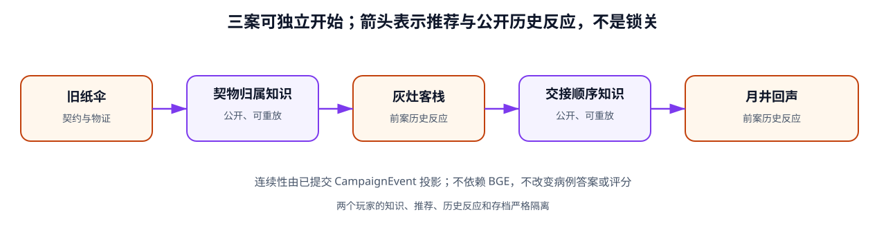
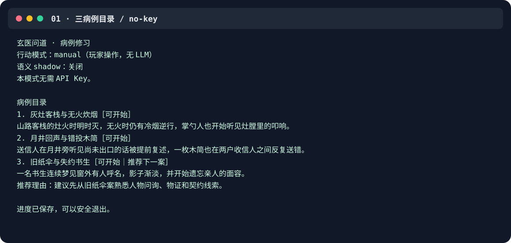
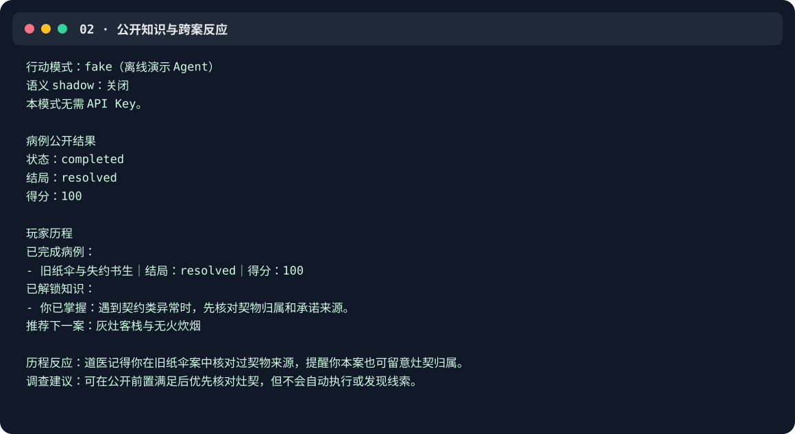
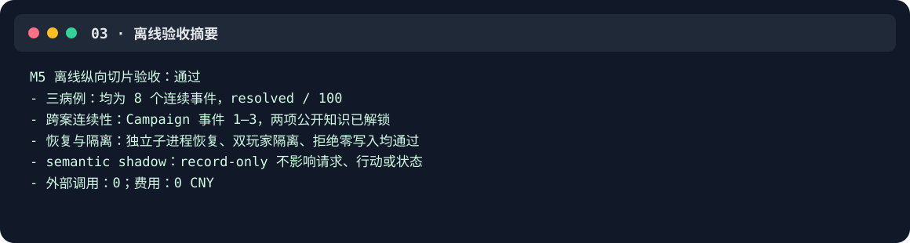

# 玄医问道：可审计的师承型智能 NPC

## Xuanyi: An Auditable Agentic Mentor NPC

一个包含六个志怪病例、确定性成长、六课教学、正式考试、第一条完整传承链和本地医馆入口的可审计游戏 AI 产品。

Xuanyi is a playable six-case game-AI product built around an auditable mentor NPC.
Players investigate, diagnose, and act; the mentor teaches, offers bounded hints, reviews performance, and explains deterministic progression without taking control of the case.
Deterministic rules own case truth, assessment, progression, permissions, exams, and inheritance.
The local clinic is the product entry point. Historical DoctorAgent auto-play, MCP, and semantic-retrieval experiments remain engineering evidence rather than the product identity.
Semantic memory remains disabled after failing its quality gate; the current mentor uses structured, auditable history.
Current reproducibility evidence is limited to Windows and Python 3.12.

## 为什么值得看

- **可玩产品，不是聊天壳**：同一玩家可在本地医馆完成 [6 个完整病例](docs/R5_SIX_CASE_CLINIC_PRODUCT.md)；每案支持调查、诊断和 `resolved / suppressed / worsened` 三类处置结果。
- **玩家行动、导师教学**：[R2～R3 教学闭环](docs/R3_ADAPTIVE_THREE_CASE_TEACHING.md)让玩家亲自处理病例；玄医先生负责课程、反思、有限可信提示、病例后师评和结构化历史引用，不替玩家操作病例。
- **考试、权限与传承**：[R4 完整传承链](docs/R4_EXAM_PERMISSION_INHERITANCE.md)提供规则评分的六题正式考试、失败补课重考、先过滤权限和“溯契还因”单传承；导师不能看答案或自行授予。
- **普通用户医馆入口**：[R5 本地产品](docs/R5_SIX_CASE_CLINIC_PRODUCT.md)组合六病例、教学、考试、传承、师评与恢复，仅绑定 `127.0.0.1`。
- **R6 状态如实分层**：[离线验收](docs/R6_OFFLINE_PRODUCT_ACCEPTANCE.md)不等于真实模型或真人试玩通过；真实 Pilot、真人试玩和远程发布均未执行。
- **模型不能直接改状态**：MentorAgent 只能提交受限 `MentorAction`；病例事实、师评、成长、考试、权限和传承均由确定性规则持有。历史 DoctorAgent/MCP 安全契约保留为工程证据。
- **保留真实失败**：历史 DoctorAgent Pilot 与 Dense 语义检索的正负结果继续可审计，但不作为导师效果或玩家收益证据；Dense 语义记忆未过质量门禁后默认关闭。

## 60 秒无 Key 启动

需要 Windows 和 Python 3.12。核心试玩不需要 API Key、GPU、Torch 或 BGE。

普通用户入口：

```powershell
New-Item -ItemType Directory -Force .\runtime_data\clinic | Out-Null
.\.venv\Scripts\xuanyi-clinic.exe --state-dir .\runtime_data\clinic
```

`xuanyi-clinic` 是产品入口；`xuanyi-play` 是 CLI/工程入口，MCP 是集成入口，DoctorAgent 自动解题只用于评测。详见 [医馆用户指南](docs/R5_CLINIC_USER_GUIDE.md)。

```powershell
py -3.12 -m venv .venv
.\.venv\Scripts\python.exe -m pip install -e .
New-Item -ItemType Directory -Force .\runtime_data\play | Out-Null
.\.venv\Scripts\xuanyi-play.exe --state-dir .\runtime_data\play
```

选择 `manual` 时由玩家操作。以下 Fake 自动解题仅用于历史回归与病例引擎验收，不是产品主流程：

```powershell
.\.venv\Scripts\xuanyi-play.exe --state-dir .\runtime_data\play `
  --mode fake --semantic-shadow off
```

离线导师教学模式使用：

```powershell
.\.venv\Scripts\xuanyi-play.exe --state-dir .\runtime_data\play `
  --mode manual --mentor-mode fake
```

病例与 Campaign 规则已作为包资源安装，普通用户无需寻找 `site-packages`、编辑 JSON 或配置 `.env`。完整安装、构建与仓库外验证见 [M6-P1 分发记录](docs/M6_P1_DISTRIBUTION_VERIFICATION.md)。

## 安全架构

关键原则是职责分离：玩家亲自处理病例；MentorAgent 只读取过滤后的公开视图并提交受限教学表达；确定性服务计算师评、成长、课程、考试、权限和传承，再以事件和原子存档保存。历史 DoctorAgent、MCP 和 semantic shadow 均不进入正式导师产品主循环。详细边界见 [产品系统架构](docs/PRODUCT_SYSTEM_ARCHITECTURE.md) 与 [ADR](docs/DECISIONS.md)。

## 六病例教学与成长



图中三病例 Campaign 是修正主线前形成、目前仍在使用的基础连续性。当前产品已扩展为六病例医馆，并在其上组合确定性成长、课程、结构化导师记忆、考试、权限和传承；推荐不构成锁关，也不依赖 BGE 相似度。当前设计见 [六病例医馆](docs/R5_SIX_CASE_CLINIC_PRODUCT.md)。

## 真实本地演示

以下图片由真实离线 CLI / 验收 stdout 的脱敏文本确定性生成；[来源命令、原始 SHA、文本 SHA 与隐私检查](docs/assets/README.md)均可核对。

### 1. 三病例目录与无 Key 启动



### 2. 知识解锁与后案历史反应



### 3. 三案、重放、隔离与最终验收



## 当前阅读路径

| 目的 | 先看什么 | 接着看什么 |
|---|---|---|
| **理解当前产品** | [项目总纲](docs/PROJECT_MASTER_BLUEPRINT.md) | [产品系统架构](docs/PRODUCT_SYSTEM_ARCHITECTURE.md)、[当前路线图](docs/ROADMAP.md) |
| **理解导师主线** | [导师教学闭环](docs/R2_MENTOR_TEACHING_LOOP.md) | [自适应教学](docs/R3_ADAPTIVE_THREE_CASE_TEACHING.md)、[考试与传承](docs/R4_EXAM_PERMISSION_INHERITANCE.md) |
| **运行与验收** | [医馆用户指南](docs/R5_CLINIC_USER_GUIDE.md) | [R6 离线验收](docs/R6_OFFLINE_PRODUCT_ACCEPTANCE.md)、[真实导师 Pilot 计划](docs/R6_REAL_MENTOR_PILOT_PLAN.md) |
| **查阅历史工程证据** | [文档导航](docs/INDEX.md) | M2～M6、M4.5 和 DoctorAgent 报告仅按历史状态阅读 |

## 可复现证据

| 事实 | 当前证据 |
|---|---|
| 6 个可玩病例与本地医馆 | [R5 六病例产品](docs/R5_SIX_CASE_CLINIC_PRODUCT.md) |
| 玩家行动与独立 MentorAgent 教学边界 | [R2 教学闭环](docs/R2_MENTOR_TEACHING_LOOP.md) |
| 确定性成长、课程与结构化导师记忆 | [R1 成长](docs/R1_APPRENTICESHIP_GROWTH.md)、[R3 教学](docs/R3_ADAPTIVE_THREE_CASE_TEACHING.md) |
| R4 正式考试、权限过滤、两进程恢复与单传承链 | [R4 实现与审计](docs/R4_EXAM_PERMISSION_INHERITANCE.md) |
| R6 八路线离线验收通过；真实导师与真人试玩未执行 | [R6 离线验收](docs/R6_OFFLINE_PRODUCT_ACCEPTANCE.md) |
| 历史 DoctorAgent 与 BGE 正负结果 | [文档导航](docs/INDEX.md)；不作为导师效果指标 |

本地复验命令：

```powershell
# 全量离线测试
.\.venv\Scripts\python.exe -m pytest

# 当前 R6 离线产品验收（新建空目录后运行）
New-Item -ItemType Directory -Force .\results\r6_local | Out-Null
.\.venv\Scripts\python.exe -m xuanyi_npc.evaluation.product_acceptance `
  --output .\results\r6_local

# MCP stdio 入口说明
.\.venv\Scripts\xuanyi-mcp-stdio.exe --help
```

公共 CI 配置已准备，但尚未创建远程或在 GitHub Actions 真实运行；目前只声明 Windows 10、CPython 3.12 的本地证据。分层验证日志见 [VERIFICATION](docs/VERIFICATION.md)。

## 诚实边界

- DoctorAgent 的 P4b 与 P4d 各是一次历史真实模型工程案例，不能推导 MentorAgent 成功率、统计因果或玩家收益。
- M4.5 的 `1.00` / `0.6667` 来自冻结合成 Gold，不是游戏产品准确率；语义记忆默认关闭且不进入正式 Agent Prompt。
- 尚未进行真实玩家研究、留存或教学收益验证。
- `JsonStateStore` / SQLite 尚未验证并发多进程事务、生产备份恢复或长期运行。
- 没有网页、游戏引擎界面、HTTP/SSE、远程部署、生产运维或全平台兼容证据。
- 当前内容全部为架空道医世界观，不提供现实医疗诊断、处方或剂量建议。

## 许可证与文档

程序代码、测试和工程脚本采用 [Apache License 2.0](LICENSE)。病例、世界观、Campaign、文档和演示文案为 `© 2026 WangYDING. All rights reserved.`，不随代码许可证授权；详见 [NOTICE](NOTICE) 与 [CONTENT_RIGHTS](CONTENT_RIGHTS.md)。第三方归属见 [THIRD_PARTY_NOTICES](THIRD_PARTY_NOTICES.md)。

- [完整文档导航](docs/INDEX.md)
- [当前产品路线图](docs/ROADMAP.md)
- [R6 发布前审计](docs/R6_RELEASE_READINESS_AUDIT.md)
- [历史技术总览（原 README 详细内容）](docs/TECHNICAL_OVERVIEW.md)

当前没有远程仓库、Tag 或 Release。R6 已完成离线验收，但真实 MentorAgent Pilot、真人试玩和正式发布仍未执行。
