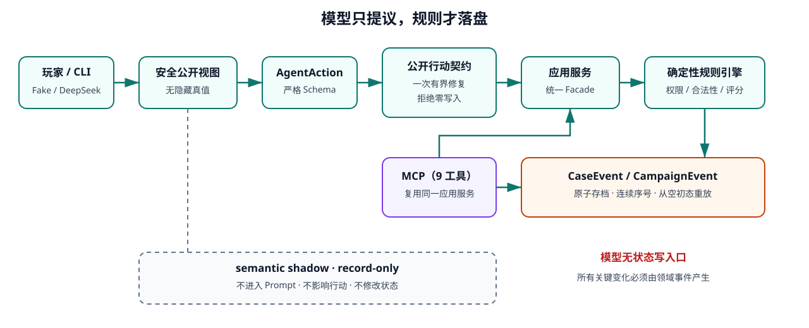

# 玄医问道：可审计的师承型智能 NPC

## Xuanyi: An Auditable Agentic Mentor NPC

一个包含三个志怪病例、确定性跨案连续性、结构化 Agent 工具、安全恢复、持久化重放和本地 CLI 的可审计游戏 AI 纵向切片。

Xuanyi is a playable three-case game-AI vertical slice built around an auditable mentor NPC.
Language models may propose structured actions, but deterministic rules own permissions and state changes.
The same application boundary serves the local CLI, Fake/DeepSeek V0 agents, and nine MCP tools.
Case and campaign events are persisted, replayable, and isolated per player.
Invalid model actions receive one bounded, public-only repair opportunity before safe fallback.
The repository preserves both positive and negative real-model evidence instead of reporting a fabricated success rate.
Semantic memory remains disabled after failing its quality gate; current reproducibility evidence is Windows + Python 3.12.

## 为什么值得看

- **可玩产品，不是聊天壳**：同一玩家可完成 [3 个完整病例](docs/M5_CASE_DESIGN.md)，获得两项公开知识与两处跨案反应；每案支持调查、诊断和 `resolved / suppressed / worsened` 三类处置结果。
- **模型不能直接改状态**：严格 `AgentAction`、公开行动契约、确定性规则和事件写入共同构成安全边界；[9 个 MCP 工具](docs/M3_EXIT_AUDIT.md)复用同一应用服务。
- **保留真实失败**：[P4b 未闭环](docs/M5_P4B_DEEPSEEK_CAMPAIGN_PILOT_20260811.md)与 [P4d 单次 5/5 行动修复](docs/M5_P4D_DEEPSEEK_RECOVERY_VALIDATION_20260811.md)并列；Dense 语义记忆未过质量门禁后默认关闭，而不是包装成成功。

## 60 秒无 Key 启动

需要 Windows 和 Python 3.12。核心试玩不需要 API Key、GPU、Torch 或 BGE。

```powershell
py -3.12 -m venv .venv
.\.venv\Scripts\python.exe -m pip install -e .
New-Item -ItemType Directory -Force .\runtime_data\play | Out-Null
.\.venv\Scripts\xuanyi-play.exe --state-dir .\runtime_data\play
```

选择 `manual` 时由玩家操作；离线自动演示使用：

```powershell
.\.venv\Scripts\xuanyi-play.exe --state-dir .\runtime_data\play `
  --mode fake --semantic-shadow off
```

病例与 Campaign 规则已作为包资源安装，普通用户无需寻找 `site-packages`、编辑 JSON 或配置 `.env`。完整安装、构建与仓库外验证见 [M6-P1 分发记录](docs/M6_P1_DISTRIBUTION_VERIFICATION.md)。

## 安全架构



关键原则是单向状态管道：公开视图 → 结构化提案 → 公开契约 → 应用服务 → 确定性规则 → 领域事件 → 原子存档与重放。MCP 只是同一应用服务的工具入口；semantic shadow 只做旁路记录，不进入 Prompt、行动或状态。详细决策见 [ADR](docs/DECISIONS.md) 与 [Agent 模式边界](docs/M5_AGENT_MODES.md)。

## 三病例 Campaign


箭头表示推荐顺序和公开历史反应，**不构成锁关**。没有前史的玩家仍可直接开始任一病例；跨案影响来自已提交 `CampaignEvent`，不依赖 BGE 相似度，也不改变病例答案或评分。证据见 [Campaign 连续性设计与测试](docs/M5_CAMPAIGN_CONTINUITY.md)。

## 真实本地演示

以下图片由真实离线 CLI / 验收 stdout 的脱敏文本确定性生成；[来源命令、原始 SHA、文本 SHA 与隐私检查](docs/assets/README.md)均可核对。

### 1. 三病例目录与无 Key 启动


### 2. 知识解锁与后案历史反应


### 3. 三案、重放、隔离与最终验收


## 两条阅读路径

| 你关注的岗位 | 先看什么 | 接着看什么 |
|---|---|---|
| **Agent 应用岗** | [AgentAction / MCP / 拒绝恢复 / 预算与重放证据](docs/M5_PORTFOLIO_EVIDENCE.md#agent-应用岗证据) | [P4b → P4c → P4d](docs/M5_P4C_AGENT_CONTRACT_AUDIT.md)、[M4.5 RAG 负结果](docs/M45_TERMINATION_AUDIT.md)、[8 分钟演示](docs/M5_DEMO_GUIDE.md#8-分钟-agent-应用岗演示) |
| **游戏 AI 产品岗** | [三病例 / 三类结局 / 跨案成长 / 恢复证据](docs/M5_PORTFOLIO_EVIDENCE.md#游戏-ai-产品岗证据) | [病例设计](docs/M5_CASE_DESIGN.md)、[Campaign](docs/M5_CAMPAIGN_CONTINUITY.md)、[8 分钟演示](docs/M5_DEMO_GUIDE.md#8-分钟游戏-ai-产品岗演示) |

## 可复现证据

| 事实 | 当前证据 |
|---|---|
| 3 个可玩病例 | [病例设计、公开/隐藏边界与参考轨迹](docs/M5_CASE_DESIGN.md) |
| 9 个冻结 MCP 工具 | [M3 退出审计](docs/M3_EXIT_AUDIT.md) |
| 三案各 8 个连续事件，均为 `resolved / 100` | [M5 验证记录](docs/VERIFICATION.md) |
| CampaignEvent 连续 1–3、两项知识、两处历史反应 | [M5 退出审计](docs/M5_EXIT_AUDIT.md) |
| M6-P1 基线 488 项离线测试 | [M6-P1 验证记录](docs/M6_P1_DISTRIBUTION_VERIFICATION.md) |
| M6-P2 当前 492 项离线测试 | [M6-P2 验证记录](docs/M6_P2_PORTFOLIO_VERIFICATION.md) |
| P4d 单次 5/5 行动契约修复，费用 `0.02345744 CNY` | [P4d 脱敏报告](docs/M5_P4D_DEEPSEEK_RECOVERY_VALIDATION_20260811.md) |
| M4.5 排名 `Recall@3=1.00`，但返回门禁 `micro F1=0.6667`、更正 FN=1 | [M4.5 终止审计](docs/M45_TERMINATION_AUDIT.md) |

本地复验命令：

```powershell
# 全量离线测试
.\.venv\Scripts\python.exe -m pytest

# 三病例纵向切片验收（新建空目录后运行）
New-Item -ItemType Directory .\runtime_data\m5_acceptance | Out-Null
.\.venv\Scripts\xuanyi-m5-acceptance.exe `
  --run-id local_acceptance `
  --state-dir .\runtime_data\m5_acceptance `
  --output .\results\local_acceptance.json

# MCP stdio 入口说明
.\.venv\Scripts\xuanyi-mcp-stdio.exe --help
```

公共 CI 配置已准备，但尚未创建远程或在 GitHub Actions 真实运行；目前只声明 Windows 10、CPython 3.12 的本地证据。分层验证日志见 [VERIFICATION](docs/VERIFICATION.md)。

## 诚实边界

- P4b 与 P4d 各是一次真实模型工程案例，不能推导稳定成功率、统计因果或玩家收益。
- M4.5 的 `1.00` / `0.6667` 来自冻结合成 Gold，不是游戏产品准确率；语义记忆默认关闭且不进入正式 Agent Prompt。
- 尚未进行真实玩家研究、留存或教学收益验证。
- `JsonStateStore` / SQLite 尚未验证并发多进程事务、生产备份恢复或长期运行。
- 没有网页、游戏引擎界面、HTTP/SSE、远程部署、生产运维或全平台兼容证据。
- 当前内容全部为架空道医世界观，不提供现实医疗诊断、处方或剂量建议。

## 许可证与文档

程序代码、测试和工程脚本采用 [Apache License 2.0](LICENSE)。病例、世界观、Campaign、文档和演示文案为 `© 2026 WangYDING. All rights reserved.`，不随代码许可证授权；详见 [NOTICE](NOTICE) 与 [CONTENT_RIGHTS](CONTENT_RIGHTS.md)。第三方归属见 [THIRD_PARTY_NOTICES](THIRD_PARTY_NOTICES.md)。

- [完整文档导航](docs/INDEX.md)
- [M5 三病例退出审计](docs/M5_EXIT_AUDIT.md)
- [M6 发布计划](docs/M6_PORTFOLIO_RELEASE_PLAN.md)
- [历史技术总览（原 README 详细内容）](docs/TECHNICAL_OVERVIEW.md)

当前没有远程仓库、Tag 或 Release；M6-P2 只完成本地项目首页与演示素材，不代表远程 CI 或发布已经完成。
