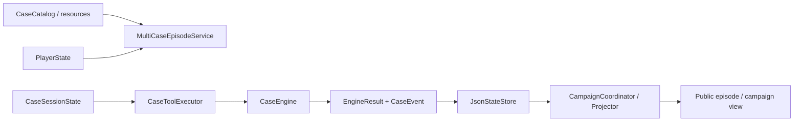

# 案件与 Campaign 模块主文档

> 状态：当前实现说明。本文是案件定义、权威案件执行、跨案件 Campaign 与产品入口边界的首选文档；历史报告和产品设计保留为证据，不替代当前代码事实。

## 1. 模块定位与当前状态

案件与 Campaign 模块定义“世界中什么可以发生”。它装载六个正式案件，建立玩家与 Episode，验证调查、诊断和处置的领域前置条件，由 `CaseEngine` 生成权威事件和新状态，并把已完成案件投影到 Campaign。

当前已实现：

- 六个正式案件的结构化定义、引用完整性校验和本地目录装载；
- 调查、诊断、处置、结局与评分的确定性执行；
- 玩家、案件 Session、Campaign 的 JSON 快照；
- 多案件创建、开始、恢复、提交、完成和 Campaign 对账；
- 本地 Web 入口，以及复用同一应用/领域服务的 MCP 入口。

当前不包含开放世界生成、动态案件创作、公网多租户身份系统或现实医疗能力。普通案件角色不是 Agent。

## 2. 数据模型与权威来源

| 数据 | 权威来源 | 作用 |
|---|---|---|
| `CaseDefinition` | [`domain/cases.py`](../../src/xuanyi_npc/domain/cases.py) 与 [`resources/cases`](../../src/xuanyi_npc/resources/cases/) | 病例、线索、调查项、诊断候选、处置和评分规则 |
| `PlayerState` | [`domain/player.py`](../../src/xuanyi_npc/domain/player.py) | 玩家身份、能力与已完成经历 |
| `CaseSessionState` | [`domain/cases.py`](../../src/xuanyi_npc/domain/cases.py) | 单次 Episode 的发现、诊断、处置、历史和 revision |
| `CaseEvent` | [`domain/events.py`](../../src/xuanyi_npc/domain/events.py) | 已提交行动的连续、可回放记录 |
| `CampaignState` | [`domain/campaign.py`](../../src/xuanyi_npc/domain/campaign.py) | 跨案件完成摘要、知识解锁和来源 |

案件 JSON 是规则输入，不是运行时状态；Session 和 Campaign 快照才是当前持久状态。对模型公开的 Observation 是安全投影，不等于完整 `CaseDefinition` 或隐藏真值。

## 3. 当前执行链

1. [`CaseCatalog`](../../src/xuanyi_npc/application/multicase.py) 从资源目录读取并验证案件。
2. `MultiCaseEpisodeService` 创建或恢复玩家、Session 与 Campaign 上下文。
3. 上层运行时只把已经通过行动和权限验证的公开 Tool 调用交给 [`CaseToolExecutor`](../../src/xuanyi_npc/application/case_tools.py)。
4. [`CaseEngine`](../../src/xuanyi_npc/engine/case_engine.py) 再验证领域上下文、技能、前置线索、诊断证据和处置条件，返回不可变的新 Session、事件和公开消息。
5. 应用服务保存权威快照；完成案件后由 [`CampaignCoordinator`](../../src/xuanyi_npc/application/campaign.py) 投影跨案件结果和知识。

## 4. 领域规则与状态变化

### 调查

调查必须匹配案件中已定义的 action、target、技能和线索前置条件；同一调查或等价 requirement 不能重复完成。成功后只公开新发现线索并增加 revision。

### 诊断

诊断 ID 必须来自案件候选，引用的证据必须已在当前 Session 中发现。提交诊断不会直接结束案件；结果需由处置复验。

### 处置与评分

处置要求已有诊断，并满足该处置的公开线索前置条件。执行后 Session 进入完成态，`CaseEngine` 根据关键线索、诊断正确性、处置结果和不安全惩罚计算分数。模型不能指定结局或分数。

### Campaign

Campaign 只消费已完成案件的公开摘要和稳定来源标识。规则来自 [`resources/campaign`](../../src/xuanyi_npc/resources/campaign/)，负责知识解锁、已完成列表与下一案建议；它不改写案件历史，也不赋予 Agent 新的世界写权限。

## 5. 入口与接口边界

- `yiwen-xinglu` 是当前正式本地 Web 命令；`xuanyi-clinic` 是兼容别名，两者都由 [`clinic/server.py`](../../src/xuanyi_npc/clinic/server.py) 组合。
- [`ClinicService`](../../src/xuanyi_npc/application/clinic.py) 连接页面、MultiCase 服务和 Cooperative Runtime。
- [`MCPApplicationService`](../../src/xuanyi_npc/application/mcp_facade.py) 与 [`mcp_server`](../../src/xuanyi_npc/mcp_server/) 是本地集成适配器，不绕过应用校验或 `CaseEngine`。
- HTTP 服务仅绑定 `127.0.0.1`；这不是公网部署安全保证。

## 6. 持久化、回放与故障边界

[`JsonStateStore`](../../src/xuanyi_npc/storage/json_store.py) 分 namespace 保存 Player、Case Session、Cooperative Agent 和 Campaign。写入采用临时文件替换；`save_case_session` 没有 expected revision，Agent State 的 revision 检查也是写入前检查而非数据库级原子 CAS。正常单进程受控入口依赖共享 Session `RLock` 避免线程间静默覆盖，完整边界见[提交一致性与失败安全](COMMIT_CONSISTENCY_DESIGN.md)。

确定性事件可用于从初始状态重建案件并核对终态；回放证明的是领域状态可重建，不代表 JSON、AgentState、SQLite Memory 和 Campaign 之间存在跨存储原子事务。提交中断时依赖幂等来源、对账和保守失败恢复，仍需专门的并发/崩溃演练证明完整恢复能力。

## 7. 与其他模块的边界

- [协作运行时](COOPERATIVE_RUNTIME_DESIGN.md) 决定何时调用 Agent、何时进入确认与执行；本模块只裁定领域命令结果。
- [Planning 与行动契约](PLANNING_AND_ACTION_DESIGN.md) 限制模型候选动作；Plan 不授予案件写权限。
- [Context Engineering](CONTEXT_ENGINEERING_DESIGN.md) 只向模型公开安全投影，不把隐藏案件定义放入请求。
- [Memory](MEMORY_DESIGN.md) 消费已提交事件的投影；Memory 不是案件权威状态。
- [Reflection](REFLECTION_DESIGN.md) 在提交后形成可拒绝经验，不能回滚或修改案件。

## 8. 实现与验证证据

| 能力 | 实现 | 代表性验证 |
|---|---|---|
| 案件定义与引用校验 | [`domain/cases.py`](../../src/xuanyi_npc/domain/cases.py) | [`test_case_definition.py`](../../tests/test_case_definition.py) |
| 调查/诊断/处置/评分 | [`engine/case_engine.py`](../../src/xuanyi_npc/engine/case_engine.py) | [`test_case_engine.py`](../../tests/test_case_engine.py) |
| 多案件生命周期 | [`application/multicase.py`](../../src/xuanyi_npc/application/multicase.py) | [`test_multicase_episode_service.py`](../../tests/test_multicase_episode_service.py) |
| 本地产品入口 | [`application/clinic.py`](../../src/xuanyi_npc/application/clinic.py) | [`test_m1_cooperative_web.py`](../../tests/test_m1_cooperative_web.py) |
| 产品案件体验 | [`product/R5_CASE_DESIGN.md`](../product/R5_CASE_DESIGN.md) | 六个正式资源文件与领域测试 |

测试证明确定性契约和既有回归，不等于真人体验、开放世界泛化或公网可靠性。

## 9. 历史与专项文档

- [`PROJECT_MASTER_BLUEPRINT.md`](PROJECT_MASTER_BLUEPRINT.md)：产品身份与最高层权责。
- [`PRODUCT_SYSTEM_ARCHITECTURE.md`](PRODUCT_SYSTEM_ARCHITECTURE.md)：全系统架构。
- [`../product/R5_CASE_DESIGN.md`](../product/R5_CASE_DESIGN.md)：六案内容与体验设计。
- [`../product/ROADMAP.md`](../product/ROADMAP.md)：跨模块状态和后续触发条件。

本文描述当前模块；上述材料分别保留产品、全局架构和历史状态角色。
