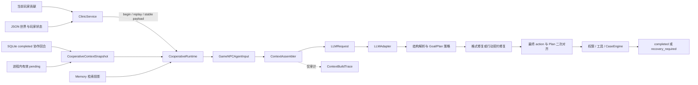

# 上下文工程模块

状态：**当前范围完成**。CE-0、CE-1、CE-1.1 与 CE-2A 已实施，CE-2A 最终请求的离线有限质量验收已通过；CE-2B、完整 CE-3 和真实模型语义收益验证仍暂缓。本文是理解当前上下文工程的首选入口，描述当前工作区中的实际实现；历史设计、实施、修复与验收材料保留在[历史文档索引](#9-历史文档索引)中。

这里的“完成”只指当前确定性范围：请求构建、协作历史与 pending 公开投影、来源边界、快照复用、幂等与保守恢复已经落地并有离线证据。它不表示所有上下文能力、原设计全部阶段、模型理解收益、协作成功率或 pending 授权持久化均已完成。

## 1. 模块定位与边界

上下文工程模块负责把当前公开世界、玩家贡献、Agent 规划状态、可选记忆、近期协作历史和当前有效 pending 的公开信息，确定性地组织为送入 `LLMAdapter.complete()` 的请求。它还生成不进入模型消息的构建审计记录，并为协作回合提供持久历史、重复操作识别和保守恢复边界。

它位于单一主 Agent 链路中，不拥有世界写权限，也不替代其他确定性边界：

- 玩家贡献是待评价的意见，不直接生成或授权工具调用；
- Goal/Plan 是 Agent 意图，不授予权限；
- 当前公开 `CaseObservation` 是模型可见案件事实的权威来源；
- `NPCAuthorityPolicy`、公开行动契约和 `CaseEngine` 分别决定权限、合法参数和世界提交；
- 历史、Memory、Reflection 或模型回复都不能恢复授权或产生新的权威案件事实。

当前范围不包括 CE-2B durable pending、跨存储事务、world mutation exactly-once、自动摘要、意图识别、讨论回合/持续暂停规则、持久行动排除、额外 Agent 或新向量库。Memory 与 Reflection 保持独立模块，不在上下文工程中重定义其写入、检索或生命周期策略。

### 当前阶段状态

| 阶段 | 当前状态 | 准确含义 |
|---|---|---|
| CE-0 | 已实施，有保留接受 | 保存历史请求快照；`ce0_requests.json` 可作请求身份，但其“来自重构前实现”的独立来源未能验证 |
| CE-1 | 已实施 | 抽取确定性 `ContextAssembler` 和非模型可见 `ContextBuildTrace`，保持既有请求形状 |
| CE-1.1 | 已实施 | 建立可重建的当前工作区 pre-change 基线，收紧 trace 语义并补正式 adapter 边界覆盖 |
| CE-2A | 已实施并完成有限修补 | 持久 completed 协作历史、完整回合选择、进程内 pending 公开投影、snapshot 复用、replay 与保守恢复 |
| CE-2B | 未实施、暂缓 | durable pending authority、原子 claim/consume/reject 和重启授权恢复 |
| CE-3 | 未完整实施、暂缓 | 原设计中的统一预算与更广泛选择；CE-2A 只有历史/pending 的有限字符边界，不能据此称 CE-3 完成 |
| CE-4 | 离线工具已具备，真实效果未验证 | v1/v2/v3 工具与离线请求/安全边界证据已存在；未运行真实模型 C/T 语义收益评测 |

## 2. 当前实际架构与数据流

正式入口是 [`ClinicService.submit_player_contribution()`](../../src/xuanyi_npc/application/clinic.py)。记录开启时，Clinic 先以 `player_id + case_id + session_id + operation_id` 和稳定 payload 读取或建立协作回合；既有 completed operation 走 replay，冲突、运行中或不确定恢复状态先处理，只有新 operation 才检查当前 pending。

启用 context v2 时，[`build_context_snapshot()`](../../src/xuanyi_npc/application/cooperative_context.py) 从同 scope、当前 operation 之前的 completed 记录选择历史，并从 `ClinicService.cooperative_pending` 复制当前 scope/revision 有效项形成不可变 [`CooperativeContextSnapshot`](../../src/xuanyi_npc/domain/cooperative_context.py)。snapshot 和选中的历史消息只构建一次，交给 [`CooperativeRuntime.handle()`](../../src/xuanyi_npc/application/cooperative_runtime.py)。

Runtime 每轮重新恢复公开观察、玩家、Goal/Plan 和可选 Memory 检索结果，构造 `GameNPCAgentInput`。[`ContextAssembler`](../../src/xuanyi_npc/agents/context.py) 再生成 A0 或 A1 的首次请求：system 规则在前，选中的完整历史回合居中，当前 user context 在后。真正送入 adapter 的是 `LLMRequest`；`ContextBuildTrace` 只保存在 `GameNPCAgent` 的 thread-local 最近构建记录中。

三类请求的关系如下：

1. **首次请求**：A0 使用简化 decision shape；A1 使用包含 Goal/Plan、评价、Memory、公开行动空间和契约的 planning shape。
2. **格式修复**：严格复用首次请求的全部消息，再追加无效 assistant 原文和确定性校验反馈；不重新读取世界、历史或 pending。
3. **行动契约修复**：复用同一个 `GameNPCAgentInput` 和 snapshot 重建既有 A0 request shape，再追加公开安全反馈；即使源自 A1，也不改成 A1 schema。修复后的最终 action 会在 authority/tool 前再次与已应用 Plan 对齐。

## 3. 上下文组成与信息边界

| 内容 | 当前来源 | 权威性与作用域 | 选择、更新与省略 |
|---|---|---|---|
| 系统规则与输出契约 | 版本化 prompt、固定行动/规划契约、CE-2A system suffix | 最高优先级的模型行为约束；玩家文本不能修改 | 每次构建常驻；CE-2A suffix 明示历史非权威、pending view 不授予权限 |
| 当前案件事实 | 最新公开 `CaseObservation`、公开环境反馈、玩家视图 | 当前模型可见世界事实；不含隐藏真相 | Runtime 每轮从权威状态恢复，不从历史或摘要恢复 |
| 当前玩家贡献 | `PlayerContribution` 原始公开文本、类型和响应引用 | 玩家信念、问题或建议，不是事实或命令；同玩家/案件/session | 当前 user context 保留一次，不进入历史查询，不做静默语义截断 |
| Goal/Plan 与评价 | 当前 `CooperativeAgentState` | Agent 当前意图，不是授权；旧版本不能冒充当前版本 | A1 每轮使用当前有效状态；A0 request shape 不包含这些字段 |
| 公开行动空间与权限视图 | 当前 observation 的公开投影、`NPCAuthorityPolicy.view()` | 合法候选和确定性权限约束 | 当前构建重新投影；不只按 Plan 过滤，以保留合法替代路径 |
| Memory context | 现有 Memory 检索服务的已选投影 | 非权威参考；来源和生命周期由 Memory 模块负责 | A1 可见，选择规则不由 CE-2A 改写；行为 C/T 评测中两侧均关闭 |
| 近期协作历史 | 独立 SQLite repository 中同 scope 的 completed turn | 历史玩家话语和 NPC 公开回复均非当前事实或授权；角色由服务端赋值 | 最多 3 个完整 user/assistant pair，按连续时间后缀选择；只能整对保留或省略 |
| pending 公开投影 | 当前进程内 `cooperative_pending` 的 scope/revision 有效项 | “当前存在待确认事项”是当前约束信息，但 view 本身不授权；授权仍使用完整 pending 对象 | 全部有效项按 confirmation ID 稳定排序；不参与历史裁剪；过期或跨 scope 项不注入 |
| 历史选择/省略元数据 | snapshot 的 operation IDs 与 `HistoryOmissionView` | 只描述本轮选择事实，不是历史摘要 | 有省略时给出精确 completed turn 数、`turn_limit`/`character_budget` 原因和重述提示 |
| `ContextBuildTrace` | assembler 对最终 provider-neutral 请求的确定性记录 | **模型不可见**；用于来源、请求形状和长度口径审计 | 记录 content 字符/UTF-8 字节、schema 哈希、prompt 哈希和输出上限；不声称 token 或 provider payload 已测量 |

历史中的分歧、撤回和改口保留为时间有序的完整回合。旧意见不会被删除，但明确属于历史；当前贡献和当前权威状态位于最后一个 user context 中。普通案中人物对话 `CaseDialogueState.recent_messages` 不会被误接为协作历史。

Memory 只向 A1 提供已经由 Memory 模块隔离和选择的非权威投影；上下文工程不改变检索、写入或纠正语义。Reflection 在回合后由独立服务生成/附加，不能反向改写本轮 snapshot，也不能自行成为权威事实或授权。相关模块的完整设计分别见 [Memory 实现报告](../PHASE_B_MEMORY_IMPLEMENTATION_REPORT.md) 和 [Reflection 实现报告](../PHASE_C_REFLECTION_IMPLEMENTATION_REPORT.md)。

## 4. 六个工程维度

| 维度 | 当前机制 | 已验证范围 | 未实现或不能宣称的能力 |
|---|---|---|---|
| 选择 | 当前事实、贡献、规划、权限和有效 pending 为必要内容；completed 历史按同 scope、当前 sequence 之前选择 | scope 隔离、当前 contribution 不重复、多个 pending 保留、旧存档空历史 | 没有意图感知选择、相关性重排或统一全请求 token 预算 |
| 分层 | system 规则、历史非权威消息、当前权威/意图/玩家信念分区；审计 trace 与模型内容分离 | 最终请求角色、标签、schema 和 trace 不泄漏有冻结/专项证据 | 标签不能证明模型一定遵守权威边界，仍需真实模型验证 |
| 排序 | `system → 完整历史 pair（时间正序）→ 当前 user context`；pending 以 confirmation ID 稳定排序 | A0/A1 首次和修复边界、撤回/改口、C/T 请求差异已离线核对 | 稳定、可重现的顺序不等于经模型实验验证的最优顺序 |
| 压缩 | 使用公开字段投影，历史按完整 pair 裁剪，省略时只发元数据和重述提示 | O01 和超限测试证明不会截断半个回合，也不伪造被省略内容 | 没有语义摘要、自动压缩或来源回链摘要；公开投影与精简不能冒充语义摘要 |
| 生命周期管理 | turn 有 started/prepared/completed/failed_before_reply/recovery_required；snapshot 每 operation 一次；completed 才进入历史 | replay、payload conflict、重启历史、过期 pending、完成写失败不重放工具 | pending 授权仍是进程内；无跨进程执行锁、跨存储原子事务或 world exactly-once |
| 验证 | 请求冻结、adapter 边界捕获、fault injection、ContextBuildTrace、行为 C/T 离线 runner 和有限质量验收 | 可确定请求内容、顺序、来源边界、调用次数和无工具副作用 | 模拟输出不能证明指代理解、改口处理、澄清质量或任务成功率提升 |

## 5. 关键契约与故障边界

### 5.1 历史与预算口径

- 历史上限为 **3 个完整 completed 回合**；一个回合必须同时包含 user 与 assistant projection。
- 历史预算为投影后 message `content` 的 **12,000 个 Python 字符**，不是 token 数、UTF-8 字节数或完整 provider payload 长度。
- 从最新 completed turn 向旧选择，恢复为时间正序；下一完整回合超限时，省略该回合及更旧回合，保持连续后缀。
- omission marker 只给精确省略数量、原因和“必要时请玩家重述”的公开提示，不包含摘要。
- pending 公开投影有独立 12,000 字符静态上限；所有当前有效项必须完整保留，不能为了腾空间提前消费或只留最新。
- assembler 还会拒绝超过当前 `PromptText` 静态限制的必要 user context。项目尚无覆盖 messages、schema、provider framing 和输出预留的统一 token 预算，因此完整 CE-3 仍未完成。

### 5.2 snapshot 与请求形状

- 首次请求只构建一次历史/pending snapshot；A0/A1 格式修复复用 `original.messages`，不重读状态。
- 行动契约修复复用同一 Agent input/snapshot，但保持既有 **A0 request shape** 和 `GameNPCDecisionProposal` schema。
- A1 首次请求明确预留 `max_output_tokens=2048`；A0 首次、两类格式修复和行动契约修复使用 adapter 默认上限，当前为 512。
- 这些差异是冻结的兼容事实。本模块不以“整理上下文”为由改变输出上限、schema 或调用次数。

### 5.3 pending 与授权

- CE-2A view 只公开 confirmation/decision ID、公开 action、authority mode、理由、case revision 和是否响应当前贡献。
- `responds_to_current_contribution=true` 要求 confirmation ID 与 decision ID 同时匹配，且 scope/revision 已由投影路径校验；该标记仍不参与授权。
- Runtime 中 legacy `pending_confirmation_id` 字段仍实际承载经验证 pending 的 decision ID。v2 builder 不把这个不透明 ID 当成完整 pending。
- 真正授权只来自当前进程内的完整 `PendingActionConfirmation` 和确定性权限策略。重启后 completed 历史可恢复，进程内 pending 不恢复；不得从历史回复、旧结果或请求参数复活授权。

### 5.4 replay、重复操作与保守恢复

- 稳定 payload 包含完整 scope/operation、文本、贡献类型和响应引用；服务端时间戳不参与 fingerprint。
- 同 scope/operation 的 completed + 相同 payload 直接 replay，不再次调用模型或工具；payload 变化返回 conflict。
- 同进程原请求仍运行时，重复请求返回 in-progress；没有当前执行归属的 started/prepared 记录转为 `recovery_required`，不自动重放。
- completed replay 中的旧 `pending_action` 只有在当前进程内仍存在完全相同且 revision 有效的项时才可对外保留；否则清除，不重新插入授权源。
- 工具可能成功但 completed 写失败时，以权威世界提交为准，operation 转入不确定恢复；不能用 revision 增量或动作相似度推断成功归属。

SQLite 协作日志、JSON 世界状态和 Agent state 之间没有跨存储事务。当前同进程 operation 归属也不是跨进程锁。严格多进程并发、崩溃后自动恢复正常结果和 world mutation exactly-once 需要权威 operation correlation 与共享 CAS/锁边界，不属于 CE-2A 保证。

### 5.5 执行与评测保护

行动契约修复可能替换首次 action，因此 Runtime 在 `_resolve_contract()` 之后、任何 authority/tool 执行之前，对**最终 action**重新执行 Plan 对齐。不匹配时返回安全拒绝，不执行工具；该保护属于执行边界，与请求等价证据分开。

行为评测的 `DurableRequestLedger` 写入失败会锁存不可继续错误并停止批次；started 失败发生在 provider adapter 前，completed/error 失败不会让不完整证据继续进入工具或下一回合。它是**评测运行保障**，不是 `ContextAssembler` 或生产协作历史组装的职责，也不提供 provider 幂等或 world exactly-once。

### 5.6 开关与回滚

两个开关默认都关闭：

| `cooperative_record_enabled` | `cooperative_context_v2_enabled` | 行为 |
|---:|---:|---|
| false | false | 旧请求/运行路径 |
| true | false | 写协作记录并启用 operation replay/冲突保护，但不注入 v2 上下文 |
| true | true | 完整 CE-2A |
| false | true | 非法组合，初始化时拒绝 |

记录模式不是零影响 shadow write：repository 不可用、payload conflict 或 recovery uncertainty 会产生稳定错误。context v2 可独立关闭而保留已有历史；CE-2A 不把 durable pending 作为授权源。

## 6. 实现与验证证据

### 6.1 能力—实现—证据

| 能力 | 主要实现 | 主要确定性证据 |
|---|---|---|
| A0/A1 与两类 repair 的确定性请求构建 | [`agents/context.py`](../../src/xuanyi_npc/agents/context.py)、[`agents/game_npc.py`](../../src/xuanyi_npc/agents/game_npc.py) | [`test_context_engineering_ce11.py`](../../tests/test_context_engineering_ce11.py)、CE-1 pre-change snapshot |
| 历史完整回合选择、omission、pending 投影 | [`application/cooperative_context.py`](../../src/xuanyi_npc/application/cooperative_context.py)、[`domain/cooperative_context.py`](../../src/xuanyi_npc/domain/cooperative_context.py) | [`test_context_engineering_ce2a.py`](../../tests/test_context_engineering_ce2a.py)、CE-2A request fixtures v1/v2 |
| operation 生命周期、replay 与恢复 | [`storage/sqlite_cooperation.py`](../../src/xuanyi_npc/storage/sqlite_cooperation.py)、[`application/clinic.py`](../../src/xuanyi_npc/application/clinic.py) | completed replay、冲突、重启、fault-injection tests；[replay 修补记录](../archive/context_engineering/context_engineering_ce2a_replay_fix.md) |
| 最终 action 与 Plan 二次对齐 | [`application/cooperative_runtime.py`](../../src/xuanyi_npc/application/cooperative_runtime.py) | [`test_context_engineering_ce11.py`](../../tests/test_context_engineering_ce11.py)、[专项修复记录](../archive/context_engineering/action_contract_repair_plan_alignment_fix.md) |
| C/T 最终请求与边界评测 | [`evaluation/ce2a_context_behavior.py`](../../src/xuanyi_npc/evaluation/ce2a_context_behavior.py)、behavior fixtures v1/v2/v3 | [`test_ce2a_context_behavior_evaluation.py`](../../tests/test_ce2a_context_behavior_evaluation.py)、[有限质量验收](../archive/context_engineering/ce2a_context_quality_acceptance_20260926.md) |
| 付费评测账本 fail-closed | [`evaluation/request_ledger.py`](../../src/xuanyi_npc/evaluation/request_ledger.py)、paid evidence wrapper | [v3 账本失败修复](../archive/context_engineering/ce2a_ledger_failure_fix_v3.md)及对应 fault-injection tests |

确定性证据可以证明信息是否进入最终请求、来源/角色/顺序、snapshot 是否复用、过期信息是否过滤、调用次数和工具副作用是否发生。它不能证明模型实际理解指代、正确处理改口、在歧义时澄清或提升协作成功率；这些仍需要固定模型的真实 C/T 对照。

### 6.2 三条独立版本轴

不要把下列版本号互相映射：

1. **实施阶段轴**：CE-0、CE-1、CE-1.1、CE-2A、CE-2B、CE-3、CE-4，描述功能与验收阶段。
2. **请求基线轴**：CE-0 `ce0_requests.json` v1；CE-1.1 `ce1_pre_change_v1/`；CE-2A `ce2a_requests_v1.json` 与 `ce2a_requests_v2.json`。CE-2A v2 只是新增精确 pending 响应标记的请求身份，不是 CE-2B。
3. **行为评测 fixture 轴**：v1 是 12 场景离线协议；v2 是 13 场景、合法 P01O/P01A 与默认禁用真实 runner；v3 保留 v2 场景语义并为账本 fail-closed 修复建立新实验身份。v3 不表示 CE-3 已实施。

CE-0 v1 必须继续表述为“历史请求快照可用，重构前独立来源未能验证”。不能用当前实现重建结果来补写其 provenance，也不能覆盖旧文件消除哈希差异。

### 6.3 历史验证结果的归属

以下数字只记录各文档所述当时运行，不能累加，也不是本次文档整理重新执行的结果：

| 来源/轮次 | 当时记录的结果 |
|---|---|
| CE-0/CE-1 实施（2026-09-24） | 专项 6；相关回归 118；全量 596 |
| CE-0/CE-1 独立审查（2026-09-25） | 审查专项 74；未重复全量 596 |
| CE-1.1（2026-09-25） | 专项 81；全量 606 |
| CE-2A replay 修补后（2026-09-25） | CE-2A 专项 31；全量 637 |
| behavior v1（2026-09-26） | 新工具专项 8；与 CE-2A 合并 39；全量 645；48 回合离线 dry-run |
| behavior v2（2026-09-26） | 行为/adapter 专项 40；相关 99；全量 651；52 回合离线 dry-run |
| ledger fix / fixture v3（2026-09-26） | 行为/adapter 专项 46；相关 87；全量 657 |
| 最终请求有限质量验收（2026-09-26） | 该验收轮次定向 27；8 个代表场景请求检查；未重复全量 |

所有上述上下文行为工具的模拟输出都不构成真实语义收益证据。v3 真实入口仍默认禁用；本模块文档不选择模型、不核验价格、不准备或授权付费运行。

## 7. 阶段演进与后续触发条件

原阶段名称和边界保持如下：

- **CE-0：冻结输入基线。** 已实施，但保留 provenance 限制。
- **CE-1：抽取构建层与构建记录。** 已实施，保持首次请求、schema、Goal/Plan、权限和 Memory 语义。
- **CE-1.1：可信当前基线与 trace 语义修订。** 已实施，补齐正式 A0/A1/repair adapter 边界。
- **CE-2：协作历史与协商信息。** 拆成 CE-2A 与 CE-2B。CE-2A 已实施；CE-2B 未实施。
- **CE-3：预算与选择。** 尚未完整实施。只有 CE-2A 局部的完整回合/字符预算和 required-context fail-closed。
- **CE-4：行为评测。** 离线 harness、预检、盲评材料和安全运行边界已实现；真实模型语义收益评测尚未执行。

CE-2B、统一 token 预算、自动摘要、意图识别、讨论回合、跨进程并发和真实效果评测都不是默认必须继续的待办。只有生产使用暴露了明确、可复现的缺口，或项目确实需要证明上下文带来的模型行为收益时，才重新启动相应阶段，并重新冻结范围和证据身份。

若未来需要 CE-2B，应先单独设计 durable pending 单一授权源、原子 claim/consume/reject、重启恢复和权限回归；若要自动把不确定 operation 恢复为成功，还需先实现所有权威 mutation 入口的 durable operation correlation。若未来需要真实 CE-4，应另行选择并冻结模型、价格、payload 上界、样本和授权；本文不执行这些工作。

## 8. 停止与回滚条件

出现跨玩家/案件/session 历史混入、权限信息丢失、历史或 replay 复活授权、旧意见被标成当前事实、必要 pending 被静默裁剪，或不确定 operation 被自动重放时，应停止相应策略并保留证据。context v2 可关闭而不删除历史；权限边界必须 fail-closed，不能通过降级绕开 scope、revision 或必要上下文校验。

输入规模、结构遵循、任务推进或成本若出现实际退化，应先区分上下文构建、执行政策与模型行为，不因文本更长、更短或更整洁就推断效果变化。

## 9. 历史文档索引

本文描述当前状态；下列文件保留各自形成时的范围、判断和测试记录，不应单独代替当前总览。

### 设计演进

- [CE-2 详细设计](../archive/context_engineering/CONTEXT_ENGINEERING_CE2_DESIGN.md)：CE-2A/CE-2B 数据契约、恢复和授权边界的详细设计；其中 CE-2A 部分已落地，CE-2B 仍为设计。

### 实施与审查

- [CE-0 / CE-1 实施报告](../archive/context_engineering/context_engineering_ce0_ce1_implementation_report.md)：最初请求冻结与 assembler 抽取。
- [CE-0 / CE-1 独立审查](../archive/context_engineering/context_engineering_ce0_ce1_review.md)：CE-0 provenance、正式路径覆盖和 trace 语义问题；后续由 CE-1.1 收紧。
- [CE-1.1 实施报告](../archive/context_engineering/context_engineering_ce11_implementation_report.md)：可信当前基线、trace 语义和 adapter 边界。
- [CE-2A 实施报告](../archive/context_engineering/context_engineering_ce2a_implementation_report.md)：SQLite 协作历史、snapshot、公开投影和故障边界。

### 修复记录

- [行动契约修复后的 Plan 对齐](../archive/context_engineering/action_contract_repair_plan_alignment_fix.md)：最终 action 的执行前二次对齐。
- [CE-2A completed replay 与 pending 标记修补](../archive/context_engineering/context_engineering_ce2a_replay_fix.md)：检查顺序、payload conflict 与双 ID 标记。

### 评测设计与离线证据

- [CE-2A 上下文行为对照方案](../archive/context_engineering/ce2a_context_behavior_pilot.md)：C/T 问题、场景和结论边界。
- [行为对照工具实施报告](../archive/context_engineering/ce2a_context_behavior_pilot_implementation.md)：v1/v2 runner、预算保护、盲评和离线 dry-run。
- [v1 离线预检](../archive/context_engineering/ce2a_context_behavior_preflight_v1.md)与 [v2 预检](../archive/context_engineering/ce2a_context_behavior_preflight_v2.md)：对应冻结身份形成时的历史预检结果。
- [v3 账本写入失败停止批次修复](../archive/context_engineering/ce2a_ledger_failure_fix_v3.md)：当前 behavior fixture 身份与付费运行 fail-closed 保障。

### 验收

- [CE-2A 最终请求上下文有限质量验收](../archive/context_engineering/ce2a_context_quality_acceptance_20260926.md)：代表性最终请求、确定性边界、27 项定向测试及真实模型待验证事项。
