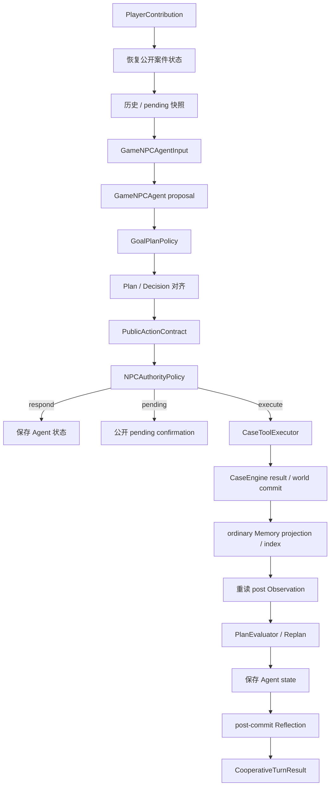

# 协作运行时模块主文档

> 状态：当前实现说明。本文是单回合编排、人机协作、确认、提交、恢复与运行时可观测性的首选入口。

## 1. 模块定位与当前状态

协作运行时把玩家自然语言贡献、Agent 候选决策和确定性系统连接成一个受限回合。它负责顺序与故障边界，但不替模型作判断，也不替 `CaseEngine` 决定世界结果。

当前已实现：玩家贡献建模、Agent proposal、Goal/Plan 与行动校验、权限分级、pending confirmation、每回合最多一个 Tool、Agent 状态保存、Memory 检索归因、提交后 Reflection、回合账本与 completed replay。

当前限制包括：pending 授权主要是进程内状态，重启不恢复授权；正常单进程入口虽已按 Session 串行化，但多进程仍没有数据库级原子 CAS；world、AgentState、合作历史和 Memory 没有跨存储事务。

## 2. 单回合数据流

核心实现为 [`CooperativeRuntime.handle()`](../../src/xuanyi_npc/application/cooperative_runtime.py)。正式 Web 路径由 [`ClinicService`](../../src/xuanyi_npc/application/clinic.py) 装载真实 Session、合作历史快照和 pending，再调用 Runtime。

## 3. 玩家、Agent 与确定性系统

| 主体 | 可以做什么 | 不可以做什么 |
|---|---|---|
| 玩家 | 提交线索、假设、建议、质疑、确认 | 直接构造已授权 Tool 或绕过前置条件 |
| Agent | 评价贡献、维护 Goal/Plan、选择公开候选、解释或提出行动 | 直接写世界、数据库或扩大权限 |
| Runtime/Policy | 校验、编排、创建 pending、执行合法 Tool、记录状态 | 代替模型选择诊断/处置结论 |
| `CaseEngine` | 裁定领域结果、事件、分数和终态 | 接收未经上层校验的自然语言意图 |

`PlayerContributionEvaluation` 可接受、部分接受、拒绝、请求更多证据或提出替代；这些是协作判断，不是对玩家文本的机械执行。

## 4. 回合生命周期

1. 恢复公开 Observation、Session、Player、Agent state，并丢弃不匹配当前 revision/owner/action 的 pending。
2. 标记与当前 Observation 不兼容的计划，并为已完成或已放弃 Goal 准备下一 active Goal。
3. 在启用时检索跨 Session Memory，建立 candidate/selected trace。
4. 构造 `GameNPCAgentInput`，调用 planning Agent；兼容性 test double 可走旧 `decide()` 路径。
5. 校验 Goal/Plan 更新以及初始 Plan—Decision 对齐。
6. 执行行动契约修复后，对最终行动再次做 Plan 对齐；修复不能偷换已应用的计划。
7. `RESPOND` 可完成非 Tool 当前步骤；Tool 动作进入权限策略。
8. 诊断 proposal 或高风险处置产生 pending；只有匹配的有效确认才能重新进入执行。
9. Tool 成功后先保存 world，再投影普通 Memory/索引；Runtime 随后重读 post Observation，确定性评估计划并保存 Agent state；最后才运行 Reflection。
10. 任一拒绝路径都不得执行 Tool 或产生世界事件，并返回可审计状态/错误码。

## 5. pending confirmation 契约

[`PendingActionConfirmation`](../../src/xuanyi_npc/domain/cooperation.py) 绑定 confirmation、decision、player、case、session、完整 action、authority mode 与 case revision。确认必须与当前贡献身份、revision 和动作一致；拒绝、改口、新的冲突动作或世界 revision 变化都会使旧 pending 失效。

Context v2 可以向模型公开 pending 的非授权投影，用于理解“正在等待什么”，但公开投影本身不授予权限。重启后不会凭历史文本恢复确认权；完整 durable pending 属于未实现能力。

## 6. 账本、幂等与恢复

[`SQLiteCooperativeHistoryRepository`](../../src/xuanyi_npc/storage/sqlite_cooperation.py) 以 player/case/session/operation 标识回合，保存稳定请求 fingerprint、prepared decision、completed result 或恢复状态：

- 相同 operation 与相同 payload 可返回 completed replay；
- 相同 operation 与不同 payload 触发冲突；
- decision 在权威执行前可进入 prepared 状态；
- 无法安全判定是否已提交的窗口进入保守恢复，而不是自动重发 Tool。

正式 CLI composition 默认启用 cooperative recording 与 context v2；可使用 `--no-cooperative-context-v2` 单独回滚上下文，或同时传入 `--no-cooperative-context-v2 --no-cooperative-record` 回到旧路径。`build_clinic_service()` 的程序化参数仍默认关闭，避免测试与嵌入调用被隐式改变；context v2 始终依赖 recording。运行时不新增自动续跑、自动重发或 exactly-once 世界修改承诺。

## 7. 状态提交顺序与失败语义

本节只描述协作入口；跨普通行动、MultiCase 与 MCP 的统一提交三态、Session 锁和重试边界见[提交一致性与失败安全](COMMIT_CONSISTENCY_DESIGN.md)。

- 世界状态由应用服务先提交，随后在 `submit_action_with_receipt()` 内投影普通 Memory；Runtime 重读 Observation、运行 PlanEvaluator 并保存 Agent state，Reflection 最后执行。
- Agent state 使用写入前 revision 检查；受控单进程路径还由 Session `RLock` 串行化。该检查不是跨进程原子 CAS，不能单独推广为全局无覆盖保证。
- 普通 Memory 写失败可通过 committed Session 对账恢复，但不回滚已提交世界。
- Reflection 始终是 post-commit、failed-safe；失败只影响经验形成和 telemetry。
- 跨存储没有原子事务，因此“回合返回失败”不能简单等同于“世界没有提交”；账本状态和权威快照共同决定是否需要人工/确定性恢复。

## 8. Context、Memory 与 Reflection 接口

- [Context Engineering](CONTEXT_ENGINEERING_DESIGN.md) 负责把当前事实、Goal/Plan、近期完整回合和 pending 公开投影装入最终请求。
- [Memory](MEMORY_DESIGN.md) 只返回作用域受限的只读候选；Runtime 记录 `selected → declared → accepted`，拒绝动作不接受使用归因。
- [Reflection](REFLECTION_DESIGN.md) 消费已提交结果与公开 evidence；无法影响当前 Tool 是否成功。

## 9. 实现与验证证据

| 能力 | 实现 | 代表性验证 |
|---|---|---|
| 协作领域契约 | [`domain/cooperation.py`](../../src/xuanyi_npc/domain/cooperation.py) | [`test_m1_cooperative_runtime.py`](../../tests/test_m1_cooperative_runtime.py) |
| 主回合编排 | [`application/cooperative_runtime.py`](../../src/xuanyi_npc/application/cooperative_runtime.py) | [`test_m2_cooperative_runtime_planning.py`](../../tests/test_m2_cooperative_runtime_planning.py) |
| Web 组合与 pending | [`application/clinic.py`](../../src/xuanyi_npc/application/clinic.py) | [`test_m1_cooperative_web.py`](../../tests/test_m1_cooperative_web.py) |
| 回合账本/重放 | [`storage/sqlite_cooperation.py`](../../src/xuanyi_npc/storage/sqlite_cooperation.py) | [`test_context_engineering_ce2a.py`](../../tests/test_context_engineering_ce2a.py) |
| Agent 状态 revision | [`storage/json_store.py`](../../src/xuanyi_npc/storage/json_store.py) | [`test_m2_cooperative_state_store.py`](../../tests/test_m2_cooperative_state_store.py) |

确定性测试可证明顺序、拒绝和状态不变量；真实模型的协作质量、玩家体验和高并发可靠性需要独立证据。

## 10. 历史与专项文档

- [协作运行时历史目录](../archive/cooperative_runtime/README.md)：M1–M5 时点的全局审计与表达材料；后续状态以当前主文档和评测主文档为准。
- [上下文工程历史索引](../archive/context_engineering/README.md)：历史快照、replay 与 pending 专项证据。
- [`../product/ROADMAP.md`](../product/ROADMAP.md)：跨模块未完成项。
