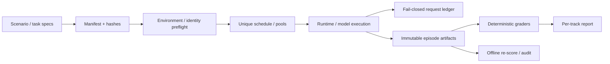

# Evaluation 模块主文档

> 状态：当前评测系统与证据治理说明。本文是评测协议、冻结身份、执行保障、artifact、版本轴和结论边界的首选入口，不把历史运行结果合并成一个总分。

## 1. 模块定位与当前状态

Evaluation 模块验证的是受限 Agent 系统，而不是生成一段看起来合理的演示。它把场景、模型/运行时配置、玩家脚本、成功规则、turn limit、重复协议、预算和 artifact 身份冻结在一起，并分开报告任务结果、可靠性、Authority、效率、修复/fallback、Memory、Reflection 与工程失败。

当前已有：M1–M5 早期能力验证、E2–E13 冻结基线及 Memory/Reflection 专项、V2 完整运行与失败审计、V2.1 设计/冻结/预检/recovery 执行、A0/A1 runner、离线重评分和 CE-2A context behavior harness。

完整 V2.1 162-episode 设计没有执行；真实攻击、并发/重启恢复、充分 Reflection 收益和公平完整 A0/A1 对照仍未完成。冻结计划存在不等于已运行。

## 2. 证据层级

| 层级 | 能证明什么 | 不能证明什么 |
|---|---|---|
| 单元/契约测试 | schema、校验、拒绝、状态不变量 | 模型理解、真实行为收益 |
| 离线 fixture/fake | 请求构建、确定性机制、runner 与 grader | 真实 provider 行为 |
| production-equivalent diagnostic | 特定模型/配置/场景下的路径观察 | 统计可靠性或泛化 |
| frozen repeated benchmark | 冻结协议下的描述性结果 | 超出协议的线上成功率 |
| matched ablation/architecture pair | 控制条件下的差异 | 有混杂或不完整配对时的因果归因 |
| 真人研究/生产观测 | 真实体验或运行证据 | 当前项目尚无充分覆盖 |

模拟输出、测试数量和请求长度不能替代真实模型语义收益；小样本未观察到安全失败也不能证明全面安全。

## 3. 冻结身份与版本轴

一个 benchmark 身份至少由以下组合决定：

`cases + runtime/model configuration + player script + success rule + turn limit + repeat protocol + immutable artifacts`

需要区分多条独立版本轴：

- 产品/实现阶段：M、P、E、CE 等工程演进；
- 评测设计：V2、V2.1 revision；
- freeze/package：同一设计下的 v1/v2/v3/v4；
- result run：每个输出目录的独立 experiment/run identity；
- Context fixture：CE 请求基线与 behavior fixture v1/v2/v3。

这些版本号不能相互替代。冻结文件的 hash 漂移必须产生新身份或拒绝执行，不能改写旧 manifest 来“修复”历史。

## 4. 执行架构

核心代码位于 [`src/xuanyi_npc/evaluation`](../../src/xuanyi_npc/evaluation/)：

- `v2_contracts.py`、`v2_scenarios.py`、`v2_graders.py` 定义任务与评分契约；
- `v21_freeze.py`、`v21_preflight.py`、`v21_schedule.py` 建立冻结、预检和唯一调度；
- `v21_execute.py`、`v21_architecture_runner.py` 执行任务与 A0/A1 比较；
- `v21_pool_control.py` 管理分池预算与停止；
- `request_ledger.py` 记录请求身份，写入失败必须停止批次；
- `v2_report.py`、`v21_report.py` 和 audit 工具从 artifact 生成/复核报告。

## 5. 运行保障

- 真实模型运行必须有显式授权和正预算；文档/预检本身不得触发付费调用。
- preflight 核对文件 hash、模型/价格快照、配置、输出目录和 schedule identity。
- 每个计划项只能出现一次，未启动、provider abort、infra failure、grader failure 和模型失败必须分开。
- 请求账本先于不可恢复的批次推进；账本写失败 fail-closed，不得继续制造无法对账的调用。
- artifact 保留模型输出、usage、repair/fallback、Authority、任务状态和错误分类；不保存密钥或 chain-of-thought。
- 失败响应的 usage 若缺失，应标记证据缺口，不能默认计为零。

账本 fail-closed 是评测运行保障，不是 ContextAssembler 或生产 Runtime 的职责。

## 6. 主要评测轨道与当前结论

### 早期 M1–M5 与 E 系列

M1–M5 记录 Cooperative Agent 能力建设。P0–P5 展示从失败轨迹到当前可执行路径的修复链。E6 的 3×3 结果只属于其冻结协议；它不是线上成功率，也不证明每项修复的独立贡献。

### V2 与 V2.1

V2 全量运行暴露任务推进和评测基础设施问题，随后形成 V2.1 修订设计。V2.1 原 54 项与 C/M recovery 是不同实验：

- G 轨道原批次 18 项完成，严格成功 17/18；
- 原 C/M 因实现/artifact 问题不能形成有效比较；
- recovery 中 M 形成 6 个有效配对，两条件均 6/6，未观察到成功率收益；
- recovery C 只形成 8 个完整配对，A0/A1 接口不对称且另有 4 个配对未启动，因此不能证明显式 Planning 的因果优势。

不能把 G、C、M 合并为一个总成功率，也不能把未启动项计作模型失败。

### Memory、Reflection 与 Context

- E10 证明真实 Agent 输入收到了跨 Session Memory；没有观察到 declared/accepted use，也未证明收益。
- E11 证明 Reflection OFAT 机制；E12 CONTROL 得到安全 `no_write`，未形成真实 derived Memory，ABLATION 未运行。
- CE-2A 离线质量验收证明最终请求构建和边界；behavior fixture 的付费真实对照仍未运行。

## 7. A0/A1 与模型边界

[`SimpleActionGameNPCAgent`](../../src/xuanyi_npc/agents/simple_action.py) 是 A0 当前行动架构，[`GameNPCAgent`](../../src/xuanyi_npc/agents/game_npc.py) 是 A1 持久 Goal/Plan 架构。比较必须提供等价公开 action arguments、相同案件/脚本/预算和成对完成；否则结果是 architecture-as-implemented 观察，不是“Planning 本身”的因果结论。

模型自评不构成成功真值。任务是否完成、诊断/处置是否正确、Authority 是否违规应由冻结规则、事件和权威终态判定。

## 8. Artifact 与报告规则

- 原始 run 目录不可被后续重跑覆盖；修复后使用新 experiment/run identity。
- 报告必须链接确切 manifest、schedule、artifact 和 grader 版本。
- 历史测试数量按来源和轮次陈述，不累加成“当前通过总数”。
- aborted、not-started、invalidated、superseded 和 completed 必须分开。
- 历史报告保留当时结论；当前主文档可以解释其后续状态，但不篡改原文。

## 9. 实现与验证证据

| 能力 | 实现/资料 | 代表性验证 |
|---|---|---|
| V2 契约与 grader | [`evaluation/v2_contracts.py`](../../src/xuanyi_npc/evaluation/v2_contracts.py)、[`v2_graders.py`](../../src/xuanyi_npc/evaluation/v2_graders.py) | [`test_eval_v2_contracts.py`](../../tests/test_eval_v2_contracts.py) |
| V2.1 freeze/preflight/schedule | [`evaluation/v21_freeze.py`](../../src/xuanyi_npc/evaluation/v21_freeze.py) 等 | [`test_eval_v21_slim.py`](../../tests/test_eval_v21_slim.py) |
| closure audit | [`evaluation/v21_report.py`](../../src/xuanyi_npc/evaluation/v21_report.py) | [`test_eval_v21_closure_audit.py`](../../tests/test_eval_v21_closure_audit.py) |
| Memory/Reflection harness | evaluation package | [`test_real_agent_memory_exposure_pilot.py`](../../tests/test_real_agent_memory_exposure_pilot.py)、[`test_reflection_ofat.py`](../../tests/test_reflection_ofat.py) |
| Context behavior harness | [`evaluation/ce2a_context_behavior.py`](../../src/xuanyi_npc/evaluation/ce2a_context_behavior.py) | [`test_ce2a_context_behavior_evaluation.py`](../../tests/test_ce2a_context_behavior_evaluation.py) |

## 10. 历史文档入口

- [`../evaluation/README.md`](../evaluation/README.md)：评测导航与紧凑证据说明。
- [`../evaluation/task_benchmark_and_results.md`](../evaluation/task_benchmark_and_results.md)：E6 协议和结果边界。
- [`../evaluation/v2_design/README.md`](../evaluation/v2_design/README.md)：原 V2 设计。
- [`../evaluation/v2_design/revision_20260920/README.md`](../evaluation/v2_design/revision_20260920/README.md)：V2.1 修订设计及冻结包入口。
- [Evaluation 历史目录](../archive/evaluation/README.md)：早期 benchmark、E2–E8 与最终 3×1 阶段证据。
- [Memory 历史目录](../archive/memory/README.md)与[Reflection 历史目录](../archive/reflection/README.md)：E9–E13 专项记录。
- [CE-2A 历史归档](../archive/context_engineering/README.md)：context behavior 设计、预检、账本修复与质量验收。

本文负责当前评测系统和结论口径；各历史文件仍是其冻结轮次的原始证据。
