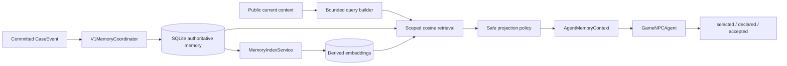

# Memory 模块主文档

> 状态：当前实现说明。本文是长期 Memory 的来源、持久化、索引、检索、安全投影、使用归因与证据边界的首选入口。

## 1. 模块定位与当前状态

Memory 模块把已提交、允许持久化的公开历史转换为按玩家隔离、可追踪来源、可失效和可检索的长期经验，并以最小只读视图提供给未来 Session 的 Agent。

当前已实现：SQLite 权威记录与来源回执、普通案件事件投影、纠正/失效/删除、BGE-M3 派生向量、作用域过滤、跨 Session 检索、安全投影、`selected → declared → accepted` 使用归因，以及 Reflection-derived candidate 的共用写入/索引路径。

当前已经证明持久化、隔离、检索和有限真实 Agent 曝光；尚未证明 Memory 稳定提高任务成功率。检索到、选中或进入请求都不等于模型使用，更不等于有益。

## 2. 当前架构

正式组合位于 [`clinic/server.py`](../../src/xuanyi_npc/clinic/server.py)：semantic 模式使用一个共享 [`SQLiteMemoryRepository`](../../src/xuanyi_npc/storage/sqlite_memory.py)、[`MemoryIndexService`](../../src/xuanyi_npc/application/memory_retrieval.py)、retrieval service 和 coordinator。

## 3. 权威记录与派生数据

| 层 | 内容 | 权威性 |
|---|---|---|
| verified source | 已提交事件/Reflection trigger 的稳定来源与回执 | 写入资格和幂等依据 |
| authoritative memory | 规范化的 episodic/learning 记录、player/session/case scope、生命周期 | Memory 业务权威记录 |
| embedding | 指定 embedding space 下的向量 | 可重建派生数据 |
| `AgentMemoryItem` | 对模型公开的最小内容、来源类型和 ID | 只读安全投影，不是世界真相 |
| usage trace | candidate/selected/declared/accepted IDs | 审计归因，不修改 Memory 内容 |

Memory 与案件世界是不同权威域。当前 Observation 优先；历史记录不能覆盖当前案件状态、创建新事实、注入指令或授予 Tool 权限。

## 4. 写入与生命周期

[`V1MemoryCoordinator`](../../src/xuanyi_npc/application/memory_coordination.py) 仅从 allowlist 中的已提交案件事件建立普通 Memory 投影。来源 ID 稳定，重复提交通过 receipt 幂等；权威案件 JSON 先提交，Memory 投影失败后可按 committed Session 对账。

[`SQLiteMemoryRepository`](../../src/xuanyi_npc/storage/sqlite_memory.py) 支持：

- player-scoped 读取与写入；
- source receipt 与 Memory 的一致性检查；
- correction、invalidation 和 hard delete/tombstone；
- embedding space 隔离和重建；
- Reflection lifecycle receipt 与 pending index 对账。

跨 world JSON 与 SQLite 不存在原子事务；“可对账”不是 exactly-once 跨存储提交保证。

## 5. 索引与检索

生产 embedding 使用本地 BGE-M3 adapter，模型目录、manifest hash、维度和 embedding space identity 显式验证。向量是派生缓存；空间不匹配、记录失效或删除时不能继续作为候选。

[`BasicCosineMemoryRetriever`](../../src/xuanyi_npc/application/memory_retrieval.py) 在相似度排序前过滤：

- 非当前 player；
- 当前 Episode；
- inactive/deleted 或不允许类型；
- 不匹配的 embedding space；
- 不满足 case/session/source 范围的记录。

生产配置目前是 `top_k=8`、最低相似度 `0.35`。这些是当前工程配置，不是经过充分真实模型实验得到的全局最优值。

## 6. 查询构造与预算

[`GameNPCMemoryQueryBuilder`](../../src/xuanyi_npc/application/game_npc_memory.py) 只使用公开信息，构造不超过 2000 字符的确定性紧凑 JSON。优先保留当前玩家贡献、Goal、当前 Plan step 和最小案件身份；公开 Observation 与近期 evaluation 是较低优先级，可按字段预算裁剪。

这里的规范化/裁剪不是语义摘要，也不调用额外 LLM。查询长度是字符约束，不应冒充精确 token 预算。

## 7. 安全投影与使用归因

[`GameNPCMemoryProjectionPolicy`](../../src/xuanyi_npc/application/game_npc_memory.py) 把候选转换为有限 `AgentMemoryContext`，保持来源 ID 和类型，排除私有/当前 Session/无效内容。

运行时分开记录：

1. `candidate`：检索器返回；
2. `selected`：投影策略选择并进入 Agent 输入；
3. `declared`：模型在 proposal 中声明使用；
4. `accepted`：Runtime 核对 declared ID 确实来自 selected 集合，且相关决策被接受。

越界声明、拒绝行动或未进入输入的 ID 不能成为 accepted use。真实 E10 pilot 中观察到 selected exposure，但没有 declared/accepted use；这是当前证据边界。

## 8. 故障与恢复边界

world-first 的跨模块提交状态、`projection_pending` 与重试边界统一见[提交一致性与失败安全](COMMIT_CONSISTENCY_DESIGN.md)；本节只说明 Memory 自身的 reconciliation 和降级行为。

- retrieval/index 失败应 `failed_safe`，不阻断或污染案件世界；
- production semantic 模式启动时对 committed Session 做 Memory 对账，并为已知玩家重建/检查索引；
- embedding 可重建，但权威 Memory/source receipt 不可由向量反推；
- current-session exclusion 防止把刚发生的事件伪装成跨 Session 经验；
- false-positive exposure 仍可能发生；E10 的 irrelevant negative 曾被选中，但未被模型声明或 Runtime 接受；
- 玩家 scope 是应用级隔离，不是公网认证或生产多租户安全证明。

## 9. 与 Context 和 Reflection 的边界

- [Context Engineering](CONTEXT_ENGINEERING_DESIGN.md) 决定 selected Memory 在最终请求中的位置和预算；Memory 模块不控制整个 prompt。
- [Reflection](REFLECTION_DESIGN.md) 只能把通过 evidence/写入策略的候选送入同一 repository/index；它没有平行的“反思数据库”。
- [协作运行时](COOPERATIVE_RUNTIME_DESIGN.md) 接受使用归因并决定拒绝/执行；Memory 不参与 Authority。

## 10. 实现与验证证据

| 能力 | 实现 | 代表性验证/记录 |
|---|---|---|
| SQLite 权威记录与生命周期 | [`storage/sqlite_memory.py`](../../src/xuanyi_npc/storage/sqlite_memory.py) | [`test_memory_repository.py`](../../tests/test_memory_repository.py)、[`test_memory_schema_v2.py`](../../tests/test_memory_schema_v2.py) |
| committed event 投影/对账 | [`application/memory_coordination.py`](../../src/xuanyi_npc/application/memory_coordination.py) | [`test_memory_coordination.py`](../../tests/test_memory_coordination.py) |
| 索引与 scoped retrieval | [`application/memory_retrieval.py`](../../src/xuanyi_npc/application/memory_retrieval.py) | [`test_memory_retrieval.py`](../../tests/test_memory_retrieval.py) |
| safe projection | [`application/game_npc_memory.py`](../../src/xuanyi_npc/application/game_npc_memory.py) | [`test_m3_agent_memory_projection.py`](../../tests/test_m3_agent_memory_projection.py) |
| production wiring | [`clinic/server.py`](../../src/xuanyi_npc/clinic/server.py) | [`test_phase_b_production_memory.py`](../../tests/test_phase_b_production_memory.py) |
| 跨 Session 曝光 | 生产链 + evaluation harness | [`evaluation/memory_evaluation.md`](../evaluation/memory_evaluation.md) |

## 11. 历史与专项文档

- [Memory 历史目录](../archive/memory/README.md)：生产接入、E9 harness 与 E10 真实 Agent pilot。
- [`../evaluation/memory_evaluation.md`](../evaluation/memory_evaluation.md)：紧凑证据说明。
- [`../archive/M45_SEMANTIC_MEMORY_EXPERIMENT.md`](../archive/M45_SEMANTIC_MEMORY_EXPERIMENT.md)：语义检索历史实验与负结果。

主文档描述当前设计；历史报告中的测试数量和真实运行结论只属于各自轮次，不能累加为本轮结果。
