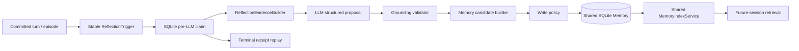

# Reflection 模块主文档

> 状态：当前实现说明。本文统一描述 Reflection 的触发、证据、生成、验证、Memory consolidation、幂等、失败隔离与效果证据边界。

## 1. 模块定位与当前状态

Reflection 是案件提交后的经验候选生成器。它从已发生的公开结果构造 evidence bundle，请模型生成结构化 finding/lesson，再经确定性 grounding 和写入策略验证，才可能成为未来可检索 Memory。

当前代码已实现 production wiring、结构化生成与一次修复、evidence grounding、保守 consolidation、共享 Memory 索引、持久化 lifecycle receipt、重启幂等和失败隔离。

确定性链路已经闭合；真实模型 pilot 观察到 trigger、生成、grounding repair 和安全 `no_write`，但没有得到 Reflection-derived Memory，因此真实派生经验的稳定生成、未来曝光和行为收益尚未证明。

## 2. 生命周期

入口为 [`ReflectionLifecycleService`](../../src/xuanyi_npc/application/reflection_lifecycle.py)，由 [`CooperativeRuntime`](../../src/xuanyi_npc/application/cooperative_runtime.py) 在世界与 Agent 状态提交后调用。production 仅在 LLM NPC 与 semantic Memory 都启用时组装 Reflection，并复用同一个模型 adapter、repository 和 index service。

## 3. Trigger 与 evidence

稳定 trigger 标识来源于公开的回合/目标/计划/Episode 生命周期。当前 evidence 类型位于 [`application/reflection.py`](../../src/xuanyi_npc/application/reflection.py)，包括：

- Tool outcome；
- Observation delta；
- Plan evaluation；
- 玩家贡献评价；
- Memory usage trace；
- 已提交 Episode outcome。

Evidence builder 只应接收 Runtime 已公开投影，不读取 raw hidden case truth。每条 evidence 有稳定 ref，proposal 必须引用实际存在且与 lesson 类型匹配的 ref。

## 4. 生成、修复与 grounding

[`ReflectionProposalGenerator`](../../src/xuanyi_npc/application/reflection.py) 请求结构化 proposal。初次 schema/grounding 失败可进行一次有限修复；耗尽后返回明确 fallback，不循环调用。

Validator 约束：

- outcome lesson 必须由 Tool outcome、Observation delta 或 assessment 支撑；
- planning lesson 必须引用 plan evaluation 或权威公开 outcome；
- cooperation lesson必须引用贡献评价；
- Memory helpfulness 必须引用 accepted usage trace，而不是仅 candidate/selected；
- Agent 台词、玩家信念和无关文本不能被提升为世界事实；
- scope 和 evidence 必须匹配，不能从单案事实无依据泛化。

模型生成的是 proposal，不是权威经验。

## 5. consolidation 与索引

[`ReflectionMemoryCandidateBuilder`](../../src/xuanyi_npc/application/reflection_memory.py) 使用确定性 renderer 和稳定 identity 构造候选。`ReflectionMemoryWritePolicy` 拒绝弱证据、玩家信念提升、未接受 Memory 的虚假帮助声明、重复或越界内容。

通过策略后，`ReflectionMemoryConsolidationService` 写入共享 SQLite Memory repository，并调用共享 `MemoryIndexService`。允许的生产类型与既有 taxonomy 对齐为 `EPISODIC` / `LEARNING`；没有另建 Reflection 专用长期记忆或向量系统。

写入成功而索引失败时保留 pending receipt，后续可对账；不能把 index pending 说成完整闭环。

## 6. 持久化幂等与恢复

SQLite schema 中的 `reflection_lifecycle_receipts` 以稳定 `trigger_id` 为主键：

- 在调用 LLM 前 atomic claim；
- terminal receipt 可跨进程 replay，不再次调用 LLM 或重复写 Memory；
- interrupted owner 仅允许受限恢复，达到上限后显式中断；
- generation fallback、`no_write`、repository failure、index pending/failure 均需持久化和可观察。

这是 Reflection trigger 的幂等边界，不等于全系统跨存储事务，也不保证模型一定生成可写 lesson。

## 7. 失败隔离

Reflection 位于权威提交之后：

- generation/validation/repository/index 失败不回滚游戏 Turn；
- Reflection 无 `CaseSessionState` 写接口，不可执行 Tool 或更改 Authority；
- failed-safe 必须在 `CooperativeTurnResult` telemetry 中保留，不能伪装成 learning completed；
- `no_write` 是保守合法结果：说明模型未提出受支持的可复用 lesson，不是基础设施故障。

## 8. 当前证据边界

| 命题 | 当前状态 |
|---|---|
| trigger → generation → validation → receipt/write/index 的确定性机制 | 已由离线测试/harness 验证 |
| Reflection ON/OFF 且普通 Memory 保持开启的 OFAT 设计 | 已验证 |
| 真实 provider trigger 与结构化修复 | 已观察 |
| 真实模型稳定产生 Reflection-derived Memory | 未证明 |
| 真实 derived Memory 的未来检索/Agent 曝光 | 未证明 |
| Reflection 改善任务成功或玩家体验 | 未证明 |

早期 Phase C smoke 的 `fallback_empty` 与后续 E12 的 valid `no_write` 是不同冻结运行；不能把后者改写为成功写入，也不能用确定性 scripted lesson 替代真实模型收益。

## 9. 实现与验证证据

| 能力 | 实现 | 代表性验证/记录 |
|---|---|---|
| evidence 与 proposal validation | [`application/reflection.py`](../../src/xuanyi_npc/application/reflection.py) | [`test_m4_reflection_proposal.py`](../../tests/test_m4_reflection_proposal.py) |
| candidate/write policy/consolidation | [`application/reflection_memory.py`](../../src/xuanyi_npc/application/reflection_memory.py) | [`test_m4_reflection_memory.py`](../../tests/test_m4_reflection_memory.py) |
| lifecycle/receipt replay | [`application/reflection_lifecycle.py`](../../src/xuanyi_npc/application/reflection_lifecycle.py) | [`test_m4_reflection_lifecycle.py`](../../tests/test_m4_reflection_lifecycle.py) |
| Runtime post-commit 隔离 | [`application/cooperative_runtime.py`](../../src/xuanyi_npc/application/cooperative_runtime.py) | [`test_m4_cooperative_runtime_reflection.py`](../../tests/test_m4_cooperative_runtime_reflection.py) |
| pending index 对账 | lifecycle + SQLite repository | [`test_m4_reflection_receipt_reconciliation.py`](../../tests/test_m4_reflection_receipt_reconciliation.py) |
| OFAT 与真实边界 | evaluation harness | [`evaluation/reflection_evaluation.md`](../evaluation/reflection_evaluation.md) |

## 10. 历史与专项文档

- [Reflection 历史目录](../archive/reflection/README.md)：接入审计、首次 smoke、E11 harness、E12 pilot 与 E13 根因审计。
- [`../evaluation/reflection_evaluation.md`](../evaluation/reflection_evaluation.md)：当前紧凑证据说明。

历史报告保留其形成时状态；本文以当前代码和后续证据统一解释，不重写历史结论。
