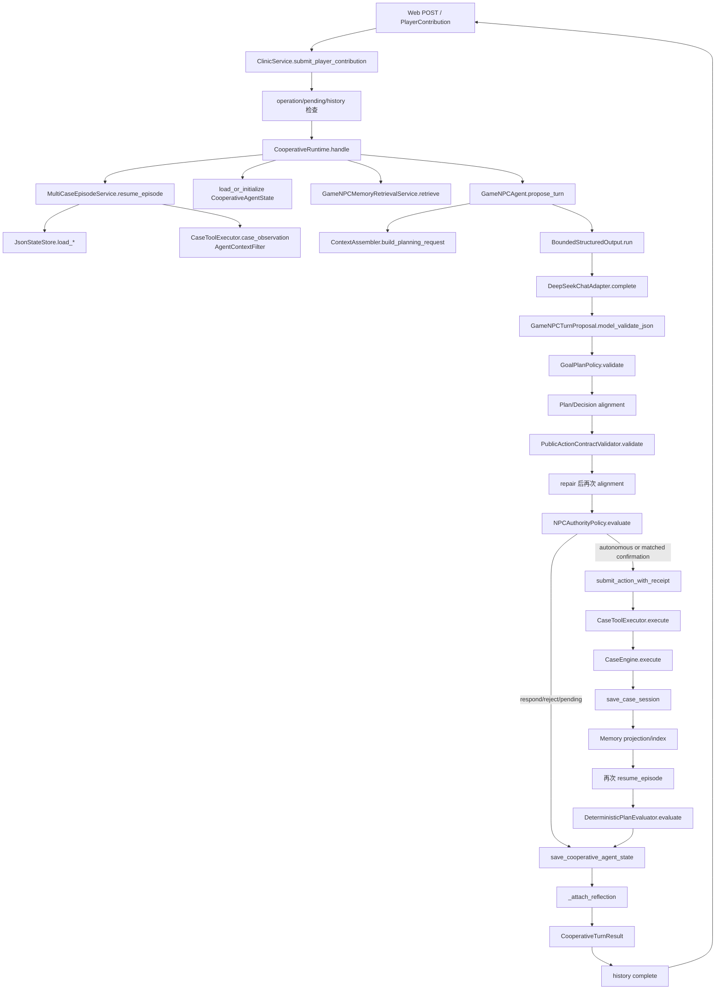

# Agent Runtime 设计与执行链路

> 分析口径：本文以 2026-09-26 当前工作区源码为准。通用概念、项目设计、真实实现和当前缺陷分别说明；出现冲突时以代码为准。主分析对象是正式 Web 路径中的 A1 `GameNPCAgent`，A0、离线 NPC 和 MCP 只在边界处说明。

## 一、这个项目中的 Runtime 到底是什么

### 1. 是否存在显式 Runtime

存在。

- **Class**：`CooperativeRuntime`
- **文件**：`src/xuanyi_npc/application/cooperative_runtime.py`
- **单轮入口**：`CooperativeRuntime.handle(request: CooperativeTurnInput) -> CooperativeTurnResult`
- **创建者**：`ClinicService.submit_player_contribution()` 在每次新协作请求中创建 Runtime；评测和测试也直接构造它。
- **调用者**：正式产品路径由 `ClinicService` 调用；不是 LLM 自己递归调用，也不是常驻后台 loop。

### 项目中的 Runtime 定义

`CooperativeRuntime` 是连接玩家贡献、公开环境、Agent 提案、确定性策略、工具执行和状态投影的**单回合应用编排层**。它不负责语言推理，也不裁定案件真相；它负责按固定顺序加载状态、构造 Agent 输入、调用 Agent、验证提案、判断权限、执行至多一个 Action、读取真实结果，并推进 Agent State、Memory 使用归因与 Reflection。世界状态的权威裁定属于 `CaseEngine`，持久化由 `MultiCaseEpisodeService`、`JsonStateStore` 和 SQLite repositories 完成。Runtime 本身是一个短生命周期对象，不是常驻调度器。

### 面试时的一句话版本

> 我的 Runtime 是 `CooperativeRuntime.handle()` 这一层单回合编排器：它读取权威状态并生成公开 Observation，组织 Context 和 Agent 调用，把 LLM proposal 依次送过规划、动作契约和权限门禁，合法时执行一个工具，再根据真实环境结果更新 Goal/Plan、Memory 和 Reflection；它本身既不做 LLM 推理，也不直接裁定世界结果。

---

## 二、Runtime 的真实代码入口

| 层级 | 文件 | Class / Function | 作用 |
|---|---|---|---|
| HTTP 用户入口 | `src/xuanyi_npc/clinic/server.py` | `ClinicRequestHandler.do_POST()` | 解析 Web 表单并调用产品服务 |
| 用户/服务入口 | `src/xuanyi_npc/application/clinic.py` | `ClinicService.submit_player_contribution()` | 校验玩家/session，管理 operation 账本、历史快照和 pending，创建 Runtime |
| Runtime 入口 | `src/xuanyi_npc/application/cooperative_runtime.py` | `CooperativeRuntime.handle()` | 编排一个 cooperative turn |
| State/Observation 读取 | `src/xuanyi_npc/application/multicase.py` | `MultiCaseEpisodeService.resume_episode()`、`_context_result()` | 加载 Player/Case/Session/Campaign 并生成公开结果 |
| Observation 投影 | `src/xuanyi_npc/application/views.py`、`case_tools.py` | `AgentContextFilter.case_observation()`、`CaseToolExecutor.case_observation()` | 从完整 world 生成最小权限 `CaseObservation` |
| Context 构造 | `src/xuanyi_npc/agents/context.py` | `ContextAssembler.build_planning_request()` | 组装 Prompt、公开 action space 和 JSON Schema |
| Agent 调用 | `src/xuanyi_npc/agents/game_npc.py` | `GameNPCAgent.propose_turn()` | 请求并解析 A1 Goal/Plan/Decision proposal |
| LLM 调用 | `src/xuanyi_npc/agents/deepseek.py` | `DeepSeekChatAdapter.complete()` | 预算预留、HTTP `/chat/completions`、usage 结算和响应校验 |
| 结构输出处理 | `src/xuanyi_npc/agents/bounded_output.py` | `BoundedStructuredOutput.run()` | 初次请求，失败时至多一次格式修复，否则 safe fallback |
| Proposal Schema | `src/xuanyi_npc/domain/planning_contract.py` | `GameNPCTurnProposal` 及子模型 | Pydantic 严格结构、枚举、字段和形状约束 |
| Planning Policy | `src/xuanyi_npc/application/goal_plan_policy.py` | `GoalPlanPolicy.validate()` | 检查 Goal/Plan 生命周期、公开 target、权限表和 Plan/Decision 一致性 |
| Action Contract | `src/xuanyi_npc/application/action_contract.py` | `PublicActionContractValidator.validate()` | 检查本轮工具、参数和目标是否属于当前公开 action space |
| Authority | `src/xuanyi_npc/application/npc_authority.py` | `NPCAuthorityPolicy.evaluate()` | 可逆调查自主；诊断协商；处置要求精确确认 |
| Executor | `src/xuanyi_npc/application/case_tools.py` | `CaseToolExecutor.execute()` | 严格解析工具参数并映射为领域 Command |
| 应用提交边界 | `src/xuanyi_npc/application/multicase.py` | `submit_action_with_receipt()` | 调 Executor，保存 world，协调普通 Memory，返回 receipt |
| Environment/Engine | `src/xuanyi_npc/engine/case_engine.py` | `CaseEngine.execute()` | 确定性验证领域规则并产生新 session、事件和结果 |
| Plan 状态更新 | `src/xuanyi_npc/application/plan_evaluator.py` | `DeterministicPlanEvaluator.evaluate()` | 根据真实 pre/post Observation 推进、修订或完成计划 |
| JSON 状态保存 | `src/xuanyi_npc/storage/json_store.py` | `JsonStateStore.save_*()` | 原子替换 JSON；Agent State 另有 revision 检查 |
| Memory 写回 | `src/xuanyi_npc/application/memory_coordination.py` | `V1MemoryCoordinator.commit_engine_result()` | 先保存 world，再从已提交领域事件投影 Memory |
| Reflection 写回 | `src/xuanyi_npc/application/cooperative_runtime.py` | `_attach_reflection()` | 在确定性生命周期边界触发 post-commit Reflection |

### A 调 B，B 调 C

正式链路可以顺着以下调用阅读：

```text
ClinicRequestHandler.do_POST()
  → ClinicService.submit_player_contribution()
    → CooperativeRuntime.handle()
      → MultiCaseEpisodeService.resume_episode()
        → JsonStateStore.load_*
        → CaseToolExecutor.case_observation()
          → AgentContextFilter.case_observation()
      → CooperativeRuntime._load_or_initialize()
      → GameNPCMemoryRetrievalService.retrieve()             # 启用 Memory 时
      → GameNPCAgent.propose_turn()
        → ContextAssembler.build_planning_request()
        → BoundedStructuredOutput.run()
          → DeepSeekChatAdapter.complete()
          → GameNPCTurnProposal.model_validate_json()
      → GoalPlanPolicy.validate()
      → Runtime 内 Plan/Decision alignment
      → PublicActionContractValidator.validate()
      → NPCAuthorityPolicy.evaluate()
      → MultiCaseEpisodeService.submit_action_with_receipt()
        → CaseToolExecutor.execute()
          → CaseEngine.execute()
        → V1MemoryCoordinator.commit_engine_result()         # 启用 Memory 时
          → JsonStateStore.save_case_session()
          → SQLiteMemoryRepository.write_projection()
      → MultiCaseEpisodeService.resume_episode()             # 重读 post Observation
      → DeterministicPlanEvaluator.evaluate()
      → JsonStateStore.save_cooperative_agent_state()
      → CooperativeRuntime._attach_reflection()              # 命中 trigger 时
    → SQLiteCooperativeHistoryRepository.complete()          # 启用记录时
  → CooperativeTurnResult 返回 UI
```

---

## 三、完整还原一次典型 Agent 执行

以下选择最常见的“玩家建议调查一个公开目标，Agent 选择低风险调查工具并成功执行”作为主路径。诊断和处置只是在 Authority 阶段转入 pending，其他前置步骤相同。

### 1. 用户输入

- **输入**：`ClinicContributionInput(player_id, case_id, session_id, operation_id, text, contribution_type, ...)`。
- **负责者**：HTTP handler 与 `ClinicService.submit_player_contribution()`。
- **调用**：构造严格的 `PlayerContribution`。
- **输出**：带服务器时间戳的、不可执行的玩家贡献对象。
- **必要性**：把自然语言表达与可执行命令分开；玩家文本是 belief，不是 ToolCall。

### 2. 入口校验、operation 和 pending

- **输入**：玩家、case、session、operation ID，可选 confirmation ID。
- **负责者**：`ClinicService`。
- **调用**：`JsonStateStore.load_case_session/load_player()`；启用 recording 时调用 `SQLiteCooperativeHistoryRepository.begin()`。
- **输出**：新 operation record，或 completed replay / payload conflict / recovery-required。
- **必要性**：防止重复 HTTP 请求造成重复 LLM/Tool 副作用；确认必须属于同一玩家、案件、session 和 revision。

正式 CLI 默认启用 cooperative recording 与 CE-2A；程序化 `build_clinic_service()` 仍默认关闭，测试或嵌入调用需要显式选择。CLI 可用 `--no-cooperative-context-v2` 单独回滚上下文，或同时关闭 recording 与 context v2。

### 3. 进入 Runtime

- **输入**：`CooperativeTurnInput(contribution, pending_action)`。
- **负责者**：`CooperativeRuntime.handle()`。
- **输出**：本轮后续编排上下文。
- **必要性**：把一轮所有门禁和副作用顺序集中在一个函数中，避免入口、Agent 或工具各自任意写状态。

### 4. 读取 World State 并构造 Observation

- **输入**：玩家、case、session ID。
- **负责者**：`_resume()` → `MultiCaseEpisodeService.resume_episode()`。
- **调用**：加载 `PlayerState`、不可变 `CaseDefinition`、`CaseSessionState`、`CampaignState`；`CaseToolExecutor.case_observation()` 调用 `AgentContextFilter.case_observation()`。
- **输出**：`MultiCaseServiceResult.observation: CaseObservation`。
- **必要性**：LLM 只能看到当前公开事实，不应看到患者隐藏信息、正确诊断集合、治疗 outcome 和评分真值。

### 5. 读取或初始化 Agent State

- **输入**：session scope 和当前 Observation。
- **负责者**：`CooperativeRuntime._load_or_initialize()`。
- **调用**：`JsonStateStore.load_cooperative_agent_state()`；不存在时建立 Episode Goal 与当前阶段 Goal。
- **输出**：`CooperativeAgentState` 与 `expected_revision`。
- **必要性**：Goal/Plan 跨 turn 存在，不能只依赖 LLM 聊天上下文。

初始化逻辑会依据 Observation 选择 `GATHER_EVIDENCE`、`FORM_DIAGNOSIS` 或 `SELECT_TREATMENT`；Episode Goal 始终是 `RESOLVE_CASE`。

### 6. 预处理 Plan 与检索 Memory

- **输入**：Agent State、Observation、玩家贡献。
- **负责者**：Runtime。
- **调用**：`_mark_invalid_plan()`、`_prepare_next_goal()`、`_retrieve_memory_context()`。
- **输出**：与当前环境兼容的 Agent State、`AgentMemoryContext`、`MemoryUsageTrace`。
- **必要性**：旧计划可能因世界变化失效；历史 Memory 需要在 player/session/type/lifecycle 范围内过滤后才能作为非权威参考。

### 7. 构造 Agent Input 与 Prompt

- **输入**：Observation、PlayerView、Contribution、AuthorityView、Goal/Plan、PlanEvaluation、Memory、pending、历史快照。
- **负责者**：Runtime 构造 `GameNPCAgentInput`；Agent 内部 `ContextAssembler.build_planning_request()` 构造 `LLMRequest`。
- **输出**：system messages、可选历史 messages、当前 user context、`GameNPCTurnProposal.model_json_schema()`。
- **必要性**：把权威世界、权限、Agent intent、历史 Memory 和玩家 belief 明确分层，并把精确 public action space 暴露给模型。

### 8. LLM 推理与结构化 Proposal

- **输入**：`LLMRequest`。
- **负责者**：`GameNPCAgent.propose_turn()` → `BoundedStructuredOutput.run()` → `DeepSeekChatAdapter.complete()`。
- **调用**：DeepSeek `/chat/completions`，`response_format=json_object`，temperature 0；随后 `GameNPCTurnProposal.model_validate_json()`。
- **输出**：`GameNPCTurnProposal(goal_update, plan_update, decision, memory_usage?)`。
- **必要性**：LLM 负责开放式判断，但输出必须进入机器可验证的协议。

首次 JSON/Schema/Agent 边界错误时最多进行一次 format repair；第二次仍失败则使用不执行工具的 fallback。DeepSeek adapter 自身明确**没有隐式网络重试**。

### 9. Goal/Plan Policy 和第一次对齐

- **输入**：未信任的 `GameNPCTurnProposal` 与当前状态。
- **负责者**：`GoalPlanPolicy.validate()`，随后 Runtime `_apply_proposal()` 和 `_action_matches_plan()`。
- **输出**：合法的候选 Goal/Plan 状态，或 `ACTION_REJECTED`。
- **必要性**：Schema 正确不代表计划与当前阶段、公开 target、权限和本轮 Decision 一致。

Policy 拒绝会保存推进过 revision 的 Agent projection，但不执行工具、不改变 world。

### 10. Public Action Contract 与第二次对齐

- **输入**：`GameNPCDecision.proposal.action` 与当前 `CaseObservation`。
- **负责者**：`_resolve_contract()` → `PublicActionContractValidator.validate()`。
- **输出**：原 Action、一次修复后的 Action，或 RESPOND fallback。
- **必要性**：计划层合法仍不代表 ToolCall 的参数键、公开 ID、证据集合和当前可用性完全正确。

修复可能替换 Action，因此 Runtime 会再次做 Plan/Decision alignment，防止“修复”绕过已经应用的 active PlanStep。

### 11. RESPOND 或 Authority

- **输入**：最终 Action。
- **负责者**：Runtime 与 `NPCAuthorityPolicy.evaluate()`。
- **输出**：
  - `RESPOND`：不执行工具，必要时完成非工具 PlanStep；
  - 普通调查：`AUTONOMOUS`，继续执行；
  - 诊断：`PROPOSAL_ONLY`，创建 pending；
  - 处置：`CONFIRMATION_REQUIRED`，创建 pending；
  - 未知权限：`FORBIDDEN`。
- **必要性**：Plan 表示意图，不等于 Permission。高风险动作需要玩家对具体 decision/action/revision 的授权。

### 12. Executor 和 Engine

- **输入**：通过门禁的 `AgentAction`、case、player、session、server time。
- **负责者**：`MultiCaseEpisodeService.submit_action_with_receipt()` → `CaseToolExecutor.execute()` → `CaseEngine.execute()`。
- **输出**：`ToolExecutionResult` / `EngineResult`，包含新的 immutable session、领域事件、公开消息和可选评分。
- **必要性**：Executor 隔离 Agent 协议与领域命令；Engine 再次验证技能、前置线索、上下文、证据和处置条件，并独占世界规则。

### 13. World commit 与普通 Memory

- **输入**：`EngineResult`。
- **负责者**：`V1MemoryCoordinator.commit_engine_result()`；Memory 未启用时由 `MultiCaseEpisodeService` 直接保存 session。
- **真实顺序**：
  1. `JsonStateStore.save_case_session(result.session)`；
  2. 从已提交领域事件构造 Memory projection；
  3. `SQLiteMemoryRepository.write_projection()`；
  4. 尝试更新向量索引。
- **输出**：`MultiCaseActionReceipt`，带 world result、events 和 memory commit 状态。
- **必要性**：Memory 只能来自已提交事实；Memory 失败不能反向改变已经发生的世界。

### 14. 重读 Observation 和 Plan Evaluation

- **输入**：成功 receipt。
- **负责者**：Runtime。
- **调用**：再次 `_resume()`，然后 `DeterministicPlanEvaluator.evaluate(pre_observation, post_observation, ...)`。
- **输出**：真实 post Observation 与新的 Goal/Plan/PlanEvaluation。
- **必要性**：计划推进必须以实际提交后的环境为准，不能相信模型声称或执行前预测。

### 15. 保存 Agent State、Reflection 和返回

- **输入**：更新后的 `CooperativeAgentState`。
- **负责者**：Runtime。
- **调用**：`JsonStateStore.save_cooperative_agent_state(expected_revision=...)`；然后 `_attach_reflection()`；启用 recording 时 `ClinicService` 最后 `repository.complete()`。
- **输出**：`CooperativeTurnResult` 返回 UI。
- **必要性**：下一轮恢复 Goal/Plan；Reflection 只能消费 post-commit evidence；operation 结果最后写入账本以支持 completed replay。

---

## 四、Runtime 真实调用链图



---

## 五、Runtime 负责什么，不负责什么

| 能力 | Runtime | Agent/LLM | Validator/Policy | Executor | Environment/Engine |
|---|---|---|---|---|---|
| 理解用户自然语言 | 组织输入，不做语义判断 | 主要负责 | 只检查结构与边界 | 否 | 否 |
| 评价玩家贡献 | 不代替判断 | 负责 proposal | 验证形状 | 否 | 否 |
| 生成 Goal/Plan/行动建议 | 调用并接收 | 负责生成 | 检查是否合法 | 否 | 否 |
| 判断 Schema/业务是否合法 | 安排顺序与失败分支 | 不可信自检 | 负责 | 参数层再校验 | 领域规则最终校验 |
| 决定是否需要确认 | 调用策略并管理 pending | 可提出，不能授权 | Authority 负责裁定 | 否 | 否 |
| 执行动作 | 发起一次执行 | 否 | 否 | 负责转换与委派 | 负责领域执行 |
| 修改真实 world | 不直接裁定 | 否 | 否 | 不直接决定结果 | `CaseEngine` 产出新状态，Store 提交 |
| 保存 Agent State | 编排保存 | 否 | 否 | 否 | Store 实际写入 |
| 更新 Memory/Reflection | 决定时机和传递 evidence | 可生成 Reflection proposal | validation/consolidation 控制写入 | 否 | repositories 保存 |
| 组织一次执行循环 | 负责 | 否 | 否 | 否 | 否 |

### Runtime 为什么不是 Agent

通用概念上，Agent 是形成判断并选择行动的决策实体；Runtime 是承载这个实体运行的控制平面。本项目中 `GameNPCAgent` 负责产生 `GameNPCTurnProposal`，`CooperativeRuntime` 不选择哪个诊断或治疗更好，只决定 proposal 是否能进入下一阶段、何时保存和怎样反馈结果。

### Runtime 为什么不是 LLM

LLM 是 `DeepSeekChatAdapter.complete()` 背后的概率推理服务。Runtime 是普通 Python 编排代码，可以在 Fake/离线 Agent 下工作；它掌握状态和副作用顺序，但没有语言模型推理能力。

### Runtime 为什么不是 Executor

Executor 只解决“一个已批准 Action 如何变成领域 Command 并执行”。Runtime 还要处理 Observation、Context、Agent、Planning、Authority、pending、State、Memory、Reflection 和失败分支，职责远大于 Executor。

### Runtime 和 Agent Harness 的区别

Agent Harness 通常更靠近模型边界，负责 Prompt、模型调用、结构解析、repair 和 tracing。本项目没有名为 Harness 的类；功能上 `ContextAssembler + GameNPCAgent + BoundedStructuredOutput + DeepSeekChatAdapter` 更接近 harness。`CooperativeRuntime` 位于其外层，拥有应用级状态机和工具副作用编排。评测 runner 也可称实验 harness，但它不是产品 Runtime。

---

## 六、State 在 Runtime 中如何流动

### 真实 State 分类

| State | 真实事实源 | 生命周期 | Runtime 如何使用 |
|---|---|---|---|
| `CaseDefinition` | 打包 JSON 资源 | 项目/案件定义级，不可变 | 生成公开选项、供 Engine 校验隐藏规则 |
| `PlayerState` | `players/*.json` | 跨 session | 生成 PlayerView、技能校验 |
| `CaseSessionState` | `case_sessions/*.json` | 单 Episode，跨 turn/重启 | 权威 world mutable state |
| `CampaignState` | `campaigns/*.json` | 玩家跨 Episode | 案件完成后的跨案投影 |
| `CooperativeAgentState` | `cooperative_agents/*.json` | 单 session，跨 turn/重启 | 保存 Episode Goal、当前 Goal/Plan、PlanEvaluation |
| 长期 Memory | `memories.sqlite3` | 玩家跨 session | 检索非权威历史；保存领域投影和 Reflection memory |
| Cooperative history | `cooperative_conversation.sqlite3` | 跨 turn/重启，可选 | operation lifecycle、completed replay、历史上下文 |
| pending confirmation | `ClinicService.cooperative_pending` 内存字典 | 进程内 | 精确授权；重启不恢复 |
| Observation | 运行时投影对象 | 单次读取 | LLM 可见的 world 子集，不是真实源 |
| Proposal/Decision/Receipt | 内存对象，部分进账本/结果 | 单 turn | 中间协议与审计证据 |

```text
JSON / SQLite Persistent State
        ↓ load + ownership validation
Player + CaseDefinition + CaseSession + Campaign + AgentState + Memory
        ↓ permission projection
PlayerView + CaseObservation + scoped MemoryContext
        ↓ ContextAssembler
LLM-visible Context
        ↓ proposal + deterministic gates
Approved AgentAction
        ↓ Executor / CaseEngine
new CaseSession + Domain Events
        ↓ world persist first
Memory projection / post Observation / PlanEvaluation / AgentState persist
        ↓
Next Turn reload
```

### 哪些是真实事实源，哪些只是投影

- **权威事实**：`CaseDefinition`、持久化 `CaseSessionState`、`PlayerState`、`CampaignState`，以及成功提交的领域事件所表达的 transition。
- **受控意图状态**：`CooperativeAgentState`。它真实记录 Agent 当前意图，但不是 world truth，也不能授权工具。
- **非权威历史**：检索到的 Memory、对话历史、玩家贡献、Reflection proposal。
- **只读投影**：`PlayerView`、`CaseObservation`、`AgentMemoryContext`、pending public view。
- **候选而非事实**：LLM proposal 和 Plan。

---

## 七、Observation 在 Runtime 中的位置

1. **在哪里生成**：`MultiCaseEpisodeService._context_result()` 调 `CaseToolExecutor.case_observation()`，后者调用 `AgentContextFilter.case_observation()`，并可叠加 diagnosis readiness policy。
2. **谁生成**：确定性 application/view 层，不是 LLM。
3. **包含什么**：案件公开简介、患者公开档案、session status/revision、已发现线索、当前可用调查、公开诊断候选、是否可提交诊断、已提交诊断 ID、当前可用处置。
4. **为什么不传完整 World**：`CaseDefinition` 含患者隐藏信息、`valid_diagnosis_ids`、治疗 `outcome` 和评分规则；传给模型会泄露真相，使“推理正确”无法区分于“读答案”。
5. **成功后如何更新**：world 保存后 Runtime 再次 `_resume()`，得到 post Observation，再交给 PlanEvaluator。
6. **失败时是否产生新 Observation**：Tool/Engine 拒绝不提交 world；Runtime 不重新 `_resume()`，PlanEvaluator 使用相同 pre Observation 作为 pre/post，并携带 `tool_succeeded=False` 和环境错误消息。逻辑上是“世界未变化”，不是创建了新事实版本。
7. **下一轮如何知道上一轮结果**：成功执行改变 `CaseSessionState`；PlanEvaluator 的公开摘要保存为 `last_plan_evaluation`；下轮 `last_environment_feedback` 取该公开摘要。预算、模型、规划、对齐、契约、权限和 Tool 等主要正常拒绝另写入一次性的 `last_decision_feedback`，在相同 Observation revision 的下一轮注入后清除。启用 CE-2A 时还可带入已完成对话对；内部异常和普通工具原始消息不会作为无限聊天历史累积。

---

## 八、结构化 Proposal 如何进入 Runtime

### 真实顶层 Schema

下面展示字段形状，省略的对象仍由真实 Pydantic 子模型严格约束：

```json
{
  "goal_update": {
    "update": "keep | replace | block | abandon",
    "draft": null,
    "blocked_reason": null,
    "public_rationale": "..."
  },
  "plan_update": {
    "update": "keep | create | revise | abandon",
    "draft": {
      "steps": [
        {
          "intent": "observe | question | inspect | investigate | ...",
          "capability": "use_tool | explain | propose_diagnosis | ...",
          "suggested_tool": "observe_patient | submit_diagnosis | ...",
          "public_target_id": "公开 ID",
          "public_summary": "...",
          "expected_information": null,
          "completion_signal": {"condition_type": "..."}
        }
      ]
    },
    "public_rationale": "..."
  },
  "decision": {
    "contribution_evaluation": {
      "contribution_id": "...",
      "disposition": "accept | partial_accept | reject | request_more_evidence | propose_alternative",
      "reason_code": "...",
      "explanation": "..."
    },
    "capability": "use_tool | explain | propose_diagnosis | ...",
    "action": {
      "action_id": "npc_<turn_id>",
      "action_type": "respond | use_tool",
      "dialogue": "...",
      "tool_call": {
        "name": "question_patient",
        "arguments": {"investigation_id": "公开 investigation_id"}
      },
      "confidence": 0.0
    },
    "explanation": "..."
  },
  "memory_usage": null
}
```

### 校验责任链

1. DeepSeek 的 `json_object` 只保证提供商尽量输出 JSON 对象，不保证业务 Schema。
2. `GameNPCTurnProposal.model_validate_json()` 检查 JSON、字段、枚举、extra forbid 和子对象形状。
3. `GameNPCAgent._parse_turn()` 检查 action ID 与贡献 ID，随后依次执行公开 Action Contract、Memory 使用引用和 `GoalPlanPolicy.validate()`；Policy 内含 Proposal 的 Plan/Decision 对齐。
4. Runtime 对 `GoalPlanPolicy` 再做一次执行边界重检。
5. Runtime 应用合法 Goal/Plan proposal 后做 `_action_matches_plan()`。
6. `_resolve_contract()` 对最终 Decision 再验精确 ToolCall，并可执行一次 action-contract repair。
7. action-contract repair 后再次做 Plan alignment。
8. `NPCAuthorityPolicy.evaluate()` 决定自主、pending 或禁止。
9. Executor 和 Engine 最后再次检查参数与领域规则。

只有走完前八步的 Tool Action 才进入 Executor。任一拒绝会返回安全结果；不会因为 explanation 看起来合理而绕过。

---

## 九、Executor 在 Runtime 中的位置

### 输入与输出

- **输入**：`AgentAction`、`CaseDefinition`、`PlayerState`、当前 `CaseSessionState` 和 server timestamp。
- **Executor**：`CaseToolExecutor.execute()`。
- **转换**：ToolCall → `InvestigationCommand` / `SubmitDiagnosisCommand` / `ExecuteTreatmentCommand`。
- **输出**：`ToolExecutionResult(session, events, message, score_breakdown)`。

### 成功与失败

- 成功：Engine 返回新 immutable session 和连续事件；应用服务随后持久化。
- 失败：`RuleViolation` 或 `ToolCallError` 被映射为公开 error code；不保存新的 session、不产生领域事件。Runtime 用 `tool_succeeded=False` 评估计划并保存反馈。

### 为什么 Runtime 不直接改 World

Runtime 只知道执行顺序，不应该复制案件领域规则。Executor 解决协议适配，Engine 解决权威规则；分层后同一 `CaseEngine` 能被 Web、Runtime、MCP 和直接测试复用，并保证任何入口都不能用自然语言绕过技能、线索、诊断和处置前置。

### 面试问题：为什么不能让 LLM 直接调用函数并改状态

> 因为模型输出同时存在格式不稳定、上下文过期、参数幻觉、权限越界和副作用重放风险。我的项目把模型输出当作不可信 proposal：先做 Schema、Goal/Plan、一致性、公开 action space 和 Authority 校验；Executor 再严格解析参数，CaseEngine 最终验证领域规则并生成不可变新状态。这样即使模型选错、修复失败、玩家注入指令或重复请求，也只能得到拒绝/pending，而不能直接污染 world。代价是链路更复杂，但换来了状态权威性、可测试性和可审计失败语义。

---

## 十、错误和失败如何处理

| 场景 | 当前真实处理 | 状态 | 是否重试 |
|---|---|---|---|
| LLM 输出非法 JSON | Pydantic parse 失败，`BoundedStructuredOutput` 发起一次 format repair；仍失败用 safe fallback | 已实现 | 最多一次模型修复 |
| Proposal Schema 错误 | 与非法 JSON 同一 bounded repair；记录 failure code/path/attempt telemetry | 已实现 | 最多一次 |
| Provider timeout/auth/rate limit/usage 不确定 | Adapter 映射明确错误；`abort_episode` 时向上抛，预算 usage 不确定会 halt | 已实现 | Adapter 无隐式重试 |
| 最终 Context 超预算 | tokenizer-aware budget 先计完整 Schema、framing 估算、输出预留和 safety margin；History/Memory 候选仍放不下则不发送 | 已实现 | 安全 fallback；不占 HTTP/费用预留 |
| Action 不存在或 target 不公开 | `PublicActionContractValidator` 拒绝；条件允许时一次 action-contract repair，否则 RESPOND fallback | 已实现 | 最多一次额外模型修复 |
| Tool 参数错误 | ActionContract 先拒绝；Executor Pydantic 再防守并映射 `invalid_tool_arguments` | 已实现 | 不自动重执行 Tool |
| Goal/Plan 不合法 | `GoalPlanPolicyError` 转安全 `ACTION_REJECTED`，保存 planning decision feedback，不执行 Tool | 已实现 | 下一玩家 turn 可重新规划 |
| Plan/Decision 不一致 | 保存 `ACTION_OUTSIDE_ACTIVE_PLAN` PlanEvaluation 和 alignment decision feedback，拒绝本轮 | 已实现 | 不在本 turn 循环；下一 turn 看见反馈 |
| 权限不足 | 诊断/处置生成 pending；forbidden 写 authority decision feedback | 已实现 | 等待新玩家输入，不自动重试 |
| pending 过期/不匹配 | Clinic/Runtime 按 owner、decision、action、case revision 拒绝 | 已实现 | 必须重新协商 |
| Tool/Engine 领域失败 | receipt `ok=False`；world 不写；PlanEvaluator 记录失败反馈 | 已实现 | 不自动重试副作用 |
| World JSON 保存抛错 | 可能发生在替换前，也可能替换已完成但回执抛错；返回 `world_commit_uncertain` | 已实现保守处理 | 同 operation 不盲目重放；记录模式持久化 recovery_required |
| Agent State 在 world 后写失败 | world 保留；返回执行成功但 `error_code=agent_state_projection_pending` | 部分恢复 | 尚无完整自动对账闭环 |
| Memory projection 失败 | world 已提交；返回 `projection_pending`，启动时可从 committed session reconcile | 已实现部分恢复 | 确定性对账，不重跑 Tool |
| Memory index 失败 | 返回 `index_pending`；world 和权威 Memory 不回滚 | 已实现部分恢复 | 可重新 index |
| Reflection 失败 | `_attach_reflection()` 返回 `FAILED_SAFE` telemetry，不回滚 world | 已实现 | 生命周期 receipt 支持幂等/对账，非盲重跑 |
| history complete 写失败 | 标记 `recovery_required`；告知结果不确定，不自动重放同 operation | recording 开启时已实现 | 禁止盲目重放 |
| 同 session 并发 world 更新 | 正常单进程入口以共享 Session `RLock` 串行化完整读改写链；多进程/直接 Store 写仍无数据库 CAS | **单进程已实现，多进程未实现** | 线程内严格排序；跨进程尚无可靠自动解决 |
| 跨 world/Agent/Memory/history 原子事务 | 多提交边界，无全局事务 | **未实现** | 依赖状态、receipt、账本和对账降低风险 |

### 为什么“写失败”不能让 LLM 盲目重试

一次写失败异常可能发生在三种不同位置：提交前、提交中状态未知、提交后但回执/账本写失败。如果不先判断权威 snapshot 和 operation lifecycle，重试可能重复调查、重复诊断或重复处置。项目在 recording 开启时把 `started/prepared` 残留和 completion 写失败转为 `recovery_required`，明确不自动重放模型或工具；Memory 则从已提交 session 做确定性 reconciliation，而不是重新执行原 Action。

---

## 十一、同步、循环与生命周期

- **Runtime 模型**：同步、单轮调用；`handle()` 中没有 while loop、async event loop 或后台自动续跑。
- **Session 开始**：`MultiCaseEpisodeService.start_episode()` 创建并保存 `CaseSessionState`。
- **Turn 开始**：一个新的 `operation_id` 和 `PlayerContribution` 进入 `submit_player_contribution()`。
- **Turn 结束**：返回任一 `CooperativeTurnResult`（responded/executed/pending/rejected），或以异常进入保守恢复状态。
- **每 turn 行动数**：至多一个最终 `AgentAction`，至多一个 Tool。
- **Task/Episode 结束**：`ExecuteTreatmentCommand` 成功后 `CaseEngine` 将 session 标为 `COMPLETED`；Episode Goal 随 post Observation 变为 completed。
- **Plan 结束**：PlanEvaluator 可把 Plan 标成 completed/abandoned/needs_revision；模型也可提出 abandon，但不能自行宣告 Goal completed。
- **Runtime 退出**：本次 `handle()` 返回即退出；下一 turn 创建新的 Runtime 实例并从 Store 恢复。
- **callback**：`decision_prepared_hook` 在最终 Decision 已过结构/action repair 和最终 Plan 检查、但尚未 Authority/Tool 前写 prepared 账本。
- **状态机**：虽然没有通用状态机框架，Goal、PlanStep、Turn status、operation lifecycle 和 CaseSession status 都由显式枚举与转换构成领域状态机。

---

## 十二、Runtime 与持久化

### 跨 Turn 保存

- `CaseSessionState`：调查历史、线索、诊断、处置、状态、分数、revision。
- `CooperativeAgentState`：Episode Goal、current Goal、Plan、last PlanEvaluation、revision。
- `PlayerState`、`CampaignState`。
- 长期 Memory 与 embedding 索引。
- 启用 recording 时：operation lifecycle、贡献、prepared decision、completed result 和可选历史。

### 跨 Session 保存

- Player、Campaign；
- SQLite 长期 Memory；
- 案件完成记录；
- cooperative history 按 session 隔离保存，但不会跨 session 注入上下文。

### 仅临时存在

- 当前 Observation、Context、LLM response、proposal 中间对象；
- 当前 Runtime 实例和 memory trace 计算过程；
- `cooperative_pending` 授权对象；
- 未启用 recording 时的对话操作历史。

### 重启后可恢复与不可恢复

可恢复：Player、Case session、Campaign、Agent Goal/Plan、Memory、已完成的 recorded turn result；启动 semantic Memory 时会 reconcile committed sessions 和 pending indexes。

不可完整恢复：旧 pending 的授权效力、任意中断点的当前 Python 调用栈、未写账本的默认模式 turn、跨 JSON/SQLite 的原子一致视图。`started/prepared` 的 recorded operation 只会进入保守 recovery，不自动继续执行。

### 持久化强度边界

`JsonStateStore._write()` 使用同目录临时文件、flush、`fsync` 和 `os.replace`，避免单文件半写。`CooperativeAgentState` 有 expected revision 检查；`CaseSessionState` 保存没有同等级 CAS。正常单进程入口另以共享 Session `RLock` 串行化完整读改写链。因此“原子替换”本身不等于并发安全；当前线程级安全来自应用层锁，仍不等于跨进程 CAS 或跨文件事务。

---

## 十三、为什么必须有 Runtime

如果只有 `User → LLM → Tool`：

- **状态一致性**：模型可能基于旧状态调用已经不可用的调查，或重复处置；没有 pre/post Observation 和 revision 约束。
- **权限控制**：玩家文本或模型可直接跳过诊断协商和治疗确认。
- **隐藏信息**：完整 case 传给模型会暴露答案；不传完整 case 又需要一个 Observation 投影层。
- **可测试性**：无法分别测试模型选择、契约、权限、Executor 和 Engine。
- **可观测性**：无法定位失败发生在 Schema、Plan、Contract、Authority、Tool 还是存储。
- **错误处理**：非法 JSON、参数幻觉、provider 失败和写后结果不确定会混成一种“Agent 失败”。
- **Tool 安全**：缺乏当前 action space 白名单和严格参数检查。
- **Plan 管理**：模型声称“完成”可能被误当成真实完成，Plan 与 Action 也可能互相冲突。
- **Memory 管理**：聊天和模型自由文本可能被直接固化为错误事实。
- **幂等性**：HTTP 重复提交可能重复产生副作用。

本项目的 Runtime 解决了顺序、边界、状态投影、计划生命周期、权限、单步执行、失败分类和审计问题；但它还没有解决数据库级并发串行化和跨存储原子事务。

---

## 十四、核心结论与代码证据

### 结论 1：Runtime 是显式单回合编排器

- **代码位置**：`src/xuanyi_npc/application/cooperative_runtime.py`
- **Class / Function**：`CooperativeRuntime.handle()`
- **说明**：函数从 `_resume()` 开始，加载 Agent State 和 Memory，调用 Agent，经过 policy/contract/authority，最多执行一个 Action，再保存状态并返回。

### 结论 2：LLM 不直接写 world

- **代码位置**：`src/xuanyi_npc/agents/game_npc.py`、`application/case_tools.py`、`engine/case_engine.py`
- **Class / Function**：`GameNPCAgent.propose_turn()`、`CaseToolExecutor.execute()`、`CaseEngine.execute()`
- **说明**：模型只返回 `GameNPCTurnProposal`；Executor 映射 Command；Engine 返回新 session，应用服务才保存。

### 结论 3：Observation 是显式安全投影

- **代码位置**：`src/xuanyi_npc/application/views.py`
- **Class / Function**：`AgentContextFilter.case_observation()`
- **说明**：只投影已发现线索和当前公开候选；`valid_diagnosis_ids`、treatment outcome 等隐藏字段不在 View schema 中。

### 结论 4：Proposal 有多层门禁

- **代码位置**：`agents/bounded_output.py`、`application/goal_plan_policy.py`、`application/action_contract.py`、`application/npc_authority.py`
- **说明**：Pydantic/repair、GoalPlanPolicy、两次 alignment、ActionContract、Authority 分别解决不同失败，不能合成一句“Schema 校验”。

### 结论 5：world commit 先于普通 Memory

- **代码位置**：`src/xuanyi_npc/application/memory_coordination.py`
- **Class / Function**：`V1MemoryCoordinator.commit_engine_result()`
- **说明**：注释和代码都明确先 `save_case_session()`，再投影 event memory；失败返回 pending，可从 committed session 对账。

### 结论 6：post Observation 决定 Plan 推进

- **代码位置**：`src/xuanyi_npc/application/cooperative_runtime.py`
- **Function**：`handle()` 成功分支调用第二次 `_resume()`，随后 `plan_evaluator.evaluate()`。
- **说明**：模型不能凭自己的文本让计划完成。

### 结论 7：写后不确定时不盲目 replay

- **代码位置**：`src/xuanyi_npc/application/clinic.py`、`storage/sqlite_cooperation.py`
- **Function**：`submit_player_contribution()`、`require_recovery()`
- **说明**：prepared/started 残留或 completion 写失败进入 recovery_required，同 operation 不会自动重放模型/Tool。

---

## 十五、README / 设计文档与真实代码一致性

| 内容 | 文档描述 | 实际代码 | 是否一致 |
|---|---|---|---|
| 显式 Runtime | `CooperativeRuntime` 组织协作回合 | `CooperativeRuntime.handle()` 明确存在 | 一致 |
| 单 Agent、单步 turn | 每 turn 一个主 Agent、最多一个 Tool | A1 每次 proposal 只有一个 `AgentAction` | 一致 |
| Agent Loop | 文档常以连续箭头表示 | 真实实现由玩家请求驱动，每次 `handle()` 后退出，无 while loop | 需限定 |
| 校验顺序 | 已同步为 `GoalPlanPolicy → 初次 alignment → ActionContract → 最终 alignment → Authority` | 代码采用相同顺序 | 一致；旧版文档曾将 ActionContract 写在 GoalPlanPolicy 前 |
| world / Plan / Memory 顺序 | 已同步为 `world → 普通 Memory/index → post Observation → PlanEvaluator → Agent state → Reflection` | 代码采用相同顺序 | 一致；旧版 Runtime 图曾将 PlanEvaluator 写在 Memory 前 |
| Memory/Reflection 接入 | README 称正式 LLM 路径接入 | LLM 模式默认 semantic Memory；Reflection 条件满足时构造 | 基本一致 |
| CE-2A Context | 架构文档称已实现 | 已实现；正式 CLI 默认开启 recording 与 context v2，程序化 composition 默认关闭 | 一致，需说明入口差异 |
| pending 恢复 | README 明确尚未完整恢复 | pending 是进程内 dict，历史 replay 不恢复授权 | 一致 |
| 状态恢复 | 文档称可恢复已持久化状态 | JSON/SQLite 可恢复；调用栈、pending、跨存储事务不可恢复 | 需限定 |
| world 并发安全 | 文档列为分层能力 | 正常单进程入口有 Session `RLock` 和并发测试；CaseSession save 本身无跨进程数据库 CAS | 一致 |
| 事件溯源 | 文档强调事件和 replay | 有领域事件与 replay，但主持久化仍是 snapshot/action history，不是完整 event-store 平台 | 需限定 |
| MCP | README 说明独立入口 | 主 Agent 不通过 MCP client，MCP 复用应用服务 | 一致 |
| 测试基线 | README/面试底稿已同步为 `657 passed` | 2026-09-26 当前工作区实测 `657 passed in 50.83s` | 一致 |

简历相关仓库材料没有发现一份可直接视为候选人当前简历原文；`docs/interview/INTERVIEW_PREP_BASELINE.md` 是事实底稿而非简历。不能据此自动声称所有模块均由候选人独立完成。

---

## 十六、面试回答版

### 1. 30 秒回答

> 我的 Agent Runtime 是 `CooperativeRuntime.handle()`，它是一个同步、单回合的编排层。每次玩家提交贡献后，它先加载案件和 Agent 状态，生成权限过滤后的 Observation，加入 Goal/Plan、Memory、Authority 和公开 action space 后调用 `GameNPCAgent`。LLM 只产出结构化 proposal，Runtime 再做规划、Plan—Action 对齐、Action Contract 和权限校验，合法时才经 Executor 进入 `CaseEngine`。世界提交后它重读 Observation、确定性推进计划，并处理 Memory 和 Reflection。

### 2. 2 分钟回答

> 我把 Runtime、Agent 和 Environment 分得比较清楚。Agent 是 `GameNPCAgent`，负责理解玩家自然语言、评价玩家贡献，并提出 Goal/Plan 更新和一个当前行动；LLM 是 Agent 内部的 DeepSeek 推理适配器。Runtime 是外层 `CooperativeRuntime`，它不做语义推理，而是掌握一次 turn 的执行顺序。
>
> 一轮开始时，Runtime 通过 application service 读取 Player、CaseSession、Campaign 和持久化的 CooperativeAgentState，再由 `AgentContextFilter` 把完整 world 投影成不含隐藏真相的 `CaseObservation`。它检索作用域受限的长期 Memory，把 Observation、玩家贡献、Goal/Plan、上次环境反馈、权限视图和精确 action space 交给 `ContextAssembler`。A1 Agent 输出严格的 `GameNPCTurnProposal`；格式或 Schema 错误最多修复一次，否则 safe fallback。
>
> Proposal 进入 Runtime 后，不会直接执行。代码先用 `GoalPlanPolicy` 检查目标阶段、计划步骤和 Decision 一致性，再用 `PublicActionContractValidator` 检查本轮 ToolCall 的参数和公开 ID，修复后还会再次做 Plan 对齐；最后由 `NPCAuthorityPolicy` 判断普通调查能否自主执行，诊断是否需要协商，处置是否需要玩家确认。
>
> 真正执行时，`CaseToolExecutor` 把 Action 转成领域 Command，`CaseEngine` 根据技能、线索和案件规则产生新的 session 和领域事件。应用服务先提交 world，再投影普通 Memory。Runtime 随后重新读取 Observation，由 `DeterministicPlanEvaluator` 根据真实结果推进计划，保存 Agent State，并在生命周期边界触发 Reflection。这个设计的核心是 LLM proposes，deterministic system validates and commits。正常单进程同 Session 写已经串行化；当前边界是没有跨 world、AgentState、Memory 和历史账本的全局事务，也没有跨进程数据库 CAS 与 durable pending。

### 3. 白板版

现场建议画五层，从左到右：

```text
Player / ClinicService
        ↓
CooperativeRuntime
  [Load State → Observation → Context → Agent → Gates → Execute → Reload → Update]
        ↓                         ↓
GameNPCAgent / DeepSeek       Policy Chain
                             Schema → GoalPlan → Align → ActionContract → Authority
                                      ↓
                         CaseToolExecutor → CaseEngine
                                      ↓
        JSON World / Agent State + SQLite Memory / History
```

然后用三种颜色标权威性：

- 红色：world truth 和 `CaseEngine`；
- 蓝色：Runtime/Policy 控制链；
- 灰色：LLM proposal、玩家 belief、Memory 等非权威信息。

最后在图下写两句：`Plan != Permission`；`world commit first, derived projections later`。

### 4. Runtime 高频追问（16 题）

#### Q1：Runtime 和 Agent 有什么区别？

- **考察点**：是否把模型、决策实体和执行框架混为一谈。
- **推荐回答**：Agent 产生判断和 Action proposal；Runtime 组织 Agent 在状态、权限和工具环境中的一轮生命周期。本项目分别是 `GameNPCAgent` 与 `CooperativeRuntime`。
- **代码依据**：`game_npc.py::propose_turn()`；`cooperative_runtime.py::handle()`。

#### Q2：为什么不用 LangGraph？

- **考察点**：技术选型是否基于问题。
- **推荐回答**：当前流程是单 Agent、单 turn、至多一个 Tool，关键复杂度在领域契约和跨存储失败语义，不在动态图调度。显式 Python 编排更容易审计每个拒绝和提交顺序；代价是流程扩展和可视化需要自己维护。如果未来出现多节点异步、人类审批长期挂起或多 Agent workflow，再考虑图框架。
- **代码依据**：`handle()` 是线性但多分支编排；无 LangGraph 依赖。

#### Q3：为什么需要 Observation？

- **考察点**：是否理解环境可见性和信息泄露。
- **推荐回答**：完整 `CaseDefinition` 含正确诊断、治疗结果和隐藏信息；Observation 是从权威 world 生成的最小权限投影，让模型能决策但不能读答案。
- **代码依据**：`views.py::CaseObservation`、`AgentContextFilter.case_observation()`；`cases.py::CaseDefinition`。

#### Q4：为什么不让 LLM 直接执行 Tool？

- **考察点**：Agent 安全边界。
- **推荐回答**：模型可能产生过期 ID、错误参数和越权动作。项目把 ToolCall 当 proposal，经 Plan、ActionContract、Authority、Executor 和 Engine 多层验证后才能提交。
- **代码依据**：`goal_plan_policy.py`、`action_contract.py`、`npc_authority.py`、`case_tools.py`。

#### Q5：Runtime 如何保证状态一致性？

- **考察点**：能否区分已实现保障与强一致承诺。
- **推荐回答**：通过不可变 Pydantic state、所有权校验、Agent revision、单文件原子替换、单进程 Session 锁、领域 transition 校验、operation ledger 和 post-commit reload 降低风险；但没有跨存储事务，CaseSession 也没有跨进程数据库级 CAS，所以不能声称完全强一致。
- **代码依据**：`json_store.py`、`memory_coordination.py::_validate_transition()`、`clinic.py` operation lifecycle。

#### Q6：Tool 执行失败怎么办？

- **考察点**：失败是否污染 world。
- **推荐回答**：Engine/Executor 错误映射成 receipt `ok=False`，不保存新 session、不产生事件；Runtime 用 `tool_succeeded=False` 更新 PlanEvaluation，并把安全反馈留给下一 turn。
- **代码依据**：`multicase.py::submit_action_with_receipt()`；`cooperative_runtime.py` failure branch。

#### Q7：Runtime 怎么恢复 Session？

- **考察点**：恢复粒度。
- **推荐回答**：下一 turn 从 JSON 恢复 CaseSession、Player、Campaign、CooperativeAgentState，从 SQLite 恢复 Memory；启用 recording 时 completed operation 可 replay。pending 授权和任意中断点调用栈不能恢复。
- **代码依据**：`JsonStateStore.load_*()`；`ClinicService.submit_player_contribution()`。

#### Q8：多用户并发怎么办？

- **考察点**：是否夸大并发能力。
- **推荐回答**：player/session 有作用域隔离，同进程相同 operation 有 live claim；正常单进程写入口还共享按 state root + session_id 建立的可重入锁，因此不同 operation 也会串行执行。边界是锁不跨进程，CaseSession JSON 没数据库级 CAS，直接 Store 写可绕过锁。生产化仍需跨进程单写者或事务数据库 CAS。
- **代码依据**：`JsonStateStore.session_write_lock()`；`CooperativeRuntime.handle()`、`MultiCaseEpisodeService.submit_action_with_receipt()`、`ClinicService` 和 MCP 入口的锁；`test_same_session_different_operations_are_serialized_without_lost_update()`。

#### Q9：为什么执行后还要重新生成 Observation？

- **考察点**：是否信任真实环境反馈。
- **推荐回答**：Executor 的预期和模型描述都不是事实；只有提交后的 world 是事实。Runtime reload 后再让 PlanEvaluator判断完成或推进。
- **代码依据**：`cooperative_runtime.py` 成功分支中 `_resume()` 后调用 `plan_evaluator.evaluate()`。

#### Q10：结构化输出失败为什么只修一次？

- **考察点**：可靠性与成本/循环风险权衡。
- **推荐回答**：一次 repair 能覆盖常见格式偏差，同时给延迟、费用和行为上界；继续无限修复会形成不可控循环。第二次失败进入不执行工具的 fallback。
- **代码依据**：`bounded_output.py::BoundedStructuredOutput.run()`。

#### Q11：Plan 为什么不能直接执行？

- **考察点**：Plan 与 Permission 区分。
- **推荐回答**：Plan 是未来意图，可能过期，也可能包含需确认动作；当前 Action 仍要与 active step 对齐并单独通过 ActionContract 和 Authority。
- **代码依据**：`GoalPlanPolicy`、`_action_matches_plan()`、`NPCAuthorityPolicy`。

#### Q12：写失败后为什么不重试 Tool？

- **考察点**：幂等与 exactly-once 陷阱。
- **推荐回答**：异常可能发生在 world 已提交但回执/账本未写的窗口，盲重试会重复副作用。记录模式把不确定 operation 标成 recovery_required；Memory 从 committed state 对账。
- **代码依据**：`clinic.py` 的 `require_recovery()` 分支；`memory_coordination.py::reconcile_committed_session()`。

#### Q13：Memory 写失败会回滚案件吗？

- **考察点**：权威与派生数据边界。
- **推荐回答**：不会。world 先提交，Memory 是派生投影；已知 projection/index 失败返回 pending 并可对账，不能用派生层失败撤销真实案件结果。
- **代码依据**：`V1MemoryCoordinator.commit_engine_result()`。

#### Q14：Runtime 是 ReAct 吗？

- **考察点**：是否生搬术语。
- **推荐回答**：行为上有 Observation→Action→环境反馈→下一 turn 的 ReAct-like 闭环，但没有经典 Thought/Action 文本协议或 ReAct 库；A1 还加入显式持久 Goal/Plan 和确定性门禁。
- **代码依据**：`CooperativeRuntime.handle()`、`GameNPCTurnProposal`。

#### Q15：Runtime 如何支持测试？

- **考察点**：可替换边界。
- **推荐回答**：Agent、service、Memory、Reflection 都通过 protocol/依赖注入进入 Runtime；Engine、Policy、Context 和 Store 可分别测试，Fake Agent 可在无真实模型时验证执行链。
- **代码依据**：`CooperativeRuntime.__init__()` 的依赖参数；`GameNPCAgentInterface` 与测试 doubles。

#### Q16：Runtime 最大的当前缺陷是什么？

- **考察点**：工程诚实度和演进判断。
- **推荐回答**：不是 prompt，而是提交边界：world、Agent State、Memory、history 没有全局事务，pending 不 durable；单进程 Session 串行化已经完成，但 CaseSession 仍无跨进程 CAS。下一步应优先做 durable operation/outbox、跨进程单写者或数据库 CAS，而不是增加自治步数。
- **代码依据**：`JsonStateStore` 多 namespace 文件、SQLite memory/history 独立数据库、进程内 pending。

---

## 十七、理解检查：必须真正理解的 10 个问题

1. 为什么 `CaseObservation` 不是 World State？请说出至少三个被隐藏的字段。
2. `GameNPCTurnProposal`、`GameNPCDecision`、`AgentAction`、`ToolCallRequest` 分别处于哪一层？
3. 真实代码中 GoalPlanPolicy、ActionContract、Plan alignment 和 Authority 的准确顺序是什么？
4. 为什么 action-contract repair 之后必须再次检查 Plan alignment？
5. 诊断和处置分别如何进入 pending？一次“我同意”为什么不能授权任意后续动作？
6. `CaseToolExecutor` 与 `CaseEngine` 的职责差异是什么？谁生成领域事件，谁保存 JSON？
7. 成功 Tool 的 world、普通 Memory、post Observation、PlanEvaluation、Agent State、Reflection 的真实先后顺序是什么？
8. world 已提交但 Agent State 或 history 写失败时，系统分别如何表达？为什么不能直接重试 Tool？
9. 哪些状态重启后能恢复，为什么 pending confirmation 不能恢复授权？
10. 项目为什么只能声称“正常单进程同 Session 串行化”，而不能声称跨进程并发安全和跨存储强一致？若让你改，第一步会改什么？

如果这 10 题不能脱离文档解释清楚，就还没有真正理解 Runtime；尤其第 3、7、8、10 题是面试官最容易用来区分“看过 README”和“读过真实代码”的地方。
