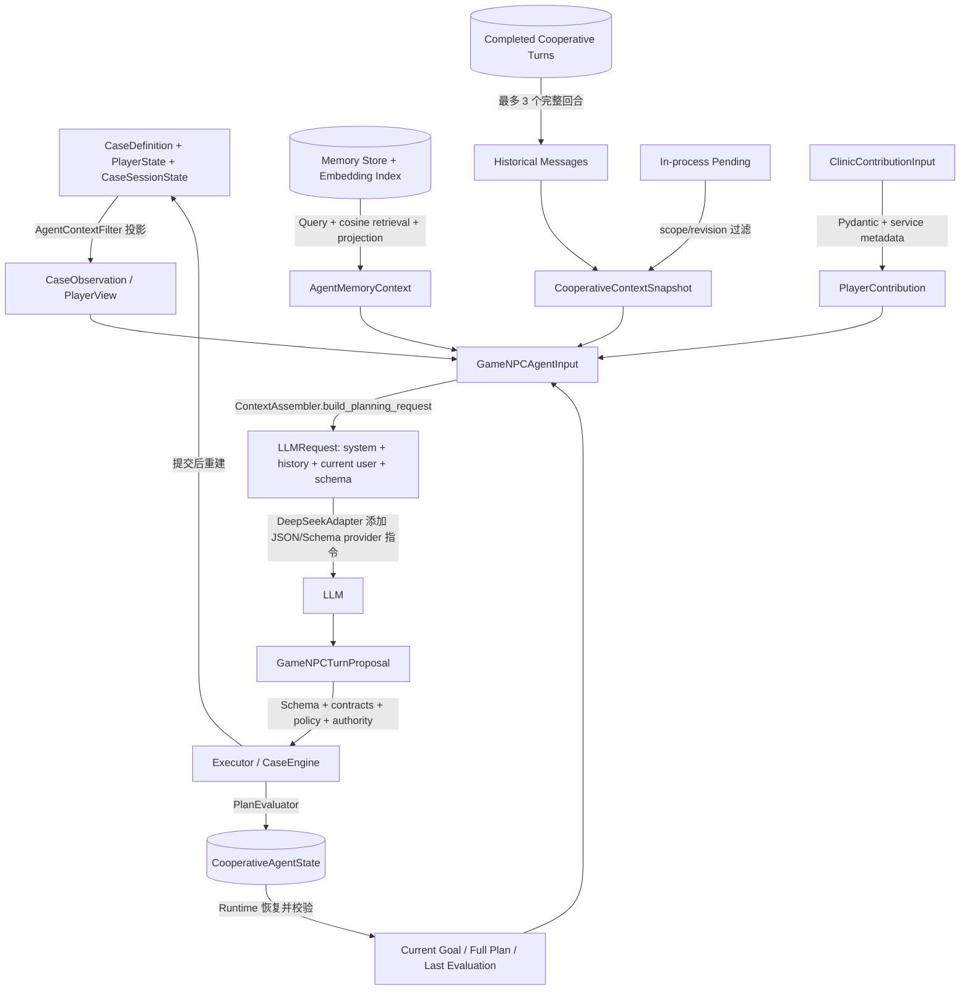

# Agent 上下文工程设计（Context Engineering）

> 目标：用于 Agent 岗位面试。本文严格区分 **Agent 通用理论、项目设计意图、当前真实代码、尚未实现能力**。结论以当前工作区代码为准；历史设计稿只作为背景，不替代代码事实。

## 0. 先给结论

本项目的上下文工程不是“拼一个大 Prompt”，而是把持久状态经过权限投影、状态恢复、检索和限量选择，转成当前一次 LLM 决策所需的 `LLMRequest`。正式协作链路中，`CooperativeRuntime` 恢复公开 Observation、当前 Goal/Plan、最近计划评价、可选 Memory 和 CE-2A 历史快照，构造 `GameNPCAgentInput`；`ContextAssembler` 再确定性地将它们排列成 system/history/current-user messages，并附上结构化输出 Schema。这个 Context 只服务当前请求，不是新的事实源；模型输出仍要经过 Schema、Action Contract、Goal/Plan Policy、Authority 和 Executor 才可能改变世界。

### 面试时的一句话版本

> 我的项目不会把完整世界状态和全部历史直接交给模型，而是由 Runtime 每轮从权威状态生成公开 Observation，恢复当前 Goal/Plan，检索并限量投影相关 Memory，再由 `ContextAssembler` 按可信度和时序组装成一次性消息；LLM 只看到决策必需的公开信息，输出还要经过确定性校验才能执行。

---

## 1. 本项目中的 Context Engineering 是什么

在本项目中，**Context** 是某一次模型调用实际可见的信息集合，代码形态主要是 `GameNPCAgentInput → LLMRequest(messages, response_schema)`。它由 Runtime 和 `ContextAssembler` 共同构造：信息来自当前公开世界投影、玩家贡献、Agent Goal/Plan、最近评价、长期 Memory 检索结果、已完成协作历史和当前有效 pending 的公开投影。Context 最终由 `LLMAdapter.complete()` 消费，通常只活到一次 initial/repair 调用结束；可持久化的是它的来源状态和协作历史，不是一个统一的 Context 快照。

这里还要区分两个近似概念：

- `CooperativeContextSnapshot` 是 CE-2A 对“已选历史 + 当前 pending 公开项”的单轮不可变快照，只是 Context 的一个输入来源。
- `ContextBuildTrace` 是请求构建审计信息，记录来源、哈希、字符数和字节数，明确 **不进入模型上下文**，也不持久化为权威状态。

---

## 2. 真实 Context 构造入口

### 2.1 入口与职责表

| 层级 | 文件 | Class / Function | 真实作用 |
|---|---|---|---|
| 协作服务入口 | `src/xuanyi_npc/application/clinic.py` | `ClinicService.submit_player_contribution()` | 校验/记录 operation，构造 `PlayerContribution`，可选构造 CE-2A snapshot，然后调用 Runtime |
| Runtime 调用位置 | `src/xuanyi_npc/application/cooperative_runtime.py` | `CooperativeRuntime.handle()` | 恢复世界与 AgentState、生成 Observation、检索 Memory、构造 `GameNPCAgentInput`、调用 `agent.propose_turn()` |
| Observation 生成 | `src/xuanyi_npc/application/views.py` | `AgentContextFilter.case_observation()` | 将完整 Case/Player/Session 投影成不含隐藏真相的 `CaseObservation` |
| Memory 查询与选择 | `src/xuanyi_npc/application/game_npc_memory.py` | `GameNPCMemoryRetrievalService.retrieve()` | 构造查询、语义检索、过滤、排序并生成限量 `AgentMemoryContext` |
| 历史/pending 快照 | `src/xuanyi_npc/application/cooperative_context.py` | `build_context_snapshot()` | 选择同 scope 已完成回合和当前有效 pending 公开投影 |
| Agent 输入结构 | `src/xuanyi_npc/agents/game_npc.py` | `GameNPCAgentInput` | 汇总本轮 Context 的结构化来源，不等于最终 Prompt |
| Agent 决策入口 | 同上 | `GameNPCAgent.propose_turn()` | 选择 A1 请求构建、调用有界结构化输出流程并解析 Proposal |
| Context / Message 构造 | `src/xuanyi_npc/agents/context.py` | `ContextAssembler.build_planning_request()` | 生成 system/history/current-user messages、response schema 和 build trace |
| Prompt 来源 | `src/xuanyi_npc/agents/game_npc.py` | `GAME_NPC_M2_PLANNING_PROMPT` | 定义角色、信任边界、规划规则和行为约束 |
| 格式修复上下文 | `src/xuanyi_npc/agents/context.py` | `build_format_repair_request()` | 复用原始消息，追加无效输出和安全校验反馈，不重新读取世界 |
| LLM 调用 | `src/xuanyi_npc/agents/bounded_output.py` | `BoundedStructuredOutput.run()` | 调用 adapter，解析；失败时最多按配置进行修复/安全 fallback |
| Provider 渲染 | `src/xuanyi_npc/agents/deepseek.py` | `DeepSeekAdapter._chat_payload()` / `complete()` | 把中立消息映射到 API payload，并把 JSON-only 指令和完整 JSON Schema 加到 system message |

### 2.2 真实调用关系

```text
ClinicService.submit_player_contribution()
  ├─ 构造 PlayerContribution
  ├─ build_context_snapshot()                 # CE-2A 开启时
  └─ CooperativeRuntime.handle()
       ├─ _resume() → AgentContextFilter.case_observation()
       ├─ _load_or_initialize()               # 当前 AgentState
       ├─ _mark_invalid_plan() / _prepare_next_goal()
       ├─ _retrieve_memory_context()
       │    └─ GameNPCMemoryRetrievalService.retrieve()
       ├─ GameNPCAgentInput(...)
       └─ GameNPCAgent.propose_turn()
            ├─ _planning_request()
            │    └─ ContextAssembler.build_planning_request()
            └─ BoundedStructuredOutput.run()
                 └─ LLMAdapter.complete()
                      └─ DeepSeekAdapter._chat_payload()
```

真实顺序中，Goal/Plan 的有效性调整发生在 Memory 检索之前；Memory 查询因此使用调整后的当前 Goal/Plan。`ContextAssembler` 不自己读取数据库，也不做 Memory 检索，它只对已经准备好的输入做确定性序列化和排列。

---

## 3. 一次典型 A1 LLM 调用到底看到了什么

最典型的是 `CooperativeRuntime.handle()` 调用 `GameNPCAgent.propose_turn()` 的 A1 planning request。最终 provider 请求的逻辑结构如下：

```text
SYSTEM message
  - GAME_NPC_M2_PLANNING_PROMPT
  - CE-2A 历史/pending 信任规则（开关启用时）
  - DeepSeek adapter 追加的“只返回 JSON”要求与完整 JSON Schema

RECENT HISTORY messages（CE-2A 开启且存在时）
  - completed_historical user message
  - completed_historical assistant message
  - 最多 3 个完整 pair，按时间正序

CURRENT USER message（一个结构化文本块）
  - turn_id 与 action_id 约束
  - AUTHORITATIVE_WORLD_case_observation
  - AUTHORITATIVE_WORLD_public_environment_feedback
  - AUTHORITATIVE_CONSTRAINTS_authority_view
  - AGENT_INTENT_current_goal
  - AGENT_INTENT_current_plan
  - AGENT_INTENT_last_plan_evaluation
  - AUTHORITATIVE_CONSTRAINTS_pending_confirmation_id
  - HISTORICAL_NON_AUTHORITATIVE_CONTEXT_memory_context
  - AUTHORITATIVE_PUBLIC_ACTION_SPACE_available_actions
  - Investigation / Diagnosis / Treatment / Active-step contracts
  - PLAYER_BELIEF_player_contribution
  - authoritative_player_view
  - CE-2A selection / omission / pending public metadata
```

注意：这里没有 provider 原生 function calling 的 `tools` 参数。可用工具被投影成公开 Action JSON 和固定契约，模型返回的 `GameNPCTurnProposal` 中再携带 `ToolCallRequest`。

### 3.1 每一部分的来源和动态性

| Context 组成 | 真实来源 | 持久化来源 | 每轮注入 | 作用 | 动态性 |
|---|---|---:|---:|---|---|
| System Prompt | `GAME_NPC_M2_PLANNING_PROMPT` | 代码版本 | 是 | 角色、规则、信任边界、规划行为 | 版本变化，单次运行固定 |
| CE-2A system suffix | `CE2A_SYSTEM_SUFFIX` | 代码版本 | 开关启用时 | 声明历史非权威、pending 不授予权限 | 固定 |
| User Input | `PlayerContribution` | completed turn 会记录公开投影 | 有贡献时 | 当前玩家的建议/问题/确认 | 每轮变化 |
| Observation | `CaseObservation` | 否；由 World State 重建 | 是 | 当前公开世界事实 | 世界 revision 变化时变化 |
| PlayerView | 当前玩家公开视图 | 否；由 PlayerState 投影 | 是 | 模型可见玩家身份/状态 | 可变化 |
| AuthorityView | `NPCAuthorityPolicy.view()` | 否 | 是 | 当前可用权限模式和公开约束 | 可变化 |
| Goal | `CooperativeAgentState.current_goal` | 是 | A1 是 | 当前任务意图 | 可变 |
| Plan | `CooperativeAgentState.current_plan` | 是 | A1 是，完整 Plan | 连续执行、避免每轮失忆 | 可变 |
| Last Plan Evaluation | `state.last_plan_evaluation` | 是 | 有则注入 | 上轮执行/计划进展的结构化反馈 | 可变 |
| Public environment feedback | 上述评价的 `public_summary` | 间接持久化 | 有评价则注入 | 给模型简短结果说明 | 可变 |
| Memory | `AgentMemoryContext` | 原 Memory 是；本轮投影否 | 检索成功时 | 非权威跨案经验 | 每轮重新检索 |
| History | SQLite completed cooperative turns | 是 | CE-2A 开启且有历史时 | 保持同 session 对话连续性 | 滑动选择 |
| Pending public views | 进程内 pending 的公开投影 | 当前未 durable | CE-2A 开启且有效时 | 告知存在待确认项；不授权 | 动态 |
| Tool/Action 说明 | 当前 Observation 投影 + 固定 contracts | 否 | 是 | 限定公开可选动作和参数 | 空间动态、契约固定 |
| Output Schema | `GameNPCTurnProposal.model_json_schema()` | 代码版本 | 是 | 强制结构化 Goal/Plan/Decision 输出 | 模型版本固定 |
| Developer message | 不存在 | 不存在 | 否 | 本项目没有单独 developer role | — |

### 3.2 不会进入模型的内容

- 病例的 `hidden_information`、`root_cause`、完整 `causal_chain`、私有正确诊断集合、未公开治疗结果、计分规则。
- 原始完整 `CaseDefinition`、`CaseSessionState`、Memory 数据库记录和向量。
- `ContextBuildTrace`、provider 密钥、成本账本、内部异常堆栈。
- 全部历史对话；仅 CE-2A 选择的 completed 完整回合进入。
- `GameNPCAgentInput.step_index` 和 `agent_state_revision` 当前虽然存在于输入对象，但 `build_planning_request()` 并没有把它们序列化进 A1 message。
- 普通案中人物聊天的 `CaseDialogueState.recent_messages` 不会混入协作 Agent 的 Context。

---

## 4. State 与 Context 的区别

### 4.1 定义

**State** 是跨步骤保留的系统事实或运行进度，例如 `CaseSessionState`、`CooperativeAgentState`、Memory records 和协作 turn records。它们有 owner、生命周期和写入规则。

**Context** 是从这些状态以及当前输入中选择、投影、排序后，提供给某一次 LLM 调用的临时视图。Context 可以包含事实、意图、历史和不可信观点，但它本身不是权威事实源。

| 对比项 | State | Context |
|---|---|---|
| 核心作用 | 跨 turn 保存事实和进度 | 支撑当前一次模型决策 |
| 生命周期 | Session、Goal、Memory 或长期 | 一次 request；repair 可复用原请求 |
| 是否持久化 | 多数核心 State 持久化 | 没有统一持久化；历史来源和评测 fixture 可保存 |
| 谁维护 | Engine、Runtime、应用服务、Repository | Runtime + ContextAssembler |
| 谁消费 | Engine、策略、服务、Retriever、Agent | LLM adapter / model |
| 是否直接给 LLM | 不一定，通常先投影 | 是，最终形态为 messages + schema |
| 是否是事实源 | 权威 State 中部分是 | 否；只是带来源级别的当前视图 |
| 更新方式 | 确定性提交、CAS/锁、Repository 写入 | 每轮重新构造，不反向直接写 State |

### 4.2 哪些 State 进入、哪些不进入

进入的是经过投影后的当前案件公开状态、当前 Agent Goal/Plan/评价、同玩家跨案 Memory 公开摘要、同 scope completed 协作历史和有效 pending 公开视图。完整隐藏案件定义、内部 scoring、Memory 原文/向量、存储版本元数据、锁和幂等账本不会直接进入。

### 4.3 既然有 State，为什么还需要 Context

因为 State 的目标是**完整、可恢复和可裁定**，LLM 输入的目标是**最小权限、相关、可理解和有预算**。直接把 State 交给模型会泄露隐藏真相、混淆权威与观点、增加成本，并使模型把内部字段当成可操作权限。Context 是 State 与概率模型之间的适配和安全边界。

---

## 5. World State 如何变成 Observation

真实链路是：

```text
CaseDefinition + PlayerState + CaseSessionState
              ↓
AgentContextFilter.case_observation()
              ↓
CaseObservation（公开、只读投影）
              ↓
GameNPCAgentInput.case_observation
              ↓
AUTHORITATIVE_WORLD_case_observation
```

`AgentContextFilter` 是真实的 Projection 层。它暴露案件标题、简介、患者公开资料、session 状态/revision、已发现公开线索、当前可用调查、公开诊断候选、是否可以提交诊断、已提交诊断 ID 和当前可用处置。可用行动还会根据当前进度和公开规则动态投影。

它不暴露隐藏病情、根因、完整因果链、尚未发现线索内容、正确诊断私有集合、处置真实 outcome 和计分逻辑。角色/视角控制主要体现在只构造 Agent-safe public view，以及 Memory 按 `player_id`/session 隔离；它不是靠 Prompt 祈求模型“不要看”。

### 为什么不能直接放完整 World State

1. **信息权限**：模型若看见正确诊断和隐藏线索，游戏调查机制失效。
2. **输入侧安全**：不提供隐藏字段比提供后要求“别使用”更可靠。
3. **Token 与干扰**：完整规则、历史和未解锁分支会显著扩大请求并降低注意力密度。
4. **事实边界**：`CaseObservation` 明确告诉模型什么是“当前公开事实”，避免把定义中的未来信息当成已发生事实。
5. **仍需输出侧验证**：投影只防泄漏，不能保证模型只选择合法动作，所以后面还有 Action Contract、Authority 和 Engine。

---

## 6. User Input 如何进入 Context

```text
HTTP/UI form fields
  ↓
ClinicContributionInput（Pydantic：extra=forbid、strip whitespace、字段类型/长度校验）
  ↓
ClinicService.submit_player_contribution()
  ↓
PlayerContribution（补齐 contribution_id、scope、时间和响应引用）
  ↓
CooperativeRuntime.handle()
  ↓
GameNPCAgentInput.player_contribution
  ↓
PLAYER_BELIEF_player_contribution JSON block
```

真实情况如下：

- 文本基本原样保留，只做 Pydantic 的结构、非空、长度和空白规范化；最终通过 JSON 序列化进入 Prompt，因此语法上会转义。
- `contribution_type`、`contribution_id`、player/case/session 标识及可选的 decision/confirmation 引用会附加为结构化元数据。
- 协作入口**没有 LLM 意图 Router**。`contribution_type` 由 UI/请求字段提供，不是模型自动分类结果。
- 项目另有 `case_chat_message()` 的确定性分类逻辑，但那是案中人物聊天路径，不能冒充协作 Agent 的 Router。
- 用户内容被明确标为 `PLAYER_BELIEF`/untrusted；它可影响讨论和 Proposal，但不能直接授权工具或覆盖 Observation。
- 当前没有专门的自然语言 prompt-injection 语义清洗器。安全依赖来源标签、JSON 边界和输出侧确定性校验，因此属于“部分防护”，不是“已完全解决”。

---

## 7. Goal 和 Plan 如何进入 Context

Runtime 从 `CooperativeAgentState` 恢复状态后，先调用 `_mark_invalid_plan()` 和 `_prepare_next_goal()`，再把 `current_goal`、`current_plan`、`last_plan_evaluation` 交给 Agent。

在 A1 Context 中：

- 当前 Goal 以完整公开结构注入，包括 ID、类型、描述、状态、优先级、完成条件和 revision 等模型字段。
- 当前 Plan 使用 `model_dump(mode="json")` 完整注入，不只是 active step；因此模型可见 2～4 步计划、当前索引、已完成/当前/待执行步骤、计划状态和版本依据。
- 最近一次 `PlanEvaluation` 完整注入，同时它的 `public_summary` 还作为 `last_environment_feedback` 单独注入。
- 固定 `EXECUTABLE_ACTIVE_STEP_CONTRACT` 要求本轮可执行 action 与应用后的 active step 对齐。

模型需要 Plan，是为了让当前行动延续一个显式承诺，而不是每轮根据同一观察任意改变方向。也不能简单地让模型每轮完全重规划：那会造成反复横跳、重复工具调用和难以判断完成。项目允许 `KEEP/CREATE/REVISE/COMPLETE/ABANDON` 等结构化更新，但由 `GoalPlanPolicy` 校验；Runtime 还会因观察版本、完成条件或执行评价确定性地失效、推进或完成计划。

需要区分：Memory 查询为了节省体积只使用当前 Plan 的 active/current step；最终给 LLM 的 A1 `current_plan` 则是完整 Plan。

---

## 8. Memory 如何进入 Context

### 8.1 真实链路

```text
Authoritative Memory SQLite records + embeddings
  ↓
GameNPCMemoryQueryBuilder.build()
  ↓ 公开、最长 2000 字符的结构化 query
BasicCosineMemoryRetriever.retrieve_scoped()
  ↓ cosine hits + index state
GameNPCMemoryProjectionPolicy.project()
  ↓ scope/status/source/conflict/dedup/预算过滤
AgentMemoryContext
  ↓
GameNPCAgentInput.memory_context
  ↓
HISTORICAL_NON_AUTHORITATIVE_CONTEXT_memory_context
```

### 8.2 检索时机与查询

Memory 在 Runtime 恢复 Observation、修正 Goal/Plan 后，调用 Agent 之前检索。查询由 `GameNPCMemoryQueryBuilder` 确定性生成，不由 LLM 生成，必含 case ID/title/status/revision、当前 Goal、当前 Plan 的 active step、当前玩家贡献；在 2000 字符内再依次加入简介、患者公开资料、最近 3 条线索、前 3 个调查、前 2 个诊断候选、前 2 个处置和最近评价。

### 8.3 检索、过滤与上限

- `BasicCosineMemoryRetriever.retrieve_scoped()` 使用 embedding cosine similarity 排序。
- scope 限定当前 `player_id`，只读允许的 episodic/learning 类型，并排除当前 session。
- Projection 再检查 active 状态、tombstone、来源 receipt、玩家和 session 一致性。
- 默认最低相关度 `0.05`，冲突 Memory 默认不允许进入。
- 按公开摘要去重，默认最多 4 条（配置允许 1～5），摘要字符总预算 900。
- 每条注入项包含公开摘要、来源 case/episode/type、相关度、confidence、reason、时间和 conflict 标记。

### 8.4 最终 Prompt 形态与失败方式

最终注入的不是 Memory 原文和向量，而是整个 `AgentMemoryContext` JSON。它除 selected memories 外还包含 query basis、candidate/selected IDs、计数和索引状态。Runtime 若检索异常，会 fail-safe 为 `memory_context=None` 并记录 trace；本轮仍可基于当前 Observation/Plan 决策。

模型可声明 `memory_usage.used_memory_ids`，但 `_validate_memory_usage()` 要求只能引用本轮 selected IDs，并校验它声称影响 Goal、Plan、工具优先级或沟通的方式与实际 Proposal 一致。Memory 始终标为 historical/non-authoritative，不能覆盖当前 Observation。

---

## 9. 历史对话如何处理

CE-2A 开启时，项目保存协作 turn 的 operation 生命周期，但只有同一 player/case/session、当前 operation 之前、状态为 `completed` 的回合可进入历史。`build_context_snapshot()` 将每个回合投影成完整 user/assistant pair：

- 最多 3 个 completed 回合，即最多 6 条历史 message。
- 历史 `content` 总预算 12,000 个 Python 字符，不是 token。
- 从最新回合向前选择，再恢复为时间正序。
- 不允许截断半个 pair；超限时整轮省略，并注入省略数量、原因和“必要时请玩家重述”的元数据。
- 不做自动摘要，不把 Memory 当作对话历史的完全替代。
- repair 复用 initial request，不重新选择历史，保证同一决策尝试看到一致快照。

CE-2A 关闭时，`ContextAssembler._recent_messages()` 可按 `recent_message_limit` 取尾部消息，默认值 6；但正式 Runtime 的历史供应来自 CE-2A snapshot。正式 CLI 当前默认开启 cooperative record/context v2，程序化 `build_clinic_service()` 默认仍是关闭，调用方需显式启用。

### 长期运行会不会无限增长

持久历史表会增长，但单次 LLM Context 不会随历史记录数线性增长，因为只选择最近 3 个完整回合并受 12,000 字符预算约束。Memory 也受 top-k 和 900 字符摘要预算限制。不过项目尚无全请求 tokenizer budget 和历史摘要层，因此“不会无限增长”不等于“任何请求都能稳定适配 provider context window”。

---

## 10. Execution Result 如何进入下一轮 Context

```text
Proposal → Validation → Executor/CaseEngine
                         ↓
                  新 CaseSessionState
                         ↓
             下一轮重新生成 Observation

执行结果 → DeterministicPlanEvaluator → state.last_plan_evaluation
                                      ↓
下一轮 last_plan_evaluation + public_summary/environment_feedback
```

成功执行后，Runtime 从提交后的权威 session 重新生成 Observation，`DeterministicPlanEvaluator` 写入 `PlanEvaluation` 并推进/完成 Plan；下一轮模型看到新 Observation、完整最近评价和其公开摘要。因此模型不是靠自己上一轮说“已经成功”来判断，而是靠世界状态和确定性评价回流。

失败/拒绝的可见性不是完全同构：

| 情况 | 世界是否变化 | 下一轮正式结构化反馈 |
|---|---:|---|
| 工具成功 | 是 | 新 Observation + 成功/进展 PlanEvaluation |
| Tool/Engine 执行失败 | 通常否 | evaluator 生成失败评价与公开摘要 |
| Action 与 active Plan 不对齐 | 否 | `_alignment_recovery_evaluation()` 持久化恢复评价 |
| 参数/Action Contract 错误 | 先做一次 repair；仍失败则安全 fallback | 独立 PublicDecisionFeedback 返回 action_contract 分类；不注入原始错误全文 |
| Authority forbidden / confirmation required | 否 | forbidden 返回 authority 公开反馈；待确认仍通过 pending 公开投影告知，均不授予权限 |
| 模型格式错误 | 否，repair/fallback | repair 当次看到校验反馈；耗尽修复后持久化 model 公开失败分类 |

所以面试时不能说“所有错误都会原样进入下一轮”。准确表述是：**世界结果通过下一轮 Observation 回流，规划相关成功/失败通过 PlanEvaluation 回流；主要拒绝分支通过独立 PublicDecisionFeedback 回流固定公开分类，内部错误全文与提交不确定等系统故障不会直接交给模型。**

---

## 11. Prompt 具体如何构造

### 11.1 System Prompt

`GAME_NPC_M2_PLANNING_PROMPT` 主要包含：Agent 身份；Observation 是当前案件事实来源；玩家贡献是待评价意见；Goal/Plan 是持久意图但不是授权；Memory 是非权威历史参考；模型每轮只能提出一个结构化行动；诊断/处置的确认规则；不得声称执行成功或直接修改世界、权限、分数和 Memory。

CE-2A 开启时追加 system suffix，明确 completed history 非权威、pending view 只读且不授予权限。

### 11.2 Developer / Instruction

项目的 provider-neutral `ChatRole` 支持 system/user/assistant/tool，但当前 A1 请求没有单独 developer message。行为规则放在 system prompt，具体 Context 与契约放在当前 user message。

### 11.3 User 部分

不是只放一句玩家文本，而是一个带显式来源标签的序列化 Context：当前 world、feedback、authority、Goal、Plan、evaluation、pending、Memory、action space、contracts、player belief、player view 和 CE-2A metadata。

### 11.4 Tool 说明

项目不使用 provider-native tool schema。`project_public_*_actions()` 从当前 Observation 生成公开行动空间，再附加固定 Action contracts；模型输出 `ToolCallRequest`，Executor 在模型之外解释和执行。

### 11.5 Output Schema

Provider-neutral request 携带 `GameNPCTurnProposal.model_json_schema()`。DeepSeek adapter 在发送前把“只输出 JSON”及完整 Schema 追加到首个 system message，并设置 `response_format={type: json_object}`。返回后 Pydantic 解析、decision/action/memory/goal-plan policy 还会做确定性校验。

### 11.6 结构化概览

```text
SYSTEM
  角色 + 事实/信任边界 + 行为规则 + CE-2A 规则

HISTORY（可选）
  completed historical user/assistant pairs，均非权威

CURRENT USER CONTEXT
  World Observation + Environment Feedback + Authority
  Goal + Full Plan + Last Evaluation
  Memory + Public Action Space + Contracts
  Current Player Belief + Player View + CE-2A metadata

OUTPUT
  GameNPCTurnProposal JSON Schema
```

---

## 12. Prompt Engineering 与 Context Engineering 的区别

Prompt Engineering 解决“如何对模型说”：例如 system 指令如何表述、怎样要求 JSON、怎样声明角色和冲突规则。Context Engineering 解决“本轮让模型看什么、从哪里取、如何过滤、以什么信任级别和顺序注入、何时丢弃”。

本项目更适合称为 Context Engineering，因为核心工作不只在 `GAME_NPC_M2_PLANNING_PROMPT`：它还包括 Observation 权限投影、Goal/Plan 恢复、Memory query/retrieval/projection、completed history 窗口、pending 快照、Action Space 投影、repair snapshot 复用和 build trace。只谈 Prompt 会遗漏真正决定模型可见世界的代码路径。

---

## 13. Context 的 Token 控制

当前 DeepSeek 正式发送路径已有统一 tokenizer-aware 预算：`prepare_request()` 先渲染包含完整 Schema 的最终 payload，再检查内容 tokens + framing 估算 + 输出预留 + 安全余量。默认应用窗口 65,536，安全余量 1,024；framing 按每条消息 16 加基础 16 估算，实际用量以 provider usage 为准。

预算不足时，按固定次序移除 Memory 检索诊断字段、最旧完整历史 pair、低相关度整条 Memory。当前 Observation、Goal/完整 Plan、权限、pending、当前贡献和执行契约保持完整。必选内容仍放不下则返回 `context_budget_exceeded`，不发送该次请求。

A1 initial/format repair 显式输出 2048；A0 initial/format repair 和 action-contract repair 显式 512。repair 复用原公开快照及其裁剪候选，加入 invalid output 与反馈后重新预算；不截断 JSON，不重读世界。

`ContextBuildTrace` 继续记录 assembler 字符/字节；`ContextBudgetTrace` 记录最终请求计数、framing 估算、选择、输出额度和哈希。输入消息字符保护为 2,000,000，响应字符保护仍为 20,000；history、pending、Memory 上游局部上限继续存在。

实现边界：这不是 provider 隐藏模板的精确复现，没有语义摘要，也尚未通过付费模型 C/T 证明裁剪改善任务质量。配置和测试见 [预算设计](../architecture/TOKEN_BUDGET_DESIGN.md)。

---

## 14. 上下文污染问题

| 污染来源 | 当前机制 | 结论 |
|---|---|---|
| 无关 Memory | cosine 检索、player/session/type/status/source 过滤、阈值、去重、top-k、字符预算 | 大部分架构化解决；语义相关不等于一定有用 |
| 与当前观察冲突的 Memory | Projection 标记冲突，默认丢弃；Prompt 声明 Observation 优先 | 已有明确防护 |
| 历史错误信息 | completed history 明示 non-authoritative，当前 Context 排最后；不从历史恢复授权 | 部分解决；模型仍可能受错误叙述影响 |
| LLM 自己的话变成事实 | assistant history 标为历史；真实事实重新从 Observation 构造 | 架构上阻断成为权威事实 |
| 过时 Plan | `_mark_invalid_plan()`、环境 revision/评价、GoalPlanPolicy、执行前 active-step alignment | 有确定性防护 |
| Tool 失败被当成功 | 世界只由 Executor/Engine 提交；下一轮重新观察并生成评价 | 核心事实层已解决 |
| 用户覆盖 system 规则 | 用户被标为 `PLAYER_BELIEF`；权限/契约在模型外复核 | 执行安全大体解决，生成内容仍可能被 prompt injection 影响 |
| 历史无限膨胀 | 完整 pair 窗口 + 字符预算 | 已限制单请求增长 |

尚未完全解决的部分是语义层 prompt injection、历史生成文本对模型注意力的影响，以及缺乏真实模型长期 C/T 证据。来源标签不能证明模型一定遵守，所以执行安全必须继续依赖模型外策略。

---

## 15. Context 的可信度层级

项目更适合按“权威性”而不是笼统高/中/低可信划分：

1. **系统行为指令**：system prompt 与 CE-2A suffix，规定模型行为，但不等于世界事实。
2. **权威当前世界**：`CaseObservation` 和由权威提交结果生成的公开环境反馈。
3. **权威约束**：`AuthorityView`、当前 pending 公开存在性、公开 Action Space 和 contracts。注意 pending view 告知约束但不授予执行权限。
4. **Agent 当前意图**：Goal、Plan、PlanEvaluation。它们是持久意图/进度，不是世界事实或权限。
5. **历史非权威参考**：selected Memory、completed user/assistant history。
6. **当前玩家信念**：`PlayerContribution`，可被评价，但不是事实或命令。

当冲突发生时，应以当前 Observation 和确定性 constraints 为准；Memory prompt 明确规定不能覆盖它们。用户/历史与当前事实的冲突主要依赖来源标签和 system 规则处理，代码没有通用的自然语言事实冲突求解器。即使模型选错，Action Contract、GoalPlanPolicy、Authority 和 Engine 仍会在输出侧拒绝非法执行。

---

## 16. Context 与安全边界

```text
完整 World State
  ↓ 输入侧最小权限投影
CaseObservation
  ↓ 来源分层与限量选择
LLM Context
  ↓
LLM Proposal
  ↓ Schema / Action Contract / GoalPlanPolicy
Authority Check
  ↓
Executor / CaseEngine
```

Context 控制是**输入侧安全**：模型从一开始就看不到隐藏真相和不属于该玩家/session 的 Memory。Policy、Authority、Executor 是**输出侧安全**：即便模型误解、越权或受到注入，也不能靠一段文本直接改变世界。

只在 Prompt 写“你不能查看隐藏信息”不可靠，因为一旦隐藏信息已经出现在输入中，模型既可能复述，也可能在决策中隐式利用；而且 Prompt 不能提供事务、权限和参数完整性保证。输入最小化降低泄漏面，输出校验控制副作用，两层缺一不可。

---

## 17. Context 如何影响 Agent 行为质量

- **决策准确性**：当前 Observation 和可用 Action Space 将选择约束在已公开且可执行的案件分支；但模型语义准确率仍需真实评测证明。
- **连贯性**：完整当前 Plan、最近 evaluation 和最多 3 轮 completed history，使模型知道正在做什么、刚发生什么、玩家是否改口。
- **长期行为**：跨案 Memory 提供相关经验，但限定同玩家、排除当前 session 且标为非权威，避免把经验当现案事实。
- **Tool 选择**：公开 Action Space + contracts + active-step contract 同时告诉模型“有哪些候选”和“本轮应与哪个计划步骤对齐”。
- **Plan 执行**：Runtime 先处理失效/完成条件，模型再提出 Plan update；最终 action 还做二次 alignment，降低计划与动作分裂。
- **幻觉控制**：模型只能基于公开投影提出 Proposal，不能声明自己已执行；下一轮以重建 Observation 而非模型叙述为准。
- **Token 成本**：投影、history window 和 memory budget 有效限制大头，但完整 schema/contracts 已计入统一预算，但压缩后的模型行为质量仍需真实评测。

---

## 18. 完整 Context Data Flow



箭头含义：

- `AgentContextFilter` 把完整世界转成最小权限公开视图。
- Runtime 从 AgentState 取当前意图并在调用模型前处理失效/完成条件。
- Memory service 用当前公开状态构造 query，返回限量、可追溯、非权威的记忆投影。
- Context snapshot 只选择同 scope completed history 和当前有效 pending 公开项。
- `ContextAssembler` 不访问存储，只把输入确定性地变成消息和 Schema。
- Provider adapter 做最后的 API 形态转换；模型只生成 Proposal。
- 执行成功后，世界和 AgentState 分别更新；下一轮重新组装 Context。

---

## 19. 代码级追踪：打开代码应该怎么看

### 19.1 一次典型调用

1. `src/xuanyi_npc/application/clinic.py` — `ClinicService.submit_player_contribution(request)`
   - 输入：`ClinicContributionInput`
   - 输出：`CooperativeTurnResult`
   - 看点：稳定 operation payload、`PlayerContribution`、CE-2A snapshot、Runtime 构造。

2. `src/xuanyi_npc/application/cooperative_context.py` — `build_context_snapshot(...)`
   - 输入：当前 scope、operation、history repository、pending 列表。
   - 输出：`CooperativeContextSnapshot` 和 selected `ChatMessage`。
   - 看点：completed-only、3-turn/12,000-char、完整 pair、pending revision 过滤。

3. `src/xuanyi_npc/application/cooperative_runtime.py` — `CooperativeRuntime.handle(request)`
   - 输入：含 contribution/pending 的 `CooperativeTurnInput`。
   - 输出：回合结果。
   - 看点：`_resume()`、`_load_or_initialize()`、Plan 准备、Memory retrieval、`GameNPCAgentInput(...)`、`agent.propose_turn()`。

4. `src/xuanyi_npc/application/views.py` — `AgentContextFilter.case_observation(...)`
   - 输入：完整 Case/Player/Session。
   - 输出：`CaseObservation`。
   - 看点：哪些公开、哪些隐藏、available actions 如何计算。

5. `src/xuanyi_npc/application/game_npc_memory.py` — `GameNPCMemoryRetrievalService.retrieve(...)`
   - 输入：当前 observation/goal/plan/contribution/evaluation。
   - 输出：`AgentMemoryContext`。
   - 看点：QueryBuilder、`retrieve_scoped()`、ProjectionPolicy。

6. `src/xuanyi_npc/agents/game_npc.py` — `GameNPCAgent.propose_turn()` / `_planning_request()`
   - 输入：`GameNPCAgentInput`。
   - 输出：解析校验后的 `GameNPCTurnProposal`。
   - 看点：A1 builder、bounded structured output、deterministic validators。

7. `src/xuanyi_npc/agents/context.py` — `ContextAssembler.build_planning_request()`
   - 输入：上述结构化 Agent input。
   - 输出：`BuiltContext(request, trace)`。
   - 看点：确切标签、排序、history、action projections、contracts、schema、2048 output reservation。

8. `src/xuanyi_npc/agents/bounded_output.py` — `BoundedStructuredOutput.run()`
   - 输入：request factory、parser、repair factory、fallback。
   - 输出：结构化结果与 attempts/usages。
   - 看点：模型错误如何进入 repair，而不是直接执行。

9. `src/xuanyi_npc/agents/deepseek.py` — `_chat_payload()` / `complete()`
   - 输入：provider-neutral `LLMRequest`。
   - 输出：`LLMResponse`。
   - 看点：schema 追加、JSON mode、temperature、output tokens、费用预算。

### 19.2 面试现场建议打开的三个核心位置

若时间只有 5 分钟，依次打开：

1. `CooperativeRuntime.handle()`：证明 Context 的数据来源和调用时序。
2. `ContextAssembler.build_planning_request()`：证明最终每条消息到底包含什么。
3. `AgentContextFilter.case_observation()` 与 `GameNPCMemoryProjectionPolicy.project()`：证明权限过滤和 Memory 选择不是口头设计。

---

## 20. 设计文档 vs 真实实现

| 能力 | 当前架构文档描述 | 当前真实代码 | 是否一致 |
|---|---|---|---|
| Context 构造 | Runtime 准备输入，`ContextAssembler` 确定性构造 | 正是该调用链 | 一致 |
| Observation | 当前公开 `CaseObservation` 是世界事实来源 | `AgentContextFilter.case_observation()` 过滤隐藏字段 | 一致 |
| Memory 注入 | A1 注入已选择非权威投影 | `AgentMemoryContext.model_dump_json()` 整体注入 | 一致 |
| Plan 注入 | A1 注入当前 Goal/Plan/evaluation | 代码注入完整 `current_plan`，不是仅 active step | 一致；口述时易误说 |
| Prompt Template | M2 prompt + CE-2A suffix | 代码如此；provider 还动态追加 JSON Schema 指令 | 基本一致；只看源码常量会漏 provider 层 |
| History | 最多 3 个 completed 完整 pair、12,000 字符、不摘要 | 实现相同 | 一致 |
| Pending | 只读公开投影、不恢复授权 | 代码过滤 scope/revision；真正授权仍靠完整进程内对象 | 一致 |
| Token 限制 | 最终 provider 请求 tokenizer 预算 | Schema、repair、framing 估算和输出额度均计入 | 一致；framing 非精确值 |
| Repair snapshot | 格式修复复用原 messages | 代码追加 invalid output + feedback，不重读状态 | 一致 |
| A1 输出预算 | initial/format repair 显式 2048 | action-contract repair 仍为 A0 形状、512 | 一致 |
| Runtime input 字段 | `GameNPCAgentInput` 含 `step_index`、`agent_state_revision` | assembler 当前未把二者写进消息 | 文档通常未强调；属于代码存在但模型不可见 |
| 执行反馈 | 世界/评价在下一轮重建；历史可补充公开结果 | PublicDecisionFeedback 独立返回公开拒绝分类，不把权限/契约拒绝伪装成 PlanEvaluation | 高层一致，但不能夸大为“所有错误都回流” |
| README | 高层介绍 Agent/Memory/Planning/安全边界 | 未完整枚举 Context labels、窗口和 repair 形状 | 非矛盾，而是 README 粒度较粗 |

结论：当前 `docs/architecture/CONTEXT_ENGINEERING_DESIGN.md` 与核心代码没有发现新的实质性矛盾；主要是**容易误读或文档粒度未覆盖**：provider 会追加完整 Schema、A1 format repair 已显式保持 2048、两个 AgentInput 元字段并未进入 Prompt，以及公开拒绝反馈与内部异常、PlanEvaluation 的边界不同。历史 archive 文档可能描述旧缺陷或旧阶段，不能作为当前实现说明。

---

## 21. 当前 Context Engineering 的真实问题

### 21.1 预算治理已落地，计数校准与行为质量仍需验证

统一预算已覆盖最终消息、完整 Schema、contracts、framing 估算、repair 增量和输出预留。当前使用官方 V4 tokenizer 与安全余量；应继续比较本地估算和 provider usage 的偏差，并验证裁剪是否影响指代理解、计划连续性和任务成功率。必选上下文超限仍需显式安全停止，不能为了继续执行而删除权限契约。

### 21.2 Memory Context 仍有可精简空间

`AgentMemoryContext` 整体 JSON 进入 Prompt，包含 query basis、candidate IDs、index counts 等运维/审计元数据；其中 query basis 还重复了部分 Observation/Goal/Plan。它们可审计但未必都对决策有价值，会占用注意力与预算。

### 21.3 语义注入防护不是完备方案

用户文本和历史模型文本虽经 JSON 转义并带不可信标签，但仍原文进入模型。项目没有独立语义 sanitizer，也没有证据证明所有 prompt injection 在生成层被抵抗；好消息是确定性输出边界能防止大部分副作用越权。

### 21.4 反馈覆盖边界需要持续维护

Runtime 已通过独立 `last_decision_feedback` 覆盖主要拒绝分支，不依赖 CE-2A 历史开关。反馈仅保留公开分类，不包含内部异常，且在 observation revision 变化时过期；新增拒绝分支仍需补充测试。

### 21.5 必选信息仍有容量上限

可选历史与 Memory 已支持确定性裁剪，不能裁剪的事实、权限、Schema 等仍可能超过应用窗口。此时显式停止是预期安全行为；上游 pending 等字符限制也继续存在。不能宣称任何规模的状态都能自动摘要并继续执行。

---

## 22. 面试回答手册

### 22.1 30 秒回答

> 我把上下文工程分成三层。第一层是输入投影：Runtime 从完整病例状态生成不含隐藏真相的 `CaseObservation`。第二层是动态选择：恢复当前 Goal/Plan 和最近评价，按当前状态检索同玩家跨案 Memory，并只选最多 3 个已完成历史回合。第三层是确定性装配：`ContextAssembler` 按 system、非权威历史、当前权威世界/约束、Agent 意图、Memory、玩家信念和 Action contracts 生成结构化请求。Context 每轮重建，LLM 只提 Proposal，不能把历史、Memory 或玩家文本直接变成事实和权限。

### 22.2 2 分钟回答

> 我们先把 State 和 Context 分开。State 是持久的世界和 Agent 进度，比如 `CaseSessionState`、`CooperativeAgentState` 和 Memory；Context 是从这些状态中为当前一次模型决策生成的临时视图。
>
> 一轮开始后，`CooperativeRuntime.handle()` 先恢复案件、玩家和 AgentState。完整案件不会直接进模型，而是经过 `AgentContextFilter` 生成公开 `CaseObservation`，把隐藏病因、正确诊断、未发现线索和真实处置结果挡在模型外。Runtime 然后校验当前 Goal/Plan 是否仍有效，并用当前 Observation、Goal、active step 和玩家贡献构造最长 2000 字符的 Memory query。检索结果按玩家、session、类型、状态、来源、相关度、冲突和字符预算过滤，默认最多 4 条、900 字符摘要。
>
> 接着 Runtime 构造 `GameNPCAgentInput`。`ContextAssembler.build_planning_request()` 把 M2 system prompt、最多 3 个 completed 历史完整回合和当前结构化 Context 组装成 messages。当前块中有权威 Observation、Authority、完整 Goal/Plan、最近评价、非权威 Memory、公开 Action Space、contracts 和当前玩家信念。DeepSeek adapter 再附加完整 JSON Schema，要求输出 `GameNPCTurnProposal`。
>
> 安全上我不只依赖 Prompt：Context 投影是输入侧最小权限，Schema、GoalPlanPolicy、Action Contract、Authority 和 Executor 是输出侧约束。目前已在 provider 发送前统一计数并确定性裁剪，也有独立的公开拒绝反馈；仍需校准 framing 估算，并通过真实模型评测证明压缩后的质量。

### 22.3 白板回答：7 个框

```text
[1 World / Agent State]
          ↓ public projection + state restore
[2 Observation + Goal/Plan]
          ↓ query
[3 Memory Retrieval & Projection]
          ↓
[4 History/Pending Snapshot + User Contribution]
          ↓
[5 ContextAssembler: trust labels + action contracts]
          ↓
[6 LLMRequest → LLM → Structured Proposal]
          ↓ validation/authority/execution
[7 New World + PlanEvaluation → next turn]
```

讲解顺序：1 是事实和持久进度；2 控制模型能看见什么；3 只取相关非权威经验；4 保持局部连续性；5 决定内容、顺序和信任层；6 模型只生成 Proposal；7 只有确定性执行结果能回写并进入下一轮。

### 22.4 高频追问（24 题）

#### Q1：Context 和 State 有什么区别？

- **考察点**：是否把 Prompt 当数据库。
- **推荐回答**：State 跨 turn 保存事实和进度；Context 是从 State 和当前输入投影出的单次模型视图，不是事实源。
- **代码证据**：`CooperativeRuntime.handle()` 加载 State 后构造 `GameNPCAgentInput`；`ContextAssembler` 再生成 `LLMRequest`。

#### Q2：Context 和 Prompt 有什么区别？

- **考察点**：是否理解数据选择与指令措辞的区别。
- **推荐回答**：Prompt 是 Context 的呈现/指令部分；Context 还包括 Observation、Plan、Memory、history、action space、schema 及其选择规则。
- **代码证据**：`GAME_NPC_M2_PLANNING_PROMPT` 只是 `build_planning_request()` 输入之一。

#### Q3：为什么不把完整 World State 给模型？

- **考察点**：最小权限与信息泄漏。
- **推荐回答**：完整 Case 含隐藏病因、答案和未来结果，既破坏产品机制又扩大攻击面；模型只接收 `CaseObservation`。
- **代码证据**：`AgentContextFilter.case_observation()` 明确选择 public 字段。

#### Q4：Observation 是怎么生成的？

- **考察点**：是否真有 Projection 层。
- **推荐回答**：可信服务代码从 `CaseDefinition + PlayerState + CaseSessionState` 计算公开线索、可用调查、诊断和处置，生成不可直接写回的 view。
- **代码证据**：`application/views.py::AgentContextFilter.case_observation()`。

#### Q5：每次 LLM 到底看到哪些信息？

- **考察点**：能否落到真实 message。
- **推荐回答**：system rules；可选 completed history；当前 Observation、feedback、Authority、Goal、完整 Plan、evaluation、Memory、公开 Action Space/contracts、PlayerContribution、PlayerView 和 CE-2A metadata；provider 还加 JSON Schema。
- **代码证据**：`ContextAssembler.build_planning_request()`、`DeepSeekAdapter._chat_payload()`。

#### Q6：Context 每轮重新构造吗？

- **考察点**：新鲜度与生命周期。
- **推荐回答**：是，每个新 operation 从当前状态重建；同一 initial request 的格式 repair 复用原 messages，避免修复时状态漂移。
- **代码证据**：Runtime 每轮构造 input；`build_format_repair_request(original, ...)` 复用 `original.messages`。

#### Q7：用户原文会直接进模型吗？

- **考察点**：输入信任边界。
- **推荐回答**：文本经 Pydantic 非空/长度/空白处理，封装成 `PlayerContribution` 并 JSON 序列化进入；没有协作意图 Router，语义上仍是不可信玩家信念。
- **代码证据**：`ClinicContributionInput`、`PlayerContribution`、`PLAYER_BELIEF_player_contribution`。

#### Q8：有意图识别或 Router 吗？

- **考察点**：是否虚构常见架构。
- **推荐回答**：协作 Agent 入口没有；贡献类型来自请求字段。另一个 case chat 路径有确定性分类，但不是本链路。
- **代码证据**：`ClinicService.submit_player_contribution()` 与 `case_chat_message()` 是不同入口。

#### Q9：Plan 为什么进 Context？

- **考察点**：长期连贯性。
- **推荐回答**：让本轮 action 延续显式目标和 active step，防止每轮重新即兴；Runtime 仍会先处理失效和完成条件。
- **代码证据**：`current_goal/current_plan/last_plan_evaluation` 注入和 `_action_matches_plan()`。

#### Q10：模型看到完整 Plan 还是当前 step？

- **考察点**：是否读过序列化代码。
- **推荐回答**：最终 A1 Prompt 看完整 Plan；Memory query 为控制查询长度只取 active step。
- **代码证据**：`build_planning_request()` 的 `current_plan.model_dump_json()`；`GameNPCMemoryQueryBuilder.build()` 的单 step payload。

#### Q11：Memory 何时检索？

- **考察点**：调用时序。
- **推荐回答**：Observation 和当前 Goal/Plan 准备好之后、调用 Agent 之前；所以 query 反映当前公开状态和当前意图。
- **代码证据**：`CooperativeRuntime.handle()` 中 `_retrieve_memory_context()` 位于 `GameNPCAgentInput(...)` 前。

#### Q12：Memory 怎么筛选？

- **考察点**：RAG 是否只是 top-k。
- **推荐回答**：先 scope 限制玩家、类型和排除当前 session，再 cosine 排序；Projection 复核 active/tombstone/source、阈值、冲突、去重、4 条和 900 字符预算。
- **代码证据**：`GameNPCMemoryRetrievalService`、`GameNPCMemoryProjectionPolicy.project()`。

#### Q13：Memory 冲突时信谁？

- **考察点**：事实优先级。
- **推荐回答**：当前 Observation/constraints 优先；冲突 Memory 默认被投影策略删除，即使进入也被标为 non-authoritative。
- **代码证据**：`allow_conflicting_memory=False` 和 M2 prompt 冲突规则。

#### Q14：为什么不用全部历史？

- **考察点**：成本、噪声和时效性。
- **推荐回答**：旧话语不是当前事实，全部注入会降低注意力密度并扩张 token；只保留同 scope 最近 3 个 completed 完整 pair，省略不伪造摘要。
- **代码证据**：`build_context_snapshot()` 的 turn/character limits。

#### Q15：为什么历史不能截一半？

- **考察点**：语义完整性。
- **推荐回答**：只留 user 或 assistant 会丢问答关系、制造错误语境，所以预算不足时整轮省略。
- **代码证据**：CE-2A history selection 以 completed turn pair 为选择单元。

#### Q16：有严格 Token Budget 吗？

- **考察点**：是否夸大能力。
- **推荐回答**：已有最终 provider 请求的 tokenizer-aware 预算，覆盖 Schema 和 repair；framing 是估算，实际用量以 provider usage 为准。
- **代码证据**：`PromptText`、CE-2A constants、`GameNPCMemoryRetrievalConfig`、`ContextBuildTrace`。

#### Q17：输出的 2048 tokens 能控制输入窗口吗？

- **考察点**：input/output budget 区分。
- **推荐回答**：不能单独控制。2048 是 A1 initial/format repair 的输出额度，输入另经 `prepare_request()` 计数和裁剪。
- **代码证据**：`GameNPCPlanningRequest.max_output_tokens=2048`。

#### Q18：Agent 怎么知道上轮工具成功？

- **考察点**：是否依赖模型自述。
- **推荐回答**：成功由 Engine 提交，下一轮重新生成 Observation；PlanEvaluator 还写结构化评价和公开摘要。模型上一轮的声称不是事实。
- **代码证据**：Runtime 执行后 post-observation 与 `last_plan_evaluation` 更新。

#### Q19：所有错误都会进入下一轮吗？

- **考察点**：失败闭环是否完整。
- **推荐回答**：不会把所有内部异常原样回流。正常拒绝分支通过独立 PublicDecisionFeedback 返回固定公开分类，工具和 Plan 进度仍用 PlanEvaluation；提交不确定等故障继续交由系统恢复。
- **代码证据**：`_alignment_recovery_evaluation()` 与各 early-return 分支的差异。

#### Q20：如何防 Prompt Injection？

- **考察点**：是否只靠 prompt。
- **推荐回答**：用户和历史被标为不可信，隐藏数据不进入 Context，模型输出再过契约/权限/Executor；生成层语义注入并未宣称完全解决，但副作用受确定性边界控制。
- **代码证据**：M2 prompt、Observation projection、validators、Authority policy。

#### Q21：为什么不用 provider-native tool calling？

- **考察点**：工具协议设计。
- **推荐回答**：当前方案将公开 Action Space 和 contracts 放进 Context，模型返回领域 `ToolCallRequest`；这样 Schema、Plan 和权限由项目统一校验，但代价是 Prompt/Schema 更大。
- **代码证据**：`project_public_*_actions()`、`GameNPCTurnProposal`；DeepSeek payload 没有 tools 字段。

#### Q22：Context 是否持久化？

- **考察点**：审计与事实混淆。
- **推荐回答**：没有统一生产 Context store。来源 State/历史持久化，评测 fixture 可冻结请求，`ContextBuildTrace` 当前保存在 Agent thread-local 最近记录中且不进模型。
- **代码证据**：`ContextBuildTrace` 注释和 `GameNPCAgent._record_built_context()`。

#### Q23：为什么 repair 不重新读取世界？

- **考察点**：一致性与 TOCTOU。
- **推荐回答**：repair 是同一次决策的格式纠错，应保持输入快照不变；否则第一次输出和修复面对不同世界，难以解释和审计。
- **代码证据**：`build_format_repair_request()` 复用 `original.messages`。

#### Q24：下一步最应该改什么？

- **考察点**：能否识别真实瓶颈。
- **推荐回答**：下一步校准 tokenizer/framing 估算与真实 usage 的误差，并比较裁剪前后任务质量；统一预算和公开反馈基础路径已经实现。
- **代码证据**：`ContextBudgetTrace` 与 `test_context_token_budget.py`；assembler trace 仍独立记录 chars/bytes。

---

## 23. 理解检查：答不上来就还没真正理解 Context Engineering

1. 为什么 `CaseSessionState` 是 State，而 `CaseObservation` 是 Context 来源而非事实库？
2. `ClinicContributionInput` 到 `PLAYER_BELIEF_player_contribution` 中间经过哪些对象和函数？
3. 哪个函数真正决定 A1 当前 user message 的标签、顺序和内容？
4. 为什么 `ContextAssembler` 不应该自己访问数据库？
5. 完整 World State 中哪些典型字段绝不能进入 Observation？
6. 模型看到的是完整 Plan 还是 active step？Memory query 又看到哪一种？
7. Memory query 的必选锚点是什么，最长多少字符？
8. selected Memory 默认最多几条、摘要总字符多少、为什么排除当前 session？
9. completed history 的 scope、数量和字符限制分别是什么？
10. 为什么历史按完整 user/assistant pair 裁剪，而不是截字符串？
11. `ContextBuildTrace` 测量了什么，为什么不能说它做了 token counting？
12. A1 initial 的 2048 指输入还是输出？repair 是否保持相同上限？
13. 工具成功、工具失败、Plan alignment 失败分别怎样进入下一轮？
14. 输入侧 Observation filtering 和输出侧 Authority/Executor 各解决什么问题？
15. 当前最大上下文风险是什么，你会如何在不丢安全契约的前提下改造？

---

## 24. 六个核心概念的最简定义

### State 是什么？

跨 turn 保存的世界事实或运行进度；本项目中包括 `CaseSessionState`、`CooperativeAgentState`、Memory 和协作记录等。

### Observation 是什么？

从当前权威 World State 计算出的、符合玩家/Agent 可见权限的只读公开投影；它是 LLM 当前世界事实的主要来源。

### Context 是什么？

为一次 LLM 调用，从 Observation、AgentState、Plan、Memory、history 和当前输入中选择、标注、排序得到的临时信息集合。

### Prompt 是什么？

Context 被呈现给模型的消息与指令形式；本项目包括 system rules、结构化 user context、可选 history 和 provider 追加的 JSON Schema 指令。

### Memory 是什么？

带玩家 scope、来源和生命周期的跨案历史经验；只有经过检索和公开投影的少量非权威摘要进入当前 Context。

### Plan 是什么？

Agent 为当前 Goal 保存的 2～4 步短期执行意图；它约束连续行动，但本身不是世界事实、权限或执行结果。

### 它们之间的关系

```text
State --公开投影--> Observation ----┐
AgentState --------> Goal / Plan ----┤
Memory Store --检索/过滤--> Memory --┤
User Input + History ----------------┤
                                    ↓
                                  Context
                                    ↓ 渲染为 messages/instructions/schema
                                  Prompt
                                    ↓
                                   LLM
```

一句话记忆：**State 保存真实进度，Observation 控制可见事实，Memory 提供非权威经验，Plan 保存当前意图，Context 决定本轮看什么，Prompt 决定这些内容如何呈现给模型。**
