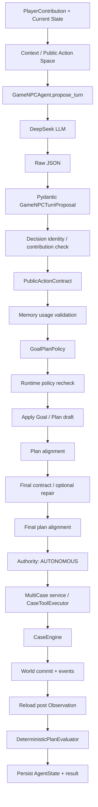

# Agent 决策机制设计

> 目标：用于 Agent 岗位面试。本文严格区分 **Agent 通用理论、项目设计意图、当前真实代码、尚未实现或证据不足的能力**。不为了套范式而把项目描述成标准 ReAct、经典 Plan-and-Execute 或反思式 Agent。

## 0. 先给结论

本项目的主决策机制是：Runtime 每个协作请求向 `GameNPCAgent` 提供公开 Observation、当前 Goal/Plan、最近计划评价、相关 Memory、玩家贡献、历史和公开 Action Space；LLM 一次性生成结构化 `GameNPCTurnProposal`，其中同时包含 Goal 更新、Plan 更新和恰好一个候选 Action。该输出只是 Proposal，不拥有执行权：它先后经过 Pydantic 解析、决策关联检查、公开 Action Contract、Memory 使用约束、Goal/Plan Policy、应用后 Plan—Decision 对齐、最终 Action Contract、Authority 和领域 Engine 校验。只有最终 Action 合法、与当前 Plan 对齐且获得权限时，Runtime 才会把它交给应用服务和 `CaseEngine`；真正执行结果再形成新 Observation 和 PlanEvaluation。

### 面试时的一句话版本

> 这是一个由持久 Goal/Plan 驱动的受控单 Agent 决策循环：LLM 基于当前 Context 生成结构化 Goal/Plan/Action Proposal，程序侧负责 Schema、行动契约、计划一致性、权限和领域规则，只有全部通过的最终 Action 才能执行并以真实 Observation 反馈到下一轮。

---

## 1. 本项目中的 Agent 决策机制是什么

一轮决策的输入是 `GameNPCAgentInput`，它汇总玩家贡献、公开案件观察、玩家视图、Authority view、当前 Goal/Plan、最近评价、Memory、pending 和有限历史。LLM 不输出任意文本命令，而是输出 `GameNPCTurnProposal`：Goal/Plan 更新草案、玩家贡献评价、沟通或 Tool 候选 Action，以及可选 Memory 使用声明。Agent 边界和 Runtime 会多次做确定性验证；需要协商或确认的 Action 先形成 `PendingActionConfirmation`，不会立即执行。世界状态只能由 `CaseToolExecutor → CaseEngine → application service commit` 改变。

---

## 2. 真正的 Agent 决策入口

### 2.1 代码入口表

| 层级 | 文件 | Class / Function | 真实作用 |
|---|---|---|---|
| Runtime 调用 Agent | `src/xuanyi_npc/application/cooperative_runtime.py` | `CooperativeRuntime.handle()` | 准备状态与 Context，调用 planning Agent，编排验证、权限和执行 |
| Agent 决策入口 | `src/xuanyi_npc/agents/game_npc.py` | `GameNPCAgent.propose_turn()` | 正式 A1 路径；请求 LLM 生成完整 turn proposal |
| 兼容决策入口 | 同上 | `GameNPCAgent.decide()` | A0 简单 action 路径；主 A1 Runtime 优先调用 `propose_turn()` |
| Context 输入 | 同上 | `GameNPCAgentInput` | 当前 turn 的结构化公开输入 |
| 请求构造 | `src/xuanyi_npc/agents/context.py` | `ContextAssembler.build_planning_request()` | 构造 messages、Action Space、contracts 和 JSON Schema |
| LLM 调用编排 | `src/xuanyi_npc/agents/bounded_output.py` | `BoundedStructuredOutput.run()` | initial 调用、一次有限格式/契约修复和 safe fallback |
| Provider 调用 | `src/xuanyi_npc/agents/deepseek.py` | `DeepSeekAdapter.complete()` | 发送 JSON-mode chat 请求并返回 `LLMResponse` |
| LLM 输出解析 | `src/xuanyi_npc/agents/game_npc.py` | `GameNPCAgent._parse_turn()` | Pydantic 解析并做第一组确定性校验 |
| Proposal Schema | `src/xuanyi_npc/domain/planning_contract.py` | `GameNPCTurnProposal` | Goal update + Plan update + Decision + optional Memory usage |
| Runtime Policy | `src/xuanyi_npc/application/goal_plan_policy.py` | `GoalPlanPolicy.validate()` | 校验 Goal/Plan 生命周期、步骤、公开引用与 Decision 对齐 |
| Action Contract | `src/xuanyi_npc/application/action_contract.py` | `PublicActionContractValidator.validate()` | 校验 Tool/arguments/target 是否属于当前公开行动面 |
| Authority | `src/xuanyi_npc/application/npc_authority.py` | `NPCAuthorityPolicy.evaluate()` | 将 Action 分为 autonomous/proposal-only/confirmation/forbidden |
| Executor 入口 | `src/xuanyi_npc/application/multicase.py` | `MultiCaseEpisodeService.submit_action_with_receipt()` | 提交最终 Action、管理 world commit 与 Memory receipt |
| Tool 翻译 | `src/xuanyi_npc/application/case_tools.py` | `CaseToolExecutor.execute()` | 解析参数，将 ToolCall 转换成领域 Command |
| 领域执行 | `src/xuanyi_npc/engine/case_engine.py` | `CaseEngine.execute()` | 验证领域前置条件，纯计算新 Session、事件与结果 |

### 2.2 真实函数级调用链

```text
ClinicService.submit_player_contribution()
  ↓
CooperativeRuntime.handle()
  ↓ 构造 GameNPCAgentInput
GameNPCAgent.propose_turn()
  ↓
ContextAssembler.build_planning_request()
  ↓
BoundedStructuredOutput.run()
  ↓
DeepSeekAdapter.complete()
  ↓ raw JSON text
GameNPCAgent._parse_turn()
  ├─ GameNPCTurnProposal.model_validate_json()
  ├─ _validate_decision_proposal()
  ├─ PublicActionContractValidator.validate()
  ├─ _validate_memory_usage()
  └─ GoalPlanPolicy.validate()
  ↓
CooperativeRuntime.handle()
  ├─ GoalPlanPolicy.validate()                 # Runtime 再验
  ├─ _apply_proposal()
  ├─ _action_matches_plan()                    # 应用后的首次对齐
  ├─ _resolve_contract()                       # 可选 action repair
  ├─ _action_matches_plan()                    # 修复后的最终对齐
  └─ NPCAuthorityPolicy.evaluate()
       ├─ pending / reject / respond
       └─ MultiCaseEpisodeService.submit_action_with_receipt()
            ↓
          CaseToolExecutor.execute()
            ↓
          CaseEngine.execute()
```

---

## 3. Agent 输入到底是什么

| 输入信息 | 真实来源 | 每轮存在 | 对决策的作用 |
|---|---|---:|---|
| 当前玩家贡献 | `PlayerContribution` | 正式协作轮是 | 待评价的建议、问题、假设、同意或拒绝，不是命令 |
| PlayerView | `AgentContextFilter.player_view()` | 是 | 提供公开玩家身份和可用能力视图 |
| Observation | `CaseObservation` | 是 | 当前公开世界事实和可用案件行动 |
| AuthorityView | `NPCAuthorityPolicy.view()` | 是 | 告诉模型哪些 Tool 属于何种权限类别 |
| Current Goal | `CooperativeAgentState.current_goal` | A1 是 | 当前阶段目标与完成条件 |
| Current Plan | `CooperativeAgentState.current_plan` | 可选 | 完整持久短计划和 active step |
| Last Plan Evaluation | `state.last_plan_evaluation` | 可选 | 上一步完成、修订、完成目标或放弃原因 |
| Environment feedback | evaluation 的 `public_summary` | 可选 | 上次公开执行/计划反馈摘要 |
| Last Decision Feedback | `state.last_decision_feedback` | 可选、一次性 | 上轮预算、模型、规划、对齐、契约、权限或 Tool 拒绝的固定公开分类；不授予权限 |
| Memory | `AgentMemoryContext` | 检索可用时 | 非权威跨案经验，只是决策依据之一 |
| History | CE-2A completed pairs | 可选 | 同 session 最近协作连续性 |
| Pending | 经 owner/revision 校验的 pending decision ID及公开投影 | 可选 | 告知待确认上下文；公开投影本身不授权 |
| Available Actions | 从 Observation 投影 | 是 | 当前可选择的 Tool、target 和精确参数形状 |
| Rules / Contracts | system prompt + 固定 contracts + JSON Schema | 是 | 约束角色、输出和 Action 形状 |

Agent 真正“决策”的依据不是单独的用户消息，而是：**当前公开世界 + 当前 Agent 意图 + 玩家贡献 + 可检索经验 + 当前可执行边界**。其中 Observation/constraints 的权威级别高于 Memory、历史和玩家信念。

---

## 4. LLM 到底负责什么

### 4.1 LLM 真实负责的部分

- 理解玩家当前公开文本，并用 `PlayerContributionEvaluation` 表达接受、部分接受、拒绝、请求证据或提出替代。
- 结合 Observation、Goal、Plan、Memory 和历史进行开放式语义判断。
- 提出 Goal 的 `KEEP/REPLACE/BLOCK/ABANDON` 更新。
- 提出 Plan 的 `KEEP/CREATE/REVISE/ABANDON` 更新；CREATE/REVISE 给出 2～4 个步骤草案。
- 选择本轮沟通能力或公开 Tool 候选，填写公开 target 和参数。
- 生成对玩家可见的 `dialogue`、解释、置信度和公共理由。
- 可声明本轮使用了哪些已选择 Memory，以及影响了 Goal/Plan/Decision 的哪个方面。

“理解用户意图”在这里不是独立 Router 分类：LLM 在完整决策中理解贡献，但 `contribution_type` 本身由请求结构提供。

### 4.2 LLM 不负责什么

| 问题 | 答案 | 代码依据 |
|---|---|---|
| 修改 World State？ | 否 | `GameNPCAgent` 只有 adapter/validator，没有 state store 或 Engine 写接口 |
| 最终判断权限？ | 否 | `NPCAuthorityPolicy.evaluate()` 在 Runtime 中执行 |
| 最终判断 Action 合法？ | 否 | Action Contract、GoalPlanPolicy、Executor 和 Engine 分层复核 |
| 批准执行？ | 否 | Runtime 根据最终对齐和 Authority 决定分支 |
| 判断 Goal 真正完成？ | 否 | `DeterministicPlanEvaluator.condition_met()` 和 Runtime 依据 Observation 判定 |
| 写数据库？ | 否 | JSON/SQLite repository 由 application/storage 层调用 |
| 调用 Engine？ | 否 | `MultiCaseEpisodeService → CaseToolExecutor → CaseEngine` |
| 判断真实执行结果？ | 否 | `EngineResult`、world commit receipt 和重读 Observation 才是事实 |
| 自行写 Memory？ | 否 | Memory/Reflection 都有来源、写入 Policy 和 repository 边界 |

---

## 5. 程序负责什么

| 能力 | LLM 负责 | 程序负责 | 原因 |
|---|---:|---:|---|
| 理解自然语言 | 是 | 结构预处理 | 开放语义适合模型，scope/类型必须确定 |
| 综合证据推理 | 是 | 提供公开事实、复核边界 | 推理开放，事实来源必须受控 |
| 选择候选行动 | 是 | 提供候选集合 | 保留自主性但限制搜索空间 |
| 生成候选参数 | 是 | 校验精确参数 | 模型可选择，不能信任格式和引用 |
| 判断 Tool 是否存在 | 否 | Schema/Contract/Executor | 必须确定性 |
| 判断 target 当前可用 | 否 | Action Contract/Engine | 与当前 Observation 和领域状态相关 |
| 维护 Goal/Plan 生命周期 | 提出更新 | 校验、应用、推进、完成 | Proposal 不能直接成为权威状态 |
| 判断 Plan 对齐 | 否 | GoalPlanPolicy + Runtime | 防止计划与行动分裂 |
| 判断权限 | 否 | Authority Policy | 权限不能由请求者自行授予 |
| 创建/消费 confirmation | 否 | Clinic + Runtime | 绑定 owner、decision、action、revision |
| Tool 执行 | 否 | Executor | 隔离副作用 |
| 修改 World State | 否 | Engine 计算、service commit | 需要领域不变量和持久化语义 |
| 判断执行结果 | 否 | Engine/receipt/post Observation | 意图不等于事实 |
| Plan 结果评估 | 否 | DeterministicPlanEvaluator | 完成条件可从公开状态确定计算 |
| 持久化和幂等 | 否 | Repository/service/operation ledger | 模型无法提供事务与 exactly-once 语义 |

### 为什么这样分工

自然语言理解、证据综合、沟通和候选策略存在歧义，适合 LLM；权限、参数集合、状态机、领域前置条件和持久化必须可重复、可测试、可审计。项目因此让模型处理“不确定性推理”，让程序控制“确定性约束与副作用”。

---

## 6. Agent 是否采用 ReAct

### 6.1 通用理论

严格 ReAct 通常在一个任务运行中交替执行：

```text
Thought / Reasoning → Action → Observation → Thought → Action → ...
```

关键不只是存在 Action 和 Observation，而是 Agent/模型在内部循环中根据刚得到的 Tool Observation 继续推理，通常还有显式或隐式 reasoning/action protocol。

### 6.2 代码检查

| ReAct 特征 | 本项目情况 |
|---|---|
| Thought 字段 | 没有；只有 explanation/public rationale，不应称为隐藏 CoT |
| 结构化 Action | 有，`AgentAction` |
| 执行后 Observation | 有，world commit 后重读 `CaseObservation` |
| 同一次请求内多步 Thought/Action 循环 | 没有 |
| 一轮连续调用多个 Tool | 没有；每回合最多一个 Action/Tool |
| 模型看到 Tool 结果后自动继续 | 不会；通常等下一次玩家协作请求 |
| 显式持久 Goal/Plan | 有，这是 ReAct 之外的重要机制 |

### 6.3 结论

**部分采用 / 类似 ReAct，但严格意义上不是标准 ReAct。**

它在跨 turn 的系统层有 `Observation → Proposal/Action → Environment Update → 下一轮 Observation` 的反馈闭环，但没有单次 Runtime 调用中的多步模型—工具循环，也没有标准 `Thought/Action/Observation` 协议。`Action → Observation → 下一次用户请求` 只能称为 ReAct-like feedback，不能据此宣称实现了 ReAct Agent。

---

## 7. Agent 是否采用 Plan-and-Execute

### 7.1 通用理论

经典 Plan-and-Execute 通常由 Planner 先为 Goal 生成完整计划，再由 Executor 按步骤执行；执行器可能是独立组件或 Agent，观察结果后由 Planner 重规划。

### 7.2 本项目符合的部分

- 有持久 `AgentGoalState`、`AgentPlan`、`PlanStep` 和 `PlanEvaluation`。
- Plan 为 2～4 步，带 active/current step、状态、建议 Tool 和完成信号。
- 每轮 Action 必须与应用后的 active PlanStep 对齐。
- Tool 执行后依据 pre/post Observation 和结果确定性推进、完成、修订或放弃 Plan。
- 下一轮模型可 `KEEP/CREATE/REVISE/ABANDON` Plan。

### 7.3 不同之处

- 没有独立 Planner Agent 与 Executor Agent；同一个 LLM 请求同时产出 Plan update 和当前 Decision。
- 不一定先一次性规划完整任务再自动跑到底，而是每个用户驱动 turn 最多执行一步。
- Plan 不是可执行脚本，也不授予 Authority。
- Runtime 会在调用 LLM 前确定性失效旧计划、完成已满足 Goal、准备下一阶段 Goal。
- 每次 Plan update 和当前 Action 是同一个 `GameNPCTurnProposal` 合同的一部分。

### 7.4 结论

本项目**包含明确的 Plan-and-Execute 机制，是持久 Plan 驱动的逐 turn 受控变体，但不是经典的独立 Planner/Executor 两阶段框架**。最准确的说法是：同一 Agent 每轮联合提出规划更新与一步行动，程序验证并执行当前步，再用确定性评价推进计划。

---

## 8. Agent 是否采用 Reflection

### 8.1 Reflection 不是“模型想了一下”

Reflection 应当以真实经历或确定性生命周期结果为证据，形成可验证的经验候选，并能影响未来决策；普通 explanation、format repair 或 PlanEvaluation 都不能自动叫 Reflection。

### 8.2 当前真实实现

项目确实存在独立 Reflection 子系统：

- 领域结构：`domain/reflection.py`、`reflection_lifecycle.py`、`reflection_memory.py`。
- Runtime 入口：`CooperativeRuntime._attach_reflection()`。
- 触发：Episode 完成、Goal 完成、Plan 放弃、Plan 第三次修订等确定性生命周期边界。
- Evidence：公开 Tool outcome、Observation delta、PlanEvaluation、玩家贡献评价、Memory usage trace 和公开 assessment。
- 生成：`ReflectionProposalGenerator` 调用 LLM 输出结构化 proposal，可做一次 schema/grounding repair。
- 验证：`ReflectionProposalValidator` 检查 evidence grounding，不能把玩家/模型话语提升为事实。
- 写入：候选还要经过 `ReflectionMemoryWritePolicy` 和 consolidation，才可能写入共享长期 Memory 并被未来 session 检索。
- 失败：post-commit failed-safe，不回滚已经提交的 world。

### 8.3 准确结论

**Reflection 机制已经真实实现并可在生产组合条件满足时接入，但它不是主决策 turn 内的即时反思循环；真实模型稳定生成可写 Reflection Memory、未来曝光及行为收益仍未充分证明。**

另外，Reflection 不只接受“成功 Tool”这一种证据，但必须发生在确定性生命周期边界，并只使用 Runtime 提供的公开、可引用 evidence。它不能根据自由聊天凭空总结事实。

---

## 9. 最准确的决策范式描述

> 这是一个单主 Agent、持久 Goal/Plan 驱动、用户请求推进的受控决策循环：每轮由 LLM 联合生成结构化规划更新和一个候选 Action，程序通过多层确定性契约与 Authority 后最多执行一步，再用权威执行结果、Observation 和 PlanEvaluation驱动下一轮；生命周期边界之后可异步式地形成受证据约束的 Reflection Memory。

不应简单说“用了 ReAct”，因为主循环不是单次调用中的多步 reasoning/tool iteration；更不应把 explanation 当 Thought。可以说它有 ReAct-like 的环境反馈，同时具有比简单 ReAct 更显式的持久 Plan、权限门和提交边界。

---

## 10. LLM 输出到底是什么

正式 A1 Schema 是 `GameNPCTurnProposal`：

| 顶层字段 | 类型 | 必填 | 含义 | 谁使用 |
|---|---|---:|---|---|
| `goal_update` | `GoalUpdateProposal` | 是 | 当前 Goal 的 keep/replace/block/abandon 草案 | GoalPlanPolicy、Runtime `_apply_proposal()` |
| `plan_update` | `PlanUpdateProposal` | 是 | 当前 Plan 的 keep/create/revise/abandon 草案 | GoalPlanPolicy、Runtime `_apply_proposal()` |
| `decision` | `GameNPCDecisionProposal` | 是 | 贡献评价、能力、单一 Action 和解释 | Runtime、Authority、Executor |
| `memory_usage` | `MemoryUsageProposal | None` | 否 | 声明引用了哪些 selected Memory 及影响 | Agent validator、Runtime attribution |

### 10.1 Goal update

- `update`：`KEEP / REPLACE / BLOCK / ABANDON`。
- `REPLACE` 必须带 `GoalDraft`：goal type、公开描述、0～100 priority、evidence requirements、completion condition。
- `BLOCK` 必须带有限 `blocked_reason`。
- LLM 不能直接把 Goal 标成 completed；完成由确定性条件判断。

### 10.2 Plan update

- `update`：`KEEP / CREATE / REVISE / ABANDON`。
- `CREATE/REVISE` 必须带 `PlanDraft`。
- `PlanDraft.steps` 必须有 2～4 个 `PlanStepDraft`。
- 每步包含 intent、capability、可选 suggested tool、可选 public target、公开摘要、可选 expected information 和 completion signal。

### 10.3 Decision

`GameNPCDecisionProposal` 包含：

- `contribution_evaluation`：存在玩家贡献时必须匹配 contribution ID。
- `capability`：沟通、调查、诊断 proposal、处置 proposal 等枚举。
- `action`：一个 `AgentAction`。
- `explanation`：公开解释。

`AgentAction` 包含 `action_id`、`RESPOND/USE_TOOL`、`dialogue`、可选 `ToolCallRequest(name, arguments)` 和 0～1 的 `confidence`。Schema 保证 RESPOND 不带 tool call，USE_TOOL 必须带 tool call。

### 10.4 为什么不是自然语言输出

自然语言无法可靠区分“解释”与“请求执行”，也无法稳定校验 Tool、参数、Goal/Plan 更新和 Memory 引用。结构化 Proposal 让系统能逐字段拒绝、修复、审计和测试，并把对玩家说的话与可能产生副作用的 Action 分开。

---

## 11. Proposal、Action 与 Execution

### Proposal

模型提交的完整候选意图，即 `GameNPCTurnProposal`。它是建议，不拥有执行权；可能被修复、拒绝或降级；生成时没有修改 World State。

### Action

Proposal 中的 `decision.action`，即一个 `AgentAction`。它可能只是 `RESPOND`，也可能携带 `ToolCallRequest`。Action 仍然是候选，并不等于已经调用 Tool。

### Execution

最终 Action 通过对齐、Contract、Authority 后，被 application service 交给 `CaseToolExecutor`，转换成领域 Command，再由 `CaseEngine` 计算并提交新 Session。只有此时才产生权威结果。

```text
LLM
  ↓
GameNPCTurnProposal
  ↓ validation / apply intent
GameNPCDecision + final AgentAction
  ↓ contract / plan / authority
Approved Action
  ↓
CaseToolExecutor → CaseEngine → world commit
```

Proposal 不等于 Tool Call：它还包括 Goal/Plan、贡献评价和沟通；其中的 Action 也可能只是响应。Proposal 更不等于执行或 State 变更。

---

## 12. Proposal 与原生 Function Calling 的区别

### 通用 Function Calling

供应商原生 Function Calling 通常让模型从 `tools` Schema 选择函数名和参数，API 返回结构化调用对象。它主要解决输出协议和函数选择，不天然解决业务权限、计划一致性和领域提交。

### 本项目的实现

本项目没有在 DeepSeek payload 中使用 `tools/tool_choice`。它把公开 Action Space 和 contracts 放进 messages，用 JSON mode + `GameNPCTurnProposal` JSON Schema 要求模型生成完整领域 Proposal，再由本地 Pydantic 和业务代码解析、批准或拒绝。

| 维度 | 原生 Function Calling | 本项目 Proposal |
|---|---|---|
| Schema 定义 | provider tool schema | 项目 Pydantic domain schema |
| 输出内容 | 通常函数名 + 参数 | Goal/Plan + 贡献评价 + Action + Memory usage |
| 解析 | SDK/provider 辅助 | 本地 `model_validate_json()` |
| 是否自动执行 | 取决于框架，容易被封装成自动执行 | 明确不会自动执行 |
| Business Policy | 不自带 | `GoalPlanPolicy` |
| 当前公开 Action 校验 | 不自带 | `PublicActionContractValidator` |
| Authority | 不自带 | `NPCAuthorityPolicy` + pending |
| 可拒绝 | 可，但需自己实现 | 主架构默认允许拒绝/修复/fallback |

### 为什么不直接用原生 Function Calling

因为本项目需要的不只是“结构化选择函数”，而是把规划意图、玩家协作、Action、权限和领域结果分开。即使改用原生 Function Calling，Plan 对齐、Action Contract、confirmation、Authority、Engine 和 commit receipt 仍必须保留。当前方案还减少 provider 绑定；代价是 Prompt/Schema 更大、结构化输出稳定性需要自己治理。

---

## 13. Proposal 生成后的真实校验链

真实代码存在两层防御，不能压缩成一条没有重复的理想链。

### 13.1 Agent 边界内部

| 顺序 | 输入 | 检查者 | 检查内容 | 失败处理 |
|---:|---|---|---|---|
| 1 | raw LLM text | Pydantic | JSON、字段、类型、枚举、model validators | 进入一次 bounded repair |
| 2 | `GameNPCTurnProposal` | `_validate_decision_proposal()` | action ID、贡献评价 ID/存在性 | 同上 |
| 3 | `decision.action` + Observation | `PublicActionContractValidator` | 当前公开 Tool、参数、target、证据引用 | 同上 |
| 4 | `memory_usage` + selected IDs | `_validate_memory_usage()` | 只能引用 selected memory，影响声明与 Proposal 一致 | 同上 |
| 5 | 完整 Proposal + current state | `GoalPlanPolicy.validate()` | Goal/Plan 生命周期、步骤、Authority view、Plan/Decision 对齐 | 同上 |

一次 repair 仍失败则 `propose_turn()` 返回确定性 safe fallback proposal，不执行工具。

### 13.2 Runtime 边界

| 顺序 | 检查/动作 | 为什么再做 | 失败处理 |
|---:|---|---|---|
| 6 | Runtime 再次 `GoalPlanPolicy.validate()` | Agent/fallback/test double 都是不可信边界 | 安全拒绝，无 Tool/world mutation |
| 7 | `_apply_proposal()` | 将已验证 Goal/Plan draft 转为带 ID/revision/status 的 AgentState | 只改变候选 Agent intent，尚未执行 world action |
| 8 | `_action_matches_plan()` | 检查 Action 与应用后的 active step | 写恢复评价并拒绝 |
| 9 | `_resolve_contract()` | 对最终 Decision 再验；必要时一次专用 action repair | 失败转安全 RESPOND |
| 10 | 修复后 `_action_matches_plan()` | 防止 repair 偷换与已应用 Plan 不一致的 Tool | 改为 truthful RESPOND 并拒绝 Tool |
| 11 | `NPCAuthorityPolicy.evaluate()` | 决定自主、proposal-only、确认或禁止 | pending/拒绝/继续 |
| 12 | Executor + Engine | 参数模型、领域上下文、技能、前置线索、session 状态 | 返回失败或拒绝提交 |

因此最准确的简图是：

```text
Raw Output
→ Schema
→ Decision Identity
→ Public Action Contract
→ Memory Usage
→ Goal/Plan Policy
→ Runtime Policy Recheck
→ Apply Plan
→ Plan Alignment
→ Final Contract/Repair
→ Final Alignment
→ Authority
→ Executor/Engine
```

---

## 14. Schema Validation 解决什么问题

项目使用 Pydantic model + provider JSON Schema：provider 被要求输出 JSON，代码用 `GameNPCTurnProposal.model_validate_json()` 解析。

Schema 能保证：字段是否存在、额外字段是否禁止、类型是否正确、枚举是否合法、Plan steps 数量是否为 2～4、`RESPOND`/`USE_TOOL` 与 `tool_call` 的结构关系、各 update 与 draft 的形状关系等。

Schema 正确绝不等于 Action 可执行。例如：

- `ToolName.GET_PLAYER_VIEW` 是合法枚举，但不属于当前公开执行 Action surface，会被 Contract 拒绝。
- `investigation_id="不存在的调查"` 在类型上是字符串，但不在当前 Observation 中。
- 合法 `execute_treatment` 仍需要玩家确认。
- 合法 Tool/target 若不等于 active PlanStep，也会被对齐检查拒绝。
- 即使上层通过，Engine 仍可能因 session 关闭、技能不足或前置线索不足而失败。

结论：**结构合法 ≠ 当前行动合法 ≠ 计划一致 ≠ 有权限 ≠ 领域执行成功。**

---

## 15. Action Contract 是什么

`PublicActionContractValidator` 约束“模型提出的 Action 是否精确属于当前公开 Action 面”。

真实规则包括：

- 调查只能使用 Observation 当前 `available_investigations` 中的 ID。
- 调查 Tool 名必须与该调查的 `CaseActionType` 匹配。
- 调查参数必须且只能是 `investigation_id`。
- 诊断只允许 `diagnosis_id` 与可选 `evidence_clue_ids`，诊断必须已开放，ID 必须是公开候选，证据必须已发现。
- 处置参数必须且只能是 `treatment_id`，且 ID 必须属于当前可用处置。
- 其他 Tool 返回 `unsupported_action`。

Pydantic Schema 检查“对象长得对不对”；Action Contract 检查“这个具体 Tool+参数+target 在当前 Observation 下是否属于公开合法行动”。它是上下文相关的业务接口契约。

---

## 16. Policy 是什么

本项目决策主链最明确的 Policy 是 `GoalPlanPolicy`。它判断的不是单纯数据结构，而是：**当前 Goal/Plan/Observation/Authority view 下，这个规划更新和 Decision 是否允许。**

它检查：

- 当前案件阶段是否允许该 Goal type。
- terminal/blocked Goal 能否 keep，Goal replace/block/abandon 与 Plan 操作是否一致。
- create/revise/keep 是否与当前 Plan 存在性匹配。
- Goal 条件和 Plan target 是否只引用公开、未过时对象。
- PlanStep 的 intent/capability/tool/target 是否相互匹配。
- Tool 是否适合当前 Goal type，且不在 forbidden authority view 中。
- 诊断/处置 PlanStep 与同轮 Decision 是否使用同一个 Tool 和 target。
- 已有可执行 active step 时，不能 plain RESPOND 后继续假装保持计划；必须执行、修订/放弃 Plan 或阻塞/放弃 Goal。

此外还有 Memory write policy、Reflection policy、diagnosis readiness policy 等，但它们属于相应子系统；不要把所有 validator 都统称为一个“Safety Policy”。

---

## 17. Authority 是什么

Authority 回答的不是“动作是否合理”，而是“NPC 在当前授权状态下有没有资格执行这个动作”。

| Action | AuthorityMode | 当前行为 |
|---|---|---|
| `RESPOND` | `AUTONOMOUS` | 可直接回复 |
| 公开普通调查 | `AUTONOMOUS` | 可执行 |
| `submit_diagnosis` | `PROPOSAL_ONLY` | 先形成 pending，匹配玩家批准后才自主执行 |
| `execute_treatment` | `CONFIRMATION_REQUIRED` | 先形成 pending，必须匹配确认 |
| 其他/缺失 Tool | `FORBIDDEN` | 拒绝 |

确认绑定 `confirmation_id + decision_id + player + case + session + 完整 action + case revision`。玩家必须提交 `APPROVAL`，引用正确 decision；Runtime 还要求本轮重新提出的 `tool_call` 与 pending action 的 `tool_call` 相同，才会把旧 decision 视为已确认。公开 pending view 不能授予权限。

### Policy 与 Authority 的区别

- Policy：这个 Goal/Plan/Action 组合在当前业务状态中是否合理、一致。
- Authority：即使合理，NPC 是否有权现在执行，还是必须先让玩家协商/确认。

一个 `execute_treatment` 可以与 Plan 完全一致、参数也合法，但仍没有 Authority，必须等待玩家确认。

---

## 18. 为什么需要 Proposal / Schema / Contract / Policy / Authority / Executor

| 层 | 本项目的核心问题 | 不能被上一层替代的原因 |
|---|---|---|
| LLM Proposal | “结合语义和证据，我建议怎样更新意图、下一步做什么？” | 需要开放式推理，但只是候选 |
| Schema | “输出对象长得对不对？” | 防止缺字段、错类型、非法枚举和形状错误 |
| Action Contract | “这个 Tool、参数和 target 是否属于当前公开行动面？” | Schema 不知道当前 Observation 中有哪些合法 ID |
| Goal/Plan Policy | “规划更新和 Action 是否与当前阶段、目标、步骤一致？” | 单个 Action 合法不代表策略/生命周期合理 |
| Plan Alignment | “最终实际要执行的 Action 是否等于已应用 active step？” | repair 可能改变 Action，必须校验最终值 |
| Authority | “NPC 现在有执行资格吗？” | 业务合理不等于获得高风险授权 |
| Executor | “如何把批准 Action 变成领域 Command？” | 隔离模型与副作用接口 |
| CaseEngine | “领域前置条件和结果到底是什么？” | 只有权威规则能产生新 Session/事件/分数 |

多层不是重复“为了安全”，而是分别回答不同问题；将它们合并到 Prompt 会失去确定性、可审计性和拒绝能力。

---

## 19. 为什么不能让 LLM 直接调用 Tool

1. 模型可能生成 Schema 中存在、但不属于当前公开 Action surface 的 Tool。
2. 参数可能缺失、多余、类型错误或引用不存在/过时 ID。
3. Action 可能违反案件阶段或领域前置条件。
4. Tool 可能与当前 active PlanStep 不一致。
5. 诊断和处置存在 Authority/玩家确认要求。
6. 处置会完成案件并产生结果和分数，属于高风险不可逆副作用。
7. 模型在生成 Proposal 时不知道执行是否成功，不能把预期写成事实。
8. 直接调用无法保证 Session revision、幂等、world-first commit 和失败恢复边界。
9. 分层 validator 和 fake adapter 可以做确定性测试；让模型直连副作用会显著降低可测性。
10. Proposal、prepared decision、result、event 和 usage 分层记录，便于审计；自由 Tool 调用难以复盘。

### 面试 2 分钟回答

> 原生 Function Calling 最多帮我把函数名和参数结构化，但不能解决当前行动是否公开、是否与持久 Plan 对齐、NPC 是否有权限、玩家确认是否仍匹配 revision，以及 Engine 是否真的执行成功。我的项目里 LLM 只输出 `GameNPCTurnProposal`，其中 Action 是候选。代码先用 Pydantic 检查结构，再用 Action Contract 检查当前公开 Tool/target，用 GoalPlanPolicy 和两次 alignment 检查计划一致性，再由 Authority 把调查、诊断、处置分成自主、proposal-only 和 confirmation-required。通过后 Executor 才把 Action 翻译成领域 Command，CaseEngine 产生真实结果，应用服务负责提交和幂等。这样开放式推理由模型完成，副作用则是可拒绝、可测试、可审计的。

---

## 20. 一次完整决策的数据流：自主调查

场景：当前 active PlanStep 是对公开调查 `inspect_incense_box` 执行 `inspect_object`；LLM 提出相同行动。



| 阶段 | 输入→输出 | 确定性 | LLM 参与 | 可拒绝 |
|---|---|---:|---:|---:|
| Context | State/Input → `LLMRequest` | 是 | 否 | 构建过大可失败 |
| Proposal | Request → raw JSON | 否 | 是 | provider 可失败 |
| Parse/Schema | JSON → typed Proposal | 是 | 否 | 是，可 repair |
| Policy/Contract | Proposal + current state → accepted candidate | 是 | 否 | 是 |
| Authority | final Action → mode | 是 | 否 | 是/pending |
| Executor | Action → Command | 是 | 否 | 是 |
| Engine | Command + State → Result | 是 | 否 | 是 |
| Commit | Result → durable world | 是但跨存储非全局事务 | 否 | 可能 uncertain |
| Feedback | pre/post Observation → PlanEvaluation | 是 | 否 | post-commit 失败进入恢复语义 |

---

## 21. 用户确认机制

```text
Validated Tool Action
  ↓
NPCAuthorityPolicy.evaluate()
  ├─ AUTONOMOUS → execute
  ├─ PROPOSAL_ONLY → PendingActionConfirmation → return to player
  ├─ CONFIRMATION_REQUIRED → PendingActionConfirmation → return to player
  └─ FORBIDDEN → reject

Later player contribution
  ↓ APPROVAL + pending_confirmation_id + responds_to_decision_id
Clinic loads current in-process pending and checks owner/revision
  ↓
Runtime verifies APPROVAL + decision + revision
  ↓
LLM makes a new turn proposal
  ↓ same tool_call as pending?
  ├─ yes → Authority treats old decision as confirmed → execute
  └─ no  → no inherited authorization; may produce a new pending
```

诊断是 `PROPOSAL_ONLY`，处置是 `CONFIRMATION_REQUIRED`；两者当前都通过 pending + 后续匹配 approval 获得执行资格。确认前 Action 不执行。pending 保存在 `ClinicService.cooperative_pending` 的进程内字典，并有锁，但不是 durable；重启后历史文本不能恢复授权。

玩家 `REJECTION` 不会通过 `_validated_pending()`，因此不产生确认。Clinic 在该轮结束后消费旧 pending；Runtime 没有独立的“执行拒绝”命令，拒绝作为新的玩家贡献供 Agent 评价并重新规划/回应。

---

## 22. Agent 如何知道 Action 成功或失败

LLM 生成 Proposal 时并不知道执行结果。Executor/Engine 返回 `ToolExecutionResult` / application result，其中包含新 session、领域 events、公开 message 和可选 score breakdown；service commit 后 Runtime 必须重读 `post_observation`。

成功时，`DeterministicPlanEvaluator` 比较 pre/post Observation、Goal condition、active step 和 `tool_succeeded=True`，推进步骤、完成 Goal 或要求修订。Tool/Engine 失败时，world 不变，evaluator 用 `tool_succeeded=False` 将步骤标记 blocked，并产生 `REVISE_PLAN / REQUESTED_TOOL_UNAVAILABLE` 等评价。对于预算、模型输出、Planning、Alignment、Action Contract、Authority 和 Tool 等主要拒绝，Runtime 还会独立保存 `last_decision_feedback`；它在 Observation revision 未变化的下一轮注入一次后清除，避免把拒绝伪装成世界变化或 Plan 执行结果。

因此：**Proposal 代表意图，Execution Result 和已提交 World State 才代表事实。** “我准备调查”或“我执行了处置”只是模型文本；没有 commit receipt 和新 Observation，不能当作成功。

---

## 23. 失败决策如何处理

| 失败类型 | 谁发现 | 同轮重试 | 是否执行 Tool | State/Observation 影响 |
|---|---|---:|---:|---|
| LLM adapter 首次调用失败 | `BoundedStructuredOutput` | 通常不修复；abort episode 错误上抛 | 否 | 使用 safe fallback 或终止；正常模型失败写公开 decision feedback，world 不变 |
| 最终 Context 超出预算 | provider adapter 的 `prepare_request()` | 不发送请求；依次尝试确定性裁剪候选 | 否 | safe fallback，并写 `budget/context_budget_exceeded` feedback |
| 非 JSON / 无法解析 | Pydantic | 最多一次格式 repair | 否，直到合法 | repair 仍失败则 safe fallback |
| Proposal Schema 错误 | Pydantic validators | 最多一次 repair | 否 | 同上 |
| action ID / contribution evaluation 不匹配 | Agent validator | 最多一次 repair | 否 | 同上 |
| Action 不在公开面/参数错误 | Agent 内 Contract | 最多一次 bounded repair；外层仍可专用 action repair | 否，直到最终合法 | 失败降级 RESPOND，并写 action-contract feedback；world 不变 |
| Goal/Plan Policy 失败 | Agent parse 或 Runtime 重检 | Agent 内可一次 repair；Runtime 重检失败不再问模型 | 否 | Runtime 返回安全拒绝并写 planning feedback；不应用非法 proposal |
| 初次 Plan alignment 失败 | Runtime | 不同轮重试；本轮不再 LLM | 否 | 写 alignment recovery evaluation 和独立 decision feedback，保存 AgentState |
| 修复后 Plan alignment 失败 | Runtime | 不再修复 | 否 | Action 改为 truthful RESPOND，返回拒绝 |
| Authority proposal/confirmation | Authority | 不是错误重试 | 否 | 保存 AgentState，返回 pending |
| Authority forbidden | Authority | 否 | 否 | 保存 AgentState 和 authority feedback；world 不变 |
| 玩家拒绝确认 | Clinic/Runtime pending validator | 否；作为新 turn 重新决策 | 否 | 旧 pending 被消费，world 不变 |
| Executor 参数错误 | `CaseToolExecutor` | 不做同轮 LLM 重试 | 否/未提交 | application result 失败；PlanEvaluator 要求修订，并写 Tool feedback |
| Engine 领域失败 | `CaseEngine` / service | 不做同轮 LLM 重试 | 命令被拒绝，无 world commit | 保存失败评价和公开 Tool feedback，下一轮重规划 |
| world commit 状态 unknown | receipt/Runtime | 明确禁止自动重放 | 不能安全断言 | operation 进入保守恢复 |
| post-commit Observation/PlanEvaluator 失败 | Runtime | 同 operation 不重放 Tool | world 已提交 | 抛 post-commit recovery error |
| Reflection 失败 | Reflection lifecycle | 自身有限修复；Runtime failed-safe | 当前 Tool 已完成 | 不回滚 world/AgentState，只记录 reflection failure |

并非所有失败都会生成新的 Observation：未执行的拒绝通常仍是旧 Observation。主要正常拒绝通过 `last_decision_feedback` 回流固定公开分类；提交不确定、存储故障和内部异常仍走系统恢复，不会原样交给模型。只有权威 world 成功提交后才会重读新的 Observation。

---

## 24. 重试机制

### 24.1 结构化输出修复

`BoundedStructuredOutput` 允许 initial model call 加最多一次 repair call。触发条件是 parser 抛出 `ValidationError` 或 `ValueError`，因此不仅覆盖 JSON/Schema，也覆盖 Agent 内 Action Contract、Memory usage 和 GoalPlanPolicy 错误。A1 initial 与 format repair 均显式使用 2048 output tokens；A0 initial/format repair 和 A0-shape action-contract repair 使用 512。第二次仍失败则返回 `output=None`，由 Agent 生成确定性 safe fallback。

每次 initial/repair 在真正发送前都会对加入完整 JSON Schema 后的最终 provider payload 重新做 tokenizer-aware 预算。History/Memory 可按确定性候选裁剪；必选内容仍超限时不发送请求，并进入安全 fallback，而不是用截断 JSON 或删除 Authority/Contract 换取调用成功。

Provider/网络类错误通常不使用同一格式 repair；标记 `abort_episode` 的预算或硬失败会直接上抛。

### 24.2 Action Contract 专用修复

Runtime `_resolve_contract()` 首次失败时可以调用 `agent.repair_action_contract()`。如果 prior 已经用了两次 LLM attempt，就不再调用模型，直接 fallback。专用 repair 使用 A0 decision schema；修复后 Runtime 再验 Contract，并重新做 Plan alignment。

### 24.3 为什么 Tool 失败不能像 JSON 错误一样立即重试

JSON 错误发生在任何副作用之前，复用同一 Context 修复是安全的。Tool/Engine 失败可能反映前置条件、技能、revision 或世界状态变化，也可能处于 commit 不确定窗口；盲目重发可能重复不可逆动作。项目因此记录真实失败、更新 PlanEvaluation，让下一 turn 基于新状态重新决策；commit unknown 则阻断重放。

---

## 25. 决策的确定性与非确定性边界

```text
Deterministic Context Assembly
          ↓
┌────────────────────────────┐
│ Non-deterministic          │
│ LLM semantic judgment      │
│ Goal/Plan/Action Proposal  │
└────────────────────────────┘
          ↓
┌────────────────────────────┐
│ Deterministic              │
│ Parse / Schema / Contract  │
│ Policy / Alignment         │
│ Authority / Executor       │
│ Engine / Commit / Evaluate │
└────────────────────────────┘
          ↓
Authoritative Result / Observation
```

非确定性主要集中于语言理解、证据权衡、候选规划、Action 选择和公开表达。Context 选择、Pydantic、Policy、Contract、Authority、领域执行、状态提交和 PlanEvaluator 都是程序逻辑；Reflection 中只有 proposal 生成是非确定性的，grounding 和写入同样确定性受限。

将两者分开能让系统利用模型的泛化能力，同时把不可逆副作用压缩到可测试的窄接口。模型可以“想错”，但不能因此自动“做错”。

---

## 26. 决策与 Plan 的关系

Agent 不是每轮自由选择任意 Tool。它可以在 Proposal 中修改 Plan，但修改必须通过 Policy；应用后，本轮 Tool Action 必须与 resulting active PlanStep 的 `suggested_tool` 和 `public_target_id` 一致。

- Plan 由模型读取：完整 `current_plan` 注入 Context。
- Policy 先检查 Proposal 自身的 Plan/Decision 对齐。
- Runtime 将合法 draft 转成持久 Plan，再检查最终 active step。
- Contract repair 可能改变 Action，因此 Runtime 必须第二次对齐。
- Tool Action 不能跳到后续 step；只与 `current_step_index` 对比。
- 模型可通过 `REVISE/ABANDON` 重新规划，但不能绕过状态机随意写 revision/status。
- 执行后由 `DeterministicPlanEvaluator` 推进步骤；模型不能宣称步骤已完成。

一个细节：`_action_matches_plan()` 对 `RESPOND` 返回 true；是否允许在可执行 active step 上只回应，主要由前面的 `GoalPlanPolicy._validate_executable_step_commitment()` 约束。专用 Action repair 若最终降级为 RESPOND，会保留已应用的 Agent intent 并安全停止 Tool，这可能需要下一轮修订，属于当前复杂边界之一。

---

## 27. 决策与 Memory 的关系

Memory 的真实路径是：

```text
Memory Store → scoped retrieval → bounded projection
→ Context → LLM Proposal → usage validation/attribution
```

Memory 不直接决定 Action，也不能直接修改 Goal/Plan 或 World State。它只是 LLM 的非权威依据之一。模型若声明使用 Memory，只能引用本轮 selected IDs；Runtime 还区分 selected、declared 和 accepted，拒绝的 Decision 不计为真实影响。

若 Memory 与当前 Observation 冲突，Projection 默认过滤；Prompt 明确要求以 authoritative world/constraints 为准。项目没有通用自然语言矛盾求解器，但即使错误 Memory 影响了模型，Action 仍需通过当前 Observation 驱动的 Contract/Policy/Engine。

---

## 28. 决策与 Observation 的关系

Agent 基于 `CaseObservation` 而不是直接访问 Environment/完整 Case：

- **权限隔离**：隐藏真相、未发现线索、正确答案和真实处置结果不进入模型。
- **信息投影**：只暴露当前角色和阶段需要的字段。
- **降低耦合**：Agent 不依赖 `CaseDefinition` 内部结构和 store。
- **可测试**：可以构造冻结 Observation 测试 Proposal、Policy 和 Contract。
- **新鲜度**：执行后从权威 world 重读，而不是相信模型或缓存的预期。

Observation 是决策事实输入，不是模型自己的记忆；它也不是 Environment 本身，而是 Environment 的最小权限公开视图。

---

## 29. Agent 是否真的“自主”

是，但属于**受约束自主性**。自主性体现在：

- 根据不同玩家贡献做接受、质疑、澄清或替代建议。
- 结合当前 Observation 和跨案 Memory选择不同调查方向。
- 创建、维持或修订 2～4 步 Plan。
- 在公开行动空间中选择具体 Tool/target，或选择只沟通。
- 根据下一轮真实 Observation 和 evaluation 调整策略。

程序没有预先写死每一句回复和每个 Tool 顺序；但它限制隐藏信息、合法 Action、Plan 对齐、Authority 和领域结果。Agent 自主不等于无限权限：**LLM 决定边界内建议做什么，程序决定这个建议能否产生副作用。**

---

## 30. 与普通 Workflow 的区别

普通 Workflow 通常预先固定分支，例如有线索就调查 A，否则回答 B。本项目中，Context Assembly、校验、权限、执行和提交是确定性 Workflow；但以下节点由 LLM 动态决定：

- 如何评价玩家观点。
- 是否保持或修改 Goal/Plan。
- 在多个公开调查/诊断/处置候选中选哪一个。
- 是执行工具、澄清、解释、挑战推理还是请求更多证据。
- 如何向玩家解释选择。

因此它最准确地说是 **Workflow + Agent Decision 的混合架构**：外层是受控状态机和执行管道，中间嵌入一个非确定性的规划/决策节点。它不是“所有流程都由 LLM 自由编排”的通用 Agent，也不是纯 if/else 脚本。

---

## 31. 核心结论的真实代码证据

### 结论：LLM 只能生成 Proposal，不能直接执行 Tool

- **代码位置**：`src/xuanyi_npc/agents/game_npc.py`
- **Class / Function**：`GameNPCAgent.propose_turn()`
- **证据说明**：返回 `GameNPCTurnProposal`；Agent 没有 state store/Engine 写接口。Tool 执行在 Runtime 后续分支。

### 结论：真实 LLM 调用有界且可修复

- **代码位置**：`src/xuanyi_npc/agents/bounded_output.py`
- **Class / Function**：`BoundedStructuredOutput.run()`
- **证据说明**：一次 initial，`ValidationError/ValueError` 时最多一次 repair，失败返回空 output 供 safe fallback。

### 结论：Proposal 使用强类型 Schema

- **代码位置**：`src/xuanyi_npc/domain/planning_contract.py`
- **Class / Function**：`GameNPCTurnProposal` 及子模型
- **证据说明**：Goal、Plan、Decision、Memory usage 均为 `extra="forbid"` Pydantic model。

### 结论：Proposal 解析后还有业务 Policy

- **代码位置**：`src/xuanyi_npc/application/goal_plan_policy.py`
- **Class / Function**：`GoalPlanPolicy.validate()`
- **证据说明**：校验阶段、生命周期、公开引用、步骤和 Plan/Decision 对齐。

### 结论：Action Contract 依赖当前 Observation

- **代码位置**：`src/xuanyi_npc/application/action_contract.py`
- **Class / Function**：`PublicActionContractValidator.validate()`
- **证据说明**：只接受当前 available investigations/diagnoses/treatments 及精确参数。

### 结论：高风险 Action 需要确认

- **代码位置**：`src/xuanyi_npc/application/npc_authority.py`
- **Class / Function**：`NPCAuthorityPolicy.evaluate()`
- **证据说明**：诊断为 proposal-only，处置为 confirmation-required，匹配 confirmed decision 才转 autonomous。

### 结论：确认是绑定对象，不是自然语言授权

- **代码位置**：`src/xuanyi_npc/domain/cooperation.py`、`application/clinic.py`、`application/cooperative_runtime.py`
- **Class / Function**：`PendingActionConfirmation`、`current_pending()`、`_validated_pending()`
- **证据说明**：绑定 owner/scope/action/revision；必须 APPROVAL 且 decision/revision 匹配。

### 结论：Executor 不让模型直接构造领域 State

- **代码位置**：`src/xuanyi_npc/application/case_tools.py`
- **Class / Function**：`CaseToolExecutor.execute()`
- **证据说明**：将批准的 `AgentAction` 解析成 `InvestigationCommand/SubmitDiagnosisCommand/ExecuteTreatmentCommand`。

### 结论：领域结果由 Engine 决定

- **代码位置**：`src/xuanyi_npc/engine/case_engine.py`
- **Class / Function**：`CaseEngine.execute()`
- **证据说明**：检查 session、技能、线索、诊断和处置前置条件，返回新 Session/events/result。

### 结论：执行反馈进入下一轮而非继续当前模型循环

- **代码位置**：`src/xuanyi_npc/application/cooperative_runtime.py`
- **Class / Function**：`CooperativeRuntime.handle()`、`DeterministicPlanEvaluator.evaluate()`
- **证据说明**：commit 后重读 Observation、更新 PlanEvaluation；没有再次调用 `propose_turn()`。

### 结论：Reflection 是 post-commit 独立链

- **代码位置**：`application/cooperative_runtime.py`、`application/reflection_lifecycle.py`
- **Class / Function**：`_attach_reflection()`、`ReflectionLifecycleService.process()`
- **证据说明**：在 world/AgentState 处理后按生命周期 trigger，失败不回滚执行。

---

## 32. 设计文档 vs 真实代码

| 能力 | 当前文档描述 | 真实实现 | 是否一致 |
|---|---|---|---|
| ReAct | README/主架构不宣称标准 ReAct；面试基线称 ReAct-like | 无单次多步 Thought/Action/Observation loop | 一致 |
| Planning | Goal/Plan proposal、对齐、执行后评价 | 已实现持久 Plan、每轮联合 plan+decision、确定性 evaluator | 一致 |
| Reflection | post-commit、evidence-grounded、可写未来 Memory；收益未证明 | 生产条件组装、trigger/validator/consolidation/receipt 已实现 | 一致 |
| Proposal | LLM 只输出结构化候选 | `GameNPCTurnProposal` | 一致 |
| Policy | Goal/Plan 生命周期和一致性 | `GoalPlanPolicy` 在 Agent 与 Runtime 双层调用 | 一致 |
| Contract | 当前公开 Action surface + bounded repair | `PublicActionContractValidator` + `_resolve_contract()` | 一致 |
| Authority | investigation autonomous、diagnosis proposal、treatment confirmation | `NPCAuthorityPolicy` 和 pending | 一致 |
| Tool 调用 | Proposal 后由 Runtime/Executor 执行 | 不使用 provider-native tools | 一致 |
| Token 预算 | 最终 provider payload 统一计数并按 History/Memory 裁剪 | `prepare_request()` 覆盖完整 Schema、framing 估算、输出预留和 safety margin | 一致；framing 仍需用 provider usage 校准 |
| 拒绝反馈 | 与 PlanEvaluation 分离的公开一次性反馈 | `last_decision_feedback` 覆盖主要正常拒绝分支 | 一致；内部/提交不确定故障不直接注入模型 |
| 验证顺序 | `PLANNING_AND_ACTION_DESIGN` 图简化为 Schema→Policy→Align→Contract | `_parse_turn()` 实际先 Contract/Memory，再 GoalPlanPolicy；Runtime 又 Policy→apply→Align→Contract→Align | **概念一致，精确函数顺序不一致/被简化** |
| Reflection 的“已实现” | README 同时声明已接入和收益不足 | 代码机制完整；真实 derived Memory/行为收益证据不足 | 一致，但面试不可说“已证明自我进化” |

没有发现 README 把项目称为标准 ReAct，也没有“模型原生 Function Calling”与代码冲突。最需要纠正的是架构图中的线性验证顺序：它适合解释职责，但不等于当前代码逐函数顺序；真实实现是 Agent 内校验加 Runtime 外层重检的双层链。

---

## 33. 当前决策机制的风险和不足

### 33.1 单次 Proposal 的合同负担仍需用真实 telemetry 评估

一个 A1 输出仍同时要求 Goal update、2～4 步 Plan、Decision、ContributionEvaluation 和可选 Memory usage，还要满足 Action Contract 与 Plan 对齐。A1 initial/format repair 现在都显式使用 2048，最终请求也有 tokenizer-aware 预算，因此旧的“repair 只有 512、容易因额度不足失败”已经解决。剩余问题是模型对复杂联合契约的语义遵循率；是否需要拆分 Planning 与 Action，必须依据 parser/repair/fallback telemetry 和真实任务质量，而不能仅凭 Schema 看起来复杂就下结论。

### 33.2 校验链重复且顺序不易推理

Agent `_parse_turn()` 已做 Contract 和 GoalPlanPolicy，Runtime 又重复 Policy、alignment、Contract 和 final alignment。这是纵深防御，但也增加职责重叠、错误分类和维护成本；当前主文档图无法精确表达实际调用顺序。

### 33.3 当前更值得处理：Plan intent 在最终执行批准前已应用

Runtime 在最终 Action Contract repair 和 Authority 前调用 `_apply_proposal()`。这不会修改 World State，但 Goal/Plan intent 可能在 Action 后续降级、pending 或 Authority 拒绝时仍被保存。新增 `last_decision_feedback` 能让下一轮知道拒绝原因，却没有改变 Plan 的提交顺序。pending 场景保留计划可能是合理语义；model/contract fallback、alignment 或 authority forbidden 时是否仍应提交新计划则需要显式定义，避免留下“计划承诺已存在但本轮动作未执行”的状态。

### 33.4 RESPOND 的最终对齐较宽

`_action_matches_plan()` 对任何 `RESPOND` 返回 true，主要依赖较早的 `GoalPlanPolicy` 防止可执行 active step 被 plain response 拖延。Action contract repair 后的 fallback RESPOND 不会再次经过完整 GoalPlanPolicy，只做 final alignment，因此可能安全停止但保留未推进的可执行步骤。

### 33.5 pending 不是 durable authority

pending 只在当前进程内；重启后不会恢复授权。这是安全的 fail-closed 选择，但用户需要重新协商，且不适合多实例部署。

### 33.6 置信度目前主要是模型自报

`AgentAction.confidence` 有 0～1 Schema 约束，但没有 calibration policy，也不直接参与 Authority 或执行门槛。它更像可观测字段，不能当成可靠风险分数。

### 33.7 不是自动连续任务执行器

每个协作请求最多执行一个 Tool，通常等待玩家下一次输入。对游戏协作和高风险确认这是合理选择，但不能对外宣称能在一个请求中自主执行长计划。

---

## 34. 最终面试回答版

### 34.1 30 秒：“你的 Agent 是怎么做决策的？”

> Runtime 每轮把公开 Observation、当前 Goal/Plan、最近评价、相关 Memory、玩家贡献和公开 Action Space 组装给 `GameNPCAgent`。LLM 输出结构化 `GameNPCTurnProposal`，同时提出规划更新和一个候选 Action。程序随后做 Pydantic、Action Contract、Memory 引用、Goal/Plan Policy、两次 Plan 对齐和 Authority 检查；调查可自主执行，诊断和处置要先协商或确认。最终由 Executor 和 CaseEngine 产生真实结果，再以 Observation 和 PlanEvaluation 进入下一轮。

### 34.2 2 分钟回答

> 我的决策链分成模型候选层和确定性执行层。Runtime 先从权威状态生成不含隐藏信息的 Observation，恢复当前 Goal/Plan，检索限量 Memory，再构造 `GameNPCAgentInput`。LLM 不直接调用环境，而是一次性输出 `GameNPCTurnProposal`：Goal update、Plan update、对玩家贡献的评价，以及一个 RESPOND 或 USE_TOOL Action。
>
> 模型输出后，第一层用 Pydantic 和本地 validator 检查 JSON、字段、枚举、Action ID、当前公开 Tool/target、Memory 引用和 Goal/Plan 规则；错误最多做一次有界修复，再失败就降级成不执行 Tool 的安全响应。Runtime 还会重新校验 Goal/Plan，把合法 draft 变成带 revision 的 AgentState，检查 Action 是否与 active step 一致，对最终 Action 再做 Contract 和修复后对齐。
>
> 之后 Authority 决定能否执行：普通调查自主，诊断只是 proposal，处置必须确认。通过后 `CaseToolExecutor` 把 Action 翻译成领域 Command，`CaseEngine` 决定新 Session、事件和结果；提交后 Runtime 重读 Observation，用确定性 PlanEvaluator 推进或修订计划。这个设计让 LLM 负责不确定的语义推理，让程序负责权限、合法性和副作用。

### 34.3 “你这个项目用的是 ReAct 吗？”

> 严格意义上不是。它有跨 turn 的 Observation→Action→环境反馈闭环，所以具有 ReAct-like 特征，但一次 Runtime 调用只让模型生成一个 Proposal、最多执行一个 Tool，不会在内部继续 Thought→Action→Observation 多步循环，也没有标准 ReAct 协议。更准确地说，它是持久 Plan 驱动的受控逐 turn Agent。

### 34.4 “为什么不用 LLM 直接 Function Calling？”

> Function Calling 只能把函数名和参数结构化，不能替我判断 Action 是否属于当前公开面、是否与 Plan 对齐、是否获得玩家授权、Engine 前置条件是否满足、world 是否真正提交。当前 JSON Proposal 还同时包含 Goal/Plan 和玩家协作评价。即使用原生 Function Calling，Policy、Authority、Executor 和 Engine 仍必须保留；当前方案选择 provider-neutral 的本地域合同，代价是需要自己治理结构化输出稳定性。

### 34.5 “LLM 和程序分别负责什么？”

> LLM 负责理解玩家、综合公开证据、提出 Goal/Plan 更新、选择候选行动和解释；程序负责决定可见信息、解析 Schema、校验 Action 与 Plan、判断权限、执行 Tool、提交世界、判定真实结果和持久化。模型可以提议，不能裁定自己的提议合法，也不能把“准备执行”写成“已经成功”。

### 34.6 白板版：8 个框

```text
[1 State + Player Input]
        ↓
[2 Observation / Context]
        ↓
[3 LLM Structured Proposal]
        ↓
[4 Schema + Contract]
        ↓
[5 Goal/Plan Policy + Alignment]
        ↓
[6 Authority / Confirmation]
        ↓
[7 Executor + CaseEngine + Commit]
        ↓
[8 New Observation + PlanEvaluation]
```

在第 3 与第 4 框之间画一条“最多一次 repair → safe fallback”；在第 6 框画 pending 回到玩家；第 8 框箭头返回第 1/2 框表示下一 turn。

---

## 35. 高频面试追问（28 题）

### Q1：你的 Agent 属于哪种范式？

- **考察点**：是否会准确归类。
- **推荐回答**：持久 Plan 驱动、逐 turn 单步执行的受控 Agent；ReAct-like feedback，Plan-and-Execute 变体，外加 post-commit Reflection。
- **代码依据**：`CooperativeRuntime.handle()`、`GameNPCAgent.propose_turn()`、`DeterministicPlanEvaluator`。

### Q2：为什么不是标准 ReAct？

- **考察点**：Action/Observation 是否被滥用成标签。
- **推荐回答**：没有单次请求内多步 Thought/Action/Observation 循环；执行后不自动再调用 LLM，而是等待下一 turn。
- **代码依据**：Runtime 每次只调用一次 `propose_turn()`，执行后直接返回 result。

### Q3：与 Plan-and-Execute 的关系？

- **考察点**：Planner/Executor 分离理解。
- **推荐回答**：有持久 Plan 和逐步执行/评价，但同一 LLM 联合输出 Plan update 与当前 Decision，不是两个独立 Agent。
- **代码依据**：`GameNPCTurnProposal`、`_apply_proposal()`、`PlanEvaluator`。

### Q4：为什么需要 Proposal？

- **考察点**：模型和副作用隔离。
- **推荐回答**：把模型输出定义成可拒绝候选；没有通过程序边界前不产生 world change。
- **代码依据**：`propose_turn()` 与 Runtime 执行分离。

### Q5：Proposal 和 Action 有什么区别？

- **考察点**：领域对象层次。
- **推荐回答**：Proposal 包含 Goal/Plan/Memory usage/Decision；Action 只是 Decision 内一个 RESPOND 或 Tool 候选。
- **代码依据**：`GameNPCTurnProposal`、`GameNPCDecisionProposal`、`AgentAction`。

### Q6：Proposal 和 Execution 有什么区别？

- **考察点**：意图与事实。
- **推荐回答**：Proposal 不改变 world；Execution 是批准 Action 经 Executor/Engine 和 commit 后产生权威结果。
- **代码依据**：`CaseToolExecutor.execute()`、`submit_action_with_receipt()`。

### Q7：Proposal 和 Function Calling 有什么区别？

- **考察点**：协议与业务审批。
- **推荐回答**：原生调用主要描述函数/参数；本项目 Proposal 还含规划与协作，并显式经过 Policy/Authority，不使用 provider `tools`。
- **代码依据**：DeepSeek `_chat_payload()`、`GameNPCTurnProposal`。

### Q8：Pydantic 能保证 Action 合法吗？

- **考察点**：结构与语义区别。
- **推荐回答**：只能保证形状和枚举；当前 target、计划一致性、权限和领域前置条件由后续层判断。
- **代码依据**：`PublicActionContractValidator`、`GoalPlanPolicy`、`NPCAuthorityPolicy`、`CaseEngine`。

### Q9：Contract 和 Policy 有什么区别？

- **考察点**：职责分层。
- **推荐回答**：Contract 验证具体 Tool/arguments/target 是否在当前公开接口；Policy 验证 Goal/Plan 生命周期和 Decision 是否与策略状态一致。
- **代码依据**：`action_contract.py` vs `goal_plan_policy.py`。

### Q10：Policy 和 Authority 有什么区别？

- **考察点**：合理性与权限。
- **推荐回答**：Policy 回答“当前状态下是否合理”；Authority 回答“NPC 是否有权现在执行”。合法治疗仍需确认。
- **代码依据**：`GoalPlanPolicy.validate()`、`NPCAuthorityPolicy.evaluate()`。

### Q11：为什么要两次 Plan alignment？

- **考察点**：repair 后 TOCTOU/偷换 Action。
- **推荐回答**：首次检查应用后的 Proposal；Action Contract repair 可能替换 Action，所以 Authority 前必须对最终 Action 再查一次。
- **代码依据**：Runtime lines around `_resolve_contract()` 前后两次 `_action_matches_plan()`。

### Q12：为什么 Runtime 还要重复 GoalPlanPolicy？

- **考察点**：信任边界。
- **推荐回答**：Agent 实现、safe fallback 和 test double 都不能被 Runtime 默认信任；执行边界应独立守住不变量。
- **代码依据**：`handle()` 调用 `agent.propose_turn()` 后再次 `goal_plan_policy.validate()`。

### Q13：JSON 输出失败怎么办？

- **考察点**：bounded retry。
- **推荐回答**：Pydantic 抛错后最多一次 repair；仍失败用确定性 safe fallback，不循环调用。
- **代码依据**：`BoundedStructuredOutput.run()`、`_fallback_turn_proposal()`。

### Q14：Tool 参数错误怎么办？

- **考察点**：修复与执行隔离。
- **推荐回答**：在执行前被 Contract 捕获；可有限修复，仍失败转 RESPOND，绝不把错误参数交给 Engine。
- **代码依据**：`_parse_turn()`、`_resolve_contract()`。

### Q15：Tool 失败后为什么不自动重试？

- **考察点**：副作用和新状态。
- **推荐回答**：Tool 失败可能是领域条件或提交不确定，重发可能重复副作用；记录评价，下一 turn 基于权威状态重决策。
- **代码依据**：`world_commit_status == "unknown"` 阻断、失败分支 `PlanEvaluator`。

### Q16：Agent 怎么知道执行成功？

- **考察点**：事实回流。
- **推荐回答**：不相信模型文本；以 service receipt、EngineResult、重读 post Observation 和 PlanEvaluation 为准。
- **代码依据**：Runtime 成功分支。

### Q17：什么 Action 需要确认？

- **考察点**：风险分级。
- **推荐回答**：调查自主；诊断 proposal-only；处置 confirmation-required。匹配 approval 后才能执行。
- **代码依据**：`NPCAuthorityPolicy.evaluate()`。

### Q18：用户随便说“我同意”可以授权吗？

- **考察点**：结构化授权。
- **推荐回答**：不可以；要 APPROVAL、pending ID、decision ID、owner/scope/revision 和相同 tool call 全部匹配。
- **代码依据**：Clinic `current_pending()`、Runtime `_validated_pending()` 和 pending action comparison。

### Q19：pending 重启后还有效吗？

- **考察点**：durability 边界。
- **推荐回答**：无效；完整 pending 当前仅进程内。历史公开投影不能恢复授权。
- **代码依据**：`ClinicService.cooperative_pending` 字典和 CE-2A 规则。

### Q20：Plan 能直接执行吗？

- **考察点**：意图与权限。
- **推荐回答**：不能；PlanStep 不是 ToolCall/授权令牌，本轮还要生成 matching Action 并过 Contract/Authority。
- **代码依据**：`PlanStepDraft`、Runtime alignment 与 Authority。

### Q21：模型能跳过 Plan step 吗？

- **考察点**：计划约束强度。
- **推荐回答**：Tool Action 必须匹配 current step；要改变方向必须合法 revise/abandon Plan，不能直接执行后续 target。
- **代码依据**：`_action_matches_plan()`。

### Q22：Memory 会直接触发 Action 吗？

- **考察点**：检索与控制混淆。
- **推荐回答**：不会；Memory 只是 Context 中非权威依据，Proposal 仍走全部校验。
- **代码依据**：Memory retrieval → `GameNPCAgentInput`，无 Executor 引用 Memory 的路径。

### Q23：错误 Memory 会污染世界吗？

- **考察点**：纵深防御。
- **推荐回答**：可能影响模型候选，但冲突默认过滤，当前 Observation 优先；最终 Action 还受 Contract/Policy/Engine 限制，Memory 不能直接写 world。
- **代码依据**：Memory projection policy、M2 prompt、Runtime validators。

### Q24：Reflection 是每轮自我纠错吗？

- **考察点**：概念准确性。
- **推荐回答**：不是。它在确定性 lifecycle boundary 后基于公开 evidence 生成经验候选，经过验证才可能写未来 Memory。
- **代码依据**：`_attach_reflection()`、`ReflectionLifecycleService`。

### Q25：为什么不用纯 Workflow？

- **考察点**：LLM 的必要性。
- **推荐回答**：玩家自然语言、证据解释、候选路径和沟通无法穷举；LLM 动态提出策略，外层仍用 workflow 控制副作用。
- **代码依据**：LLM 产出 contribution evaluation、Goal/Plan 和 Action；Runtime 负责固定管线。

### Q26：为什么不用 LangGraph？

- **考察点**：框架取舍。
- **推荐回答**：当前核心是一个主 Agent、单 turn 一个模型节点和确定性领域状态机，手写 Runtime 能精确控制 commit、pending、repair 和 recovery。若未来需要复杂分支、并行 Agent 或 durable graph checkpoints，再评估 LangGraph。
- **代码依据**：`CooperativeRuntime.handle()` 已显式表达有限状态与边界；项目无 LangGraph 依赖。

### Q27：Agent 自主性体现在哪里？

- **考察点**：约束是否等于非 Agent。
- **推荐回答**：模型动态理解贡献、维护计划、选择公开候选和沟通策略；程序只限定合法/授权执行边界。
- **代码依据**：`GameNPCTurnProposal` 的多个开放选择字段。

### Q28：当前决策链最需要改进什么？

- **考察点**：工程反思。
- **推荐回答**：优先明确 Plan intent 的提交语义：先在 candidate state 校验最终 Action，再决定成功、合法 RESPOND、pending、fallback 或拒绝分别是否提交 Goal/Plan。联合 Proposal 是否拆分则先看 repair/fallback telemetry；当前 token budget 和 A1 repair 额度已不是主要缺口。
- **代码依据**：A1 schema、最终 payload budget、Agent/Runtime 重复校验、`_apply_proposal()` 位于 final contract/authority 之前。

---

## 36. 理解检查：答不上来就没有真正理解决策机制

1. `GameNPCAgent.propose_turn()` 返回的对象为什么不能直接叫“已执行 Action”？
2. A1 Proposal 顶层四个字段是什么，哪个可选？
3. Pydantic、Action Contract、GoalPlanPolicy 和 Authority 分别回答什么问题？
4. `_parse_turn()` 中真实校验顺序是什么？Runtime 为什么还要再验？
5. 为什么有初次 Plan alignment 和 repair 后 final alignment？
6. 诊断与处置的 AuthorityMode 有什么不同，实际又如何获得批准？
7. 玩家一句自然语言“同意”为什么不能授权 Tool？
8. LLM 能否把 Goal 标记为 completed？真正由谁判定完成？
9. 一个 Schema 完全正确的 Tool Action，至少还有哪四层可能拒绝它？
10. JSON/Policy 错误与 Engine/commit 错误为什么不能采用同样的重试？
11. 为什么本项目只能称为 ReAct-like，而不是标准 ReAct？
12. 它符合 Plan-and-Execute 的哪些特征，又缺少哪种经典分离？
13. Reflection 在何时触发，为什么不等于每轮自我反思？
14. Proposal、Execution Result、Observation 三者中谁能证明世界发生了变化？
15. 当前结构化决策最大的稳定性和状态一致性风险分别是什么？

---

## 37. 概念收口

### Agent

读取受限 Context、维护 Goal/Plan、调用 LLM 形成候选决策，并受 Runtime 边界约束的主决策组件；本项目正式主 Agent 是 `GameNPCAgent`。

### LLM

Agent 内负责开放式语义理解、规划草案、候选 Action 和表达的非确定性模型；没有执行权。

### Decision

把最终 `GameNPCDecisionProposal` 包装上 decision/turn ID、attempt、fallback、Plan 关联和 usage 的本轮候选决策记录。

### Proposal

LLM 提出的、可验证可拒绝的完整候选；A1 中是 `GameNPCTurnProposal`。

### Action

Proposal 内本轮唯一的 `AgentAction`，可能是回复，也可能是带 ToolCall 的候选行动。

### Action Contract

基于当前 Observation 校验 Tool、参数和公开 target 是否精确合法的上下文契约。

### Policy

验证 Goal/Plan 生命周期、步骤、公开引用和 Decision 是否符合当前业务状态的确定性规则。

### Authority

判定 NPC 对最终 Action 是可自主执行、只能提议、需要确认还是禁止的权限层。

### Executor

把已批准 `AgentAction` 解析为领域 Command，并把执行交给 `CaseEngine` 的确定性适配层。

### Tool

Agent 可请求的受限能力名称与参数协议；它是领域 Command 的上层接口，不是模型可直接运行的任意函数。

### Execution Result

Executor/Engine 和提交层产生的真实 session、events、message、receipt 与错误；它描述事实结果，而非模型预期。

### Observation

从当前权威 State 重新投影出的公开只读世界视图，是下一轮决策的事实输入。

### 完整关系

```text
Observation + Goal/Plan + Memory + Player Input
  → Agent 组装 Context
  → LLM 生成 Proposal
  → Proposal 中包含 Decision / Action
  → Schema + Action Contract + Policy + Plan Alignment
  → Authority
  → Executor 将批准 Action 变成 Tool/Domain Command
  → CaseEngine 产生 Execution Result
  → commit 后生成新 Observation
  → 下一 turn 再决策；生命周期边界可触发 Reflection
```

一句话记忆：**LLM 提议，Policy 判断是否合理，Authority 判断是否有权，Executor 负责落地，Engine 决定结果，Observation 把事实带回下一轮。**
