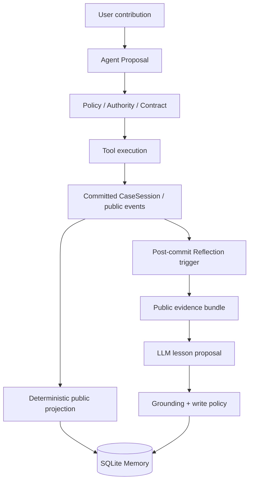
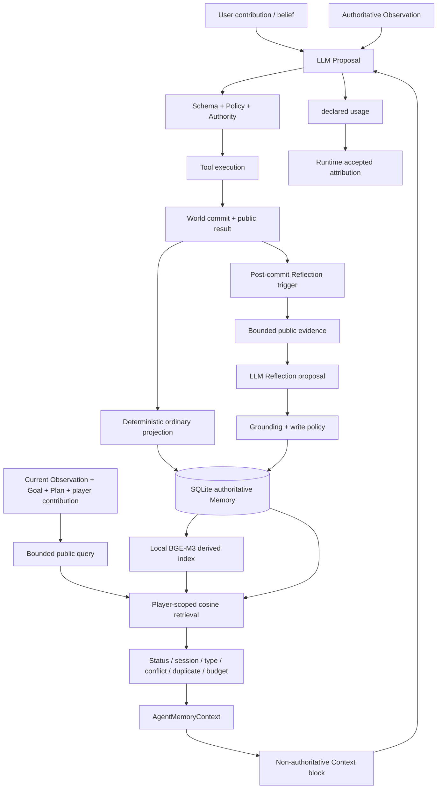

# Agent Memory 系统设计

> 面试口径：本文基于当前工作区真实代码、测试与冻结评测证据。必须始终区分四层：通用理论、设计意图、当前实现、尚未证明的能力。
>
> 最重要边界：案件 `World State / CaseSessionState` 是当前世界事实源；Memory 是从已提交公开经历派生的、可检索但非权威的历史经验。Memory 不能创建事实、授予权限或绕过 Action/Policy/Authority。

## 0. 先给结论

本项目没有把“聊天记录”包装成 Memory。生产 Memory 是一个按玩家隔离、跨 Session 持久化的 SQLite 经验层：普通路径只从已提交的调查、诊断提交和处置结果做确定性投影；Reflection 路径允许 LLM 提出可复用 lesson，但必须经过封闭证据校验、写入策略和同一存储合同，才会落成 `episodic` 或 `learning` 记录。每轮由 Runtime 在 Agent 决策前构造公开查询、做 BGE-M3 embedding 和精确余弦检索，再经过状态、权限、冲突、重复、条数和字符预算过滤，作为非权威 `AgentMemoryContext` 注入 Prompt。系统还能审计 `candidate → selected → declared → accepted`，但这种外部归因不是对模型内部因果的证明。

---

## 一、本项目为什么需要 Memory

### 1.1 没有 Memory 会怎样

本项目的一个病例 Session 内，当前 Observation、Goal、Plan 和协作历史足以支撑局部连续性；真正缺失的是**跨 Session 的经验迁移**。没有长期 Memory 时，新 Session 只能看到当前案件和有限同会话历史，无法主动召回过去公开发生过的相似调查、已提交假设、处置结果或经验证的 Reflection lesson。

需要避免两个夸大：

- 当前没有独立的“用户偏好画像”“角色关系记忆”，所以不能声称已经解决长期偏好或关系演化。
- 当前也没有证明 Memory 稳定减少重复错误或提高任务成功率；这是目标与可测试假设，不是现有结论。

### 1.2 本项目 Memory 主要解决什么

1. 把已经提交的公开经历转换成可审计、可失效、跨 Session 可恢复的经验记录。
2. 在新一轮决策前按当前案件、Goal、Plan step 和玩家贡献检索少量相关经验，避免把全部历史塞进 Prompt。
3. 用 player scope、current-session exclusion、公共投影和 World-first 冲突规则，防止历史经验越权成为当前事实。
4. 为 Reflection 提供一个受控的长期落点，并用使用 Trace 区分“检索到”“模型声明使用”和“最终决策接受”。

### 1.3 面试时的一句话版本

> 我的项目把 Memory 设计成跨 Session 的非权威经验层：普通记忆只从已提交的公开执行结果确定性投影，Reflection 经验要经过证据校验后才能写入；后续回合按玩家作用域做向量检索和安全过滤，再以有界上下文影响 Proposal，但最终事实、权限和执行仍由 World State 与确定性 Runtime 决定。

---

## 二、所有 Memory 相关模块盘点

| 模块 | 文件路径 | Class / Function | 作用 |
|---|---|---|---|
| 基础类型 | [`domain/memory.py`](../../src/xuanyi_npc/domain/memory.py) | `MemoryType`, `MemoryEvent` | 定义通用枚举；注意枚举有 5 种不等于生产都可写 |
| 权威 Memory 合同 | [`memory/contracts.py`](../../src/xuanyi_npc/memory/contracts.py) | `VerifiedMemorySource`, `AuthoritativeMemoryRecord`, lifecycle models | 来源回执、记录、哈希、状态、纠正/失效/删除合同 |
| 普通投影器 | [`memory/projection.py`](../../src/xuanyi_npc/memory/projection.py) | `CommittedActionPublicViewBuilder`, `DeterministicMemoryProjector` | 从已提交公开事件确定性生成 Memory；不调用 LLM |
| 普通写入编排 | [`application/memory_coordination.py`](../../src/xuanyi_npc/application/memory_coordination.py) | `V1MemoryCoordinator.commit_engine_result()` | World 先提交，再投影 Memory；失败标记 pending |
| 持久化 Store | [`storage/sqlite_memory.py`](../../src/xuanyi_npc/storage/sqlite_memory.py) | `SQLiteMemoryRepository` | SQLite 记录、receipt、embedding、lifecycle、tombstone、Reflection receipt |
| 向量与检索合同 | [`memory/embeddings.py`](../../src/xuanyi_npc/memory/embeddings.py) | `DerivedEmbeddingRecord`, `MemoryRetrievalConfig` | embedding、索引状态、hit/result Schema |
| 索引/检索器 | [`application/memory_retrieval.py`](../../src/xuanyi_npc/application/memory_retrieval.py) | `MemoryIndexService`, `BasicCosineMemoryRetriever` | 建索引、完整性检查、精确余弦排序、Top-K |
| Query 与 Memory Filter | [`application/game_npc_memory.py`](../../src/xuanyi_npc/application/game_npc_memory.py) | `GameNPCMemoryQueryBuilder`, `GameNPCMemoryProjectionPolicy`, `GameNPCMemoryRetrievalService` | 公开查询、scope、冲突/重复/预算过滤、安全投影 |
| Agent 可见结构 | [`domain/cooperative_memory.py`](../../src/xuanyi_npc/domain/cooperative_memory.py) | `AgentMemoryItem`, `AgentMemoryContext`, `MemoryUsageTrace` | 单轮只读上下文与使用归因 |
| Context 注入 | [`agents/context.py`](../../src/xuanyi_npc/agents/context.py) | `ContextAssembler.build_planning_request()` | 以 `HISTORICAL_NON_AUTHORITATIVE_CONTEXT` 注入并参与最终 token 裁剪 |
| 使用声明校验 | [`agents/game_npc.py`](../../src/xuanyi_npc/agents/game_npc.py) | `_validate_memory_usage()` | 只允许声明最终实际保留、已 selected 的 ID |
| Runtime 编排 | [`application/cooperative_runtime.py`](../../src/xuanyi_npc/application/cooperative_runtime.py) | `_retrieve_memory_context()`, `_accepted_memory_trace()`, `_finalize_decision_memory_trace()`, `_attach_reflection()` | 决策前读、决策后归因、提交后 Reflection |
| Reflection 生成 | [`application/reflection.py`](../../src/xuanyi_npc/application/reflection.py) | evidence builder / generator / validator | 从公开结果生成结构化提案，一次修复，封闭证据校验 |
| Reflection Writer | [`application/reflection_memory.py`](../../src/xuanyi_npc/application/reflection_memory.py) | candidate builder / write policy / consolidation | 候选规范化、规则过滤、写同一 repository、建索引 |
| Reflection 生命周期 | [`application/reflection_lifecycle.py`](../../src/xuanyi_npc/application/reflection_lifecycle.py) | `ReflectionLifecycleService` | pre-LLM claim、幂等 replay、`no_write`/pending/failure 记录 |
| 生产组装 | [`clinic/server.py`](../../src/xuanyi_npc/clinic/server.py) | `build_production_memory()`, `build_production_reflection()` | SQLite + 本地 BGE-M3 + 检索/写入/Reflection 组合与启动对账 |
| Conversation History | [`storage/sqlite_cooperation.py`](../../src/xuanyi_npc/storage/sqlite_cooperation.py) | `SQLiteCooperativeHistoryRepository` | CE-2A 同 Session 回合日志；明确不是语义 Memory Store |

当前项目不存在独立的 `MemoryWriter` 类；“Writer”是普通路径 `V1MemoryCoordinator + DeterministicMemoryProjector + SQLiteMemoryRepository` 和 Reflection 路径 `ReflectionMemoryConsolidationService` 的职责组合。当前也不存在独立 user/profile、relationship、task-memory、forget/decay、ANN vector database 或 memory reranker 模块。

---

## 三、本项目到底有哪些类型的 Memory

### 3.1 按真实生产能力分类

| 理论类型 | 项目真实名称 | 保存内容 | 生命周期 | 持久化 |
|---|---|---|---|---:|
| Turn 内 working view | `AgentMemoryContext` | 本轮选中的最多 4 条安全投影和检索诊断 | 当前 Agent 请求；下轮重新检索 | 否 |
| 同 Session 历史 | CE-2A cooperative history / `recent_messages` | 已完成玩家/NPC 回合内容 | 同会话可恢复并按窗口进入 Context | 是，但不属于 Memory repository |
| 长期 episodic | `MemoryType.EPISODIC` | 调查经历、已提交诊断假设、case-experience 型 Reflection lesson | 跨 Session，直到纠正/失效/硬删除 | 是 |
| 长期 learning | `MemoryType.LEARNING` | 公开处置结果、learning-pattern 型 Reflection lesson | 跨 Session，直到纠正/失效/硬删除 | 是 |
| Reflection-derived | `StructuredExperiencePublicPayload`，最终仍落为 episodic/learning | 通过验证的可复用公开 lesson | 与长期 Memory 相同 | 是 |
| User/Profile | 无 | 无专用画像字段/Store | 未实现 | 否 |
| Relationship | 枚举存在，生产合同禁止 | `MemoryType.RELATIONSHIP` 仅为未启用通用枚举 | 未实现 | 否 |
| Commitment | 枚举存在，生产合同禁止 | 无 | 未实现 | 否 |
| 独立 Reflection Memory | 枚举存在，生产合同禁止 | 无独立 `REFLECTION` record/store | 未实现 | 否 |
| Task Memory | 无独立类型 | Goal/Plan 在 `CooperativeAgentState`，不是 Memory | 不适用 | 否 |

关键代码证据：`AuthoritativeMemoryRecord.verify_authoritative_shape()` 只允许 `EPISODIC` 与 `LEARNING`，且强制 `relationship_impacts` 为空。Reflection 的 `proposed_memory_type` 也只允许这两种。

### 3.2 面试表述

不要回答“五类 Memory”。正确回答是：**生产可持久化、可检索的长期 Memory 有两类：episodic 和 learning；Reflection 是来源/生成机制，不是第三个存储类型；Turn 内只有临时的 Memory view，没有正式独立 ShortTermMemory Store。**

---

## 四、Short-term Memory 到底是什么

### 4.1 当前没有正式 `ShortTermMemory`

代码中没有 `ShortTermMemory` 类、scratchpad repository 或按重要性写入的短期记忆池。承担“短期连续性”的其实是三个不同对象：

| 对象 | 存什么 | 保存位置 | 生命周期 | 是否直接进 Context |
|---|---|---|---|---:|
| `AgentMemoryContext` | 本轮从长期库选中的安全 Memory view | Runtime/AgentInput 内存对象 | 一个 turn | 是 |
| CE-2A History | 同 Session 已完成回合、生命周期与结果日志 | `cooperative_history.sqlite3` | 跨进程、同 Session；Context 取有界历史 | 是，作为历史块 |
| `CooperativeAgentState` | 当前 Goal、Plan、Plan evaluation、revision、feedback | Agent state repository | Session 级并持久化 | 是，作为当前意图/状态 |

因此：

- Turn 结束后，`AgentMemoryContext` 本身不保存；长期记录仍在 SQLite，下轮重新检索。
- Conversation History 会保留，但它是按时间顺序的日志，不经过 Memory 语义检索。
- Agent State 说明“Agent 当前在做什么”，不是“过去学到了什么”。

---

## 五、Long-term Memory 到底是什么

长期 Memory 是 `SQLiteMemoryRepository` 中的 `AuthoritativeMemoryRecord` 加其 `VerifiedMemorySource`。它保存：

- 已提交调查及新公开线索的经历；
- 玩家提交过的公开诊断假设及其公开证据——注意只记录“提交过”，不把正确性固化；
- 已执行处置及其公开可观察结果；
- 通过 Reflection evidence/写入策略的 case experience 或 learning pattern；
- 来源 Session、事件类型/序号/revision、哈希、projection version、write reason、状态和 supersede 关系。

它不保存 raw hidden truth、CoT、任意用户主张、未执行 Proposal、失败 Tool 的“成功经验”、长期用户画像或关系变化。数据库为 `state_dir/memories.sqlite3`；记录跨 Session、跨进程重启保留，启动时从 committed Session 对账普通投影并重建/补齐索引。

---

## 六、Memory 数据结构

### 6.1 权威记录 `AuthoritativeMemoryRecord`

| 字段 | 类型 | 含义 | 谁写入 | 谁使用 |
|---|---|---|---|---|
| `memory_id` | Identifier | player + source + projection 的稳定 ID | 程序哈希 | 幂等、读取、Trace |
| `player_id` | Identifier | 所有者 scope | 可信源 | 所有查询/变更隔离 |
| `memory_type` | episodic/learning | 生产长期类型 | 确定性 projector；Reflection 仅提议后受限映射 | type filter、Prompt |
| `content` | text | 公开规范化摘要 | 普通路径程序渲染；Reflection 路径来自已验证 lesson 后规范化 | embedding、Agent 安全摘要 fallback |
| `importance` | 1..5 | 事件类型对应的规则分值 | 程序固定赋值 | 仅派生 Prompt confidence；不参与当前排序 |
| `related_case_id` | optional ID | 来源案件 | public payload | 元数据/语义文档 |
| `related_entity_ids` | set | action/clue/type/reason/lesson 等稳定 ID | 程序 | 索引文档/审计 |
| `relationship_impacts` | tuple | 通用合同保留位 | 当前强制空 | 当前不用 |
| `occurred_at` | UTC time | 来源发生时间 | committed event 或 Reflection clock | Prompt 展示、审计；不做 recency rank |
| `source_*` | IDs/type/sequence/revision | 完整来源链 | 可信程序 | 对账、隔离、验证 |
| `projection_version/ordinal` | version/int | 投影版本和同源序号 | projector | 稳定 ID、迁移、receipt |
| `write_reason` | enum | 为什么允许写 | projector | 审计 |
| `public_payload_hash` | SHA-256 | 公共来源完整性 | 程序 | 冲突检测 |
| `content_hash` | SHA-256 | 规范化内容完整性 | 程序 | embedding 过期检查 |
| `status` | active/superseded/invalidated | 生命周期 | repository lifecycle API | active filter |
| `supersedes_memory_id` | optional ID | 纠正链 | correction API | 版本追踪 |

### 6.2 来源回执 `VerifiedMemorySource`

它保存稳定 `source_event_id`、player/session、source type、sequence/revision、projection identity、发生时间、严格判别联合 `public_payload` 和 hash。普通记录的 `content` 不是原始事件 dump，而是从这个 allowlisted 公共 payload 重算出来。

### 6.3 派生向量 `DerivedEmbeddingRecord`

字段为 `memory_id/player_id/embedding_space_id/content_hash/dimension/vector/l2_norm/generated_at`。向量是可重建派生数据，不是权威 Memory；`content_hash` 不匹配即 stale，索引不完整时检索 fail closed。

### 6.4 Agent 可见 `AgentMemoryItem`

只暴露 `memory_id/type/public_summary/source_type/source_episode_id/source_case_id/relevance_score/confidence/reason_code/occurred_at/last_verified_at/conflict flag`。它不是数据库原记录，也不含 hidden payload、relationship impacts 或可执行指令。

---

## 七、Memory 从哪里来



普通 Memory 的直接来源只有 allowlist 中已提交的：

1. `InvestigationCompletedEvent`；
2. `DiagnosisSubmittedEvent`；
3. `TreatmentExecutedEvent`。

Reflection Memory 的来源是已提交后的公开 evidence bundle，包括 Goal/Plan/evaluation、最终 Decision、Tool outcome、Observation delta、玩家贡献及其评价、Memory usage trace、episode assessment。用户输入或 Agent Proposal 可以成为 evidence，但单独不能证明世界事实；写入策略要求至少一个权威结果类证据。

---

## 八、什么信息可以写入 Memory

| 候选信息 | 是否写 | 真实判断依据 |
|---|---:|---|
| 用户普通闲聊 | 否 | 无普通 Memory projector；History 可记录但不等于 Memory |
| 用户说“门已打开” | 否（不能当事实） | 玩家贡献是 belief；无 committed event 就不能成为普通事实投影 |
| 成功提交的调查 | 是 | event allowlist + committed action 一致性校验 |
| 提交的诊断 | 是，但写成“提交过的假设” | 不写 `diagnosis_correct`，避免假设固化为真相 |
| 成功执行处置及公开结果 | 是 | committed `TreatmentExecutedEvent` |
| Tool Proposal 尚未执行 | 否 | Proposal ≠ experience |
| Tool 被拒绝或执行失败 | 不写普通成功经验 | 没有成功 committed allowlist event；失败可进入 Runtime feedback/evidence，但不会伪造成功 |
| Agent 自己的推测 | 否 | 普通路径确定性；Reflection 需闭集证据验证 |
| 用户长期偏好 | 否 | 当前无 profile/preference schema 与 writer |
| 角色关系变化 | 否 | 生产合同禁止 relationship memory |
| 合法 Reflection lesson | 可能 | 中/高 confidence、≥2 refs、含权威结果证据、scope/安全/重复等检查均通过 |

不是每句话、每轮都写。普通写入只发生在受控 Tool 成功产生 committed event 后；Reflection 也只在特定 lifecycle boundary 触发，并允许正常 `no_write`。

---

## 九、Memory Writer 怎么工作

### 9.1 普通 Writer：不调用 LLM

触发点在 `MultiCaseService` 成功得到 `EngineResult` 后：

```text
EngineResult(events, new session)
→ V1MemoryCoordinator.commit_engine_result()
→ validate transition
→ save CaseSession first
→ DeterministicMemoryProjector.project_committed_event()
→ SQLiteMemoryRepository.write_projection()
→ MemoryIndexService.index_player()
```

程序负责全部来源 allowlist、公开视图、内容模板、importance、hash、ID、事务和索引。LLM 不参与普通 Memory 摘要或打分。

### 9.2 Reflection Writer：LLM 只提议

```text
Post-commit lifecycle boundary
→ public evidence bundle
→ LLM ReflectionProposal (最多一次 repair)
→ closed-world grounding validator
→ deterministic candidate renderer
→ ReflectionMemoryWritePolicy
→ shared SQLite repository
→ shared index
```

LLM 可以提出 finding/lesson、scope、confidence 和目标 memory type；程序决定证据是否合法、是否值得写、如何生成稳定 ID/来源记录、是否重复/冲突、是否真正持久化。Findings 本身不会自动写入。

---

## 十、Memory 评分是谁做的

当前不存在统一 `memory_score`。

| 分数 | 谁计算 | 何时 | 用途 | 影响写入/排序/遗忘 |
|---|---|---|---|---|
| `importance` | 确定性规则 | 投影时 | 调查=2、诊断=3、处置=4；structured experience=3/4 | 不决定普通写入；不参与排序；不触发遗忘 |
| `similarity/relevance_score` | embedding + 精确 cosine | 每次检索 | 阈值过滤与排序 | 影响检索；不改存储 |
| Agent-visible `confidence` | 规则 `min(1, .55 + importance*.08)` | 安全投影时 | 告诉模型历史记录可信程度；冲突时上限 .35 | 不参与排序/写入/遗忘 |
| Reflection `confidence` | LLM 枚举提议，程序校验 | Reflection 生成时 | LOW 直接拒写，MEDIUM/HIGH 才继续 | 影响 Reflection 写入资格 |

生产检索并没有 `similarity + importance + recency` 的混合公式，也没有 access count、utility、time decay 或 reranker。

---

## 十一、LLM 能不能随便写 Memory

不能。普通 Memory 完全是确定性投影；Reflection 是：

```text
LLM output
→ JSON/Pydantic parse
→ exact evidence-ref resolution
→ lesson-type grounding validation
→ scope validation
→ canonical rendering/fingerprint
→ write-policy validation
→ deterministic projection
→ repository transaction
```

Reflection 最多初次生成加一次 repair，仍不合法则空 fallback；LOW confidence、证据不足、没有权威 outcome、用户 belief 冒充事实、未 accepted 的 memory helpfulness、scope 过宽、内容过短、显式冲突、重复、owner 不匹配都会拒绝。这样避免把幻觉或推测永久化并在未来检索中自我强化。

---

## 十二、Memory 和真实执行结果的关系

`Proposal ≠ Experience`。普通写入器要求事件与 committed `CaseSessionState.action_history` 的 sequence、timestamp、action identity、public evidence 一致；处置的 hidden correctness、score 和内部 outcome 不序列化。被拒绝、未授权或尚未执行的 Proposal 不产生 ordinary Memory。

Reflection 必须在 World/Agent 状态提交后触发。可写 lesson 至少要有两个 evidence refs，且至少包含 Tool outcome、Observation delta、Plan evaluation 或 Assessment 之一。原因是计划只表达意图；只有执行后的公开结果或确定性评价才提供学习信号。否则系统会把“准备做 A”循环强化成“A 有效”。

---

## 十三、Memory Store

### 13.1 真实实现

- 存储：SQLite，默认 `state_dir/memories.sqlite3`。
- Repository：`SQLiteMemoryRepository`。
- 不是外部向量数据库；authoritative rows 与 float32 embedding BLOB 共存于 SQLite，Python 中做 exact cosine。
- 以 `player_id` 隔离；记录保留 `source_session_id`，但检索会排除当前 Session。
- 没有 NPC scope 字段，因为当前产品组合是按 player 维护这套 Game NPC 经验；不能声称支持多 NPC 私有记忆。

| 操作 | Function | 作用 |
|---|---|---|
| Add/idempotent write | `write_projection()` | 校验 deterministic projection，同事务写 receipt + memory |
| Get | `get_memory()` | player-scoped 单条读取 |
| List | `list_memories()` | player-scoped，支持 active-only |
| Vector write/rebuild | `write_embeddings()` / `replace_embeddings_for_space()` | 写派生向量或原子重建一个空间 |
| Search | `BasicCosineMemoryRetriever._retrieve()` | active rows + vectors做 exact cosine |
| Correct | `correct_memory()` | 新建 replacement，旧记录标 `SUPERSEDED`，删除旧向量 |
| Invalidate | `invalidate_memory()` | 标 `INVALIDATED`，删除向量，保留审计记录 |
| Hard delete | `hard_delete_memory()` | 删除内容与纠正链，保留无内容 tombstone 防止重建复活 |
| Reflection receipt | `claim_reflection_trigger()` / `complete_reflection_trigger()` | pre-LLM 幂等与跨重启 replay |

SQLite 内单次 repository 写操作使用事务；但 World JSON、Memory SQLite、Agent State、History 之间没有全局原子事务，系统靠 world-first、pending 状态、稳定 ID、幂等与启动对账恢复。

---

## 十四、Memory Retriever

### 14.1 何时、谁触发

每个协作 turn 开始，`CooperativeRuntime.handle()` 在构造 `GameNPCAgentInput`、调用 Agent 之前调用 `_retrieve_memory_context()`。不是等用户显式说“回忆一下”，也不是由 LLM 自己发起 Tool call。

### 14.2 Query 是什么

`GameNPCMemoryQueryBuilder` 以确定性 JSON 组合：

- 必保留：case id/title/status/revision、current Goal、current Plan 的 active step、当前 player contribution；
- 有空间才加入：synopsis、patient public profile、最近 3 条线索、前 3 个调查、2 个诊断、2 个处置、last plan evaluation；
- 最大 2000 字符，不调用 LLM 摘要，只使用公开信息。

---

## 十五、Memory 如何检索

```text
Public bounded query
→ local BGE-M3 embedding
→ player-scoped active Memory + current-session exclusion
→ same embedding-space vectors
→ exact cosine similarity
→ min_similarity=0.35
→ similarity descending, memory_id tie-break
→ top_k=8 candidates
```

生产 embedding 为本地 BGE-M3，模型目录、manifest hash、dimension 和 `embedding_space_id` 都校验。SQLite 只是向量持久化，不提供 ANN；代码逐条计算 cosine。`retrieve_conservative_scoped()` 和 V2 representation 合同存在，但生产 `build_production_memory()` 当前接的是 V1 `MemoryRetrievalConfig(top_k=8, min_similarity=.35)`。

---

## 十六、Memory 检索排序

真实公式只有：

```text
cosine(q, m) = sum(q_i * m_i) / (||q|| * ||m||)
```

低于阈值删除；其余按 `(-similarity, memory_id)` 稳定排序并截 Top-K。importance、recency、confidence、access count、write reason 都不参与排序。V2 conservative retriever 可以额外要求 top-1 与 top-2 的 minimum margin，但生产链当前未启用它。

---

## 十七、Memory 过滤

检索结果不会全部进入 Context，真实过滤链为：

1. Repository 只读当前 player 的 active records；
2. 只允许 episodic/learning；
3. 在相似度前排除 current session；
4. 校验 embedding space、dimension、content hash 和索引完整性；
5. similarity ≥ 0.35，最多 8 个 internal hits；
6. Projection 再校验 player/source owner、active、tombstone、current session、type；
7. 与当前 Observation 冲突默认过滤；
8. `public_summary` 规范化精确去重；
9. 投影 `min_relevance=.05`（在生产 .35 后通常是防御性复核）；
10. 最多 4 条、摘要总计最多 900 字符；
11. Context 全局 token budget 还可从最低 relevance 开始继续裁剪。

所以 `candidate_ids`、projection 的 `selected_ids` 与真正保留到 provider payload 的 `retained_memory_ids` 可能不同。

---

## 十八、Memory 怎么进入 Context

```text
SQLite records/vectors
→ GameNPCMemoryRetrievalService.retrieve()
→ AgentMemoryContext
→ GameNPCAgentInput.memory_context
→ ContextAssembler.build_planning_request()
→ HISTORICAL_NON_AUTHORITATIVE_CONTEXT_memory_context
→ final tokenizer-aware budget
→ LLM
```

Memory 以完整 `AgentMemoryContext.model_dump_json()` 注入，包含每条的公开摘要、类型、来源类型、source episode/case、相似度、规则 confidence、occurred/verified time、冲突标记，以及检索/索引诊断。默认 projection 最多 4 条、900 字符；之后还受整请求 token budget 约束。Prompt 明确说它不是当前事实、不能证明诊断/处置正确、不能公开 hidden target、不能授权 Tool、不能直接修改 Goal/Plan。

---

## 十九、Memory 到底怎么影响决策

### 19.1 机制案例

没有历史处置经验时，Agent 只能根据当前 Observation、Goal、Plan 和 action space 排序合法方案。有一条相似案件的公开 learning memory 时，Prompt 多出例如“过去某类公开处置产生了某公开结果”的非权威证据；模型可据此调整 Goal/Plan、合法 Tool 优先级或说明方式，但仍必须选择当前 action space 中合法 action，并通过后续验证与 Authority。

### 19.2 证据分层

- 单元/集成测试用 deterministic/scripted Agent 证明 Memory 能改变 Plan、Goal 或合法 Tool priority，并证明无关/冲突 Memory 不应改变行为。
- E10 真实模型跨 Session pilot 证明 persisted → indexed → retrieved → selected → Agent-input exposure；模型没有声明使用，因此未到 accepted。
- 后续 V2.1 M1 真实运行中已经出现 selected、declared 和 Runtime accepted IDs，说明真实模型能走完外部使用归因链。
- 但 V2.1 六个有效 M 配对中 M0、M1 都是 6/6 strict success；M1 成本平均更高，提交时序有变化，却没有观察到任务成功收益。因此不能说“Memory 已被严格证明提升成功率”。

---

## 二十、Memory Use Validation

模型在 `MemoryUsageProposal` 中返回 `used_memory_ids`、`influence_types`、五种 affected flags 和 `public_effect_summary`。验证分三层：

1. `GameNPCAgent._validate_memory_usage()`：ID 必须在 selected 且仍被最终 token budget 保留；相关 flag 必须和 Proposal 形状一致。
2. Runtime `_accepted_memory_trace()`：Goal/Plan 只有真实接受变更才计 accepted。
3. Runtime `_finalize_decision_memory_trace()`：Decision、Tool priority、communication 只有最终合法 Decision 仍匹配原 Proposal 才计 accepted；后续拒绝则清空 accepted。

`MemoryUsageTrace` 保存 candidate/selected/declared/accepted/rejected。它证明的是**可审计外部归因**，不是读取模型隐状态的因果证明；accepted 也不等于 Memory 对任务有益。

---

## 二十一、错误 Memory 怎么办

- **Correction**：通过 trusted lifecycle boundary 生成 replacement；原记录改为 `SUPERSEDED`，replacement 用 `supersedes_memory_id` 建链，旧向量删除。
- **Invalidation**：原记录保留但改为 `INVALIDATED`，向量删除，后续 active-only 检索不可见。
- **Hard delete**：删除目标及其 correction descendants 的内容、source receipt 和向量，保留不含原内容的 tombstone，阻止启动对账重新生成。

保留失效/纠正审计的价值是可追溯和幂等；真正有删除义务时再 hard delete。当前这些是 repository capability 与测试覆盖，未发现面向终端用户的 Web 管理入口，不能说用户可在产品界面自行纠错。

---

## 二十二、Memory 更新与冲突

系统不会用同 ID 静默覆盖内容：同一 source key 与不同 payload/hash 会报 projection conflict。显式 correction 保留旧版本并创建新版本；invalidation 不创建替代。检索期还会把 Memory payload 与当前 Observation 做有限、确定性的冲突检测，默认不选入。

未实现的部分：没有通用语义矛盾检测器，也不会自动判断两个自然语言 Memory 哪个更可信；Reflection 的 `conflicting_memory_ids` 参数存在，但 Runtime 当前调用 consolidation 时没有传入自动发现的冲突集。因此复杂跨记录冲突仍需可信 lifecycle 操作或未来的冲突治理。

---

## 二十三、Memory 与 World State 冲突怎么办

**World State / 当前 Observation 优先。** `GAME_NPC_M2_PLANNING_PROMPT` 明确把 Memory 标为 non-authoritative；Projection 对可识别冲突默认过滤，即使允许带冲突项，也会降 confidence 并加“不能作为当前事实”的文字。Memory 不能改变 `CaseSessionState`、公开 hidden target、增加 Authority 或直接执行 Tool。

面试回答：

> Memory 是历史经验和检索提示，World State 是当前事实。两者冲突时我让当前 Observation 胜出；Memory 最多被过滤或作为低置信历史对照，任何状态改变仍必须通过合法 Action 和 Environment commit。

---

## 二十四、Memory 与 Observation 的区别

| 对比项 | Observation | Memory |
|---|---|---|
| 时间 | 当前 Session 当前 revision | 过去 Session 的经历 |
| 来源 | World/Case State 的公开投影 | committed public event 或验证后的 Reflection lesson |
| 权威性 | 当前事实权威输入 | 非权威辅助经验 |
| 持久化 | 来源 World State 持久化 | 独立 SQLite Memory 持久化 |
| 检索 | 不需要语义召回，Runtime 直接读取 | embedding + scope + cosine + filter |
| Context 位置 | `AUTHORITATIVE_WORLD_case_observation` | `HISTORICAL_NON_AUTHORITATIVE_CONTEXT_memory_context` |
| 能否授权 | 仍需 Authority/Policy | 不能 |

---

## 二十五、Memory 与 Agent State 的区别

Memory 不属于 `CooperativeAgentState` 的物理存储。Agent State 保存当前 episode goal、current goal、current plan、last evaluation、revision 和 feedback，回答“Agent 当前在做什么”；Memory 保存跨 Session 的过去经历/lesson，回答“过去发生过什么或沉淀了什么”。Runtime 同时读取二者来构造 Query/Context，但 State 可被当前回合合法更新，Memory 只能走专用 Writer/lifecycle。

---

## 二十六、Memory 与 Conversation History 的区别

| 对比项 | CE-2A History | Memory |
|---|---|---|
| 内容 | 原始/结构化回合 request、contribution、decision、result | 筛选后的公开经历或 lesson |
| 顺序 | 同 Session 时间序 | 跨 Session 语义检索 |
| 写入 | 回合生命周期 journal | committed event / validated Reflection |
| Context | 有界近期历史或结构化 snapshot | Top-K 后最多 4 条安全投影 |
| 权威性 | 历史话语非权威 | 历史经验非权威 |
| 存储 | 独立 cooperation SQLite | memories SQLite |

所以“保存聊天记录”只解决可恢复历史，不等于具备 Memory 的选择、结构化、向量检索、生命周期和未来使用归因。

---

## 二十七、Memory 与 RAG 的关系

二者都可抽象成 `Query → Retrieval → Context → LLM`，但语料和治理不同。标准 RAG 常检索外部文档知识；本项目检索的是该玩家过去已提交的公开经历及 Reflection lesson，带 source session、lifecycle、owner、current-session exclusion 和 usage trace。项目没有通用文档摄取、chunking、citation QA 或外部知识库，因此不应说“实现了标准 RAG”；更准确是“用 RAG 式检索实现 Agent episodic/learning memory”。

---

## 二十八、Memory 是否需要向量数据库

当前不需要外部 Qdrant/FAISS/Pinecone。数据按 player scope 过滤后规模有限，SQLite 保存向量，Python exact cosine 易于审计、稳定 tie-break、事务处理和测试。代价是 O(N) 扫描、无 ANN、无高并发水平扩展；当单玩家 active Memory 达到较大规模、延迟或并发成为瓶颈时，再迁移到支持 metadata pre-filter 的向量索引更合理。迁移时 SQLite 权威 record/receipt 仍应保留，向量库只做可重建派生索引。

---

## 二十九、Reflection 是什么

本项目的 Reflection 不是“再让 LLM 想一遍”，而是一个 post-commit、evidence-grounded 的经验候选生成生命周期：

```text
Committed experience
→ deterministic lifecycle trigger + persistent claim
→ bounded public evidence bundle
→ LLM structured ReflectionProposal
→ schema/grounding validation (最多一次 repair)
→ reusable lesson candidate
→ write policy
→ episodic/learning Memory
→ index
→ future-session retrieval
```

### 29.1 何时触发

`ReflectionTriggerType` 枚举定义了 7 种可能类型，但 `CooperativeRuntime._attach_reflection()` 当前自动触发的只有 4 种：

- episode completed；
- goal completed；
- plan abandoned；
- plan repeatedly revised（代码条件是 revision == 3 且本轮发生 revise）。

`GOAL_BLOCKED`、`SAFETY_OR_AUTHORITY_BLOCK`、`EVALUATION_OUTCOME_AVAILABLE` 有领域合同/测试用途，但当前 Runtime 没有自动分支触发，面试不能说 7 种都已生产接入。

### 29.2 输入、输出与保存

输入是 public evidence refs，不是 raw hidden truth；输出是 findings 和最多 5 个 lesson proposals。Candidate builder 最多取 3 个，单次最多写 3 条。Findings 只用于反思结果，不自动持久化；只有 reusable lesson 通过 validator 和 write policy 才保存。生产仅在 `npc_mode=llm` 且 `memory_mode=semantic` 时装配 Reflection，并复用 Agent 的 LLM adapter、Memory repository 和 index service。

---

## 三十、Reflection 与普通 Memory 的区别

| 对比项 | Ordinary Experience Memory | Reflection |
|---|---|---|
| 内容 | 发生过什么：调查、提交假设、执行处置及公开结果 | 从已发生证据中提出可复用 lesson |
| 来源 | committed allowlisted event | 多类 public evidence bundle |
| 抽象程度 | 事件级 | 有 bounded applicability scope 的经验归纳 |
| 写入时机 | 每次成功 mutating Tool commit 后 | 特定 post-commit lifecycle boundary |
| LLM | 不参与 | 生成 proposal/confidence/scope，但不直接写 |
| 最终类型 | episodic/learning | 仍映射为 episodic/learning |
| 未来作用 | 提供过去公开经历 | 提供验证后的经验模式 |

例如普通 Memory 可记“过去案件执行过某处置，公开结果为……”。Reflection 可以提议“在相似公开症状和相同 Goal 类型下，应先核对某类证据再选择处置”，但只有真实 outcome/assessment/plan evaluation 支撑且 scope 有界时才可写。

---

## 三十一、Reflection 为什么必须基于真实结果

若依据未执行计划直接总结“A 是好策略”，模型会把自己的意图当训练信号，形成自证循环。项目把 Reflection 放在提交后，并要求 lesson 至少两个证据引用和至少一个权威结果类引用；outcome lesson 还需 Tool outcome/Observation delta/Assessment，planning lesson 需 Plan/Step 加 Plan evaluation。即便这样，公开 outcome 也只支持有限、非因果表述；确定性 renderer 会避免无证据地宣称“因为 A 所以成功”。

---

## 三十二、Memory 是否会遗忘

当前没有完整主动遗忘机制：没有 TTL、时间衰减、基于访问次数/importance 的淘汰、自动 archive 或定期 prune。已有的是显式 lifecycle：correction、invalidation、hard delete/tombstone。它们是纠错/删除，不是自主遗忘。

---

## 三十三、Memory 数量不断增长怎么办

当前只控制 **Context 增长**，没有解决 **Store 增长**：

- query 最大 2000 字符；
- retrieval top_k=8；
- projection 最多 4 条/900 字符；
- final token budget 可继续移除低 relevance Memory；
- active-only、current-session、type、conflict 和重复过滤减少曝光。

但 SQLite 内 active records 仍会增长，exact cosine 仍是 O(N)，也没有自动归档/压缩/淘汰。因此长期运行要补 retention policy、按规模分区/ANN、语义近重复合并和可审计清理；这些是未来扩展，不是当前能力。

---

## 三十四、Memory 去重

当前有三层去重：

1. 普通投影的稳定 source event ID + projection version/ordinal，使同一 committed event 重放幂等；
2. Repository 对同 source key/record 做 idempotent write，不同 payload/hash 则冲突而非覆盖；
3. Reflection candidate 用 canonical fingerprint 去同提案重复，write policy 对同 type 的规范化完全相同 content 做精确重复跳过；Context projection 也按 normalized summary 去重。

未实现语义近重复检测。不同 Session 中语义相同但文字不同的事件会保留独立记录，这对 episodic provenance 有合理性，但对 learning memories 会带来冗余风险。

---

## 三十五、Memory 来源可信度

系统没有一个统一数值化“source credibility”模型，而是用来源合同分级治理：

| 来源 | 可信边界 | 能否直接成为长期事实经验 |
|---|---|---:|
| committed World event | 与 action history 对齐后的公开发生事实 | 是 |
| Tool public result / Observation delta | 已执行后的公开结果 | 可支撑 Reflection |
| User statement | 玩家信念/贡献，不是世界事实 | 否，除非后续执行/评价证实 |
| Agent Proposal/dialogue | 意图或话语 | 否 |
| LLM Reflection | 候选归纳 | 仅通过证据与策略后 |

因此用户说“门已经打开了”不能直接记成“门已打开”。它最多作为 `PLAYER_BELIEF`/contribution 参与当前决策；只有 Environment 提交对应状态变化或提供公开证据，才能形成事实来源。

---

## 三十六、Memory 污染防护

| 风险 | 状态 | 真实机制与剩余边界 |
|---|---|---|
| LLM 幻觉直接写普通 Memory | 已解决 | 普通 writer 完全确定性，只接 committed allowlist event |
| 用户错误陈述写成世界事实 | 已解决（普通路径）/部分解决（Reflection） | belief 不能直接投影；Reflection 有 evidence/write policy，但自然语言 grounding 仍非形式化事实证明 |
| Tool 失败写成成功经历 | 已解决 | 只有 committed success event 进入普通投影；Proposal/拒绝不写 |
| inactive Memory 继续检索 | 已解决 | active-only join/list；纠正/失效删除向量；tombstone 防复活 |
| 当前 World 与历史冲突 | 部分解决 | 同 case 的 investigation/diagnosis 未发现 clue 冲突可检测；treatment/structured 或一般语义矛盾无通用检测 |
| Reflection 总结错误经验 | 部分解决 | closed-world refs、类型规则、LOW 拒写、belief/helpfulness 防护；LLM 中/高 confidence 不是可靠性证明，真实质量未充分评测 |
| 语义重复造成自我强化 | 部分解决 | stable ID/精确文本去重；无 semantic near-duplicate consolidation |

---

## 三十七、Memory 与权限 / 隐私

Repository 的读写、embedding、lifecycle 均要求 `player_id`；Retriever 在相似度计算前只取当前 player，投影再核验 memory/source owner，并排除 current session。这样可防另一玩家的高相似 bait 进入当前 Agent。

边界：这是应用层 player isolation，不是公网身份认证、数据库 row-level security 或完整多租户安全证明；没有 `npc_id` scope，也没有字段级隐私分级。公开 projection 避免 hidden case truth，但若未来加入用户敏感画像，需要单独的 consent、retention、export/delete 和加密治理。

---

## 三十八、Memory 持久化和恢复

正常链路支持：

```text
SQLite write + embedding
→ shutdown
→ repository.initialize()
→ reconcile every committed CaseSession
→ index every known player
→ reconcile Reflection index-pending receipts
→ future turn retrieve
```

普通 Memory 可从 committed world action history 重新投影，stable IDs 保证幂等；embedding 是派生数据，可按 content hash 重建。Reflection receipt 在 LLM 前持久 claim，terminal result 可跨进程 replay，不重复调用 LLM/写入；index pending 可后续对账。若 semantic 启动对账仍 pending，生产启动显式失败，不静默降级成 fake memory。

---

## 三十九、Memory 写失败怎么办

### 39.1 普通写入

`V1MemoryCoordinator` 先保存 World Session，再逐事件投影。Memory 失败返回 `memory_projection_pending`，已提交 World 不回滚；index 失败标 `index_pending`。请求 receipt 暴露 status/error，启动时按 committed session 重放并补索引。

### 39.2 Reflection

Reflection 在 World/Agent commit 后执行；generation、validation、repository、index 或 receipt 失败都不回滚 turn。结果以 `failed_safe`、`repository_failure`、`index_pending` 或合法 `no_write` 记录。

Memory 写失败和 World 写失败严重程度不同：World 是当前事实源，提交不确定意味着不知道 Action 是否真实生效，必须停止/恢复；Memory 是可从已提交 World 重建的派生经验，丢失会影响未来辅助质量，但不应篡改已经发生的事实。

---

## 四十、Memory 与 Runtime 的关系

Runtime 不是 Memory Store，它是时序编排者：

- turn 开始读取 Observation/Agent State 后调用 retrieval；
- 把 `AgentMemoryContext` 交给 Agent/ContextAssembler；
- 验证模型声明并在最终 Decision 后形成 usage trace；
- Tool commit 通过 MultiCase/Coordinator 触发 ordinary write/index；
- post-commit 判断 Reflection trigger 并传入结果证据；
- Memory/Reflection 故障转换为可观察、fail-safe 状态。

Memory 模块负责“存、找、过滤、生命周期”；Runtime 负责“什么时候读、什么时候写、写失败如何不污染主流程”。

---

## 四十一、Memory 与 Context Engineering 的关系

```text
Long-term Store
→ retrieval candidates
→ Memory projection selected set
→ final tokenizer-aware context budget
→ provider payload
```

Memory 系统解决“哪些经历可保存、如何索引与召回”；Context Engineering 决定“这一轮哪些 selected items 真正进入最终请求、放在什么标签下、预算不够时先裁什么”。因此 selected 不一定等于 retained，模型也不能声明已经被全局预算移除的 Memory。

---

## 四十二、Memory 与决策机制的关系

Memory 经 Context 影响 LLM 的 Goal/Plan/Decision Proposal，但没有批准权：

- 不能修改 World State；
- 不能让 hidden action 公开；
- 不能绕过 Schema/Alignment/Policy/Authority；
- 不能替 Agent 直接执行 Tool；
- 即使模型声明使用，最终 Decision 被修复/拒绝时 usage 也不会 accepted。

这使“经验建议”和“执行控制”分层。

---

## 四十三、Memory 与 Plan 的关系

Query 显式包含 current Goal、完整 Plan 中的 active step 和 last evaluation，因此检索会围绕当前计划阶段；Memory Context 与当前 Plan 一起进入 Planning Prompt。模型可以在 `MemoryUsageProposal` 中声明 `affected_plan`，但必须同时提出非 KEEP 的 plan update，Runtime 还要确认 Plan 实际改变才接受归因。

现有测试证明 scripted/deterministic 场景中 relevant Memory 能改变 Plan；生产代码没有一个确定性“看到失败经验就跳过某 step”的规则，也没有 Memory 直接推进 plan index。是否调整 Plan仍由 LLM 提议并受合同校验。

---

## 四十四、Memory 测试

本次专项执行了文件名包含 `memory` 或 `reflection` 的 25 个测试文件，共 **206 passed**。代表性覆盖如下：

| 测试类型 | 是否存在 | 验证内容 |
|---|---:|---|
| 普通写入/投影 | 是 | allowlist、公开字段、hidden truth 不泄漏、确定性内容 |
| Repository CRUD/事务 | 是 | round-trip、幂等、冲突、rollback、player isolation |
| 检索/Top-K | 是 | cosine、threshold、稳定 tie-break、scope、space/dimension/hash |
| 安全投影/过滤 | 是 | current session、inactive、tombstone、重复、字符预算、冲突 |
| 持久化/重启 | 是 | write/index 后重启、启动对账、schema migration |
| 失效/纠正/删除 | 是 | supersede、invalidate、tombstone、防重建复活 |
| Runtime 使用归因 | 是 | selected/declared/accepted、拒绝清空、Authority 不可绕过 |
| Reflection | 是 | trigger、grounding、repair/fallback、policy、write/index、receipt replay |
| Reflection 行为 A/B | 是 | scripted derived lesson 改变合法 Tool priority；拒绝候选不污染未来 |
| 真实评测入口合同 | 是 | paid confirmation、freeze identity；不是实际模型收益测试本身 |

测试通过证明实现合同，不等于真实模型长期学习效果。

---

## 四十五、如何证明 Memory 真的工作

### Level 1：能保存

已证明。Repository、projection、重启和 lifecycle 测试覆盖；E9/E10 也有真实跨 Session 持久化记录。

### Level 2：能检索并进入 Agent

已证明。集成测试覆盖检索/过滤/Context；E10 真实 Agent pilot 证明 Session B candidate、selected、Agent-input exposure。

### Level 3：影响未来决策

证据是分层而非“一句已证明”：

- **机制级已证明**：scripted/deterministic A/B 能让 Memory 改变 Plan/Goal/合法 Tool priority；rejected reflection 不改变未来行为。
- **真实模型外部归因已观察**：V2.1 M1 artifact 中存在 selected → declared → accepted，且公开 effect summary 与最终合法 Tool decision 对齐。
- **有益因果/成功率提升未证明**：M0/M1 六对均为 6/6 strict success，成功率差为 0；时序有变化且 M1 平均成本更高，但不能归因为质量收益。accepted 是合同一致的自报告，不是模型内部因果证明。

最稳妥口径：**已经证明存储、检索、真实曝光和部分真实 accepted attribution；尚未证明 Memory 稳定改善任务结果。**

---

## 四十六、Memory 完整数据流



---

## 四十七、真实代码调用链

### 47.1 一次普通 Memory 写入

```text
MultiCaseService（application/multicase.py）
  成功执行得到 EngineResult
→ V1MemoryCoordinator.commit_engine_result()
  输入：case/player/previous_session/result
  输出：MemoryCommitResult
→ JsonStateStore.save_case_session()
  先提交权威 World Session
→ DeterministicMemoryProjector.project_committed_event()
  输入：allowlisted event + committed session
  输出：VerifiedMemorySource + AuthoritativeMemoryRecord
→ SQLiteMemoryRepository.write_projection()
  同事务校验并写 source receipt + memory row
→ MemoryIndexService.index_player()
  补写 DerivedEmbeddingRecord；失败变 index_pending
```

Reflection 写入替换中间部分为：`CooperativeRuntime._attach_reflection()` → `ReflectionLifecycleService.process()` → `ReflectionProposalGenerator.generate()` → `ReflectionMemoryConsolidationService.consolidate()` → 同一个 `write_projection()` / `index_player()`。

### 47.2 一次 Memory 检索

```text
CooperativeRuntime.handle()
→ _retrieve_memory_context()
→ GameNPCMemoryRetrievalService.retrieve()
→ GameNPCMemoryQueryBuilder.build()
→ BasicCosineMemoryRetriever.retrieve_scoped()
→ SQLiteMemoryRepository.list_memories()/list_embeddings()
→ exact cosine + threshold + Top-K
→ GameNPCMemoryProjectionPolicy.project()
→ AgentMemoryContext
→ GameNPCAgentInput.memory_context
→ ContextAssembler.build_planning_request()
→ final provider request
```

---

## 四十八、设计文档 vs 真实代码

| 能力 | 文档描述 | 真实代码 | 是否一致 |
|---|---|---|---|
| Short-term Memory | 主 Memory 文档聚焦长期 Memory | 无正式 ShortTermMemory；CE-2A/State/turn view 分担 | 基本一致，但需面试时主动澄清 |
| Long-term 类型 | episodic/learning | 合同只允许两者 | 一致 |
| Writer | committed event 确定性投影；Reflection 保守写 | 两条链真实存在 | 一致 |
| Retriever | BGE-M3 + scoped cosine，top_k=8/.35 | 生产 wiring 正是如此 | 一致 |
| Ranking | similarity | 仅 cosine + ID tie-break | 一致 |
| Reflection | post-commit、grounded、可 no_write | 真实存在 | 一致 |
| Reflection triggers | 文档只泛称生命周期 trigger | enum 7 种，但 Runtime 自动接入仅 4 种 | 文档不够精确，容易误述 |
| Planning lesson 证据 | Reflection 文档写“plan evaluation 或 authoritative outcome” | validator 要求 Plan/PlanStep **且** PlanEvaluation | 文档描述偏宽，代码更严格 |
| Invalidation | correction/invalidation/hard delete | 已实现且有测试 | 一致 |
| Forgetting | 未宣称自动遗忘 | 无 TTL/decay/prune | 一致 |
| Persistence/recovery | SQLite、reconciliation、receipt | 已实现 | 一致 |
| Use Validation | selected→declared→accepted | 已实现 | 一致 |
| 当前真实证据 | Memory 主文档以 E10“selected、无 declared/accepted”作为边界 | 该 E10 结论仍正确，但后续 V2.1 M1 已出现真实 declared/accepted；仍无成功率收益 | 主文档证据摘要已滞后，不是代码矛盾 |

另一个常见误区不是文档冲突，而是代码表面：`MemoryType` 枚举有 `RELATIONSHIP/COMMITMENT/REFLECTION`，但生产 `AuthoritativeMemoryRecord` 明确拒绝它们。不能根据枚举声称已实现五类长期 Memory。

---

## 四十九、当前 Memory 系统最大风险

最大的风险是**长期质量治理和收益证据仍不足**：检索只按 embedding similarity 排序，去重主要是 source identity/精确文本，没有 recency/utility/可信度融合、通用语义冲突检测或主动遗忘。随着存储增长，过时、近重复或表面相似但无帮助的记录可能被选中；E10 已真实观察到 irrelevant false-positive selection。虽然 current Observation 优先、usage attribution 和安全执行边界能降低伤害，但 `accepted` 仍是外部合同归因，不证明它真正有益；V2.1 M0/M1 又没有成功率差异。

次级工程风险是 exact cosine 的 O(N) 扫描和 Store 无 retention policy；在当前规模可接受，长期规模化前必须补离线 retrieval quality、causal paired eval、生命周期治理与容量策略。

---

## 五十、面试回答版

### 50.1 30 秒回答：“你的 Agent Memory 怎么做的？”

> 我把 Memory 做成了按玩家隔离、跨 Session 的非权威经验层。普通记录只从已提交的调查、诊断提交和处置公开结果确定性投影到 SQLite；Reflection 只能提出 lesson，经过封闭证据和写入策略后才可能落成 episodic 或 learning。每轮 Runtime 用当前 Observation、Goal、Plan 和玩家输入构造公开 query，经本地 BGE-M3、cosine、scope/冲突/预算过滤后注入 Prompt，并记录 selected、declared、accepted。Memory 可以影响 Proposal，但不能改 World、授权 Tool 或绕过 Policy。

### 50.2 2 分钟回答

> 这套 Memory 有写、存、读、用和纠错五层。写入上，普通路径不让 LLM 决定：Tool 真正执行并提交 World 后，Coordinator 从 allowlist 的 committed event 构造公共 source receipt，再由 deterministic projector 生成 episodic/learning record。World 先提交，Memory 或索引失败记 pending，后续按 committed session 对账。
>
> 存储上，用 SQLite 保存权威 Memory、来源 receipt、生命周期审计、tombstone 和派生 embedding。向量不是事实源，可以按 content hash 重建。记录按 player 隔离，current session 不参加跨 Session recall。
>
> 读取上，Runtime 每轮在 Agent 决策前，用当前案件、Goal、active Plan step、玩家贡献和部分公开 Observation 构造不超过 2000 字符的 query。本地 BGE-M3 生成向量，Python exact cosine 先做 active/player/type/session 过滤，再以 0.35 阈值取 top 8；安全投影继续做 owner、tombstone、冲突、精确重复和预算过滤，最终默认最多 4 条、900 字符。
>
> 使用上，Context 把它标成 non-authoritative。模型若使用必须返回 memory IDs 和影响类型；系统核对 ID 确实进入最终请求，并且 Goal/Plan/Decision 真正被接受，形成 candidate→selected→declared→accepted Trace。这个 Trace 是外部归因，不是对模型内部因果的证明。
>
> Reflection 是补充 Writer：只在 episode/goal 完成、plan 放弃或反复修订等提交后边界触发，以公开结果为 evidence，让 LLM 提议 lesson，再由程序 grounding、scope、安全、重复和 confidence 策略决定是否写；合法 no_write 也是正常结果。错误 Memory 可 correction、invalidate 或 hard delete/tombstone。当前已证明持久化、检索、真实曝光和部分真实 accepted use，但 M0/M1 都是 6/6，尚未证明成功率收益。

### 50.3 “短期记忆和长期记忆有什么区别？”

> 项目没有独立 ShortTermMemory Store。Turn 内的 `AgentMemoryContext` 是从长期库临时选出的 working view；同 Session 连续性主要由 CE-2A History 和 Agent State 承担。真正长期 Memory 是 SQLite 中跨 Session、跨重启的 episodic/learning records。History 是时间序日志，State 是当前 Goal/Plan，Memory 是筛选后可语义检索的过去经验。

### 50.4 “谁决定什么值得记住？”

> 普通经历由程序 allowlist 决定：成功提交的 investigation、diagnosis submission 和 treatment event 自动、确定性投影。Reflection lesson 先由 LLM 提议，但程序用 evidence role、至少两个 refs、权威 outcome、confidence、scope、belief 防护、重复和冲突策略最终裁决。LLM 没有直接写权限。

### 50.5 “Memory 评分是谁做的？”

> 没有统一分数。Importance 是事件类型规则值；relevance 是查询和 Memory embedding 的 cosine；Prompt confidence 是 importance 的确定性映射；Reflection confidence 由 LLM 枚举提议，但 LOW 会被程序拒写。当前检索排序只用 similarity，不混合 importance、recency 或 access count。

### 50.6 “Memory 如何进入 Context？”

> Runtime 每轮先调用 retrieval service；它构建公开 query、做 player-scoped cosine retrieval，再由 projection policy 生成最多 4 条、900 字符的 `AgentMemoryContext`。ContextAssembler 把完整 JSON 放进 `HISTORICAL_NON_AUTHORITATIVE_CONTEXT_memory_context`，最终 tokenizer budget 仍可继续裁低相关项；模型只能声明最终 retained 的 ID。

### 50.7 “为什么 Memory 不能作为事实源？”

> Memory 是过去公开经历的派生表示，可能过时、误召回或被 Reflection 归纳；当前 Observation 才是当前 revision 的 World projection。若 Memory 能直接成为事实，就会绕过 Environment commit、把假设或历史条件固化到当前世界。项目因此让 World 优先、冲突项默认过滤，并把状态改变留给合法 Action→Authority→Executor。

### 50.8 “错误 Memory 怎么处理？”

> 可 correction、invalidation 或 hard delete。Correction 创建 replacement 并把旧记录标 superseded；Invalidation 保留审计但不再检索；Hard delete 删除内容和纠正链并留 tombstone 防止对账复活。当前有 repository API 和测试，但没有终端用户自助管理 UI。

### 50.9 “Reflection 是什么？”

> 它是 post-commit 的经验候选生成器，不是简单自我思考。Runtime 在真实生命周期边界收集公开 Tool outcome、Observation delta、Plan evaluation 等 evidence；LLM 生成结构化 lesson proposal，程序 grounding 和写入策略决定是否落成同一 episodic/learning Store。证据不足时 no_write 是正确结果。

### 50.10 “怎么证明 Memory 真的影响行为？”

> 我分三层证明：持久化、检索曝光、行为影响。前两层已有 repository/integration 和真实 E10 证据；scripted A/B 证明机制上能改变 Plan/Tool priority。真实 V2.1 M1 还观察到 selected→declared→accepted，但这只是可审计外部归因；M0/M1 都是 6/6，没有成功率差，所以我不会声称已证明有益因果，下一步要做严格配对、行为差异和质量指标联合评测。

### 50.11 白板回答（8 个框）

```text
[1 Real committed experience]
          ↓
[2 Deterministic projection / grounded Reflection]
          ↓
[3 SQLite authoritative Memory + derived embedding]
          ↓
[4 Public query from Observation + Goal + Plan]
          ↓
[5 Player-scoped cosine retrieval]
          ↓
[6 Status/conflict/dedup/budget filter]
          ↓
[7 Non-authoritative Context → LLM Proposal]
          ↓
[8 Validation/Authority/Execution → new committed experience]
```

在框 7 旁补一条审计线：`candidate → selected → declared → accepted`；强调框 8 的 World commit 才能产生下一轮真实经验。

---

## 五十一、高频面试追问（32 题）

### Q1. 为什么不把全部聊天历史都叫 Memory？

- **考察点**：是否区分日志与可检索经验。
- **推荐回答**：History 是同 Session 的时间序记录；Memory 是有写入资格、来源、生命周期、语义检索和安全投影的跨 Session 经验。二者存储和使用链不同。
- **代码依据**：`storage/sqlite_cooperation.py` 与 `storage/sqlite_memory.py` 分离。

### Q2. 项目真实有几类长期 Memory？

- **考察点**：是否根据生产合同而非枚举作答。
- **推荐回答**：两类，episodic 和 learning。Reflection 是来源机制，不是独立类型。
- **代码依据**：`AuthoritativeMemoryRecord.verify_authoritative_shape()`。

### Q3. 为什么枚举里有五类？

- **考察点**：未来领域模型与已实现能力的边界。
- **推荐回答**：通用枚举预留 relationship、commitment、reflection，但 V1 authoritative contract 明确拒绝；不能把 schema 预留说成产品能力。
- **代码依据**：`domain/memory.py` 对比 `memory/contracts.py`。

### Q4. Short-term Memory 存在哪里？

- **考察点**：是否强行套理论。
- **推荐回答**：没有独立 Store；本轮 `AgentMemoryContext` 是临时 working view，同会话连续性由 History 和 Agent State 提供。
- **代码依据**：`GameNPCAgentInput.memory_context`、`SQLiteCooperativeHistoryRepository`、`CooperativeAgentState`。

### Q5. Memory 与 Agent State 最大区别？

- **考察点**：运行状态与历史经验分层。
- **推荐回答**：State 是当前 Goal/Plan/revision，可被本回合合法更新；Memory 是过去经历/lesson，跨 Session 检索并走专用 lifecycle。
- **代码依据**：`cooperative_runtime.py` 分别 load state 与 retrieve memory。

### Q6. Memory 与 Observation 冲突信谁？

- **考察点**：事实权威边界。
- **推荐回答**：Observation/World 优先；Memory 默认过滤可识别冲突，即使暴露也只能是低置信历史参考。
- **代码依据**：M2 Prompt 与 `_conflicts_with_observation()`。

### Q7. 谁触发 Memory retrieval？

- **考察点**：Runtime 编排。
- **推荐回答**：Runtime 每个协作 turn、Agent 决策前自动触发，不是 LLM Tool call。
- **代码依据**：`CooperativeRuntime.handle()` → `_retrieve_memory_context()`。

### Q8. Query 是用户原话吗？

- **考察点**：查询工程。
- **推荐回答**：不是。它是由当前 case、Goal、active Plan step、玩家贡献和有界公开 Observation 组成的确定性 JSON，最大 2000 字符。
- **代码依据**：`GameNPCMemoryQueryBuilder.build()`。

### Q9. 为什么排除当前 Session？

- **考察点**：跨 Session 经验定义和信息重复。
- **推荐回答**：当前事实已在 Observation/State 中，排除可防刚发生事件伪装成长期迁移，也让评测真正测跨 Session recall。
- **代码依据**：`MemoryScope.excluded_source_session_id`。

### Q10. 为什么用 embedding 而不是 keyword？

- **考察点**：语义召回取舍。
- **推荐回答**：案件描述与经验文字不一定词面一致，dense embedding 能召回语义相似经历；代价是 false positive，所以后面仍有 scope、threshold、conflict 和 usage validation。
- **代码依据**：BGE-M3 adapter + `BasicCosineMemoryRetriever`。

### Q11. 为什么不用向量数据库？

- **考察点**：规模与复杂度权衡。
- **推荐回答**：当前 player-scoped 数据小，SQLite + exact cosine 更易审计、事务和复现；规模上来再引入 metadata-filtered ANN，且只替换派生索引。
- **代码依据**：vectors 存 `memory_embeddings`，Python 计算 cosine。

### Q12. Top-K 是多少，怎么选的？

- **考察点**：是否知道真实配置与证据边界。
- **推荐回答**：生产 internal top_k=8、min similarity=.35；projection 最多 4 条/900 字符。这是当前工程配置，不是已证明全局最优。
- **代码依据**：`clinic/server.py::build_production_memory()` 与 `GameNPCMemoryRetrievalConfig`。

### Q13. 排序公式是什么？

- **考察点**：是否脑补综合评分。
- **推荐回答**：当前只按 exact cosine 降序，memory_id 稳定 tie-break；不加 importance、recency、confidence。
- **代码依据**：`BasicCosineMemoryRetriever._retrieve()`。

### Q14. Importance 有什么用？

- **考察点**：字段是否真正进入控制逻辑。
- **推荐回答**：程序按事件类型固定赋值，并映射为 Agent-visible confidence；目前不影响检索排序、普通写入资格或遗忘。
- **代码依据**：`DeterministicMemoryProjector.memory_from_verified_source()`、`_project_candidate()`。

### Q15. LLM 能直接写 Memory 吗？

- **考察点**：安全边界。
- **推荐回答**：不能。普通路径无 LLM；Reflection 只生成 proposal，之后有 schema、closed-world evidence、scope、write policy、deterministic projection 和 repository 校验。
- **代码依据**：`reflection.py`、`reflection_memory.py`。

### Q16. 为什么诊断也能记？错误诊断不会污染吗？

- **考察点**：事实与历史事件的区分。
- **推荐回答**：记的是“玩家提交过某假设并引用某公开证据”，不是“诊断为真”；hidden correctness 不进入 payload/content。
- **代码依据**：`DiagnosisPublicPayload` 与 projection template。

### Q17. Tool 失败会写 Memory 吗？

- **考察点**：Proposal/attempt/experience 边界。
- **推荐回答**：不会写成普通成功经验。只有成功 committed allowlist event 进入 projector；失败可作为反馈或 Reflection evidence，但不能伪装成功结果。
- **代码依据**：`V1MemoryCoordinator` 输入 `EngineResult.events` 与 event allowlist。

### Q18. 如何防另一玩家 Memory 泄漏？

- **考察点**：隔离层次。
- **推荐回答**：Repository query、embedding、retriever scope、projection source 都核验 player_id，相似度前已经隔离；但这是应用隔离，不是完整生产认证。
- **代码依据**：`list_memories(player_id=...)`、`MemoryScope`、projection owner checks。

### Q19. 失效 Memory 为什么不直接删？

- **考察点**：审计与删除义务。
- **推荐回答**：invalidate/supersede 保留来源和纠错轨迹但不再检索；需要真正删除内容时用 hard delete+tombstone。
- **代码依据**：`correct_memory()`、`invalidate_memory()`、`hard_delete_memory()`。

### Q20. Tombstone 有什么用？

- **考察点**：重建与删除一致性。
- **推荐回答**：普通 Memory 可从 committed World 重放；若硬删除只删 row，启动对账会复活。Tombstone 记录无内容删除标识，阻止重新投影。
- **代码依据**：`memory_tombstones` 与 repository tests。

### Q21. Memory 写失败会回滚 World 吗？

- **考察点**：跨存储一致性。
- **推荐回答**：不会。World-first，Memory projection/index 失败记 pending，启动对账；World commit 不确定则是更严重的恢复状态。
- **代码依据**：`V1MemoryCoordinator.commit_engine_result()`、`MultiCaseService` receipt。

### Q22. 这是不是全局事务？

- **考察点**：分布式/多存储一致性。
- **推荐回答**：不是。SQLite 内单操作原子，但 JSON World、Memory、State、History 无统一 ACID 事务；用顺序、幂等 ID、pending 和 reconciliation 达到可恢复一致性。
- **代码依据**：World save 在 Memory write 之前，启动遍历 committed sessions。

### Q23. Reflection 何时触发？

- **考察点**：领域枚举与 Runtime 实接分支。
- **推荐回答**：Runtime 当前自动接入 episode complete、goal complete、plan abandoned、plan repeatedly revised；枚举另有 3 种但未自动接入。
- **代码依据**：`CooperativeRuntime._attach_reflection()`。

### Q24. Reflection 为什么允许 no_write？

- **考察点**：保守学习。
- **推荐回答**：证据不足或没有可复用 lesson 时，不写比固化猜测更安全；`no_write` 是有效结果，不是系统失败。
- **代码依据**：`ReflectionLifecycleService.process()`。

### Q25. Reflection confidence 谁给？可靠吗？

- **考察点**：LLM 自评边界。
- **推荐回答**：LLM 在有限枚举中提议，程序仅把 LOW 作为拒写条件；MEDIUM/HIGH 也必须通过证据和安全策略，不能把自信度当事实概率。
- **代码依据**：`ReflectionConfidence` 与 `ReflectionMemoryWritePolicy.evaluate()`。

### Q26. 如何防 Reflection 把用户信念写成事实？

- **考察点**：evidence role 与污染。
- **推荐回答**：贡献本身不足以支撑 outcome；cooperation lesson 要 contribution evaluation，write policy 还检查 summary 是否只是复述未评价 belief。
- **代码依据**：validator + `_promotes_player_belief()`。

### Q27. 如何证明模型用了 Memory？

- **考察点**：可观测性与因果谦逊。
- **推荐回答**：让模型声明 IDs/影响类型，再校验 IDs 真在最终 Context、变更/Decision 真被接受，形成 accepted trace；这证明外部一致归因，不证明内部因果。
- **代码依据**：`MemoryUsageProposal`、`MemoryUsageTrace`、Runtime finalize。

### Q28. selected 和 accepted 有何区别？

- **考察点**：召回不等于使用。
- **推荐回答**：selected 是系统放入 Context；declared 是模型声称使用；accepted 是最终合法结果与该声明一致。拒绝或修复掉的 Decision 不能 accepted。
- **代码依据**：`_accepted_memory_trace()`、`_finalize_decision_memory_trace()`。

### Q29. accepted 是否等于 Memory 有帮助？

- **考察点**：因果与效果评测。
- **推荐回答**：不等于。它只是合同层 attribution；还要有 M0/M1 配对、行为差异和任务/质量指标。当前 M0/M1 都 6/6，未见成功率收益。
- **代码依据**：V2.1 recovery report。

### Q30. Memory 会主动遗忘吗？

- **考察点**：长期治理。
- **推荐回答**：当前不会；只有显式 correction/invalidation/hard delete。Top-K 只控制 Context，不控制 Store 增长。
- **代码依据**：无 TTL/decay/prune 路径，lifecycle API 明确。

### Q31. 当前最大技术债是什么？

- **考察点**：能否识别真实风险。
- **推荐回答**：质量治理和收益验证：只有 similarity rank、精确去重、有限冲突检测、无主动遗忘；真实 false-positive 已出现，且尚无任务成功收益。
- **代码依据**：retriever/projection 逻辑、E10 与 V2.1 M 报告。

### Q32. 如果下一步升级，你先做什么？

- **考察点**：演进优先级。
- **推荐回答**：先建 retrieval/usage/outcome 的严格配对评测，测 precision、false-positive、行为质量和成本；再据数据加入 recency/utility/rerank、semantic dedup/conflict 和 retention。不要先盲目换向量库。
- **代码依据**：当前已有 candidate/selected/accepted telemetry，可作为评测基础。

---

## 五十二、理解检查：答不上这 20 个问题，就没有真正理解本项目 Memory

1. 为什么 `MemoryType` 有 5 个值，但你只能说生产长期 Memory 有 2 类？
2. `AgentMemoryContext` 为什么不是第三种持久化 Memory？
3. CE-2A History、Agent State、长期 Memory 分别解决什么问题？
4. 用户说出一个世界事实，为什么不能直接写入 ordinary Memory？
5. 诊断 Memory 记录的是“正确诊断”还是“提交过的公开假设”？代码如何保证？
6. 为什么普通 writer 必须在 World commit 之后运行？
7. Memory projection 失败后为什么不回滚 World？怎么恢复？
8. 一条普通 Memory 的 stable ID 和两个 hash 分别防什么问题？
9. Query 必保留哪些字段，哪些字段可因 2000 字符预算不进入？
10. 当前检索排序的精确公式、阈值、Top-K 和 tie-break 是什么？
11. `importance`、`relevance`、Agent-visible `confidence`、Reflection confidence 分别由谁计算、用于哪里？
12. 为什么 current-session Memory 必须在 similarity 计算前排除？
13. internal top-8 为什么最终可能只有 4 条甚至 0 条进入 provider request？
14. 冲突检测当前能识别哪些情况，不能识别哪些情况？
15. correction、invalidation、hard delete/tombstone 的语义差异是什么？
16. Reflection 的 7 个 enum trigger 中，Runtime 真正自动接入了哪 4 个？
17. Reflection lesson 从 LLM output 到 repository write 要经过哪些确定性关卡？
18. 为什么 `selected → declared → accepted` 仍不能证明内部因果和行为收益？
19. E10、scripted A/B、V2.1 M recovery 分别证明到哪个证据层级？
20. 为什么 Top-K 解决的是 Context 增长，而不是 Store 增长？如果规模扩大，你会先用什么指标决定改造？

---

## 五十三、最终概念收口

### Short-term Memory

本项目没有独立正式 Store；最接近的是单 turn 的 `AgentMemoryContext` working view。同 Session 连续性另由 History 与 Agent State 承担。

### Long-term Memory

按 player 隔离、跨 Session/重启保留的 SQLite episodic/learning 经验记录，来源可追溯、可失效、可检索，但不是当前 World 事实。

### Memory Candidate

可能进入下一阶段的经验：普通路径是 allowlisted committed event 的确定性投影；Reflection 路径是验证后的 reusable lesson candidate。Candidate 不等于已写入或已进入 Context。

### Memory Writer

负责判断写入时机并把合格来源落成记录的职责组合。普通 Writer 全确定性；Reflection Writer 接收 LLM proposal，但最终由程序验证和写入。

### Memory Store

`SQLiteMemoryRepository`：保存 source receipt、authoritative record、embedding、lifecycle/audit/tombstone 与 Reflection receipt。

### Memory Retriever

用公开当前上下文构造 query，按 player/type/session/status 预过滤后做 BGE-M3 exact cosine，返回阈值以上 Top-K candidates。

### Memory Ranking

当前仅 similarity 降序 + `memory_id` 稳定 tie-break，不综合 importance、recency 或 access count。

### Memory Filter

对候选继续做 owner、current session、active/tombstone、type、conflict、精确重复、relevance、条数、字符与最终 token budget 约束。

### Invalid Memory

被标记 `INVALIDATED` 的记录；保留审计但删除向量、不能再进入 active retrieval。被纠正的旧记录是 `SUPERSEDED`；真正删除则留 tombstone。

### Reflection

基于 post-commit 公开结果的结构化经验提议过程；LLM 只生成候选，经 grounding/write policy 后才可能成为 episodic/learning Memory。

### Observation

当前 World/Case State 在当前 revision 的公开、权威投影，是当前事实判断优先级最高的输入。

### World State

Environment 中真实提交的案件状态与行动历史；只能通过合法 Action/Executor 更新，是 Memory 投影和纠错的事实基础。

### Context

某一轮真正交给 LLM 的有界信息组合；Memory 只是其中标记为非权威的一块，且可能被最终 token budget 继续裁剪。

### 一条完整链路

```text
Real Execution
→ World Commit / Public Result
→ Deterministic Memory or Grounded Reflection
→ SQLite Store + Derived Index
→ Public Query + Scoped Retrieval
→ Safety/Conflict/Budget Filter
→ Non-authoritative Context
→ LLM Proposal
→ Schema/Policy/Authority
→ Real Execution
→ New Experience
```

最终面试收口：**Memory 让 Agent 能利用过去，但不能让过去篡改现在；它提升的是可供决策参考的经验连续性，不替代 World State、Runtime 控制与真实执行。**
