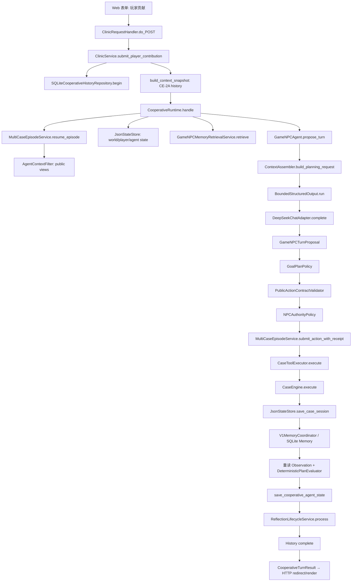
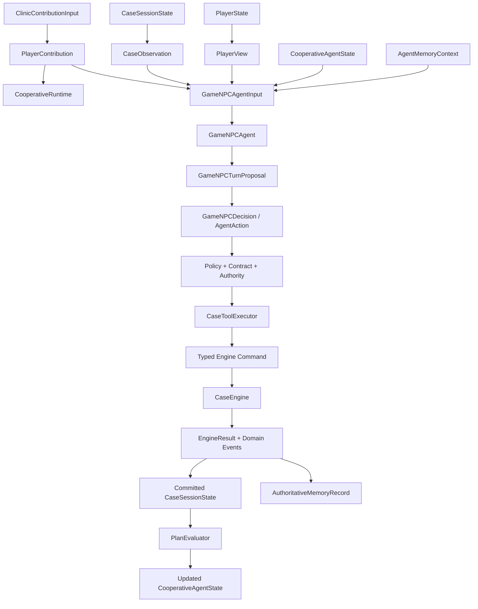

# Agent 工程实现分析（Code Architecture & Implementation）

> 分析基线：当前工作区源码，而不是只按 README 或简历措辞推断。本文面向“接手代码”和“面试现场打开代码讲解”两个场景。正式主链指本地 Clinic Web 中的 Cooperative Agent 路径；MCP、手工案件操作与离线 NPC 会在相关处单独标明，不能与主链混为一谈。

## 一、项目整体目录结构

```text
yiwen-npc/
├── pyproject.toml                  # 包元数据、依赖、pytest 配置、3 个命令入口
├── README.md / START_HERE.md       # 产品总览与本地启动说明
├── src/xuanyi_npc/                 # 可安装的 Python 主包
│   ├── agents/                     # Agent、Prompt/Context、LLM 抽象与 DeepSeek 适配
│   ├── application/                # 用例编排：Runtime、Policy、Tool Executor、Memory/Reflection
│   ├── domain/                     # Pydantic 领域模型、Action、State、Event、规划契约
│   ├── engine/                     # 确定性病例规则与状态转移
│   ├── storage/                    # JSON world/Agent state、SQLite Memory/协作账本
│   ├── memory/                     # Memory 契约、投影、向量与错误模型
│   ├── clinic/                     # 本地 Web 服务器、路由、依赖组装、进程入口
│   ├── mcp_server/                 # 独立 MCP stdio 工具入口及严格输入 Schema
│   ├── evaluation/                 # benchmark/eval runner、grader、fixture 契约
│   ├── resources/                  # 病例、Campaign、UI、Tokenizer、pilot 快照
│   ├── cli/                        # 仅包占位；当前没有主业务 CLI 实现
│   └── config/                     # 当前为空；配置并未集中在这里
├── tests/                          # 80 个 test_*.py，单元、集成、安全、评测回归
├── docs/
│   ├── architecture/               # 当前架构说明与一致性/安全边界
│   ├── interview/                  # 本系列面试文档
│   ├── evaluation/                 # 评测设计和结果解释
│   ├── product/ / recruitment/     # 产品与招聘材料
│   └── archive/                    # 历史阶段材料，不代表当前实现
├── tools/                          # 评测、fixture 冻结、实验与运维辅助脚本
├── examples/                       # 使用示例
├── requirements/                   # 分场景依赖锁定/说明
├── runtime_data/                   # 本地运行生成的状态目录，不是源码
├── runtime_models/                 # 本地 BGE-M3 模型资产，不是业务代码
├── runtime_evaluations/            # 本地评测运行产物
├── evaluation_results/ / results/ # 评测和实验结果
└── private/                        # 本地私有材料，不属于公开运行时接口
```

这里最容易误读的两点：第一，项目没有 `src/runtime/`，Runtime 位于 `application/cooperative_runtime.py`；第二，`src/xuanyi_npc/config/` 为空，真实配置分布在 CLI 参数、环境变量、代码内配置模型和资源 JSON 中。

## 二、目录职责说明

| 目录 | 真实职责 | 重要程度 |
|---|---|---|
| `src/xuanyi_npc/application` | 承载主用例和控制流，包括 Cooperative Runtime、Clinic Service、MultiCase、Policy、Tool Executor、Memory/Reflection 协调 | 核心 |
| `src/xuanyi_npc/agents` | 将公开状态组装成模型请求，调用 LLM，解析/修复结构化 Proposal；不写世界状态 | 核心 |
| `src/xuanyi_npc/domain` | 定义状态、Action、ToolName、Goal/Plan、合作回合和事件等强类型契约 | 核心 |
| `src/xuanyi_npc/engine` | 执行确定性病例规则，产出新 `CaseSessionState` 和领域事件 | 核心 |
| `src/xuanyi_npc/storage` | JSON 原子替换、Agent revision 检查、SQLite Memory、SQLite cooperative history | 核心 |
| `src/xuanyi_npc/memory` | Memory 权威记录、来源、投影、向量契约；不负责调用 Agent | 核心 |
| `src/xuanyi_npc/clinic` | Web 入口、HTTP 路由、生产依赖组装与进程生命周期 | 入口层 |
| `src/xuanyi_npc/mcp_server` | 独立 MCP Tool surface；直接到 `MCPApplicationService`，不经过 Cooperative Runtime | 次入口 |
| `src/xuanyi_npc/evaluation` | 离线/真实模型评测、grader、报告与冻结 fixture | 验证层 |
| `src/xuanyi_npc/resources` | 六个病例、Campaign 规则、Web 静态资源、Tokenizer 与 pilot 配置 | 运行数据 |
| `tests` | 领域、Runtime、Agent、Memory、Web、MCP、故障注入和评测回归 | 核心证据 |
| `docs` | 设计、产品、评测和面试材料；`archive` 不能当当前事实 | 说明层 |
| `runtime_*`、`results` | 本地模型、运行状态或评测产物 | 生成数据 |

## 三、核心模块地图

| Agent 概念 | 实际模块 | 主要文件 | 核心 Class/类型 |
|---|---|---|---|
| Runtime | application | `application/cooperative_runtime.py` | `CooperativeRuntime` |
| Agent | agents | `agents/game_npc.py` | `GameNPCAgent`, `DeterministicCooperativeNPC` |
| LLM 边界 | agents | `agents/llm.py`, `agents/deepseek.py` | `LLMAdapter`, `DeepSeekChatAdapter` |
| Context | agents + application | `agents/context.py`, `application/cooperative_context.py`, `application/views.py` | `ContextAssembler`, `CooperativeContextSnapshot`, `AgentContextFilter` |
| State | domain | `domain/cases.py`, `player.py`, `campaign.py`, `cooperative_planning.py` | `CaseSessionState`, `PlayerState`, `CampaignState`, `CooperativeAgentState` |
| Persistence | storage | `storage/json_store.py`, `sqlite_memory.py`, `sqlite_cooperation.py` | `JsonStateStore`, `SQLiteMemoryRepository`, `SQLiteCooperativeHistoryRepository` |
| Planner | Agent + domain + policy | `agents/game_npc.py`, `domain/planning_contract.py`, `application/goal_plan_policy.py` | 没有独立 Planner；`GameNPCAgent.propose_turn()` 生成 Goal/Plan proposal |
| Plan evaluator | application | `application/plan_evaluator.py` | `DeterministicPlanEvaluator` |
| Memory read | application | `application/game_npc_memory.py`, `memory_retrieval.py` | `GameNPCMemoryRetrievalService`, `BasicCosineMemoryRetriever` |
| Memory write | application + memory | `application/memory_coordination.py`, `memory/projection.py` | `V1MemoryCoordinator`, `DeterministicMemoryProjector` |
| Tool / Action | domain | `domain/actions.py` | `ToolName`, `ToolCallRequest`, `AgentAction` |
| Executor | application | `application/case_tools.py` | `CaseToolExecutor` |
| Action Contract | application | `application/action_contract.py` | `PublicActionContractValidator` |
| Planning Policy | application | `application/goal_plan_policy.py` | `GoalPlanPolicy` |
| Authority | application | `application/npc_authority.py` | `NPCAuthorityPolicy` |
| Engine | engine | `engine/case_engine.py` | `CaseEngine` |
| Reflection | application | `application/reflection_lifecycle.py`, `reflection.py`, `reflection_memory.py` | `ReflectionLifecycleService` 等 |
| Web composition root | clinic | `clinic/server.py` | `main()`, `build_clinic_service()` |

简历中的“Runtime、Planning、Memory、Tool-use、安全策略”都能映射到真实模块；但“Planner”和“Tool Registry”不能被说成独立组件，因为代码里分别是嵌入式规划生成与多处静态映射。

## 四、项目真实入口

### 4.1 程序启动入口

- 命令：`yiwen-xinglu` 或 `xuanyi-clinic`
- 声明：`pyproject.toml` 的 `[project.scripts]`
- 文件：`src/xuanyi_npc/clinic/server.py`
- 函数：`main(argv=None)`

`main()` 校验已存在的 `--state-dir`，再依次构造 NPC、Memory、Reflection、`ClinicService` 和只绑定 `127.0.0.1` 的 `ClinicHTTPServer`，最后进入 `serve_forever()`。

```text
pyproject.toml console script
  → clinic.server.main()
  → build_game_npc()
  → build_production_memory()
  → build_production_reflection()
  → build_clinic_service()
  → ClinicHTTPServer.serve_forever()
```

### 4.2 用户输入进入 Agent 的第一处

协作文本的 HTTP 第一接收点是 `ClinicRequestHandler.do_POST()`。`/cases/natural` 和 `/cases/cooperate` 将表单转为 `ClinicContributionInput`，调用 `ClinicService.submit_player_contribution()`。随后才进入 `CooperativeRuntime.handle()`。

`/cases/action` 是手工 baseline；`/cases/chat` 是案件人物对话；它们不是 Cooperative Agent 请求。`xuanyi-mcp-stdio` 则从 `mcp_server/stdio.py::main()` 启动独立 MCP server，也不是正式 Web Agent 主链。

## 五、一次完整请求调用链

### 5.1 调用链图



### 5.2 逐步定位

1. `clinic/server.py::ClinicRequestHandler.do_POST()` 解析表单与 operation token。
2. `application/clinic.py::ClinicService.submit_player_contribution()` 获取同 Session 进程内锁；记录开启时创建/复用 durable operation record。
3. `application/cooperative_context.py::build_context_snapshot()` 从已完成历史和当前 pending 快照构造 CE-2A 上下文。
4. `application/cooperative_runtime.py::CooperativeRuntime.handle()` 重读公开 Observation、World、Player 与 Agent State，并检索 Memory。
5. `agents/game_npc.py::GameNPCAgent.propose_turn()` 调 `ContextAssembler`、`BoundedStructuredOutput` 和 `LLMAdapter`，得到 `GameNPCTurnProposal`。
6. Runtime 依次做 Goal/Plan policy、首次 Plan—Decision alignment、Action Contract（最多一次专门 repair）、最终 alignment、Authority。
7. 非工具回复直接保存 Agent State；需确认动作生成 `PendingActionConfirmation`；批准的工具才进入 `MultiCaseEpisodeService.submit_action_with_receipt()`。
8. `application/case_tools.py::CaseToolExecutor.execute()` 校验参数，将 Tool 转为 Engine command。
9. `engine/case_engine.py::CaseEngine.execute()` 计算新的 Session、事件和评分；它不直接持久化。
10. `MultiCaseEpisodeService` 先保存 world，启用 Memory 时由 `V1MemoryCoordinator` 做 world-first 投影并尝试更新索引。
11. Runtime 重读 post Observation，运行 `DeterministicPlanEvaluator`，保存 `CooperativeAgentState`，最后运行 Reflection。
12. `ClinicService` 把完整结果写为 cooperative history 的 `completed`；HTTP 层将结果放入 query 后跳转并渲染。

## 六、核心 Class 清单

| Class | 文件 | 职责 | 主要调用方 |
|---|---|---|---|
| `ClinicHTTPServer` / `ClinicRequestHandler` | `clinic/server.py` | 本地 HTTP transport、路由和安全错误页面 | `main()` / 浏览器 |
| `ClinicService` | `application/clinic.py` | Web 用例门面、operation 幂等账本、Runtime 组装 | HTTP handler |
| `CooperativeRuntime` | `application/cooperative_runtime.py` | 单个协作 turn 的确定性编排 | `ClinicService`、测试/评测 |
| `GameNPCAgent` | `agents/game_npc.py` | 构造模型决策、解析/修复 Proposal | `CooperativeRuntime` |
| `ContextAssembler` | `agents/context.py` | 把公开输入渲染为 A0/A1/repair `LLMRequest` | `GameNPCAgent` |
| `DeepSeekChatAdapter` | `agents/deepseek.py` | Provider HTTP、模型发现、预算/usage 和错误映射 | `GameNPCAgent` 经 `LLMAdapter` |
| `BoundedStructuredOutput` | `agents/bounded_output.py` | 一次 initial 加最多一次 format repair | `GameNPCAgent` |
| `GoalPlanPolicy` | `application/goal_plan_policy.py` | 验证 Goal、Plan、公开 target 与动作一致性 | `CooperativeRuntime` |
| `PublicActionContractValidator` | `application/action_contract.py` | 验证 Tool、arguments 和当前公开候选 | `CooperativeRuntime` |
| `NPCAuthorityPolicy` | `application/npc_authority.py` | 判定自主、只提案、需确认或禁止 | `CooperativeRuntime` |
| `DeterministicPlanEvaluator` | `application/plan_evaluator.py` | 根据真实执行结果推进/修订/完成 Plan | `CooperativeRuntime` |
| `MultiCaseEpisodeService` | `application/multicase.py` | 案件用例、Tool 提交、world-first commit、Campaign | Runtime、Clinic |
| `CaseToolExecutor` | `application/case_tools.py` | 严格参数解析并把 Tool 转为 Engine command | MultiCase、MCP |
| `CaseEngine` | `engine/case_engine.py` | 确定性规则与纯状态转移 | `CaseToolExecutor` |
| `JsonStateStore` | `storage/json_store.py` | JSON 原子读写、Session 锁、Agent revision 检查 | 应用服务/Runtime |
| `SQLiteMemoryRepository` | `storage/sqlite_memory.py` | Memory、索引元数据与 Reflection receipt 持久化 | Memory/Reflection 服务 |
| `V1MemoryCoordinator` | `application/memory_coordination.py` | 已提交事件到权威 Memory 的投影/对账 | `MultiCaseEpisodeService` |
| `GameNPCMemoryRetrievalService` | `application/game_npc_memory.py` | 作用域检索、冲突处理和 Agent-safe 投影 | `CooperativeRuntime` |
| `SQLiteCooperativeHistoryRepository` | `storage/sqlite_cooperation.py` | 协作 turn 的 started/prepared/completed/recovery 账本 | `ClinicService` |
| `ReflectionLifecycleService` | `application/reflection_lifecycle.py` | 回合后 Reflection 的生成、验证、写入与 receipt | `CooperativeRuntime` |

## 七、Runtime 代码分析

**文件**：`src/xuanyi_npc/application/cooperative_runtime.py`  
**Class**：`CooperativeRuntime`  
**主方法**：`handle(CooperativeTurnInput) -> CooperativeTurnResult`

它负责：

- 恢复公开 Observation、Player、Session 和 `CooperativeAgentState`；
- 取 scoped Memory，构造 `GameNPCAgentInput`；
- 调 Agent，并串联 planning policy、alignment、action contract、authority；
- 处理 RESPOND、pending confirmation、forbidden 和 executable action 分支；
- 提交最多一个 Tool，重读 post Observation，评估 Plan，保存 Agent State；
- 在已提交结果后触发 Reflection，并产生审计字段。

它不负责：

- 不渲染 HTTP，也不管理进程；
- 不直接发 Provider HTTP，请求由 Agent/Adapter 完成；
- 不直接解释病例规则，规则属于 `CaseEngine`；
- 不直接修改 `CaseSessionState`，而是调用 `MultiCaseEpisodeService`；
- 不实现 Memory SQL，也不自行生成 embedding。

Runtime 不是 Agent，因为它不产生语义判断；它把 Agent 的不可信 proposal 放入确定性控制链。Runtime 也不是 Engine，因为它组织用例和副作用，Engine 只接受强类型 command 并计算领域状态转移。

还有一个必须准确表述的工程事实：`handle()` 是“一次请求一个 turn”，不是函数内部的 `while task_not_finished`。跨 turn 的连续性来自持久化 World/Agent State/History/Memory，以及下一次 HTTP 请求再次调用 `handle()`。

## 八、Agent 代码分析

**文件**：`src/xuanyi_npc/agents/game_npc.py`  
**Class**：`GameNPCAgent`  
**核心方法**：

- `propose_turn(GameNPCAgentInput) -> GameNPCTurnProposal`：正式 A1，Goal/Plan + Decision 一次结构化输出；
- `decide(...) -> GameNPCDecision`：A0/兼容路径；
- `repair_action_contract(...)`：收到安全 contract feedback 后进行一次专用 repair；
- `action_contract_fallback(...)`：修复失败后的安全回复。

输入包含公开 Player/Observation、玩家贡献、Authority view、Goal/Plan、最近评价、Memory、pending、历史和 cooperative snapshot。输出只是 proposal/decision，不是已执行动作。

Agent 内部包含 Prompt 常量、`ContextAssembler`、结构化输出与 parser-side validator；它接收已经检索好的 `memory_context`，但不读写 Memory；它可以提出 `tool_call`，但不调用 `CaseToolExecutor`；它没有 `JsonStateStore`，不能修改世界。离线模式使用 `DeterministicCooperativeNPC`，是无外部 LLM 的替代实现。

## 九、LLM 调用封装

### 9.1 抽象与实现

- `agents/llm.py`：`LLMAdapter` Protocol，以及 `LLMRequest`、`LLMResponse`、`ChatMessage`、`ModelUsage`。
- `agents/deepseek.py`：`DeepSeekChatAdapter.complete()`，直接使用 HTTP；明确“无隐式重试、无 Prompt 日志”。
- `agents/bounded_output.py`：把 provider 调用包装成有界结构化执行与一次格式修复。
- `agents/token_budget.py`：最终 provider payload 的 tokenizer-aware 预算和确定性裁剪。

封装的价值是让 `GameNPCAgent` 只依赖 `complete(request)` 契约，而不绑定 DeepSeek HTTP 细节，并把 provider 错误、usage、成本预留和 payload 预算留在适配层。

### 9.2 以后修改哪里

| 变化 | 真实修改点 |
|---|---|
| 换 Provider/模型 | 新实现 `LLMAdapter.complete()`；在 `clinic/server.py::build_game_npc()` 改 composition；保持 `LLMRequest/Response` 契约 |
| 只换 DeepSeek model/base URL/key | 环境变量与 `DeepSeekAdapterConfig.from_env()`，通常不动 Runtime |
| 增加网络 Retry | `DeepSeekChatAdapter` 附近；必须保持 bounded 调用和费用/usage 语义，不能在 Tool 提交后自动重放 |
| 增加模型诊断 | `diagnostic_hook`、`BoundedAttemptTelemetry` 或 Adapter 元数据；当前明确不记录原始 Prompt |
| 调整结构化 repair | `BoundedStructuredOutput` 与 `GameNPCAgent` 的 repair request builder |

## 十、Context 构造代码

Context 并不是单文件完成，而是四层：

```text
JsonStateStore + resume_episode
  → AgentContextFilter（公开 PlayerView / CaseObservation）
SQLite cooperative history
  → build_context_snapshot（历史/pending）
GameNPCMemoryRetrievalService
  → AgentMemoryContext（作用域过滤后的非权威记忆）
以上 + Goal/Plan + PlayerContribution + Authority
  → GameNPCAgentInput
  → ContextAssembler.build_planning_request()
  → LLMRequest
  → DeepSeek payload + tokenizer budget
```

**主要文件与边界**：

- `application/views.py::AgentContextFilter`：从权威状态生成无隐藏答案的公开视图；
- `application/cooperative_context.py::build_context_snapshot()`：选取同 scope 的已完成历史与当前有效 pending；
- `agents/context.py::ContextAssembler`：渲染 initial、format repair、action-contract repair，并生成 `ContextBuildTrace`；
- `agents/token_budget.py`：在完整 Schema 和 provider framing 加入后做最终 token 预算。

`ContextAssembler` 的直接输入是 `GameNPCAgentInput`，输出为 `BuiltContext(request: LLMRequest, trace: ContextBuildTrace)`；调用方是 `GameNPCAgent`，被调用方是 `BoundedStructuredOutput`/`LLMAdapter`。它不查询数据库，也不判断 action 是否可以执行。

## 十一、State 实现分析

| State | 文件/结构 | 保存位置 | 主要写入者 |
|---|---|---|---|
| World/Case | `domain/cases.py::CaseSessionState` | `<state-dir>/case_sessions/<session>.json` | `MultiCaseEpisodeService` 经 `JsonStateStore` |
| Player | `domain/player.py::PlayerState` | `<state-dir>/players/<player>.json` | `MultiCaseEpisodeService` |
| Campaign | `domain/campaign.py::CampaignState` | `<state-dir>/campaigns/<player>.json` | `CampaignCoordinator` |
| Agent intent | `domain/cooperative_planning.py::CooperativeAgentState` | `<state-dir>/cooperative_agents/<session>.json` | `CooperativeRuntime` |
| 人物对话 UI 状态 | `application/case_dialogue.py::CaseDialogueState` | `<state-dir>/case_dialogues/<session>.json` | `ClinicService.case_chat_message()` |
| Pending confirmation | `domain/cooperation.py::PendingActionConfirmation` | `ClinicService.cooperative_pending` 内存字典 | `ClinicService`/Runtime 结果 |
| Cooperative history | `storage/sqlite_cooperation.py::CooperativeTurnRecord` | `<state-dir>/cooperative_conversation.sqlite3` | `ClinicService` |
| Long-term Memory/Index/Reflection receipt | `memory/contracts.py` 等 | `<state-dir>/memories.sqlite3` | Memory/Reflection 服务 |

状态通过 `player_id`、`case_id`、`session_id` 和 revision 关联。`CaseSessionState` 是案件 world 权威，但不是全局总账：Goal/Plan、历史、Memory、pending 分属不同边界。`JsonStateStore` 使用临时文件、`fsync` 和 `os.replace` 原子替换；Agent State 额外检查 `expected_revision`。同 Session 写入用进程内 `RLock` 串行化，但没有跨 JSON/SQLite 的全局事务，也没有跨进程 JSON CAS。Pending 仍不持久化。

## 十二、Memory 代码分析

当前没有名为 `MemoryStore` 或 `MemoryWriter` 的单体类；职责按写入、持久化、索引、检索和安全投影拆开。

### 12.1 写入链

```text
CaseEngine 的已提交事件
  → MultiCaseEpisodeService
  → V1MemoryCoordinator.commit_engine_result()
  → DeterministicMemoryProjector
  → SQLiteMemoryRepository.write_projection()
  → MemoryIndexService.index_player()
```

`V1MemoryCoordinator` 明确先 `save_case_session()`，再从已提交事件投影 Memory；投影失败返回 pending，不把 world 伪装成未提交。`reconcile_committed_session()` 可从已提交 Session 补投影。

Reflection Memory 走 `ReflectionLifecycleService` → evidence/validator → `ReflectionMemoryConsolidationService` → 同一个 SQLite repository/index；不是第二套记忆库。

### 12.2 读取链

```text
CooperativeRuntime._retrieve_memory_context()
  → GameNPCMemoryRetrievalService.retrieve()
  → GameNPCMemoryQueryBuilder
  → BasicCosineMemoryRetriever.retrieve_scoped()
  → GameNPCMemoryProjectionPolicy.project()
  → AgentMemoryContext
  → GameNPCAgentInput
  → ContextAssembler
```

“Memory 影响未来决策”的真实代码证据是：Runtime 将检索结果放入 `GameNPCAgentInput.memory_context`，`ContextAssembler.build_planning_request()` 将其渲染到 A1 请求，模型 proposal 声明 used IDs，Runtime 再把 `selected → declared → accepted/rejected` 写入 `MemoryUsageTrace`。检索到不等于已使用，拒绝动作也不会被计为 accepted influence。

## 十三、Tool 系统代码分析

### 13.1 定义、注册与执行

- 定义：`domain/actions.py::ToolName`, `ToolCallRequest`, `AgentAction`。
- 参数契约与执行：`application/case_tools.py` 中的 `*ToolArguments` 和 `CaseToolExecutor.execute()`。
- Agent 可见 action contract：`application/action_contract.py`。
- 权限分组：`domain/npc_authority.py` 与 `application/npc_authority.py`。
- Planning 可用范围：`domain/cooperative_planning.py`。
- 可修改案件的工具集合：`application/multicase.py::MUTATING_CASE_TOOLS`。
- MCP 对外注册：`mcp_server/server.py::FROZEN_MCP_TOOL_NAMES`, `_TOOL_INPUTS`, `_TOOL_DESCRIPTIONS`, `create_mcp_server()`。

内部 Agent 路径没有统一动态 Tool Registry。所谓“注册”实际上分布在 Enum、映射、Policy、Executor 分支和 MCP 映射中。MCP 的动态 `Tool.from_function()` 只是外部 surface 注册，不是 Cooperative Runtime 的内部 registry。

### 13.2 新增 Tool 的真实改动面

1. 在 `domain/actions.py::ToolName` 增加枚举；若会改变 world，还要有对应 `CaseActionType`、command/event/资源数据。
2. 在 `application/case_tools.py` 增加严格 arguments model 与执行分支/映射。
3. 在 `application/action_contract.py` 增加公开 projection 和 validator 规则。
4. 根据权限更新 `npc_authority.py`；根据规划能力更新 `cooperative_planning.py`、`goal_plan_policy.py`、`plan_evaluator.py`。
5. 若允许正式案件提交，更新 `multicase.py::MUTATING_CASE_TOOLS`。
6. 若暴露给 MCP，更新 `mcp_server/contracts.py` 及 `server.py` 的名称、输入、描述。
7. 更新 Context 中公开行动空间和对应单元/集成/拒绝零写入测试。

## 十四、Action 执行链代码分析

```text
GameNPCTurnProposal.decision
  └─ GameNPCDecisionProposal.action: AgentAction
       ↓ GoalPlanPolicy + alignment
       ↓ PublicActionContractValidator.validate()
       ↓ 可选 GameNPCAgent.repair_action_contract()
       ↓ 最终 alignment
       ↓ NPCAuthorityPolicy.evaluate()
       ↓ SubmitActionInput(action=AgentAction)
       ↓ MultiCaseEpisodeService.submit_action_with_receipt()
       ↓ CaseToolExecutor.execute()
       ↓ InvestigationCommand / SubmitDiagnosisCommand / ExecuteTreatmentCommand
       ↓ CaseEngine.execute()
       ↓ EngineResult(session, events, message, score)
       ↓ JsonStateStore / Memory projection / post-Observation
```

关键转换位置：

- LLM JSON → `GameNPCTurnProposal`：`GameNPCAgent._parse_turn()`；
- Proposal → 带运行元数据的 `GameNPCDecision`：`CooperativeRuntime.handle()`；
- ToolCall → typed Engine command：`CaseToolExecutor.execute()`；
- command → 新 world/events：`CaseEngine.execute()`；
- EngineResult → 持久 world/Memory receipt：`MultiCaseEpisodeService._submit_action_with_receipt_once()`。

LLM 从未获得 Engine 或 Store 引用，因此“提出 Action”和“执行 Action”在代码上是硬边界，不只是 Prompt 约定。

## 十五、Policy / Contract / Authority 代码分析

### Policy

- 文件：`application/goal_plan_policy.py`
- Class：`GoalPlanPolicy`
- 职责：验证 goal/plan 的状态迁移、step shape、公开 target、suggested tool 和当前可执行空间；它不批准权限。

### Contract

- 文件：`application/action_contract.py`
- Class：`PublicActionContractValidator`
- 职责：把当前 Observation 投影为公开 action contract，并验证最终 Tool 名、arguments、target 和 evidence。
- Runtime 通过 `_resolve_contract()` 最多调用一次 Agent 专用 repair，失败走安全 fallback。

### Authority

- 文件：`application/npc_authority.py` 与 `domain/npc_authority.py`
- Class：`NPCAuthorityPolicy`
- 职责：调查可自主，诊断 proposal-only，处置 confirmation-required，未知/不匹配则 forbidden。

当前实际顺序不是一句笼统的“先 Contract 再 Policy”：A1 的 Schema 在 Agent parser 边界，Runtime 先做 `GoalPlanPolicy` 和首次 alignment，再做 Action Contract/repair，再做最终 alignment，之后才是 Authority 和 Tool。

## 十六、Planning 代码分析

| 概念 | 真实实现 |
|---|---|
| Goal/Plan/Step/Evaluation 状态 | `domain/cooperative_planning.py` |
| 模型输出 Draft | `domain/planning_contract.py::GameNPCTurnProposal` 等 |
| 生成 | `GameNPCAgent.propose_turn()`，不是独立 Planner class |
| 验证 | `application/goal_plan_policy.py::GoalPlanPolicy` |
| 应用 proposal | `CooperativeRuntime._apply_proposal()` |
| 与 Decision 对齐 | Runtime `_action_matches_plan()` 和相关拒绝分支 |
| 执行后评估 | `application/plan_evaluator.py::DeterministicPlanEvaluator` |
| 持久化 | `JsonStateStore.save_cooperative_agent_state()` |

因此可以说项目“有 Planning subsystem”，但不能说“有独立 Planner、Replanner 和 PlanExecutor 三个服务”。生成嵌入 Agent，生命周期编排位于 Runtime，完成判断由确定性 evaluator 完成。

## 十七、Persistence 层

| 持久化边界 | 内容 | 写入时机 | 调用者 |
|---|---|---|---|
| JSON `players/` | PlayerState | 创建/玩家状态变更 | MultiCase |
| JSON `case_sessions/` | world、action history、revision | Engine 成功后 world-first | MultiCase / Memory coordinator |
| JSON `campaigns/` | 跨案件 Campaign projection | 案件完成/对账 | CampaignCoordinator |
| JSON `cooperative_agents/` | Goal/Plan/evaluation/feedback | 每个 Runtime turn 分支收口 | CooperativeRuntime |
| JSON `case_dialogues/` | 普通人物聊天 UI 历史 | chat 请求后 | ClinicService |
| SQLite `memories.sqlite3` | source、Memory、embedding、Reflection receipt | 已提交事件投影/Reflection consolidation/索引 | Memory/Reflection |
| SQLite `cooperative_conversation.sqlite3` | 请求、prepared decision、结果、恢复状态 | Agent turn 前、中、后 | ClinicService |
| 内存 pending | 待确认 Action | Runtime 返回 pending 后 | ClinicService |

Repository 层不是一个统一 Unit of Work。JSON world、Agent State、Campaign、Memory 和 cooperative history 各自有边界；当前依赖 Session 进程内串行、operation journal、revision、world-first 投影和保守恢复，而不是全局事务。

## 十八、配置管理

| 配置类别 | 当前位置 | 修改方式 |
|---|---|---|
| 启动/运行模式 | `clinic/server.py::build_parser()` | CLI 参数：state dir、host/port、npc/memory 模式、CE flags 等 |
| API/模型/价格预算 | `.env`/环境变量 + `DeepSeekAdapterConfig.from_env()` | 设置 DeepSeek key、base URL、model、timeout、token/cost 等；不要提交密钥 |
| Agent 参数 | `agents/game_npc.py::GameNPCAgentConfig` | composition 时传入；当前主要是 prompt version/recent limit |
| Token 预算 | `agents/token_budget.py` + DeepSeek config + tokenizer resource | 调整 adapter/预算配置和 tokenizer 资产 |
| Memory 模型 | `build_parser()`、`build_production_memory()` | CLI 指定 BGE 模型目录、manifest、device、length、batch |
| Memory retrieval | `build_production_memory()` 中 `MemoryRetrievalConfig` | 目前 top-k/min similarity 等写在 composition code |
| Prompt | `agents/game_npc.py`、`application/reflection.py` 中常量/renderer | 直接修改代码并更新冻结测试，不在外部模板目录 |
| 病例/Campaign/UI | `src/xuanyi_npc/resources` | 修改 JSON/CSS/JS 并跑 schema/资源测试 |
| Python 依赖/入口 | `pyproject.toml`, `requirements/` | 包配置 |

结论：项目有强类型配置对象，但没有集中式配置目录或统一 settings service；空的 `src/xuanyi_npc/config/` 不能被介绍成已实现配置中心。

## 十九、异常处理

异常是分层处理，不是 Runtime 单点兜底：

- **Adapter**：`DeepSeekChatAdapter` 将鉴权、限流、超时、transport、provider、JSON、截断、预算等映射为专用异常。
- **Structured output**：`BoundedStructuredOutput` 区分 provider failure 与 validation failure，最多一次 format repair，失败返回可审计 result。
- **Agent**：parse/contract repair 失败转安全 fallback，不执行 Tool。
- **Runtime**：Goal/Plan、alignment、contract、authority、tool failure 转 `CooperativeTurnResult` 的稳定状态/错误码；world commit unknown 抛 `CooperativeCommitUncertainError`；world 已提交后的 Observation/PlanEvaluator 失败抛 `CooperativePostCommitError(stage)`。
- **Tool/Engine**：`CaseToolExecutor` 抛 `ToolCallError` 子类；Engine 抛 `RuleViolation`；MultiCase 将它们变成稳定业务错误并保证拒绝零事件。
- **Storage**：JSON/SQLite 抛 `StorageError`、`MemoryError`、`CooperativeHistoryError` 等边界异常。
- **Service**：`ClinicService` 将不确定或已提交后续失败写入 history 的 `recovery_required`，阻止危险重放。
- **HTTP**：已知输入/业务错误返回 400；未知异常返回通用 500，不泄露内部细节。

所以面试中应说“各层在自己能判断提交语义的位置处理异常”，不能说“所有异常统一由 Runtime 处理”。

## 二十、日志和调试

项目当前没有常规 `logging/logger` 生产日志；`ClinicRequestHandler.log_message()` 还主动关闭了 stdlib HTTP access log。可观测性来自结构化诊断与持久化证据：

- `GameNPCAgent` / `BoundedStructuredOutput` 的可注入 `diagnostic_hook`；
- `BoundedAttemptTelemetry`：attempt、repair、usage、预算拒绝；
- `ContextBuildTrace` 与 adapter 的 `ContextBudgetTrace`；
- `CooperativeTurnResult`：status、error、selected tool、alignment、Memory/Reflection 字段；
- `cooperative_conversation.sqlite3`：started/prepared/completed/recovery_required；
- world JSON：revision、action_history；Agent JSON：Goal/Plan/evaluation/feedback；
- evaluation artifacts 与 request ledger。

调试一次 Agent turn 的建议顺序：先按 operation ID 查 cooperative history；再看 `CaseSessionState.revision/action_history` 判断 world 是否提交；再看 `CooperativeAgentState`；然后看 `CooperativeTurnResult` 的 contract/authority/tool/Memory/Reflection 字段；模型问题才看 attempt/context/token traces。不要声称项目已有集中式日志平台。

## 二十一、测试结构

当前 `tests/` 有 80 个 `test_*.py`。很多文件同时覆盖单元和集成边界，以下按主要目标归类。

| 测试类型 | 代表文件 | 验证内容 |
|---|---|---|
| Domain unit | `test_domain_models.py`, `test_case_definition.py`, `test_m2_goal_plan_domain.py` | Pydantic 契约、不变量、Goal/Plan shape |
| Engine unit | `test_case_engine.py`, `test_event_replay_gold.py` | 规则、事件、状态转移、回放 |
| State/storage | `test_json_store.py`, `test_m2_cooperative_state_store.py`, `test_memory_repository.py` | 原子读写、revision、SQLite schema/隔离 |
| Agent/LLM | `test_m1_game_npc_agent.py`, `test_deepseek_adapter.py`, `test_e5_structured_fallback_policy.py` | 请求、解析、repair、provider errors/fallback |
| Context | `test_context_engineering_ce0_ce1.py`, `test_context_engineering_ce2a.py`, `test_context_token_budget.py` | Context 等价、历史、来源、最终 token budget |
| Runtime integration | `test_m1_cooperative_runtime.py`, `test_m2_cooperative_runtime_planning.py`, `test_p2_plan_decision_alignment.py` | 一 turn 编排、Planning、final alignment |
| Tool/Policy | `test_m5_public_action_space.py`, `test_p3_model_visible_diagnosis_contract.py`, `test_p4_treatment_action_contract.py`, `test_m1_npc_authority.py` | action space、contract、authority、拒绝零写入 |
| Memory | `test_memory_coordination.py`, `test_memory_retrieval.py`, `test_m3_*`, `test_cross_session_memory_exposure.py` | world-first、检索、作用域与 Agent exposure |
| Reflection | `test_m4_reflection_*`, `test_m4_cooperative_runtime_reflection.py` | evidence、grounding、lifecycle、幂等/失败隔离 |
| Web/MCP integration | `test_m1_cooperative_web.py`, `test_mcp_p0.py`, `test_mcp_stdio.py` | HTTP/MCP 入口和 application boundary |
| Failure safety | `test_commit_consistency_faults.py`, `test_p3a_repair_attempt_telemetry.py` | 提交窗口、并发、recovery、attempt 证据 |
| Evaluation regression | `test_agent_task_benchmark.py`, `test_eval_v2_*`, `test_eval_v21_*` | runner、grader、artifact、冻结场景 |

## 二十二、核心数据结构关系图



## 二十三、如果面试官让我打开代码

### 第一打开：`application/cooperative_runtime.py`

原因：它最能证明这是 Agent 系统而不是模型 wrapper。看 `handle()` 中 State load → Memory → Agent → Policy/Contract/Authority → Tool → post Observation → PlanEvaluator 的控制链，并强调一请求一 turn。

### 第二打开：`agents/game_npc.py`

原因：展示模型职责边界。看 `GameNPCAgentInput`、`propose_turn()`、bounded output、parse/repair/fallback；指出 Agent 只产 proposal，不持有 Store/Engine。

### 第三打开：`application/case_tools.py`

原因：展示安全落地。看严格 arguments model、`CaseToolExecutor.execute()` 如何把 `ToolCallRequest` 转成 typed command，再交给 `CaseEngine`。

### 5 分钟代码展示路线

1. 30 秒看 `pyproject.toml` 与 `clinic/server.py::main()`，说明真实启动与 composition root。
2. 2 分钟看 `CooperativeRuntime.handle()` 的关键阶段和分支。
3. 1 分钟看 `GameNPCAgent.propose_turn()` 与 `LLMAdapter`，说明 LLM 只提案。
4. 1 分钟看 `CaseToolExecutor.execute()` → `CaseEngine.execute()`，说明确定性执行。
5. 30 秒看 `JsonStateStore` 与 `V1MemoryCoordinator`，说明 world-first、多持久化边界和恢复限制。

## 二十四、项目扩展指南

### 新增一个 Tool

修改 `domain/actions.py`、`application/case_tools.py`、`action_contract.py`，再按需要更新 `npc_authority.py`、`cooperative_planning.py`、`goal_plan_policy.py`、`plan_evaluator.py`、`multicase.py` 和 `mcp_server`。若是新 world mutation，还要增加 Engine command/event/rule 和病例资源。最后覆盖合法、非法参数、权限、重复/过期状态、拒绝零写入和 MCP（如暴露）测试。

### 新增一个 Memory 类型

修改 `memory/contracts.py` 的 taxonomy/record，`memory/projection.py` 或 Reflection candidate/consolidation 的生成规则，`storage/sqlite_memory.py` 的允许类型/schema（如需要），`application/game_npc_memory.py` 的 readable types、projection/render/conflict policy，并补检索、隔离、Context exposure、usage attribution 和迁移测试。不能只在 Prompt 中添加一段文字。

### 新增一个 Agent 能力

若只是新决策语义，修改 `domain/cooperation.py`/planning contracts、`game_npc.py` Prompt 与 parser validator、Context schema，再在 Runtime/Policy 中定义其确定性含义。若能力会执行副作用，还必须接入 Action Contract、Authority、Executor/Engine 与 State tests。

### 更换 LLM

实现 `agents/llm.py::LLMAdapter`，返回现有 `LLMResponse/ModelUsage`；在 `clinic/server.py::build_game_npc()` 注入新 adapter；对齐 JSON Schema、token 预算、错误分类、usage/cost 和模型发现策略。Runtime、Tool、Engine 不应因 provider 更换而改动。

## 二十五、代码质量分析

### 模块耦合

优点是 LLM 与世界执行物理分离：`GameNPCAgent` 没有 Store/Engine，`CaseEngine` 没有 LLM，依赖可由 Protocol/constructor 注入。风险是 Runtime 与工具元数据存在高扇出：`CooperativeRuntime` 直接协调 Planning、Memory、Reflection、History hook、Authority 和 Tool result。

### 单一职责

`CaseEngine`、`CaseToolExecutor`、`DeepSeekChatAdapter`、`JsonStateStore` 的边界清晰。`CooperativeRuntime` 约 1367 行，`MultiCaseEpisodeService` 约 1329 行，已同时承担多个阶段分支；这是可维护性压力，不等于功能错误。

### 扩展性

Provider 通过 `LLMAdapter`、Memory 通过 service/repository Protocol 较易替换；新增 Tool 的扩展性较弱，因为元数据散落在多个 Enum/映射/Policy/Executor/MCP 文件中。Planning 也没有独立 planner interface，改变 A1 输出通常会波及 Agent、domain contract、policy、Runtime 与 tests。

### 测试覆盖

80 个测试文件覆盖 domain、engine、state、agent、context、runtime、memory、reflection、web、MCP、fault injection 和 eval。强项是拒绝零写入、提交不确定、上下文预算等边界有专门测试；“文件数量”不能替代覆盖率指标，仓库当前没有在配置中声明覆盖率门槛。

### 可维护性

Pydantic `extra="forbid"`、冻结模型、稳定 error code、原子写入和可注入依赖提高可定位性。薄弱点是没有统一 logging、pending 非 durable、配置分散，以及少数大文件中的长控制流。

## 二十六、发现的真实架构问题

1. **Runtime 过重**：`CooperativeRuntime.handle()` 同时承载 Planning 生命周期、Memory attribution、两次 alignment、contract repair、Authority、commit 后处理和 Reflection；分支多，修改顺序时回归面大。
2. **Tool 注册分散**：没有统一 metadata/registry，新增 Tool 要同步 Enum、Executor、Contract、Planning、Authority、MultiCase、MCP 等多处，存在漏配风险。
3. **多存储无全局事务**：world JSON、Agent JSON、Campaign JSON、Memory SQLite、History SQLite 和 Reflection receipt 分开；已有 world-first、recovery ledger 和 reconciliation，但不能宣称全链 exactly-once。
4. **Pending confirmation 不持久化**：`ClinicService.cooperative_pending` 是进程内字典；重启后旧确认不可恢复，只能安全失效。
5. **配置和 Prompt 分散**：空 `config/` 与真实配置位置不一致；Memory retrieval 参数和 Prompt 常量在代码中，变更需跑冻结回归。
6. **缺少常规生产日志**：有结构化 trace 与 durable journal，但没有集中 logger/access log，线上式关联排障能力有限。
7. **入口能力不等价**：正式 Web Cooperative 路径拥有 Runtime/History/Memory/Reflection；MCP 直接执行 Tool，不经过完整 Agent 后链。不能把一条入口的保证推广到另一条。

## 二十七、设计文档 vs 代码

| 描述 | 文档位置 | 当前实际代码 | 是否一致 |
|---|---|---|---|
| Runtime 是单 turn 编排 | `COOPERATIVE_RUNTIME_DESIGN.md` | `CooperativeRuntime.handle()` 每请求运行一次 | 一致；不要口述成内部无限 loop |
| Agent 提 Proposal，系统执行 | `PRODUCT_SYSTEM_ARCHITECTURE.md` | `GameNPCAgent` 无 Store/Engine；Runtime/Executor 执行 | 一致 |
| Planning 有 Goal/Plan/Evaluator | `PLANNING_AND_ACTION_DESIGN.md` | domain state + Agent proposal + Policy + Runtime + evaluator | 一致；但无独立 Planner service |
| 验证顺序 | `PRODUCT_SYSTEM_ARCHITECTURE.md`、Planning 文档 | Schema → GoalPlanPolicy → 初次 alignment → Contract/repair → final alignment → Authority | 当前主文档一致；旧材料若写 Contract/Policy 相反，应以代码为准 |
| Memory world-first | `MEMORY_DESIGN.md`, `COMMIT_CONSISTENCY_DESIGN.md` | `V1MemoryCoordinator.commit_engine_result()` 先保存 world 再投影 | 一致 |
| PlanEvaluator/Memory 顺序 | `COMMIT_CONSISTENCY_DESIGN.md` | world → ordinary Memory/index → post Observation → PlanEvaluator → Agent State → Reflection | 当前主文档一致；历史图若不同已过时 |
| CE-2A 正式入口默认开启 | `CONTEXT_ENGINEERING_DESIGN.md` / 启动说明 | CLI `--cooperative-record`、`--cooperative-context-v2` 默认 true；programmatic builder 默认 false | 有条件一致；必须区分 CLI 与测试/程序化构造 |
| State 有明确 JSON/SQLite 边界 | `PRODUCT_SYSTEM_ARCHITECTURE.md` | `JsonStateStore` + 两个 SQLite repository | 一致；但无全局事务/跨进程 CAS |
| Tool 是 bounded capability | 架构主文档 | Enum + contract + authority + executor + engine | 语义一致；代码没有统一 Tool Registry |
| MCP 是工具适配入口 | `COMMIT_CONSISTENCY_DESIGN.md` | MCP 直接 `MCPApplicationService` → Executor/Engine | 一致；不经过 Runtime/Memory/Campaign 后链 |
| 配置目录 | 目录名字可能造成误解 | `src/xuanyi_npc/config` 为空，配置分散 | 名称与实现能力不一致，不能宣称配置中心 |

**当前最大的“架构图理解—代码组织”偏差**不是功能缺失，而是容易把 Tool 系统理解成一个可插拔 Registry。代码实际以多个静态映射和条件分支实现；MCP 有独立注册表，但它不统一内部 Agent Tool metadata。第二个常见误解是把 Runtime 讲成常驻循环，实际是每个 HTTP contribution 构造并执行一个 turn。

## 二十八、最终面试版

### 28.1 30 秒项目代码结构介绍

“项目按 domain、application、agents、engine、storage 和 adapter 分层。Web 入口在 `clinic/server.py`，一次协作请求由 `ClinicService` 进入 `CooperativeRuntime`；Agent 层只把公开状态组装成 LLM 请求并输出结构化 proposal，Runtime 用 Planning Policy、Action Contract 和 Authority 校验后，经 `CaseToolExecutor` 把 Tool 转成强类型 command，最终由 `CaseEngine` 改变 world。World/Agent state 用 JSON，长期 Memory 与协作账本用独立 SQLite。”

### 28.2 2 分钟架构介绍

“启动入口由 `pyproject.toml` 指向 `clinic.server.main()`，这里组装 DeepSeek Agent、BGE Memory、Reflection、Store 和本地 HTTP Server。玩家从 `/cases/cooperate` 提交文本，`ClinicService` 先做 operation 幂等和历史账本，再构造 CE-2A 历史快照，调用 `CooperativeRuntime.handle()`。

Runtime 每次只处理一个 turn：重读公开 Observation、Player、Goal/Plan 与 scoped Memory，生成 `GameNPCAgentInput`。`GameNPCAgent.propose_turn()` 通过 `ContextAssembler`、有界结构化输出和 `LLMAdapter` 得到 Goal/Plan/Decision proposal。模型输出先经过 GoalPlanPolicy、Plan—Decision 对齐、Action Contract，必要时有限 repair，再做最终对齐与 Authority。普通回复只更新 Agent State；高风险动作生成 pending；获批 Tool 进入 MultiCase、CaseToolExecutor 和 CaseEngine。

Engine 只做确定性状态转移并返回事件。应用层先保存 world，再投影普通 Memory；Runtime 重读真实 post Observation，用 deterministic PlanEvaluator 推进计划，保存 Agent State，最后做 Reflection。整个项目的关键边界是：LLM 有建议权，没有状态写权限；不同存储有恢复与幂等保护，但不存在全局事务。”

### 28.3 “你负责哪部分？”回答模板

“我主要负责的是 Cooperative Agent 的端到端控制链，而不只是 Prompt：包括 `CooperativeRuntime` 的单 turn 编排、`GameNPCAgent` 的结构化输出边界、Context/Token Budget、Planning 与 Action Contract 对齐、Authority gate，以及 world commit 后的 Plan/Memory/Reflection 一致性处理。我还用故障注入和集成测试验证了拒绝零写入、提交不确定时不盲目重放等边界。具体贡献应按你的真实提交记录替换，不能把全仓库都说成个人独立完成。”

### 28.4 “你最熟悉哪个模块？”回答

“我最熟悉 `CooperativeRuntime`，因为它是整个系统的控制面。我可以从 `handle()` 逐段解释 Observation/State 如何恢复，Memory 如何进入 Context，A1 proposal 如何经过 Policy、两次 alignment、Contract repair 和 Authority，再到 Tool/Engine/world commit；也能解释为什么 post-commit failure 不能按普通失败重试，以及 Agent State、Memory、Reflection 分别在什么时机更新。”

### 28.5 白板代码架构图

```text
[Clinic HTTP]
      ↓
[ClinicService + History Ledger]
      ↓
[CooperativeRuntime]
   ↙       ↓        ↘
[State] [Memory] [GameNPCAgent → LLMAdapter]
              ↓ Proposal
     [Policy + Contract + Authority]
              ↓
        [CaseToolExecutor]
              ↓
          [CaseEngine]
              ↓
 [World commit → Plan/Memory/Reflection]
```

## 二十九、高频代码追问（30 题）

| # | 问题 | 考察点 | 推荐回答 | 代码位置 |
|---:|---|---|---|---|
| 1 | 程序入口在哪？ | 能否落到真实入口 | `pyproject.toml` 的 `yiwen-xinglu/xuanyi-clinic` 指向 `clinic.server.main()` | `pyproject.toml`, `clinic/server.py` |
| 2 | 用户输入第一站在哪？ | transport 边界 | `ClinicRequestHandler.do_POST()`，协作路由转 `ClinicContributionInput` | `clinic/server.py` |
| 3 | Runtime 在哪？ | 核心定位 | `CooperativeRuntime.handle()`，一次请求一个 turn | `application/cooperative_runtime.py` |
| 4 | Runtime 为什么不是 Agent？ | 职责边界 | Runtime 编排和执行控制；Agent 只形成不可信 proposal | Runtime + `agents/game_npc.py` |
| 5 | Agent 怎么调用 LLM？ | 调用抽象 | `propose_turn()` → ContextAssembler → BoundedStructuredOutput → LLMAdapter | `agents/game_npc.py`, `bounded_output.py`, `llm.py` |
| 6 | 当前 Provider 是什么？ | 生产 wiring | `build_game_npc()` 注入 `DeepSeekChatAdapter`；offline 可用 deterministic NPC | `clinic/server.py`, `agents/deepseek.py` |
| 7 | Context 在哪生成？ | 上下文分层 | public view/history/memory 上游组装，最终 `ContextAssembler.build_planning_request()` | `views.py`, `cooperative_context.py`, `context.py` |
| 8 | Token 预算在哪？ | 最终 payload 控制 | `agents/token_budget.py`，完整 Schema/framing/output reserve 后预算 | `agents/token_budget.py`, `deepseek.py` |
| 9 | Prompt 在哪？ | 配置事实 | `game_npc.py` 中 system/planning 常量；不是外部模板服务 | `agents/game_npc.py` |
| 10 | Proposal 的类型在哪？ | 强类型输出 | `domain/planning_contract.py` 和 `domain/cooperation.py` | 对应 domain 文件 |
| 11 | State 在哪定义？ | domain 分层 | World/Player/Campaign/Agent 分别在 cases/player/campaign/cooperative_planning | `domain/*` |
| 12 | State 存哪？ | 持久化 | World/Agent/Campaign 是 state-dir JSON；Memory/History 是两个 SQLite | `storage/*`, `clinic/server.py` |
| 13 | Agent State 如何防并发覆盖？ | revision/CAS 边界 | 进程内 Session `RLock` + `expected_revision` 检查；不是跨进程数据库 CAS | `storage/json_store.py` |
| 14 | Memory 写在哪？ | world-first | `V1MemoryCoordinator.commit_engine_result()` 先 world 后 projection | `application/memory_coordination.py` |
| 15 | Memory 怎么影响决策？ | 真实数据流 | retrieve → `AgentMemoryContext` → `GameNPCAgentInput` → ContextAssembler | `game_npc_memory.py`, Runtime, `context.py` |
| 16 | Memory Store 是哪个类？ | 避免虚构 | 没有单体 `MemoryStore`；持久层是 `SQLiteMemoryRepository` | `storage/sqlite_memory.py` |
| 17 | Tool 在哪注册？ | 识别分散实现 | 内部没有统一 registry；ToolName、Contract、Executor、Authority、Planning 多处映射；MCP 另有注册 | `domain/actions.py`, `case_tools.py`, `mcp_server/server.py` |
| 18 | Tool 如何执行？ | 受控副作用 | Runtime 批准后 → MultiCase → CaseToolExecutor → typed command → CaseEngine | Runtime, `multicase.py`, `case_tools.py` |
| 19 | LLM 能直接改状态吗？ | 安全边界 | 不能；Agent 无 Store/Engine 引用，只输出 `AgentAction` | `agents/game_npc.py` |
| 20 | Action Contract 在哪？ | 参数安全 | `PublicActionContractValidator` 用当前公开 action space 验证 Tool/target/args | `application/action_contract.py` |
| 21 | Authority 在哪？ | 授权安全 | `NPCAuthorityPolicy.evaluate()`；诊断/处置走不同模式 | `application/npc_authority.py` |
| 22 | Plan 在哪生成？ | 避免虚构 Planner | A1 由 `GameNPCAgent.propose_turn()` 同时生成 Goal/Plan/Decision，没有独立 Planner class | `agents/game_npc.py` |
| 23 | Plan 怎么完成？ | 模型/程序边界 | `DeterministicPlanEvaluator` 基于 post Observation 和执行结果推进 | `application/plan_evaluator.py` |
| 24 | 一轮可执行几个 Tool？ | bounded action | 主链一个 decision、最多提交一个 Tool；其余 turn 下次请求继续 | Runtime |
| 25 | 模型输出坏了怎么办？ | repair/fallback | initial 后最多一次 format repair；contract 另有一次专用 repair；失败安全 RESPOND/拒绝 | `bounded_output.py`, `game_npc.py`, Runtime |
| 26 | world 保存失败如何处理？ | commit semantics | receipt 标记 unknown，Runtime 抛 commit-uncertain，Clinic history 阻断自动重放 | `multicase.py`, Runtime, `clinic.py` |
| 27 | 有全局事务吗？ | 诚实边界 | 没有；多存储靠 world-first、ledger、reconciliation 和保守 failure handling | storage/commit docs |
| 28 | 如何替换模型？ | 可扩展性 | 实现 `LLMAdapter` 并在 composition root 注入，保持 request/response/usage 契约 | `agents/llm.py`, `clinic/server.py` |
| 29 | 如何测试 Agent？ | 分层测试 | fake adapter 验证 Agent；fake agent 验证 Runtime；真实模型用 evaluation/pilot，不把单元测试依赖外网 | `tests/test_m1_game_npc_agent.py` 等 |
| 30 | MCP 是否走同一完整链？ | 入口差异 | 不走；MCP → `MCPApplicationService` → Executor/Engine，绕过 Cooperative Runtime/普通 Memory/Campaign 后链 | `mcp_server/server.py`, `application/mcp_facade.py` |

## 三十、最终理解检查

如果下面 20 个问题答不上来，就说明还没有真正掌握项目代码：

1. `yiwen-xinglu` 在 `pyproject.toml` 中具体指向哪个函数？
2. 哪两个 POST 路由会进入 Cooperative Agent，哪个路由只是 manual baseline？
3. `ClinicService` 在 Runtime 前为什么要写 `started`，Tool 前为什么要写 `prepared`？
4. 为什么说 `CooperativeRuntime.handle()` 是一个 turn，而不是持续循环？
5. `GameNPCAgentInput` 的数据分别来自哪些模块？
6. `ContextAssembler` 和 `AgentContextFilter` 的职责有什么区别？
7. Provider 的完整 JSON Schema 在哪一步计入 token budget？
8. `GameNPCAgent.propose_turn()` 输出的是什么，为什么不等于执行结果？
9. GoalPlanPolicy、首次 alignment、Action Contract、最终 alignment、Authority 的实际顺序是什么？
10. Contract repair 后为什么还要做第二次 alignment？
11. 哪个类把 Tool arguments 变成 Engine command？
12. `CaseEngine.execute()` 是否直接写磁盘？谁负责保存？
13. world、Agent State、Memory、History 分别保存在哪里？
14. `V1MemoryCoordinator` 为什么先保存 world 再写 Memory？
15. Memory 的 selected、declared、accepted 三个集合有什么区别？
16. pending confirmation 为什么在重启后会失效？
17. world commit unknown 与 post-commit follow-up failure 的处理有什么不同？
18. 新增一个 Tool 为什么不能只改 `ToolName`？
19. MCP 为什么不能代表 Web Cooperative Agent 的完整保证？
20. 没有集中 logging 时，如何用 operation ID、history、world revision、Agent State 和 traces 定位一次失败？

## 三十一、最终项目代码速查表

### Agent 项目代码地图

| 我要回答的问题 | 应该看哪个文件/符号 |
|---|---|
| 执行入口在哪？ | `pyproject.toml`; `src/xuanyi_npc/clinic/server.py::main` |
| 用户输入在哪？ | `clinic/server.py::ClinicRequestHandler.do_POST` |
| Service 在哪？ | `application/clinic.py::ClinicService` |
| Runtime 在哪？ | `application/cooperative_runtime.py::CooperativeRuntime.handle` |
| Agent 在哪？ | `agents/game_npc.py::GameNPCAgent` |
| LLM 抽象在哪？ | `agents/llm.py::LLMAdapter` |
| DeepSeek 调用在哪？ | `agents/deepseek.py::DeepSeekChatAdapter.complete` |
| Context 在哪？ | `agents/context.py::ContextAssembler`; `application/cooperative_context.py` |
| Token Budget 在哪？ | `agents/token_budget.py`; `agents/deepseek.py` |
| World State 在哪？ | `domain/cases.py::CaseSessionState` |
| Agent State 在哪？ | `domain/cooperative_planning.py::CooperativeAgentState` |
| JSON 持久化在哪？ | `storage/json_store.py::JsonStateStore` |
| Memory 在哪？ | `application/game_npc_memory.py`, `memory_coordination.py`, `storage/sqlite_memory.py` |
| Planning 在哪？ | `domain/cooperative_planning.py`, `agents/game_npc.py`, `goal_plan_policy.py`, `plan_evaluator.py` |
| Action Contract 在哪？ | `application/action_contract.py::PublicActionContractValidator` |
| Authority 在哪？ | `application/npc_authority.py::NPCAuthorityPolicy` |
| Tool 定义在哪？ | `domain/actions.py::ToolName/ToolCallRequest/AgentAction` |
| Tool Executor 在哪？ | `application/case_tools.py::CaseToolExecutor` |
| Engine 在哪？ | `engine/case_engine.py::CaseEngine` |
| Reflection 在哪？ | `application/reflection_lifecycle.py` 及 `reflection*.py` |
| 协作历史在哪？ | `storage/sqlite_cooperation.py`; `<state-dir>/cooperative_conversation.sqlite3` |
| MCP 注册在哪？ | `mcp_server/server.py::create_mcp_server` |
| 测试在哪？ | `tests/`；按 M1–M5、P、CE、eval 等前缀定位 |
| 评测在哪？ | `src/xuanyi_npc/evaluation/`, `runtime_evaluations/`, `evaluation_results/` |

---

### 本文的最终工程结论

这个项目的真实代码形态是：**一个由 Web 请求驱动、每次执行单个 cooperative turn 的应用层 Runtime；一个只生成结构化提案的 LLM Agent；一条由 Policy、Contract、Alignment、Authority、Executor 和 deterministic Engine 组成的控制链；以及分离的 JSON/SQLite 状态边界。**

面试时最需要避免的四个误述是：把 Runtime 说成内部无限循环；把 Agent 说成直接调用工具并写状态；把分散映射说成统一 Tool Registry；把多存储恢复机制说成全局事务或 exactly-once。
