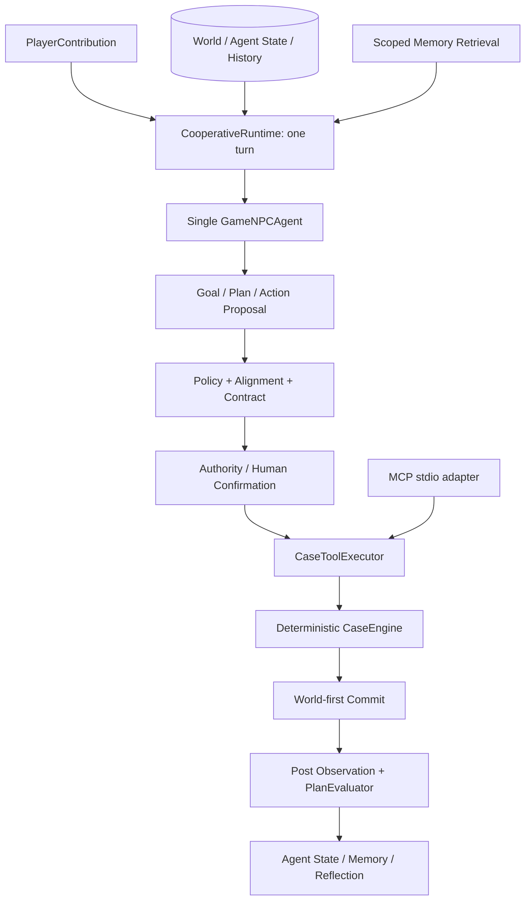
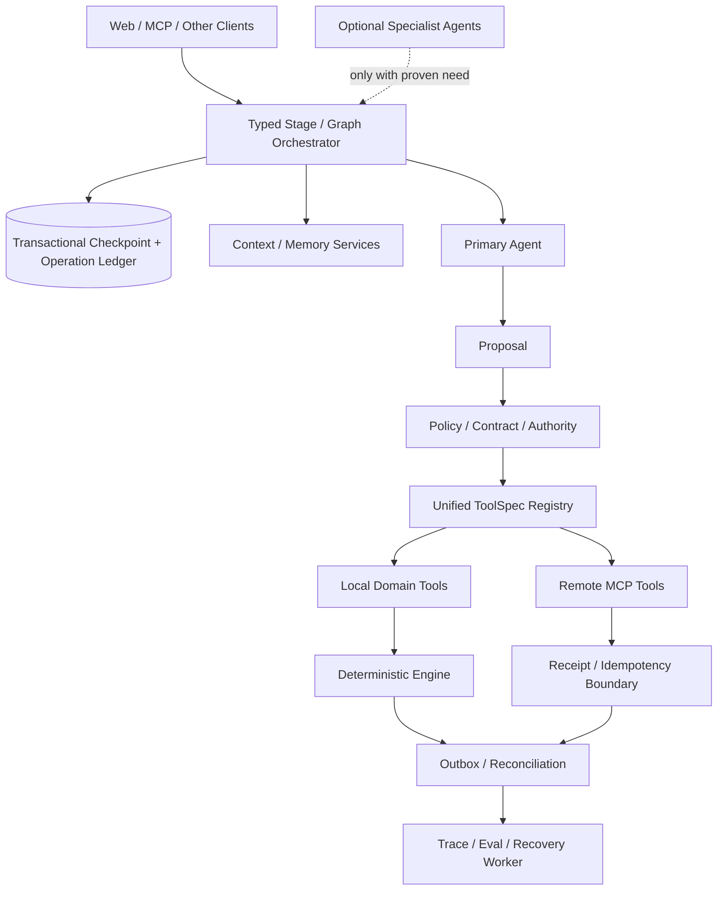

# Agent 技术取舍与架构决策（Trade-off Analysis）

> 目标：不是证明当前方案“普遍最好”，而是解释它为什么适合《异闻行录》当前目标、规模和风险边界；同时明确它放弃了什么、何时应改变。本文以当前源码、主架构文档和可复现测试为准。
>
> 外部框架能力以 2026-09-27 的官方资料为比较基线：[LangGraph Overview](https://docs.langchain.com/oss/python/langgraph/overview)、[LangChain Overview](https://docs.langchain.com/oss/python/langchain/overview)、[AutoGen Agent and Agent Runtime](https://microsoft.github.io/autogen/dev/user-guide/core-user-guide/framework/agent-and-agent-runtime.html)、[CrewAI Introduction](https://docs.crewai.com/core-concepts/Agents)、[MCP Introduction](https://modelcontextprotocol.io/docs/getting-started/intro)。这些资料用于说明候选方案，不替代本仓库的代码证据。

## 一、项目核心设计哲学

### 1.1 这个项目整体选择了什么路线

当前真实路线可以概括为：

> **单一 LLM Agent + 自研单回合 Runtime + 显式领域 State + LLM Proposal / 程序验证执行 + 确定性 Engine + 受来源约束的长期 Memory。**

它还有四个限定：

1. **不是纯 Agent 自治系统**：`GameNPCAgent` 负责开放判断，`CooperativeRuntime` 和 `CaseEngine` 负责边界、权限和事实提交。
2. **不是纯固定 Workflow**：Goal、Plan、玩家贡献评价和候选 Action 由模型结合当前 Observation 动态提出。
3. **不是 Multi-Agent**：正式 cooperative turn 只有一个 `GameNPCAgent`；病例人物、Memory、Planner、Executor 都不是独立自主 Agent。
4. **不是“没有 MCP”**：仓库已有 `xuanyi-mcp-stdio`，但 MCP 是独立的外部工具适配入口，不是正式 Web Agent 主链的内部编排总线。

更准确的架构标签是：

> **deterministic workflow 中嵌入 constrained agentic decision core（确定性工作流中的受约束智能决策核）。**

### 1.2 为什么选择这条路线

#### 项目目标

项目不是通用自动化平台，而是六个病例、一个调查搭档、有限工具集合的 Human-Agent Cooperative Game NPC。核心难点是让 NPC 能理解开放自然语言并自主判断，同时不能看到隐藏真相、绕过诊断/处置权限或污染权威世界。

#### 开发成本

在初始规模下，一条主要线性链加有限分支，比引入图运行时、多 Agent message bus 和分布式 checkpoint 更容易落地。代价是当前已经积累了较多自研 Runtime、恢复和诊断代码。

#### 可控性

`GameNPCAgent` 不持有 Store/Engine，只能输出结构化 Proposal。`GoalPlanPolicy`、Plan—Decision alignment、`PublicActionContractValidator`、`NPCAuthorityPolicy` 和 `CaseEngine` 形成程序化控制链。

#### 可解释性

每一步都能映射到稳定类型、状态和错误码：Proposal 是什么、在哪一层被拒绝、是否执行 Tool、world 是否已提交、Plan 是否推进，都可以分别检查。

#### 扩展性

Provider 通过 `LLMAdapter` 可替换；Memory、Reflection 和 Context 有独立服务边界。但 orchestration 和 Tool metadata 的扩展性一般：Runtime 文件较大，新 Tool 要同步多个映射。

#### 调试难度

相比自由 ReAct 或多 Agent 群聊，单 Agent、每回合最多一个 Tool、确定性状态转移更容易复现。相比成熟框架，项目缺少现成的图可视化、统一 checkpoint 和生产 tracing。

## 二、项目最核心的架构取舍

| 决策 | 当前选择 | 放弃/暂不采用 | 当前依据 |
|---|---|---|---|
| Runtime | 自研 `CooperativeRuntime`，一次请求一个 turn | LangGraph/CrewAI Flow 等通用图运行时 | 主链有限但有高度定制的状态、权限和提交顺序 |
| Agent 数量 | 单一 `GameNPCAgent` | Planner/Memory/Critic/Tool 多 Agent | 只有一个真实自主决策主体，其他职责可确定性实现 |
| 系统形态 | Agent 决策核 + 确定性 Workflow | 全自治 Agent 或全固定流程 | 输入开放，但执行边界必须稳定 |
| Action | LLM Proposal → 多层校验 → Executor | 模型直接调用并改变世界 | 诊断/处置有权限与确认语义 |
| Tool 表达 | 自定义严格 JSON Action schema | 仅依赖 Provider 原生 Function Calling | 需要 provider-neutral 契约、repair 和领域校验 |
| Tool 接入 | 内部强类型调用；MCP 作为独立适配入口 | MCP 作为内部总线 | 工具同进程、数量有限、需共享 Engine 规则 |
| State | World/Agent/Campaign/History/Memory 显式分域 | 把全部历史塞进 Prompt | 需要权威事实、生命周期、revision 和可恢复性 |
| Memory | 已提交事件/Reflection 投影 + scoped semantic retrieval | 无来源的通用向量 RAG | 过去经历会影响决策，但不能变成当前事实或授权 |
| Planning | A1 先提出 Goal/Plan/Decision，每 turn 最多执行一步，再确定性评估 | 自由 ReAct 内循环或纯静态 plan | 需要跨回合意图，也要控制成本和副作用 |
| 规则边界 | LLM 处理开放语义，程序处理权限、规则、提交 | 全 LLM 或全规则 | 两类问题的确定性需求不同 |
| 持久化 | JSON world/Agent state + SQLite Memory/History，world-first | 单一数据库全局事务或纯 event store | 本地单机产品优先简单、可检查；牺牲跨边界原子性 |
| Provider | 最小 `LLMAdapter` + DeepSeek adapter | LangChain model/tool harness | 只需一个 provider-neutral complete 接口和强定制预算语义 |

## 三、自研 Runtime vs LangGraph

### 3.1 LangGraph 解决什么问题

LangGraph 官方将其定位为面向长时间运行、具状态 Agent 的低层 orchestration framework/runtime，核心能力包括图节点与边、持久执行、Human-in-the-loop、streaming、memory 和状态恢复。它也强调可以在同一图中混合确定性步骤和 LLM 步骤。

这与本项目方向并不冲突；事实上，本项目的 Proposal、Policy、Authority、Tool、post-commit evaluation 可以被建模成图节点。问题不是“LangGraph 能不能做”，而是当前是否值得承担迁移和框架语义成本。

### 3.2 为什么当前没有直接采用 LangGraph

1. **当前正式运行单位很小**：一次 HTTP 请求只执行一个 turn，最多一个 Tool，没有并行分支、子图或动态 Agent 拓扑。
2. **关键复杂度在领域提交语义**：真正困难的是 world-first、确认绑定、revision、Memory projection、提交不确定和不得重放 Tool。换图框架不会自动解决这些领域事务问题。
3. **状态不是单一 Graph State**：World、AgentState、History、Memory、pending 分属不同权威边界，不能简单合并为一个可随意 checkpoint 的 dict。
4. **需要精确控制验证顺序**：Schema → GoalPlanPolicy → alignment → Action Contract/repair → final alignment → Authority → Tool，这条顺序是安全性质的一部分。
5. **当前依赖面较小**：项目只需最小 `LLMAdapter`、Pydantic、HTTP 和本地存储；引入 LangGraph 会增加框架学习、版本和调试栈。
6. **可审计性优先**：目前可直接从 `CooperativeRuntime.handle()` 阅读完整控制链，适合研究和面试展示。

### 3.3 对比

| 维度 | 当前自研 Runtime | LangGraph |
|---|---|---|
| 状态管理 | 自己定义多个领域状态和持久化边界 | Graph state + checkpointer，适合节点间状态传递/恢复 |
| 流程表达 | 一个长方法和显式分支，顺序直接 | 节点、边、条件路由更直观，复杂分支更易可视化 |
| 调试 | 依赖结构化结果、history ledger、测试和 traces | 可结合图执行 trace/checkpoint 观察节点 |
| 灵活性 | 对本项目的 commit/authority 语义完全可控 | 对图形工作流、interrupt/resume、subgraph 更强 |
| 初期成本 | 小规模下较低 | 需要学习和适配框架状态/持久化模型 |
| 长期维护 | Runtime 增长后自研成本上升 | 框架承担通用 orchestration，但仍需维护领域节点 |
| 扩展性 | 并行、长任务、多 interrupt 需自行实现 | 长运行、分支、HITL、durable execution 更成熟 |
| 适合场景 | 单 Agent、短 turn、强领域约束 | 多阶段长任务、复杂图、跨中断恢复、可视化编排 |

### 3.4 面试回答：为什么当前选择自研 Runtime

“不是因为 LangGraph 不适合 Agent，而是当前系统只有一个主 Agent、一个 bounded turn 和一条需要精确审计的领域提交链。真正的风险是权限、world commit 和跨状态一致性，我希望这些顺序直接体现在代码里，而不是先迁移成通用 Graph State。这样初期依赖更少、测试边界更清楚。但现在 `CooperativeRuntime` 已经超过千行，说明规模正在接近图化或阶段化重构的阈值。”

### 3.5 什么时候考虑 LangGraph

出现以下任意两三项时，会认真做 spike，而不是继续扩展大方法：

- 一个用户任务需要跨多个内部节点长时间运行，而非一请求一 turn；
- 多个 Human-in-the-loop interrupt 必须跨重启精确恢复；
- 出现并行工具、子流程、回滚/补偿和大量条件分支；
- 需要统一 checkpoint、节点级 streaming 和图可视化；
- Runtime 阶段频繁重排，现有测试难以覆盖组合爆炸；
- 多个 Agent 或远程 worker 需要统一 orchestration。

即使迁移，`CaseEngine`、Action Contract、Authority 和 commit receipt 仍应保留。LangGraph 负责 orchestration，不替代领域安全与事务语义。

## 四、自研 Agent 框架 vs AutoGen

### 4.1 AutoGen 擅长什么

AutoGen 官方把 Core 定位为 event-driven、可扩展/分布式的 Agent runtime，并提供 Agent identity、消息通信、Agent lifecycle、AgentChat teams、Human-in-the-loop 和多种协作模式。它也能构建单 Agent，但最能体现价值的场景通常是多个可对话、可路由的 Agent 或分布式 Agent 系统。

### 4.2 为什么当前项目没有采用 AutoGen

- 当前没有 Agent-to-Agent 消息网络，只有玩家与一个 `GameNPCAgent` 的协作。
- Planner、Memory、Executor、Critic 并不是拥有独立目标和自主行为的主体；把它们包装成 Agent 只会把函数调用变成消息通信。
- 项目的关键状态是病例 world 和授权，不是 conversation transcript；不能让群聊历史成为权威状态。
- 多 Agent 框架会引入新的 termination、handoff、消息重复、共享上下文和并发副作用问题。
- 当前评测已需要区分 model output、contract、authority、tool 和 commit failure；多 Agent 会增加归因变量和模型调用成本。

### 4.3 “NPC 角色多”不等于 Multi-Agent

病例中的患者、证人和人物是游戏内容/对话参与者，不具有独立 Agent state、Goal、Tool authority 或自主 Runtime。正式代码和 README 都明确：当前唯一产品 Agent 是 `GameNPCAgent`。

### 4.4 AutoGen 何时有价值

如果未来出现多个真正独立的调查主体，例如每个 Agent 拥有不同私有观察、工具权限、长期目标，必须通过消息协商和 handoff 完成任务，并且需要异步/分布式运行，那么 AutoGen Core 的 runtime 和 message model 会比继续自建通信层更有吸引力。

## 五、Single Agent vs Multi-Agent

### 5.1 为什么选择 Single `GameNPCAgent`

| 维度 | 单 Agent 当前收益 | 拆成多 Agent 的新增成本 |
|---|---|---|
| 任务复杂度 | 一个调查搭档可完成贡献评价、Planning 和 Action proposal | 需要定义 Planner/Critic/Tool Agent 的真实独立目标 |
| 通信成本 | 一次 initial，至多有限 repair | 多轮消息、上下文复制、token/延迟增加 |
| 状态一致性 | 一个 Agent proposal 对应一个 turn/decision | 多 Agent 对 Goal/Plan/Action 可能产生冲突版本 |
| 权限 | 统一经过一条 Authority gate | 必须定义每个 Agent 的身份、能力和授权传播 |
| 调试 | 能定位一个模型输出与一个 action | 需要追踪发言顺序、handoff、termination 和责任归因 |
| 评估 | A0/A1 和具体 stage 可比较 | 质量变化同时受角色、拓扑、轮次和聚合策略影响 |
| 费用 | 每 turn 调用有界 | 调用数和上下文随协作轮次放大 |

### 5.2 为什么不拆 Planner Agent、Memory Agent、Tool Agent、Critic Agent

- **Planner**：当前 Goal/Plan 与 Decision 需要同一请求内结构一致；拆开会增加计划—动作漂移和第二次模型成本。
- **Memory**：检索、隔离和冲突过滤是确定性数据服务，不需要自主目标；LLM 只需声明实际使用的 Memory IDs。
- **Tool Agent**：参数校验和 Engine command 转换必须确定，不应由第二个模型“再理解一遍”。
- **Critic**：当前 critic 的核心职责已由 Pydantic schema、Policy、Contract、alignment 和 Engine rules 覆盖；只有语义质量批评无法规则化且收益被评测证明时，才值得增加模型 critic。

### 5.3 Multi-Agent 什么时候才有价值

不是“任务复杂就拆”，而是至少满足以下条件之一：

- 不同主体有真实冲突或互补目标，而非人为角色提示；
- 各自拥有不同私有 context 或权限，无法合并到单 Agent；
- 任务可并行分解，通信成本低于串行推理收益；
- 专家 Agent 的独立模型/工具显著提高质量，并能用消融实验验证；
- 需要跨组织/跨机器的 Agent ownership 和 handoff。

## 六、Agent vs Workflow

### 6.1 为什么不能只用固定 Workflow

玩家可以用开放自然语言表达假设、质疑、风险意见和模糊建议。固定 `if/else` 很难穷举同义表达、证据组合、对话解释和下一步优先级，也难以产生自然协商体验。

### 6.2 哪些必须由 Agent 决定

- 对 `PlayerContribution` 的接受、部分接受、拒绝或请求证据；
- 当前 Goal/Plan 的语义更新 proposal；
- 在公开合法候选中选择下一行动；
- 面向玩家解释判断；
- 声明哪些 Memory 实际影响了 Goal/Plan/Decision；
- Reflection 的候选经验文本（之后仍需验证）。

### 6.3 哪些必须 Workflow 化

- State/Observation 读取与可见性过滤；
- Context 来源和 token budget；
- Schema、GoalPlanPolicy、alignment、Action Contract、Authority；
- Tool argument 解析、Engine rules、world commit；
- post Observation、PlanEvaluator、Memory 投影、Reflection grounding；
- operation ledger、幂等和失败分类。

### 6.4 最准确的结论

本项目不是“Agent 与 Workflow 二选一”，而是：

> **让 Agent 负责开放语义选择，让 Workflow 负责不可违反的执行协议。**

## 七、LLM 直接控制 vs 受约束 Agent

### 7.1 两种方案

```text
方案 A：User → LLM → Tool/State

方案 B：User → LLM Proposal
              → Schema / Planning / Alignment / Contract / Authority
              → Executor → Engine → State
```

项目选择方案 B。

### 7.2 为什么

| 目标 | 直接控制风险 | Proposal + Validation 的收益 |
|---|---|---|
| 安全 | Prompt injection 或幻觉可直接形成副作用 | LLM 没有 Store/Engine 引用，非法动作止于边界 |
| 权限 | 模型可能把玩家建议误当授权 | Authority 使用绑定 decision/action/revision 的确认 |
| 一致性 | 模型认为完成不等于 world 已改变 | 只有 Engine event 和成功提交是权威结果 |
| 测试 | 难以隔离模型随机性和规则错误 | fake Agent 可测试 Runtime，fake adapter 可测试 Agent |
| 审计 | 只能看到最终调用 | 能区分 proposal、repair、拒绝、执行与 commit 状态 |
| 恢复 | 重试可能重复副作用 | receipt/history 阻断不确定操作的盲目重放 |

代价是代码和延迟增加，而且 Policy/Contract 需要持续维护。它适合本项目，是因为诊断和处置具有明确业务权限，错误执行的成本高于多写一些控制代码。

## 八、Function Calling vs 自定义 Action 执行

### 8.1 当前真实实现

当前 DeepSeek payload 使用 `response_format={"type":"json_object"}`，并把完整 JSON Schema 注入 system instruction；模型返回顶层 `GameNPCTurnProposal`，不是 provider 原生 function-call event。之后由 Pydantic、Runtime、Contract 和 Executor 处理。

### 8.2 为什么不只依赖 Function Calling

Function Calling 解决的是“模型如何表达调用哪个函数和参数”，但不自动解决：

- Tool 是否在当前 Observation 中公开可用；
- 参数引用的 target/evidence 是否属于当前 session/revision；
- 诊断/处置是否有权限或确认；
- Tool 调用与 active PlanStep 是否一致；
- world 是否已提交、是否可以重试；
- Memory 和 Agent State 如何在 commit 后更新。

因此 Function Calling 与 `CaseToolExecutor` 不是替代关系。未来可以把 Function Calling 作为另一种 **Proposal serialization channel**，但仍必须保留 Action Contract、Authority、Executor 和 Engine。

### 8.3 当前方案的代价

- 自己维护 Schema instruction、parser 和 repair；
- provider 原生 tool-call 生态利用不足；
- Schema 遵循仍会失败，需要 safe fallback；
- 换模型时要验证 JSON mode/Schema 行为。

## 九、MCP vs 本地 Tool 系统

### 9.1 先纠正问题前提

MCP 官方定位是连接 AI application 与外部数据源、工具和 workflow 的开放标准。本项目**已经使用 MCP**：

- 依赖：`pyproject.toml` 固定 `mcp==2.0.0`；
- 入口：`xuanyi-mcp-stdio = xuanyi_npc.mcp_server.stdio:main`；
- 注册：`mcp_server/server.py::create_mcp_server()`；
- 安全门面：`application/mcp_facade.py::MCPApplicationService`；
- 测试：`test_mcp_p0.py`、`test_mcp_stdio.py`。

正确问题应是：

> **为什么 MCP 只作为边缘集成协议，而没有成为 Web Cooperative Agent 内部的 Tool Runtime？**

### 9.2 为什么内部仍用本地 Tool 系统

- 所有案件工具都在同一进程、同一代码库，无需远程 discovery；
- `AgentAction`、`CaseToolExecutor` 和 Engine command 有强类型直接调用，减少序列化层；
- 权限依赖当前 world、Plan 和 pending confirmation，不只是工具 Schema；
- Runtime 需要准确知道 Tool 前后提交阶段，通用协议调用不会自动提供本项目 receipt 语义；
- MCP 入口本身绕过 Cooperative Runtime、普通 Memory/Campaign 后链，因此不能反过来充当主链。

### 9.3 什么时候进一步使用 MCP

- 将工具开放给外部 AI client；
- 工具由不同团队、语言或进程维护；
- 需要动态发现第三方数据源/服务；
- 希望同一案件工具被多个 host 复用；
- 为只读知识、搜索或外部业务系统建立标准接口。

即便扩大 MCP 使用，Authority 和 domain policy 应留在 server/application boundary，不能把 client 发来的 tool call 当成授权事实。

## 十、显式 State vs 全 Prompt Memory

### 10.1 当前选择

项目用 `CaseSessionState`、`PlayerState`、`CampaignState`、`CooperativeAgentState`、SQLite History 和 Memory records 表示不同生命周期；每轮只把经过投影的必要信息放进 Context。

### 10.2 为什么 State 比 Prompt 历史可靠

1. **权威性**：Prompt 是模型输入视图，world JSON/Engine event 才是已提交事实。
2. **修改权限**：模型可以提议 Goal/Plan，但不能通过文本改 `CaseSessionState`。
3. **结构验证**：Pydantic、revision 和 ownership 能拒绝脏状态；聊天文本没有同等约束。
4. **生命周期**：world、pending、Memory、history 的保留和失效规则不同。
5. **并发与恢复**：显式 revision、operation ID、receipt 能判断冲突和提交状态；Prompt 无法提供 CAS/幂等。
6. **Context 成本**：完整历史会无限增长，显式 State 可按需要投影和裁剪。
7. **测试**：可以独立构造 State 测 Policy/Engine，不依赖随机对话复现。

### 10.3 代价

显式 State 需要 schema evolution、迁移、多个存储边界和恢复逻辑。当前项目仍有 pending 不持久、跨存储无全局事务、跨进程 CAS 不完整等问题。

## 十一、Memory 系统 vs RAG

### 11.1 概念区分

- **普通 RAG** 常用于从外部文档/知识库检索相关内容，增强当前回答。
- **Agent Memory** 表示某个主体过去经历、行为结果或验证后的经验，必须带身份、时间、来源、生命周期和作用域。

### 11.2 本项目并非“不用检索”

当前 Memory 使用 BGE-M3 embedding、`BasicCosineMemoryRetriever` 和 top-k/min similarity，技术上包含 retrieval augmentation。它与普通文档 RAG 的核心区别是治理语义：

- 只从已提交事件或经 grounding 的 Reflection 投影；
- 绑定 player/source session/case/type；
- 排除当前 session，检查生命周期和来源；
- 与当前 Observation 冲突时降权并标记非权威；
- 用 `selected → declared → accepted` 记录实际影响；
- Memory 不能替代 current world、注入权限或直接形成 Tool。

### 11.3 为什么不能“把历史扔进向量库就结束”

向量相似度只回答“文本像不像”，不回答“来源是否可信、是否属于当前玩家、是否过期、是否与当前世界冲突、能否授权行动”。这些恰恰是 Agent Memory 的风险核心。

### 11.4 RAG 何时仍然有价值

如果加入世界观百科、规则手册、剧情文档或外部知识，适合做独立 Knowledge RAG；它应与 autobiographical Agent Memory 分库、分标签、分 Prompt 区块和分评测，不能混成一个“历史真相池”。

## 十二、Plan-and-Execute vs ReAct

### 12.1 当前实现不能强贴单一标签

它不是经典自由 ReAct：没有模型在一个请求内无限执行 `Think → Act → Observe`，也不保存/暴露自由思维链。每个 cooperative turn 最多一个 Tool，Observation 在下一阶段由程序重读。

它也不是传统“一次生成完整计划，然后机械执行到底”的 Plan-and-Execute：每轮模型可基于最新 Observation、玩家贡献、Memory 和上一轮 evaluation 更新 Goal/Plan，程序只执行当前一个通过校验的 Action。

更准确的描述是：

> **持久 Goal/Plan 驱动的 single-step observe–propose–validate–act–evaluate 循环。**

### 12.2 为什么选择这种混合方式

- Plan 提供跨回合目标连续性和可解释步骤；
- single-step execution 让每次副作用都重新经过 Contract/Authority；
- post Observation + deterministic evaluator 防止模型自称完成；
- 玩家可以在高风险节点参与确认；
- 模型调用和 Tool 数有明确上限，便于成本与失败恢复。

### 12.3 放弃了什么

- 不适合一个 turn 内大量探索和多 Tool 自主迭代；
- A1 输出同时承担 Goal/Plan/Decision，Schema 负担较重；
- 每步都需新请求，长任务延迟更高；
- 计划质量收益目前没有被无混杂评测证明。

## 十三、规则系统 vs LLM 决策

| 问题类型 | 当前负责者 | 原因 |
|---|---|---|
| 理解玩家开放表达 | LLM Agent | 同义、模糊、语义组合难以穷举 |
| 评价贡献和解释 | LLM Agent | 需要上下文化语言判断 |
| 提议 Goal/Plan/Action | LLM Agent | 路径选择具有开放性 |
| 公开视图过滤 | 程序 | 隐藏真相不能依赖模型自律 |
| Schema/参数/target | 程序 | 可形式化、应确定性测试 |
| 诊断/处置权限 | 程序 | 属于不可违反的授权规则 |
| 病例前置、结果、评分 | `CaseEngine` | 世界规则必须唯一且可回放 |
| Plan 完成判断 | 程序基于 Observation | 模型声明不能变成权威事实 |
| Memory 来源/隔离 | 程序 | 防止串号、过期和错误提升 |

全规则方案更稳定，但会牺牲自然语言理解和开放协商；全 LLM 方案灵活，但不能提供可证明的权限和状态一致性。当前混合的原则是：**语义模糊处用模型，安全不变量处用程序。**

## 十四、为什么没有做 Multi-Agent

### 面试官问：“为什么不用多个 Agent 提升能力？”

推荐回答：

“我先判断系统里有没有多个真实决策主体。当前产品只有一个调查搭档，Planner、Memory、Tool 和 Critic 都可以用确定性模块完成，并没有独立目标或私有权限。强行拆成多 Agent 会增加模型调用、消息同步、termination 和状态冲突，却没有证据表明任务成功率会提高。因此我选择单 Agent，并用模块化服务拆职责。未来只有在出现真实专家角色、私有 context、并行任务或跨组织 handoff，而且消融实验证明收益时，才会引入 Multi-Agent。”

这不是说 Multi-Agent 没用，而是拒绝用 Agent 数量代替模块设计。

## 十五、为什么没有引入更多框架

### 15.1 LangChain

LangChain 官方提供标准模型接口、agent harness、tools 和 middleware，适合快速接多 Provider/工具生态。当前项目只需一个同步 `LLMAdapter.complete()`、严格 schema、定制费用与 token budget；引入完整 harness 的直接收益有限。若未来 Provider/模型/工具集成显著增多，LangChain 的标准接口和 middleware 值得评估。

### 15.2 CrewAI

CrewAI 的 Crews 面向角色化协作，Flows 面向事件驱动的可控流程。当前没有多个真实 Agent role，流程又高度依赖自定义 commit semantics，因此未采用。若未来形成多个明确专家团队并需要 Crew/Flow 组合，可以做受控试验。

### 15.3 AutoGen

适合对话式/事件驱动多 Agent、handoff 和分布式 runtime；当前单 Agent 没有相应通信需求。

### 15.4 LangGraph

适合复杂、持久、可中断恢复的图工作流；当前一 turn 主链尚可直接表达，但 Runtime 增长已经使其成为最值得下一阶段评估的框架。

### 15.5 自己实现还是用框架

判断标准不是“框架重不重”，而是：

- 通用能力是否占主要复杂度；
- 框架状态/恢复语义能否匹配领域提交语义；
- 团队是否需要生态、可视化和运维支持；
- 迁移能否减少总代码和故障面，而非只换 API；
- 是否能用现有 fault/evaluation suite 验证等价性。

## 十六、当前架构牺牲了什么

1. **牺牲框架生态**：没有现成节点可视化、checkpoint UI、通用 middleware 和 tracing 平台。
2. **承担自研维护成本**：Runtime、repair、history ledger、恢复语义、token budget 都要自己维护。
3. **牺牲快速扩展 Tool 的便利**：Tool metadata 分散在 Enum、Contract、Planning、Authority、Executor、MCP 等多处。
4. **牺牲单库事务简单性**：JSON 与多个 SQLite 边界便于检查，却增加一致性/恢复难度。
5. **牺牲多 Agent 并行能力**：没有 message bus、handoff、Agent lifecycle 或分布式 worker。
6. **牺牲长链自主性**：每回合最多一个 Tool，需要多次用户/HTTP turn 才能推进长任务。
7. **牺牲 Provider 原生工具生态**：结构化 Proposal 自行解析，而非直接依赖 function/tool calling。
8. **牺牲部分模型自由度**：temperature 0、严格 schema、有限 repair 和多个 gate 可能降低表达/探索空间。
9. **牺牲开发速度换审计性**：每个新增能力都需要 domain contract、policy、executor 和测试闭环。

这些是有意取舍，但不意味着所有代价都应永久保留。

## 十七、当前架构最大的不足

### 17.1 第一优先级：跨存储一致性与恢复未闭环

World/Player/Campaign/Agent State 是 JSON，Memory/Reflection receipt 与 cooperative History 是不同 SQLite 边界；pending confirmation 还是进程内字典。当前已有：

- JSON 临时文件 + `fsync` + 原子替换；
- 进程内 Session `RLock`；
- Agent State revision 检查；
- world-first Memory projection 与 reconciliation；
- cooperative started/prepared/completed/recovery ledger；
- commit unknown 和 post-commit failure 的保守阻断。

但仍没有跨存储全局事务、跨进程 JSON CAS、durable pending 和自动 recovery worker。这是最大的可靠性技术债。

### 17.2 第二优先级：Runtime 和 Tool metadata 扩展压力

`CooperativeRuntime` 已超过 1300 行，主 `handle()` 聚合 Planning、Memory attribution、repair、Authority、commit 和 Reflection。Tool 增加时要更新多个静态映射，缺少统一 `ToolSpec` source of truth。

### 17.3 第三优先级：可观测性不足

系统有 `diagnostic_hook`、attempt/context traces、durable history 和 evaluation artifacts，但没有常规集中日志、分布式 trace ID、指标和告警；HTTP access log 还被关闭。

### 17.4 能力证据不足

- Memory 机制已验证，但稳定行为收益未证明；
- Reflection 的下游收益未证明；
- A1 Planning 尚无无混杂证据证明优于 A0；
- V2.1 没有完整、统一可合并的总成功率。

架构“有能力”不等于该能力“已证明值得成本”。

### 17.5 设计文档、题目预设与真实代码的一致性

| 项目 | 文档/预设 | 当前代码事实 | 判断 |
|---|---|---|---|
| 单 Agent | README 与产品主架构明确只有 `GameNPCAgent` | 正式 Runtime 每 turn 只调用一个 Agent | 一致 |
| 安全顺序 | 产品主架构写 Policy → initial alignment → Contract → final alignment → Authority | `CooperativeRuntime.handle()` 同顺序 | 一致 |
| Memory/Plan 后链 | commit 文档写 world → ordinary Memory/index → post Observation → PlanEvaluator → Agent State → Reflection | MultiCase + Runtime 同顺序 | 一致 |
| MCP | 本次题目包含“为什么没有使用 MCP”的预设 | `mcp==2.0.0`、`xuanyi-mcp-stdio`、`mcp_server/` 已存在 | 题目预设不成立；代码和当前主文档一致 |
| Agent 对 Memory/Reflection 的所有权 | `TECHNICAL_OVERVIEW.md` 的简图写 `GameNPCAgent（Goal / Plan / Memory / Reflection）` | Agent 只接收 `memory_context`；Memory retrieval/write 和 Reflection lifecycle 是 Runtime 调用的独立服务 | 简图表述易误导，应按详细主文档和代码解释 |
| 测试规模 | README/旧面试底稿写 `657 passed` | 当前 `pytest --collect-only` 为 674 tests | 证据数字已过时，不影响架构，但面试不可继续引用 657 为当前值 |

除上述简图归属歧义和测试数字陈旧外，本次没有发现当前八份架构主文档在 Runtime、State、Planning、Memory、Policy/Contract/Authority 主链上与代码存在新的实质性矛盾。历史 `archive/` 材料不属于当前实现依据。

## 十八、如果项目扩大，下一步怎么演进

### 阶段 1：巩固当前单 Agent 主链

- 将 Runtime 拆成有类型的 phase/stage，而不改变行为顺序；
- 建立统一 `ToolSpec` 元数据，生成 Contract/Authority/MCP projection；
- 补 durable pending、跨进程 CAS 或将核心状态迁入事务数据库；
- 建立 recovery worker/outbox 和 post-commit 对账；
- 把 trace、operation ID、latency、token、repair、commit status 接入统一观测；
- 修正并重新冻结 A0/A1、Memory 和 Reflection 的因果评测。

### 阶段 2：按需求引入图式 Runtime

当出现多个可恢复节点、并行分支、多个 human interrupt 时，对 LangGraph 做兼容性 spike：

- Graph state 只保存 orchestration projection，不取代 domain authority；
- Engine/Contract/Authority 保持纯模块；
- 每个副作用节点必须带 operation/receipt；
- 用当前 fault-injection suite 验证迁移前后语义等价。

### 阶段 3：扩大 Tool 和外部集成

- 保留本地核心 Tool；
- 通过 MCP 暴露或接入跨语言/跨进程工具；
- 对每个远程 Tool 定义身份、scope、timeout、idempotency 和 compensating policy；
- 把外部知识 RAG 与 Agent Memory 分开治理。

### 阶段 4：只有有证据时引入 Multi-Agent

- 先选择一个明确需要专家分工/私有 context 的任务；
- 做 single-agent baseline 与 multi-agent paired evaluation；
- 定义消息协议、ownership、shared state、termination 和费用上限；
- 收益未超过复杂度/成本时不推广。

### 是否一开始重做成分布式 Runtime

不建议。当前先解决持久化、一致性、可观测性和评测可信度，比增加分布式拓扑更直接。分布式只在吞吐、跨组织或远程 worker 成为真实需求时引入。

## 十九、成本与收益分析

| 选择 | 主要收益 | 主要成本 |
|---|---|---|
| 自研 Runtime | 精确控制顺序、状态和提交语义；依赖少 | 大文件、恢复/可观测性自研、框架生态缺失 |
| 单 Agent | 成本低、归因清楚、状态一致 | 无专家并行/真实多角色协作能力 |
| Agent + Workflow 混合 | 同时处理开放语义与安全不变量 | 边界设计和集成测试复杂 |
| Proposal 模式 | LLM 无直接副作用，易审计/测试 | 多层转换、repair 与延迟 |
| 自定义 Action schema | Provider-neutral、可包含 Goal/Plan/Memory 声明 | Schema 负担、原生 tool-call 利用不足 |
| 显式 State | 权威、可恢复、可测试、可控 context | schema/迁移/并发/存储治理成本 |
| Domain Memory | 来源/隔离/失效/归因安全 | 比普通向量检索复杂，收益仍需证明 |
| 持久 Plan + 单步执行 | 跨回合连续、每步重新授权 | 长任务请求多，A1 输出复杂 |
| 确定性 Engine | 世界规则唯一、可回放、模型不可越权 | 新玩法需要显式建模和测试 |
| MCP 边缘适配 | 可被标准客户端复用，不污染核心 Runtime | 主链与 MCP 能力/一致性保证不同 |
| JSON + SQLite | 本地透明、易检查、部署轻 | 多存储事务、跨进程并发和恢复复杂 |
| 最小 LLMAdapter | 易 fake、Provider 边界清楚 | 少用成熟框架的集成/中间件生态 |

## 二十、面试中的“为什么不用 XXX”（20 题）

### 1. 为什么不用 LangGraph？

- **面试官意图**：判断是否了解框架价值，还是重复造轮子。
- **推荐回答**：当前是一请求一 turn、单 Agent、最多一个 Tool；关键复杂度是领域权限和 commit semantics，不是图路由。自研让顺序可直接审计，但 Runtime 已接近应评估图化的规模。
- **项目依据**：`CooperativeRuntime.handle()`；`CaseEngine`；commit consistency 文档。

### 2. 为什么不用 AutoGen？

- **意图**：判断多 Agent 框架是否匹配需求。
- **回答**：当前没有 Agent message network 或 handoff，只有一个真实决策主体；把服务包装成 Agent 会增加通信与一致性成本。
- **依据**：README 明确单 `GameNPCAgent`；无 AutoGen 依赖/Agent runtime。

### 3. 为什么不用 CrewAI？

- **意图**：是否理解 role-based collaboration 与 flow。
- **回答**：没有多个独立专家角色；确定性流程又依赖定制状态/提交顺序。若未来形成真实 Crew 和事件式 Flow，再评估。
- **依据**：单 Agent 主链；`application` 中明确服务边界。

### 4. 为什么不用 LangChain？

- **意图**：模型/工具集成是否重复实现。
- **回答**：当前只需最小 provider-neutral complete 接口、强定制 schema/成本/token budget；LangChain 的广泛集成收益尚不足以抵消依赖和抽象迁移。
- **依据**：`agents/llm.py`, `deepseek.py`, `token_budget.py`。

### 5. 为什么不用 MCP？

- **意图**：是否准确理解 MCP 和仓库事实。
- **回答**：项目已经用 MCP，问题应改为为什么不把它作为内部总线。内部工具同进程、强类型、需要领域 receipt；MCP 作为外部适配入口更合适。
- **依据**：`mcp==2.0.0`、`xuanyi-mcp-stdio`、`mcp_server/`。

### 6. 为什么不用 Multi-Agent？

- **意图**：架构是否过于简单。
- **回答**：单 Agent 已覆盖唯一自主角色；其他模块没有独立目标。多 Agent 会增加消息、状态、termination、成本和评估变量。
- **依据**：唯一 `GameNPCAgent`；Planner/Memory/Executor 是服务。

### 7. 为什么不单独做 Planner Agent？

- **意图**：Planning 是否模块化。
- **回答**：当前 Goal/Plan/Decision 需要同轮一致；拆分会产生 plan/action 漂移。生成在 Agent，验证/完成判断已独立为 policy/evaluator。
- **依据**：`propose_turn()`, `GoalPlanPolicy`, `DeterministicPlanEvaluator`。

### 8. 为什么不做 Critic Agent？

- **意图**：如何纠错。
- **回答**：当前主要错误是 schema、target、权限和规则，都能确定性验证；先用程序 gate 比再调用一个可能犯错的模型更稳。语义 critic 要先证明增益。
- **依据**：Contract、alignment、Authority、Engine、bounded repair。

### 9. 为什么不做 Memory Agent？

- **意图**：Memory 是否智能化不足。
- **回答**：检索/隔离/来源/冲突是数据治理，不需要自主主体。模型只负责使用声明和 Reflection candidate，写入仍由程序验证。
- **依据**：`GameNPCMemoryRetrievalService`, `MemoryUsageTrace`, Reflection validator。

### 10. 为什么不用原生 Function Calling？

- **意图**：是否了解模型原生工具能力。
- **回答**：可以作为序列化通道，但不能替代 Planning alignment、权限、状态版本、commit 和 Engine；当前选择顶层结构化 Proposal 包含更多 than tool args。
- **依据**：DeepSeek JSON mode；`GameNPCTurnProposal`；Runtime gates。

### 11. 为什么不用纯 ReAct？

- **意图**：Agent loop 选择。
- **回答**：自由内循环难以限制 Tool 次数、成本和高风险确认。当前每 turn 一个 Proposal/最多一个 Tool，执行后重读 Observation 并评估 Plan。
- **依据**：Runtime 单 turn；bounded output；one-tool 分支。

### 12. 为什么不用纯 Plan-and-Execute？

- **意图**：计划是否僵化。
- **回答**：环境和玩家意见每 turn 变化，不能一次计划机械执行到底；计划持久化，但每一步都允许基于新 Observation replan。
- **依据**：`CooperativeAgentState`, `_apply_proposal()`, PlanEvaluator。

### 13. 为什么不用普通 Workflow？

- **意图**：Agent 是否必要。
- **回答**：Workflow 负责可形式化步骤，但无法穷举玩家自然语言、证据解释和行动优先级；这些由 Agent 动态提议。
- **依据**：`PlayerContributionEvaluation`, Goal/Plan/Decision proposal。

### 14. 为什么不用纯 Prompt 历史保存状态？

- **意图**：显式状态是否过度设计。
- **回答**：Prompt 不是权威数据库，无法可靠处理 ownership、revision、生命周期、并发和 commit；它只能是 State 的裁剪视图。
- **依据**：`JsonStateStore`, domain state, ContextAssembler。

### 15. 为什么不直接用普通 RAG 做 Memory？

- **意图**：Memory 与 RAG 的理解。
- **回答**：项目确实用向量检索，但 Agent Memory 还必须验证事件来源、玩家作用域、时间、冲突和使用归因；相似度不能回答这些问题。
- **依据**：Memory contracts、scope、projection policy、usage trace。

### 16. 为什么不用全 LLM？

- **意图**：是否过度限制模型。
- **回答**：自然语言交给 LLM，隐藏真相、权限、前置、状态提交交给程序；后者错误成本更高且可以形式化。
- **依据**：Agent 无 Store；Engine 独占 world transition。

### 17. 为什么不用全规则系统？

- **意图**：LLM 的真实价值。
- **回答**：规则适合不变量，但无法经济地覆盖开放表达、贡献评价、解释和动态计划；Agent 提供语义适应性。
- **依据**：结构化 contribution evaluation 与 planning proposal。

### 18. 为什么不并行调用多个 Tool？

- **意图**：吞吐/自主性。
- **回答**：工具会改变同一 Session，后一个动作合法性依赖前一个结果；串行一个 Tool 保证 revision、确认和可恢复性。只读且独立的工具未来可评估并行。
- **依据**：Session lock、每 turn 一 Tool、post Observation。

### 19. 为什么不用统一数据库/分布式事务？

- **意图**：持久化成熟度。
- **回答**：当前本地单机规模优先透明 JSON 与独立 SQLite；但跨存储恢复是已承认技术债。规模化时应迁入事务数据库/outbox，而不是宣称现状足够。
- **依据**：`JsonStateStore`、两个 SQLite repository、commit consistency 限制。

### 20. 为什么不用分布式 Runtime？

- **意图**：扩展性。
- **回答**：当前是 loopback 本地产品、单用户式 session，分布式会先引入跨进程锁、幂等、消息重复和运维成本；应在吞吐/远程 worker 需求出现后引入。
- **依据**：HTTP 仅绑定 `127.0.0.1`；当前锁只进程内。

## 二十一、架构决策记录（ADR）

### ADR-001：采用自研单回合 Cooperative Runtime

- **背景**：一个玩家贡献触发一个 Agent 决策，最多执行一个案件 Tool，并需精确控制提交顺序。
- **候选方案**：自研 Runtime；LangGraph；CrewAI Flow；纯 handler 串接。
- **选择**：`CooperativeRuntime.handle()` 显式编排。
- **原因**：流程规模有限，领域 Policy/Authority/commit semantics 高度定制，直接代码便于审计和 fault injection。
- **代价**：Runtime 已增长为大文件，自研 checkpoint/recovery/trace 成本高。
- **未来变化**：出现复杂图、多个 interrupt、并行/长任务时评估 LangGraph；保留 domain gates。

### ADR-002：正式运行时只使用一个 `GameNPCAgent`

- **背景**：产品呈现一个调查搭档；Planner/Memory/Tool 都能建模为模块。
- **候选方案**：单 Agent；Planner/Executor/Critic 多 Agent；角色群聊。
- **选择**：单 Agent，普通病例人物不是 Agent。
- **原因**：减少调用、通信、状态冲突和评估变量；符合产品主体。
- **代价**：缺少专家并行和多主体协商能力。
- **未来变化**：只有出现真实独立目标/私有 context 并有配对评测增益时引入多 Agent。

### ADR-003：LLM 只提交 Proposal，程序拥有执行权

- **背景**：模型输出可能幻觉、越权或受玩家文本影响，诊断/处置有不同权限。
- **候选方案**：直接 tool execution；Prompt 约束；Proposal + deterministic validation。
- **选择**：Schema → Policy → alignment → Contract → Authority → Executor。
- **原因**：把不可信语义判断与权威副作用隔离，支持拒绝零写入和审计。
- **代价**：更多类型、转换、repair 和维护工作。
- **未来变化**：可更换 Proposal 表达方式（如原生 function calling），但不移除确定性 gate。

### ADR-004：显式分域 State，而非全 Prompt 状态

- **背景**：案件事实、Agent 意图、History、Memory 和 pending 生命周期不同。
- **候选方案**：完整聊天历史；单一大 State；分域强类型 State。
- **选择**：Pydantic domain state + JSON/SQLite 权威边界，Prompt 只是投影。
- **原因**：支持 ownership、revision、恢复、裁剪和单元测试。
- **代价**：schema evolution、多存储一致性和恢复复杂。
- **未来变化**：核心状态迁入事务型数据库、durable pending、outbox/recovery；仍保留分域语义。

### ADR-005：采用持久 Plan + 单步执行的混合循环

- **背景**：需要跨回合目标连续性，又不能让模型一次执行完整高风险计划。
- **候选方案**：纯 ReAct；一次 Plan-and-Execute；无显式 Plan；持久 Plan/每 turn 一步。
- **选择**：A1 同轮 proposal Goal/Plan/Decision，执行最多一个 Tool，post Observation 后确定性评估。
- **原因**：兼顾解释性、replanning、授权和 bounded cost。
- **代价**：A1 schema 重、长任务慢，Planning 增益尚未被无混杂证明。
- **未来变化**：先修正 A0/A1 评测；需要长链自主任务时再扩展内部 step loop。

### ADR-006：Memory 由已提交事实投影并受作用域治理

- **背景**：跨 session 经验有价值，但错误记忆可能污染当前判断。
- **候选方案**：全历史 Prompt；普通向量 RAG；事件来源约束 Memory。
- **选择**：world-first projection、BGE-M3 retrieval、scope/conflict/lifecycle 过滤、usage attribution。
- **原因**：历史可影响 proposal，但不能成为当前事实或授权。
- **代价**：系统复杂、索引和对账成本高，行为收益未证明。
- **未来变化**：用严格 paired eval 决定保留/简化；外部知识另建 RAG 边界。

### ADR-007：本地 Tool 执行，MCP 作为边缘适配器

- **背景**：内部 Tool 少且与 domain engine 紧密；同时希望可被外部 MCP client 调用。
- **候选方案**：全部本地；内部全部 MCP；本地核心 + MCP adapter。
- **选择**：Cooperative Runtime 直接调用 `CaseToolExecutor`；另设 `xuanyi-mcp-stdio`。
- **原因**：内部调用保留强类型和 commit 语义，外部集成获得标准协议。
- **代价**：两种入口能力与后处理不完全等价，需要分别说明/测试。
- **未来变化**：远程/跨语言工具增加时扩大 MCP，但 policy 留在 server side。

### ADR-008：确定性 Engine 独占 World State Transition

- **背景**：病例隐藏真相、前置、结局和评分必须一致且可回放。
- **候选方案**：LLM 生成结果；Tool 自己写 State；统一 `CaseEngine`。
- **选择**：Executor 构造 typed command，`CaseEngine` 返回新 Session/events，应用层持久化。
- **原因**：唯一规则源、可重放、易测试，防止 LLM 伪造结果。
- **代价**：每个新玩法都需显式 command/event/rule 建模。
- **未来变化**：扩展 Engine/plugin contract，但不把权威状态转交给 LLM。

## 二十二、最终面试回答版

### 22.1 30 秒：“最大的架构设计选择是什么？”

“最大的选择是没有让 LLM 直接成为执行器，而是把它放在确定性 Runtime 中：单个 `GameNPCAgent` 读取公开 State 和 Memory，输出 Goal/Plan/Action Proposal；程序再做规划一致性、Action Contract、权限和 Engine 规则校验。这样保留自然语言决策能力，同时 world 只由确定性 Engine 修改。”

### 22.2 2 分钟：“为什么这样设计 Agent 架构？”

“这个项目是合作调查 NPC，不是通用 Agent 平台。输入是开放自然语言，所以纯 Workflow 很难处理玩家的假设、质疑和证据解释；但诊断、处置、隐藏真相和状态提交又不能交给模型。因此我采用单 Agent + 确定性 Workflow 的混合架构。

每次请求执行一个 turn。Runtime 从权威 world、Agent State、History 和 scoped Memory 构造公开上下文，`GameNPCAgent` 只产生结构化 Proposal。Proposal 经过 GoalPlanPolicy、两次 Plan—Decision alignment、Action Contract 和 Authority，合法后才由 `CaseToolExecutor` 转成 Engine command。Engine 产生事件和新 world，提交后再重读 Observation、评估 Plan、投影 Memory 和 Reflection。

我没有一开始用 LangGraph 或 Multi-Agent，是因为当时只有一条 bounded 主链和一个真实自主主体；主要复杂度是领域权限和 commit semantics，不是图或 Agent 通信。代价是 Runtime、恢复和 Tool metadata 需要自研。现在 Runtime 已变大，下一阶段我会先拆 typed stages、补 durable pending/outbox 和统一 tracing，再在出现多节点长任务时评估 LangGraph。”

### 22.3 “为什么不用 LangGraph？”

“LangGraph 的 durable execution、HITL 和 graph orchestration 很适合复杂长任务，但当前是一请求一 turn、单 Agent、最多一个 Tool。换框架并不能替我解决病例 Authority、world-first commit 和不可盲目重放这些领域问题，所以初期选择显式自研链路。现在 Runtime 超过千行，若继续增加并行分支、多个 interrupt 或跨重启节点恢复，我会做 LangGraph spike，但保留现有 Engine 和安全 gate。”

### 22.4 “为什么不用 Multi-Agent？”

“我先看有没有多个真实决策主体。当前只有一个调查搭档；Planner、Memory、Executor 和 Critic 都没有独立目标，适合做确定性模块。拆成多 Agent 会增加 token、延迟、消息顺序、状态冲突和评测变量。只有出现私有 context、不同权限、专家分工或可并行任务，并且 paired eval 证明收益时，我才会引入。”

### 22.5 “你的架构有什么缺点？”

“最大缺点不是模型能力，而是工程恢复边界：world/Agent state 用 JSON，Memory/History 用不同 SQLite，pending 还在内存，虽然已有 Session lock、revision、ledger 和 reconciliation，但没有跨存储全局事务、跨进程 CAS 和自动 recovery。其次 Runtime 过重、Tool metadata 分散、统一可观测性不足。另外 Memory、Reflection 和 A1 Planning 的行为收益还没有被充分无混杂地证明。”

### 22.6 “如果重新做一次，你会怎么优化？”

“我不会把核心直接改成 Multi-Agent，也不会删除确定性 Engine。会保留 Proposal/Contract/Authority 边界，但更早做三件事：第一，把 Runtime 拆成 typed stage pipeline，并用统一 `ToolSpec` 生成 Contract、Authority 和 MCP metadata；第二，把 world、Agent state、pending 和 operation receipt 放到更一致的事务/Outbox 模型中，补 recovery worker；第三，从第一天建立统一 trace 和因果评测。只有流程真的发展成多节点、可中断、可并行的长任务后，再引入 LangGraph；只有有真实多主体需求和评测收益后，再引入 Multi-Agent。”

## 二十三、白板架构图

### 23.1 当前架构



关键说明：MCP 是旁路适配入口，不经过图中的 `GameNPCAgent` 和完整 cooperative 后链。

### 23.2 合理的未来扩展架构



未来图不是“框架越多越好”：Primary Agent、安全 gate 和 Engine 权威边界仍保留；Specialist Agents 是可选分支，不是默认升级。

## 二十四、最终理解检查

如果下面 20 个问题答不上来，就说明没有真正理解架构取舍：

1. 为什么把当前架构称为“受约束 Agent 嵌入确定性 Workflow”，而不是纯 Agent？
2. 当前真正拥有自主决策权的 Agent 有几个？病例人物为什么不算 Agent？
3. 为什么 `GameNPCAgent` 不能持有 `JsonStateStore` 或 `CaseEngine`？
4. 自研 Runtime 当前解决了什么，LangGraph 又能补什么？
5. LangGraph 为什么不能自动解决 world commit 和领域 Authority？
6. 哪些具体变化会触发 LangGraph 迁移评估？
7. 为什么 Planner/Memory/Tool/Critic 目前应是模块而不是 Agent？
8. 什么条件下 Multi-Agent 的收益可能超过通信和评估成本？
9. 为什么 Function Calling 不能替代 Action Contract 和 Executor？
10. 当前 DeepSeek 调用究竟是 native tool call，还是 JSON Proposal？
11. 项目是否使用 MCP？MCP 主链和 Web cooperative 主链有什么不同？
12. 为什么 MCP 适合作为边缘协议，而不必作为内部总线？
13. 为什么 Prompt history 不能作为 world 的事实源？
14. 本项目 Memory 和普通文档 RAG 的治理差异是什么？
15. 为什么当前方案既不是经典 ReAct，也不是机械 Plan-and-Execute？
16. 哪些判断交给 LLM，哪些必须留给程序？判断原则是什么？
17. 当前架构为了审计和安全牺牲了哪些能力和开发速度？
18. 最大可靠性技术债为什么是跨存储恢复，而不是“模型不够强”？
19. 如果重新设计，为什么先做 typed stages、ToolSpec、outbox 和 tracing，而不是先拆 Multi-Agent？
20. 如何用 paired evaluation 证明某个框架、Memory、Planning 或 Multi-Agent 变化真的值得？

---

## 最终结论

当前方案不是理论上的通用最优解，而是对当前问题结构的选择：**任务语义开放，但副作用空间小且高约束；只有一个真实 Agent；每个 turn 的执行必须可审计、可拒绝、可确认。** 因此，单 Agent、自研显式 Runtime、Proposal/Validation/Executor、显式 State 和领域 Memory 是合理组合。

它获得了控制、可解释、可测试和安全边界；放弃了框架生态、快速 Tool 扩展、图式恢复、多 Agent 并行和单库事务简单性。未来是否引入 LangGraph、MCP 扩展或 Multi-Agent，不应由技术流行度决定，而应由流程拓扑、外部集成、真实多主体需求和无混杂评测证据决定。
